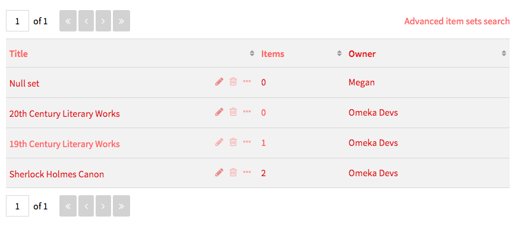
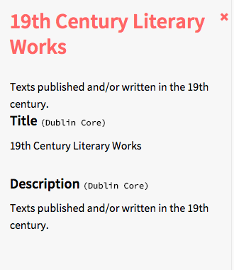
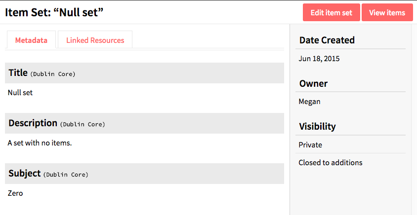

Item sets are an aggregation of *items*, similar to collections in previous versions of Omeka. In Omeka S, items may belong to any number of sets, and an item set can have any number of items.

Item sets are managed via the *item sets* tab located in the left navigation of the admin dashboard. After clicking on the tab, a table appears listing all item sets with their *Title*, number of *Items*, the *Owner* of the set, and icons for each row representing options to *edit* (pencil), *delete* (trash can), or *view details* (ellipses). In the upper right corner are buttons to *Add new item set* or *Advanced item sets search. To return to the sets browse screen from this search form, use your browser’s back button.

## View Item Set

To quickly see information about an item set, click on the *view details* button for the item set on the item sets browse page. This will open a drawer on the right hand side of the page with the basic metadata for the set. To close the drawer, click the X in the upper right hand corner of the drawer.

To view all the information for an item set, click on its name. On the item sets view page, there are tabs to see an item set’s *Metadata* and *Linked Resources*. On the right side of the item set’s view page is information about the date created, owner, and visibility. For item sets, visibility includes both whether the set is private or public and whether other users can add items to the set. 

The item set’s *metadata* is entered by users. The *linked resources* are items which are used to populate specific metadata properties (for example: Creator). When viewing linked resources, the table includes the predicate (property or description) and the object (linked item resource).

To view the items in a set, either click on the number of items in the set on the item set browse page, or click the *view items* button in the upper right corner of the individual item set page.

## Creating an item set
Item sets can draw on the same resource templates as items to populate elements from vocabularies in the OmekaS install. Item sets should have at least one element by which to identify and describe the set. 

To create a new item set, start at the item sets tab from the left hand navigation of the global admin dashboard. Click the *add new item set* button on the right hand side of the screen.

## Settings
Item sets have two settings which control their access. They can be *public* or *not public* and they can be *open* or *closed*.

Use the *make public/private* button (eye icon) to set whether the item is visible to the public or only to users of the OmekaS install. 

An item set’s status as *closed* or *open* is toggled using the lock icon in the upper right corner of the edit view, near the *delete* and *save* buttons. When an item set is closed, only the item set creator, site admins, and global admins can edit and add items to that set. Open item sets can be edited and contributed to by any user on the install.

 Open and Public 

  Closed and Private
