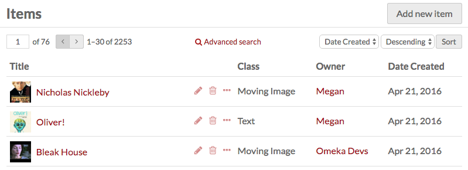
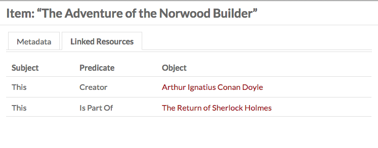
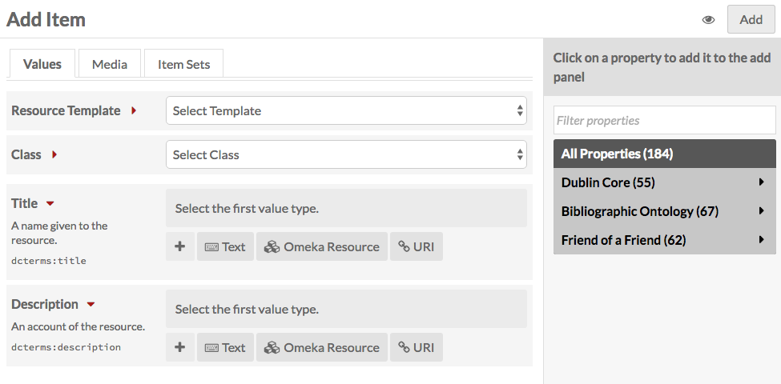
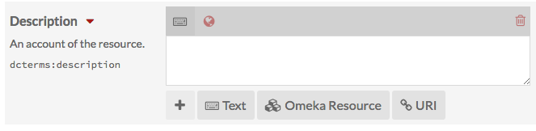
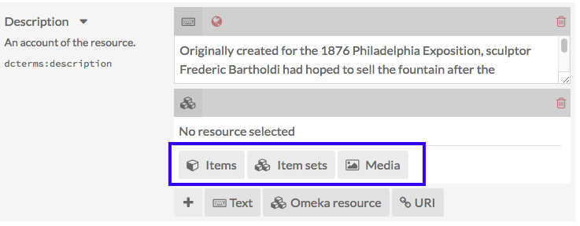
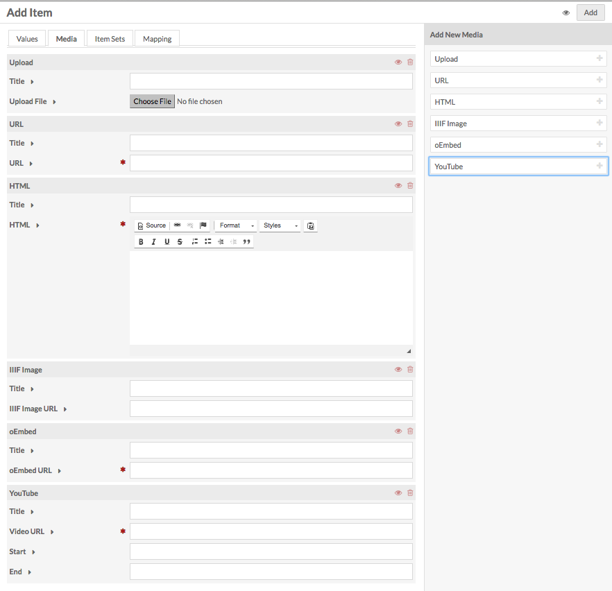
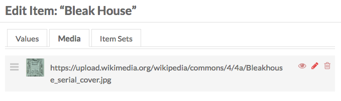

Items are the building blocks of the Omeka system. 

In Omeka S, items can be made available to you from the system administrator, and you may add items to your own site.

Items are listed in the *Items* tab (one box icon), found on the left-hand navigation of the administrative dashboard. 

Each item appears as a row, with: the *Title*; icons to *edit* (pencil), *delete* (trash can), or *view details* (ellipses); the *Class*; the item’s *Owner*; and *Date Created*. 

Options for navigating and creating items display above the table of items. 

On the left side is a display for the number of pages of items, with forward and back arrows. The current page number is an editable field - enter any valid page number and hit return/enter on your keyboard to go to that page. 

In the center top is a button for [Advanced Search](../search.md). 

On the right top of the Items window, above the table of items, is the *Add new item* button. Just above the table on the right are options for sorting the table of items, with two dropdown menus. The first lets you select between *Title*, *Class*, *Owner,* and *Date Created*; the second allows you to sort ascending or descending. To apply, click the *sort* button.

## View
To quickly view the basic information about an item, click the *view details* (ellipses) button in the row for the item, located next to the edit and delete buttons. This will open a drawer to the right of the list which displays the item’s title,  description, and visibility.

For a more detailed look at an individual item, click on its title in the items browse table or when viewing its details  
When you view an individual item , there are tabs for the item’s *Metadata* and its *Linked Resources*. The right side of the page displays the item’s media, any *item sets* to which it belongs, its creation date, owner, and visibility. 

 The blue squares indicate where to click to open the full item view.

An item’s *linked resources* (shown below) are resources, which have been added as properties to the item. The table on this tab gives the predicate (property) and a link to each object (item).

 

## Adding an Item

To add a new item, begin by selecting the the *Add new item* button. 

Before creating items, site admins may want to create [Resource Templates](/content/resource-template.md), which will load specific fields for various item types.

### Values
The Values tab is where you enter metadata, such as title, description, etc.

You can select a resource template from the drop-down menu. Resource templates are defined by the site administrators and editors.
  * If using a resource template, the class should automatically load.
  * If not using a resource template, you may select a class from the dropdown menu (these are populated from the [Vocabularies](/content/vocabularies.md) in your installation).

Add information to the properties which load. If you do not select a resource template or class, the Dublin Core properties Title and Description will load automatically.    
You may add text, a resource from the installation, or an external link in each field.  

#### Text
Text fields are entered with text, which can include HTML code. The keyboard at the top of the field input indicates text. The globe icon which appears next to it can be used to set language. 

#### Omeka Resource
Omeka Resource fields create an internal link between the resource you are creating and the resource which fills that field. 

When creating an item, you have the option to use either another item or an item set. Once you select an item or item set, detailed information will load, and you must click *select resource* to finish linking the resources. You can also click the *X* button in the upper right-hand corner to go back to the list of items or item sets.

     
Once you have created an item and added media to it, you will also have the option to use media *attached to that item* for a property. 

To use a media resource for a property, select the media option for the element. The drawer which opens will display all media attached to the item. Select the media which you want to use; this will switch the drawer to just that media. Click the *Select Resource* button at the bottom of the drawer to complete the process.

#### URI
URI fields link to an external website or online resource.

You may add other fields by selecting a property from the list on the right. Browse fields by vocabulary (Dublin Core, Bibliographic Ontology, etc), or search in the *filter properties* bar above the list of properties and vocabularies.

You can indicate the language for the content of a text input using the globe symbol above the input (see the red arrow in the image below). Click on the globe to activate a text field, then enter the [ISO 639-1](https://en.wikipedia.org/wiki/List_of_ISO_639-1_codes) code for the language in which the text is written.

### Media
Use the *Media* tab to add images, video, or other files.
Using the buttons on the *Add New Media* menu on the right side of the screen, select a media type (Upload, URL, oEmbed, YouTube, or HTML)

- *Upload*: select a file to upload from your computer.
- *URL*: import media via a uri.
- *HTML*: add html content as a media resource for your item.
- *IIIF*: Add an IIIF image via url.
- *oEmbed*: insert an embedded representation of an external URL. Note that this will only work with content from [existing oEmbed implementations](http://oembed.com/#section7) - use the url in your browser’s location bar.
- *YouTube*: add a link to embed a YouTube video. Use the url from your browser’s location bar (with `/watch/` in it) rather than the `youtu.be` link.

While editing, you can delete any media instance using the delete button (trashcan) on the upper right corner of the media block.

If you have more than one media instance for an item, you can reorder them by dragging and drop each media instance block, using the icon of three lines in the upper left corner of the block as the anchor when dragging (click there).

You can edit media later by going by editing an item, navigating to the *media* tab, and clicking the edit button (pencil) for a media when editing the item. You can use the delete button to remove media from an item.

### Item Sets
You can only add items to existing item sets.

From the right-hand menu, click on the owner of an item set, then click the name of the item set to add the item to that set. 

You can also filter item sets using the text entry bar above the list of users.

To remove a connection between an item and item set, click the delete (trash can) button to the right of the item set title.

### Visibility
Use the *make public/private* button (eye icon) to set whether the item is visible to the public or only to users of the Omeka S system. 

 Public 

  Private

Note that if an item is private, all the media attached is private, but an item which is public can have attached media which are set to be either public or private.
