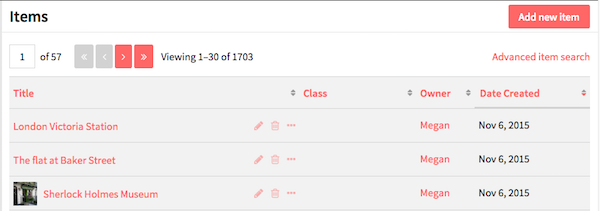
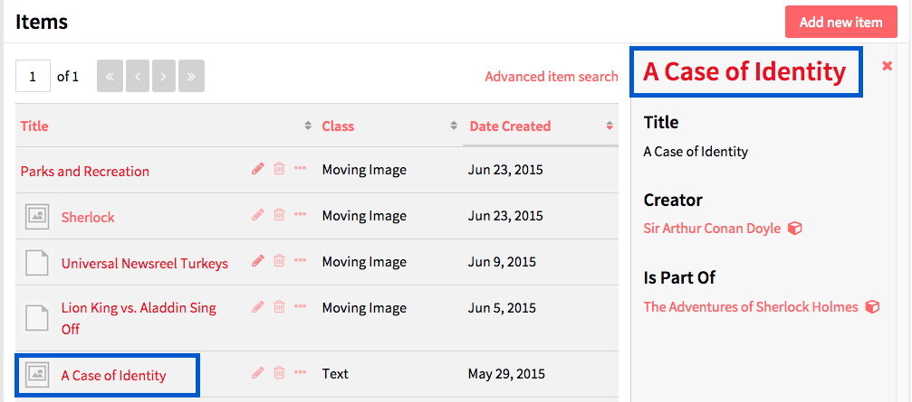
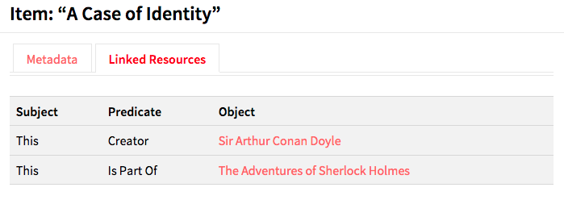
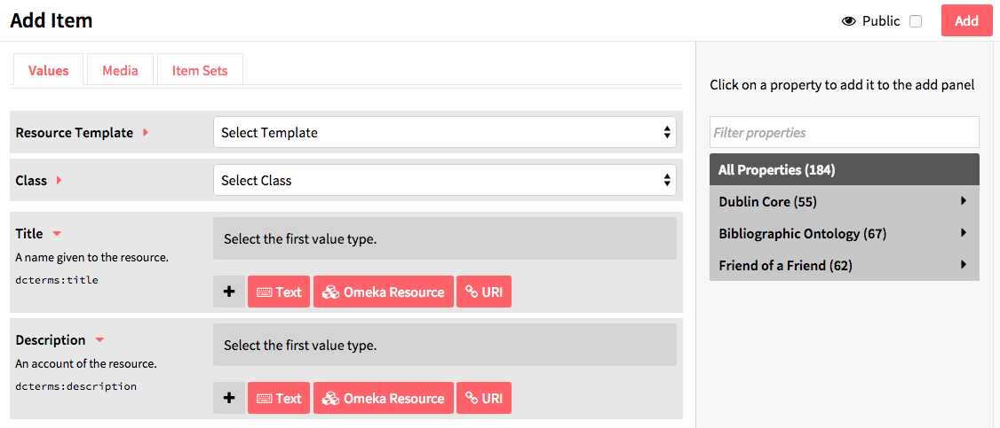
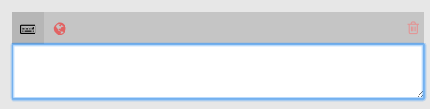
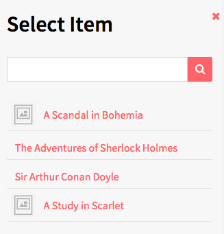
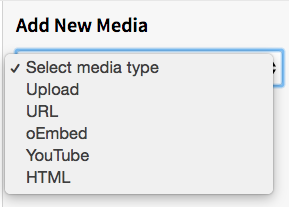
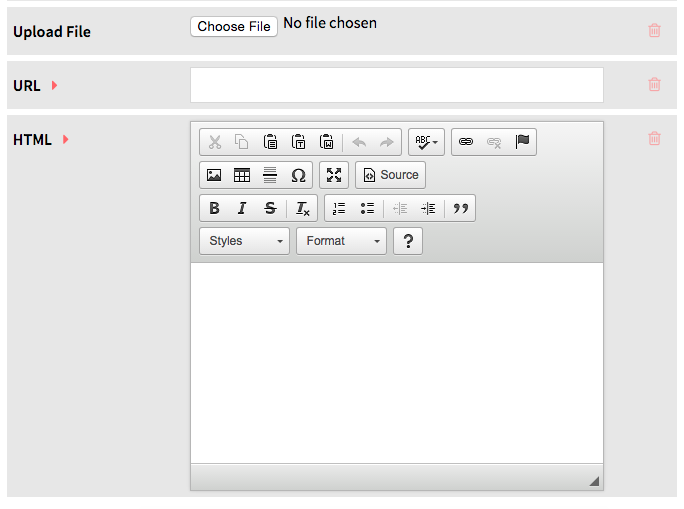

Items are the building blocks of the Omeka system. 

In Omeka S, items can be made available to you from the system administrator, and you may add items to your own site.

Items are listed in the Items tab, found on the left-hand navigation of the administrative dashboard. Each item appears as a row, with: the *Title*; icons to *edit* (pencil), *delete* (trash can), or *view details* (ellipses); the *Class*; the item’s *Owner*; and *Date Created*. The list of items can be sorted by any of the fields listed using the up/down arrow icons at the end of that section.  

On the right side of the window above the table of items is a button to *add new item* and a link to the *advanced item search*.

## View
To quickly view the basic information about an item, click the *view details* (ellipses) button in the row for the item, located next to the edit and delete buttons. This will open a drawer to the right of the list which displays the item’s title,  description, and visibility.

 The blue squares indicate where to click to open the full item view.

For a more detailed look at an individual item, click on its title in the items browse table or when viewing its details  
When you view an individual item , there are tabs for the item’s *Metadata* and its *Linked Resources*. The right side of the page displays the item’s media, any *item sets* to which it belongs, its creation date, owner, and visibility. 

An item’s *linked resources* (shown below) are resources, which have been added as properties to the item. The table on this tab gives the predicate (property) and a link to each object (item).

 

## Adding an Item

To add a new item, begin by selecting the the *Add new item* button. 

Before creating items, site admins may want to create [Resource Templates](/content/resource-template.md), which will load specific fields for various item types.

### Values
The Values tab is where you enter metadata, such as title, description, etc.

1. If available and appropriate, select a resource template from the drop-down menu. Resource templates are defined by the site administrators and editors.
  * If using a resource template, the class should automatically load.
  * If not using a resource template, select a class from the dropdown menu (these are populated from the [Vocabularies] (/content/vocabularies.md) in your installation).
1. Add information to the fields provided.  
  1. You may add text, a resource from the installation, or an external link in each field.  
    * **Text** fields are entered with text, which can include HTML code. The keyboard at the top of the field input indicates text. The globe icon which appears next to it can be used to set language. 

    * **Omeka Resource** fields create an internal link between the resource you are creating and the resource which fills that field. 
     You have the option to use either another item or an item set. 
     Once you select an item or item set, detailed information will load, and you must click *select resource* to finish linking the resources. You can also click the *X* button in the upper right-hand corner to go back to the list of items or item sets.

      
    * **URI** fields link to an external website or online resource.
1. You may add other fields by selecting a property from the list on the right. Browse fields by vocabulary (Dublin Core, Bibliographic Ontology, etc), or search in the *filter properties* bar above the list of properties and vocabularies.

### Media
Use the *Media* tab to add images, video, or other files.
Using the dropdown of the *Add New Media* menu on the right side of the screen, select a media type (Upload, URL, oEmbed, YouTube, or HTML)
  
- *Upload*: select a file to upload from your computer.
- *URL*: add a link to a website or web resource.
- *oEmbed*: insert an embedded representation of an external URL. Note that this will only work with content from existing oEmbed providers.
- *HTML*: add html content as a media resource for your item.

While editing, you can delete any media instance using the delete button (trashcan) on the upper right corner of the media block.

If you have more than one media instance for an item, you can reorder them by dragging and drop each media instance block, using the icon of three lines in the upper left corner of the block as the anchor when dragging (click there).

After you have added media, you can edit and delete it from the [Media](../content/media.md) tab on the left navigation.

### Item Sets
Use the dropdown to add the item to an item set. Sets must be created first, before adding the item. 

### Visibility
Use the *make public/private* button (eye icon) to set whether the item is visible to the public or only to users of the Omeka S system. 

 Public 

  Private

Note that if an item is private, all the media attached is private, but an item which is public can have attached media which are set to be either public or private.
