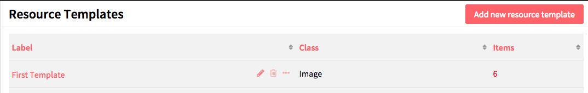

A *Resource Template* is a set of pre-defined Properties, and optionally a Class, to use to guide Item creation and interpretation of Properties. 

Resource templates are managed in the Administrative Dashboard, accessed through the left-hand navigation under the tab label *Resource Templates*. 

From this tab, you can sort existing templates by *label*, *class*, or number of *items* assigned to that template, using the up-down arrow icon next to each column heading. You can also use the icons in each template’s row: use the *pencil* to edit, the *trash can* to delete, and the *ellipses* to quickly view the details for that template. If you click on the number of items listed for a template, it will take you to a list of all those items. 

## Create a resource template
1. From the Resource Templates tab in the Admin Dashboard, click the *Add new resource template* button.
1. In the Label property, type the label for your new template.
  - This will be the text displayed in the dropdown for Resource Templates when creating an item, so be sure that the label is clear.
1. If desired, select a class to associate with the template.
1. Add properties from the list of vocabularies in the menu on the right side of the screen.
  - You can filter properties in the text box or select from a specific vocabulary using the arrows to the right of the vocabulary names. 

Note that users who select this resource template when creating an item will be able to add other priorities to the item, and that the properties associated with the resource template are not required when creating an item.

