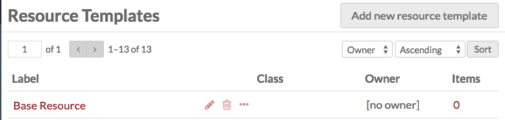
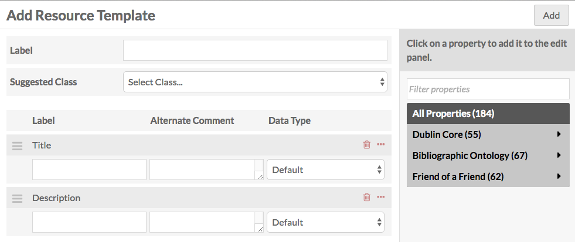
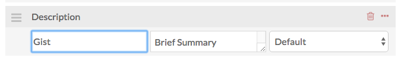

A *Resource Template* is a set of pre-defined Properties, optionally with a Class, to guide Item creation and the interpretation of Properties. 

Resource templates are managed from the Admin Dashboard, accessed through the left-hand navigation under the tab labeled *Resource Templates*. 

From this tab, you can sort existing templates by *label*, *class*, or number of *items* assigned to that template, using the up-down arrow icon next to each column heading. You can also use the icons in each template’s row to: *edit* (pencil), *delete* (trash can), or *view details* (ellipses). If you click on the number of items listed for a template, it will take you to a list of all those items. 

## Base Resource
All Omeka S installations include a Base Resource template which maps to the metadata fields required by the Digital Public Library of America (DPLA). It will display in the table of resource templates as "Base Resource" with no owner. 

The Base Resource template contains the following Dublin Core fields: Title; Rights; Type; Creator; Date; Description; Format; Language; Spatial Coverage (Place); Publisher; Alternative Title: Contributor; Extent; Identifier; Relation; Is Replaced By; Replaces; RightsHolder; Subject; Temporal Coverage.

## Create a resource template
1. From the Resource Templates tab in the Admin Dashboard, click the *Add new resource template* button.
1. In the Label property, type the label for your new template. This will be the text displayed in the dropdown for Resource Templates when creating an item, so be sure that the label is clear.
1. If desired, select a class to associate with the template.
1. Add properties from the list of vocabularies in the menu on the right side of the screen. You can filter properties in the text box or select from a specific vocabulary using the arrows to the right of the vocabulary names. 
  - The Dublin Core properties *Title* and *Description* are added to every Resource Template by default. You can use these or delete as desired.
1. If desired, add an alternate label and alternate comment for the element (see below)
1. Select a data type for the element: Literal, URI, or Resource. Whichever you choose will be automatically loaded once someone selects that Resource Type and they will only be able to use **this data type** for the element when using this Resource Template.
  - Literal: text and/or html imput
  - URI: a link with label
  - Resource: either an existing Item or Item Set in the Omeka S install

You can change the display label of the property when the resource template is used by entering the text you want to appear in the *Alternate Label* field for each property. You can also add alternate comments for the property. This will change the text under the property name when users are creating items using your Resource Template. 

In the image below, from an Add Item view, the template has been written so that the Description property is labeled as Gist with an new comment (the default is “an account of the resource”): 

Note that users who select this resource template when creating an item will be able to add other properties to the item, and that the properties associated with the resource template are not required when creating an item.

