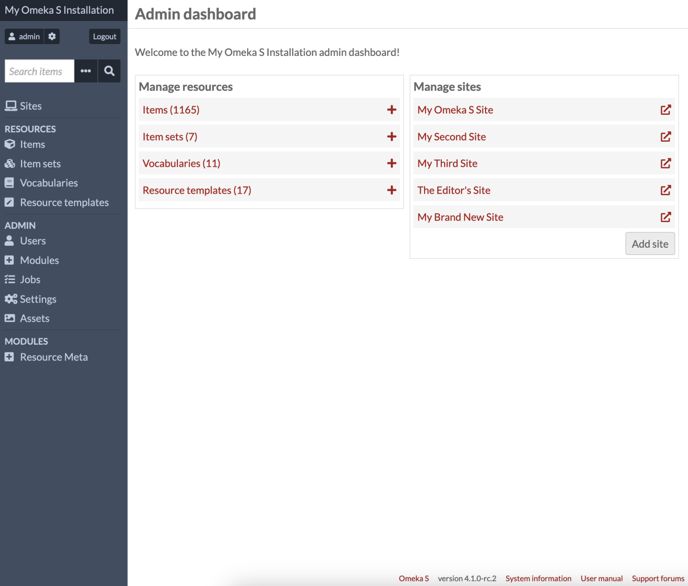
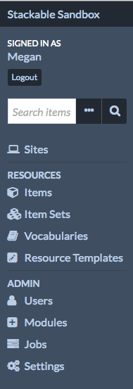
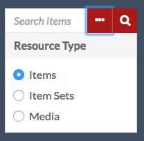
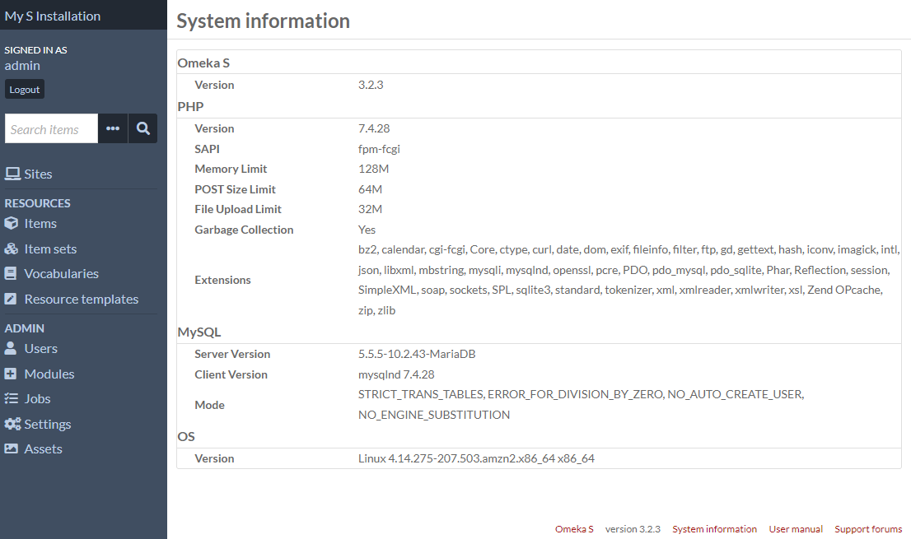

# Administrative Dashboard

The administrative dashboard manages the content shared by all Omeka S sites. It also manages the core functionalities of the Omeka S installation. 

This [screencast](https://vimeo.com/455708039){target=_blank} walks you through the main features of the dashboard. It explains how to navigate your Omeka S installation:

<iframe src="https://player.vimeo.com/video/455708039?h=438143f0d3" style="position:absolute;top:0;left:0;width:100%;height:100%;" frameborder="0" allow="autoplay; fullscreen; picture-in-picture" allowfullscreen></iframe>

<a href="https://vimeo.com/455708039">Navigating Omeka S</a> from <a href="https://vimeo.com/omeka">Omeka</a> on <a href="https://vimeo.com">Vimeo</a>.

## Admin main page

When a user logs in, the first page they see is the Admin Dashboard. 

!!! note
	Depending on the user role, you may not see precisely the same options in the left-hand navigation. See [below](#left-hand-navigation) for details. 

The admin dashboard presents users with two boxes: **Manage Resources** and **Manage Sites*. This is in addition to the left-hand navigation present on all pages (see below).  

The **Manage Resources** box displays the following resources with their total count: [Items](content/items.md), [Item sets](content/item-sets.md), [Vocabularies](content/vocabularies.md), and [Resource templates](content/resource-template.md). Clicking on the label of the Resource takes you to the browse page. Clicking the plus-symbol button to the right of the label takes you to the add page for that resource type. 

The **Manage Sites** box lists the [Sites](sites/index.md) on the install. Clicking on the site name will take you to the administrative tab for the site. Clicking on the small arrow icon to the right will take you to the public view of the site (in a new window or tab). 

## Left-hand navigation

The following content appears on the left side of the admin dashboard and on all administrative pages. 

In the upper left corner of the screen is a link displaying the title of the installation. This will always take you back to the admin dashboard. 

Directly below the installation title is the message “Signed in as [User]”. [User] is the display name of the person logged in. Next to the username is a gear icon. This icon will [take you to your user settings page](admin/users.md#user-settings). 

Near the username is the button to **Logout**. 

Underneath the user information is a search field. This includes an option for advanced search (ellipsis) and the button to search (magnifying glass). Use this to search all items in the installation. 

Advanced search options allow you to refine the search by Resource Type. This limits the search to **Items**, **Item Sets**, or **Media** by clicking the radio button next to the selected Resource Type. 

The left-hand navigation of the dashboard is divided into sections related to function and user access:

- [Sites](sites/index.md): lists and provides access to all of the sites on the OmekaS install. (Computer icon)
- Resources: content creation and metadata management.
    - [Items](content/items.md): manage the individual resources of your install. (Box icon)
    - [Item Sets](content/item-sets.md): manage aggregated groups of items. (Multiple boxes icon)
    - [Vocabularies](content/vocabularies.md): manage the metadata standards for your install. (Closed book icon)
    - [Resource Templates](content/resource-template.md): manage predefined sets of properties (fields) to use when creating items. (Pencil in a square icon)
- Admin: installation-level administration. Note that some of these tabs may not be visible to all user levels.
    - [Users](admin/users.md): manage users for the whole install and individual sites. (Human silhouette icon)
    - [Modules](modules/index.md): add functionality to your sites. (Plus sign in square icon)
    - [Jobs](admin/jobs.md): displays the user-activated tasks which are currently running. NB: jobs only display when they are running. (Three bars icon)
    - [Settings](admin/settings.md): manage the global settings for all sites, the admin dashboard, and the site dashboards. (Gears icon)

If you have installed modules, they may appear in the admin section of the left navigation below settings.

Note that users with more limited permissions will see only some of these navigation options.

## System information

In the bottom right corner of every admin page is the current version of Omeka S. There are also some helpful links. Click the link labelled "System information" to see more details about your installation.

On this page you can verify the versions of dependencies that Omeka is using. This might be PHP, ImageMagick, and/or MySQL. If a module requires your server to supply something like a PHP utility, you can view it here. Look here to verify whether your Omeka installation recognizes a module you have tried to install.

Note that your PHP section will tell you the "File Upload Limit". This is the number reflected in the media upload interface and the asset upload interface. Note that Omeka S will tell you how much free server space it has access to. 

You may be asked to supply this information when requesting technical support on the [Forums](https://forum.omeka.org/){target=_blank} or when posting an issue on GitHub. 

Clicking the two buttons near the bottom of the page can help you verify that PHP and ImageMagick are working properly. Do this right after installation to ensure you don't run into problems with batch-importing or PHP-dependent jobs later on.

