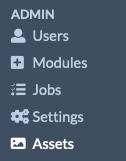
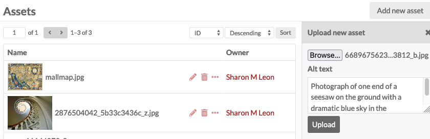
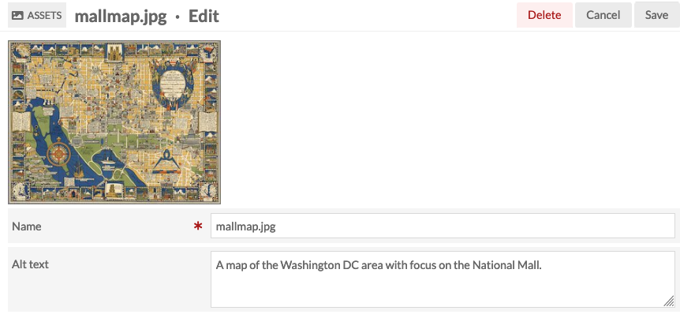

# Assets

Digital files added to Omeka S that are not media attached to items can be managed in the **Assets** section of the administrative interface. Examples of assets include site logos, images that are purely illustrations, and custom-made thumbnails. 

The Assets section provides users with a browseable list of all of the assets for the entire installation, listed with a thumbnail, a title, icons to edit (pencil), delete (trash can) or view details (ellipsis), and the asset's owner. There are no batch-editing options available for assets. 

## Asset permissions

| Category | Permission | Global Admin | Supervisor | Editor | Reviewer | Author | Researcher |
|-----|-----|---|---|---|---|---|---|
| Assets | View | Yes | Yes | Yes | Yes | Yes | Yes | 
| | Edit | All | All | All | All | Their own | No |
| | Delete | All | All | All | Their own | Their own | No |

## Add an asset

To add a new asset to the installation, click the "Add new asset" button in the upper right hand corner of the Assets screen. A drawer will open that allows the user to browse their computer for an asset file, and to create alternative text for that file (alt text will be available to screen-readers and whenever an image cannot load). Click the "Upload" button to complete the process.

Assets are maintained at only their original size; they are not duplicated and resized like media attached to items. You will need to manually upload other sizes as desired. 

## Edit an asset

Existing assets may be edited by clicking on the pencil icon. Users have the option to change the file name and to create or edit alternative text. Users can also delete assets by clicking on the red "Delete" button in the upper right hand corner. 

