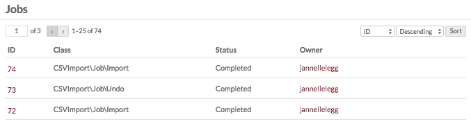
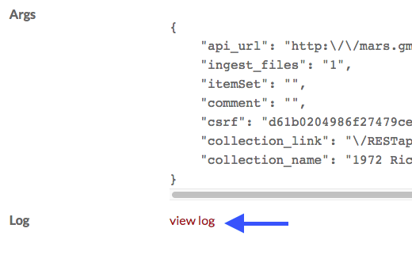

# Jobs

When a user starts running a process which will take some time, such as an API import, the progress of the process is displayed in the **Jobs** section of the admin dashboard. The table also displays completed, stopped, and error-interrupted jobs.

The Jobs table shows a job’s **ID** number, **Class** of job, **Status** and the **Owner**, or user who started the job.

!!! note
	Batch-editing activities are sometimes shown in the Jobs log. Only "Edit all" or "Delete all" operations appear here. Batch-editing only selected items, even a full page of items, will not appear here.

Only Global Admins and Supervisors can see or access the Jobs tab.

You can order the rows of the table by ID, Class, Status, or Owner (descending or ascending) using the drop-down menus just above the table on the upper right.

To see the details of a job, click on its ID number. On a job’s details page, you will see the following information: 

- **Status** (In Progress, Error, Completed, Stopped)
- **Started** and **Ended** (date stamps)
- **Class** (source of the job, for example `DspaceConnector\Job\Import`)
- **Owner**
- **Args**
- **Log** - click on **view log** to see any error or other messages. 

!!! note
	Are your jobs starting and not completing? You might need to [set the path for PHP](../configuration.md#php-path) so that your system can perform the background process.

