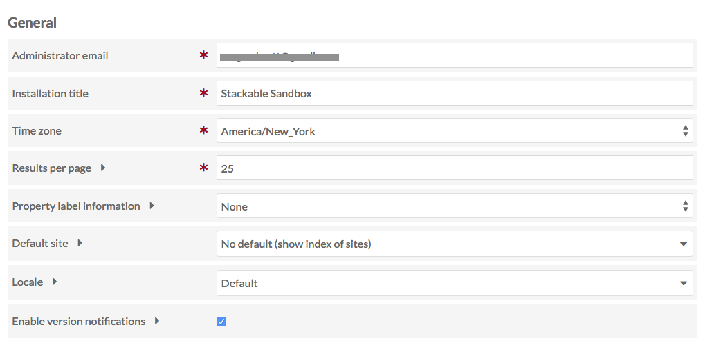
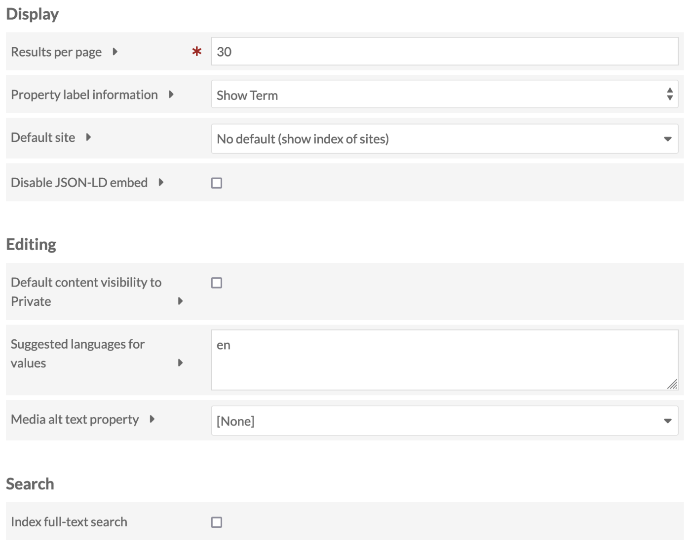
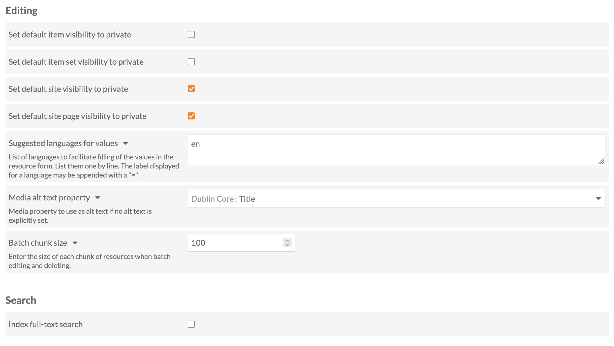
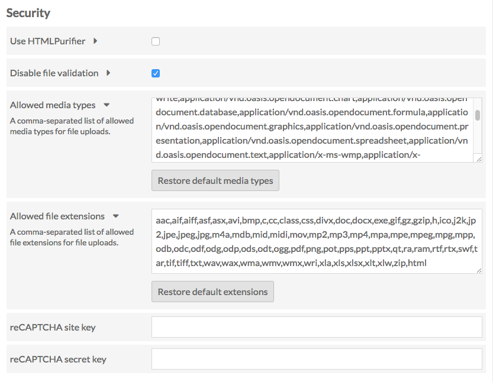

# Settings

Admin users may change the settings for the admin dashboard and general settings for all sites using the **Settings** section on the left side of the admin dashboard (with the gear icon). 

Global settings are only available to Global Administrator users.

Settings are divided into five sections: **General**, **Display**, **Editing**, **Search**, and **Security** settings.

## General

**Administrator email**: Sets the email address for the installation administrator. 

!!! note
	Some hosting setups may require that the domain name for the administrator email matches the domain name of the installation (if your domain is `yourinstall.org`, the administrator email must be `user@yourinstall.org`). Omeka S relies on the server’s underlying `sendmail` utility for sending email.

**Installation title**: Allows you to change the title for the Omeka S installation overall. This is what appears in the upper left-hand corner of the admin dashboard.

**Time zone**: Sets the default time zone for the install, which will be used for error logging messages and to determine creation dates for items, item sets, and other materials on the install. This is a dropdown menu. 

**Locale**: A dropdown that lets you select from a dropdown of [available languages](https://www.transifex.com/omeka/omeka-s/){target=_blank} for the Omeka S core to change the language in which your installation's admin side displays.

**Enable version notifications**: Check this box to enable warning banners for new versions of Omeka S, themes, and modules. If it is unchecked, no user (at any role) will see update warnings, not even the Global Administrator. If it is checked, every applicable user can see them (i.e. Supervisor users who can see the Modules page, Site Managers who can see the Themes pages, and every user on the `/admin` homepage).

**Disable JSON-LD @reverse**: Disable [JSON-LD reverse properties](https://www.w3.org/TR/json-ld11/#reverse-properties){target=_blank} in the API output for resources. 

**Favicon**: Choose from your assets, or upload a file, to appear in the small browser window/tab icon space. A [favicon](https://www.w3schools.com/html/html_favicon.asp){target=_blank} should be a small image around 32x32 pixels in size uploaded specifically for this purpose. Favicons can be [set at an installation level](../sites/site_settings.md#general-settings) as well as on each individual site.

## Display

**Results per page**: Changes the number of results (items, item sets, media) displayed per page when browsing in either public or admin sides of the installation.

**Property label information**: Determines what is displayed next to each property when users are editing items and item sets. 

- By default, this is set to "none", meaning that only the property label is displayed.
- If **Show Vocabulary** is selected, the parenthetical statement next to the property name displays the vocabulary used (for example, Dublin Core) 
- If **Show Term** is selected, the parenthetical statement next to the property name displays the vocabulary:term (for example, `dc:title`). 

**Default site**: This dropdown gives you control over where people land when they navigate to the base url of your install. You can either display a list of all sites in the install (default) or select a specific site from the dropdown, to which people will be redirected.

**Disable JSON-LD embed**: By default, Omeka embeds JSON-LD in resource browse and show pages for the purpose of machine-readable metadata discovery. Check this to disable embedding.

## Editing

**Set default item visibility to private**: When this box is checked, all new items made by all users will have their visibility set to private. If this box is not checked, all new items are public by default, unless set otherwise at the point of creation.

**Set default item visibility to private**: When this box is checked, all new item sets made by all users will have their visibility set to private.

**Set default item visibility to private**: When this box is checked, all new sites made by all users will have their visibility set to private.

**Set default item visibility to private**: When this box is checked, all new site pages made by all users will have their visibility set to private.

**Suggested languages for values**: You can list languages here to provide a convenient dropdown selection for languages when filling out descriptive metadata for resources installation-wide. Provide two- or four-letter [ISO 639-1](https://en.wikipedia.org/wiki/List_of_ISO_639-1_codes){target+_blank} language tags for maximum compatibility. Users can still type their own values when editing resources. 

**Media alt text property**: Select a field (for example, `dc:title` or `dc:description`) from the media description to use as alternative text if no alt text is explicitly set. [Alt text](https://webaim.org/techniques/alttext/){target=_blank} is used in lieu of images (including thumbnails on browsing and search results pages) when a user is employing a screen reader and is an important part of meeting accessibility expectations.

**Batch chunk size**: When batch-editing or processing changes, Omeka will process one "chunk" of the total resources at a time. You may wish to set this higher or lower depending on the capacity of your server. 

## Search

**Index full-text search**: Check this box and "Save" the page to run an index of your installation's resources and sites. You should only need to run this process if you are having issues with searching.

## Security

**Use HTMLPurifier**: a checkbox. If checked, the service [HTMLPurifier](http://htmlpurifier.org/){target=_blank} will clean up any user-entered HTML. 

**Disable file validation**: a checkbox, unchecked by default. When unchecked, file uploads are limited by the following two fields. When this box is checked, any type of media or MIME type can be uploaded.

**Allowed media types**: The default list contains the most common media types. Only files with media types included in this list may be uploaded to the installation.
	- Separate additions to the list with a comma.
	- To return to defaults, click the "Restore default media types" button.

**Allowed file extensions**: The default list contains common file extensions. Only files with extensions included in this list may be uploaded to the installation.
	- Separate additions to the list with a comma.
	- To return to defaults, click the "Restore default extensions" button.

The final two fields relate to setting up [Google reCAPTCHA](https://www.google.com/recaptcha/intro/index.html){target=_blank} for your site. You will need both a site key and a secret key. Enter them in the corresponding fields after signing up with reCAPTCHA:

**reCAPTCHA site key** enables display of the widget on your install's sites.

**reCAPTCHA secret key** allows communication between your install and reCAPTCHA's server. 
