# Users

User accounts in an Omeka S installation allow your staff and audience to do things like add items, [make and moderate submissions](../modules/collecting.md), upload media, create virtual exhibits, and edit metadata.

User roles set at the installation level are separate from [site-specific user roles](../sites/site_users.md). A user must be created for the installation and then given site roles. This allows you to give minimal site-wide permissions to someone who will be drafting and publishing a virtual exhibit on your installation.

Administrators manage and create users from the Users section of the main administrative dashboard (head and shoulders icon). The Users section displays the user’s email followed by full name in parentheses, as well as their role and the date the account was created.

There are six user roles in Omeka S:

- **Global Administrator**: full installation privileges.
- **Supervisor**: robust site and content privileges.
- **Editor** (Content Expert): full privileges for content creation.
- **Reviewer**: robust content privileges but can only delete own content.
- **Author**: Create own content.
- **Researcher**: Search and read privileges only.

Behind the scenes, role values use the following slugs:

- `global_admin`
- `site_admin`
- `editor`
- `reviewer`
- `author`
- `researcher`.

These roles are separate from the [user roles assigned at a site-specific level](../sites/site_users.md), which allow registered users of the installation to have site access to build exhibit pages.

One example of how you may wish to manage the users of your site:

- A **Global Admin** user who installs, manages, and upgrades the modules and themes, and controls fundamental installation settings and server utilities.
- A **Supervisor** who manages user accounts on the installation and sites.
- One or more **Editors** who are responsible for the design and management of items, item sets, and resource templates.
- **Reviewer** staff members who are responsible for manually adding digitized or collected items and describing them according to institutional guidelines, and editing the additions of others.
- **Authors** who can add and edit their own items, and who are also given site-specific permissions to create exhibits and publish their research using items in the collection.
- **Researchers** who can be given site-specific permissions, but cannot add items.

## Create a user

Only Supervisors and Global Administrators can create, edit, and delete users. Editors, Reviewers, Authors, and Researchers can edit their own user information but cannot change the information of other users.

To create a new user, select the "Add new user" button in the upper right hand corner of the Users section in the administrative dashboard.

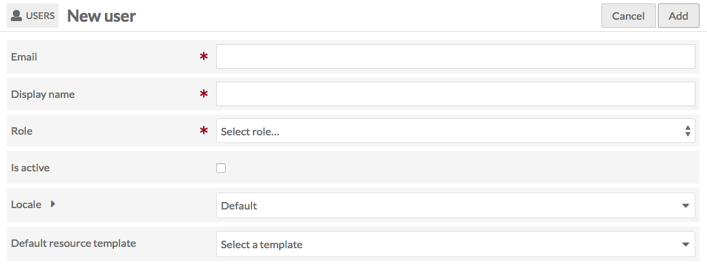

On the Add User page, enter the following:

- **Email address**
- **Name** (full name or a display name)
- A **Role** from the dropdown menu (see above for user role privileges)
- Check the **Is active** box to confirm that the user is active. A user who is inactive cannot log in.

The user is then sent a notification email to set up their account & password. The email will appear to come from what is set as the Administrator email in the [General settings of the installation](settings.md#general). Each email will expire 14 days after being sent. If the email expires, an administrator can manually set up a user's temporary password and email them.

> *Greetings!*
>
> *A user has been created for you on Omeka at [website]*
>
> *Your username is your email: [email]*
>
> *Click this link to set a password and begin using Omeka S: [website unique link]*
>
> *Your activation link will expire on [date and time]. If you have not completed the user activation process by the time the link expires, you will need to request another activation email from your site administrator.*

!!! note
	If you are having problems sending emails from your Omeka S installation, check with your hosting provider. Some hosting setups may require that the domain name for the administrator email matches the domain name of the installation (if your domain is `yourinstall.org`, the administrator email must be `user@yourinstall.org`). Omeka S relies on the server’s underlying `sendmail` utility for sending email; see the [Mail section on the Configuration page](../configuration.md#mail) for more information.

## Manage users
To manage an existing user, go to the Users section.

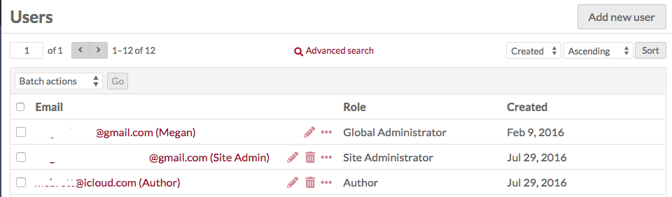

To view the name, email, and role of a user, click on the username.

To see the items and item sets owned by a user, click the ellipsis located between the delete (trash can) button and the user role label. This will open a drawer on the right side of the screen with this information; you can click on the number of items or item sets to browse the items or item sets created by that user.

### Edit user

To edit a user’s information, change their password, or access their API keys, go to the Users section. Find the user on the table and click the edit (pencil) button on their row in the table.

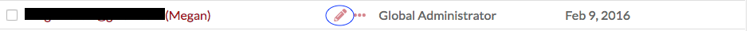

The Edit User page has four tabs: **User information**, **User settings**, **Password**, and **API keys**. After making changes on any of these tabs, be sure to click the save button in the upper right hand corner of the browser window. At any time you may cancel your edits by clicking the cancel button next to the save button.

### User information
On this tab, you can edit the display **Name** and **Email** for the user, select or change the user **Role** and click the checkbox to confirm that the user **Is active** (or uncheck the checkbox to render the user inactive). A user who is made inactive will be immediately logged out.

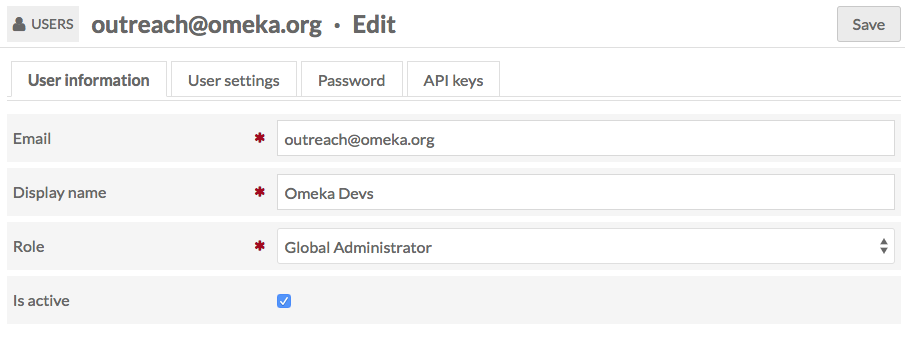

### User settings
This tab allows a user or global admin to set the following:

- **Locale**: select from a dropdown of available languages. This will change the language of the installation's admin & public interfaces for that user. (This depends on [how many interface strings have been translated](../translateOmekaS.md). Untranslated strings default to English.)
- **Default resource template**: select from existing templates to have a template auto-load whenever the user creates a new item.
- **Default sites for items**: select from available sites to automatically attach new items to the sites when created by the user. Setting this will not give the user a site-specific role.

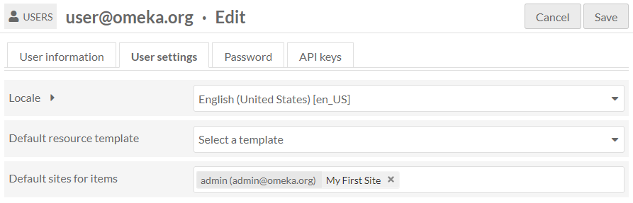

### Password
On this tab, create a new password. It must be entered twice, in both the New Password and Confirm New Password fields, to save properly.

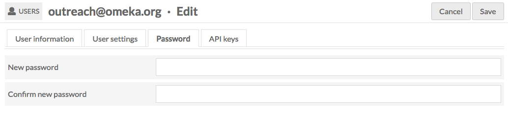

To see the password requirements, click the arrow next to the New Password field. This will display a list of [requirements](../../configuration) if any have been configured.

### API keys
Use this tab to generate an API key for the user. To generate one, you must provide a label for the key - this could be a date or the purpose of the key. Save the page to generate the key.

To remove existing API keys, check the "Delete?" box on the row for that key and click Save.

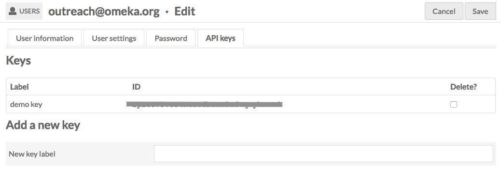

## Batch edit users

You can edit multiple users at one time by using the checkboxes to the left of each user's email in the User table.

Click the checkboxes to select the users you want to edit.

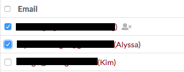

Then, using the dropdown just above the table, select from the following options:

- Edit selected (users)
- Edit all (users)
- Delete selected (users)
- Delete all (users).

To edit only the users whose checkboxes you have ticked, choose "Edit selected" from the dropdown and then click "Go". You will be directed to the Batch Edit Users page.

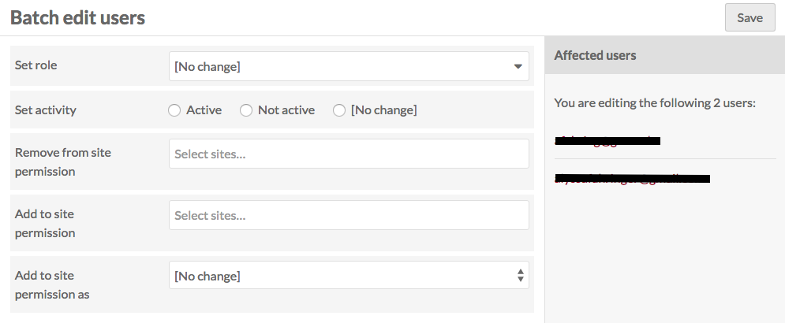

On the right hand side of the page are the emails for the users you are editing and to whom any changes you make will be applied.

On this page you can:

- Set role: select from a dropdown of all roles (see below) to change the role for all selected users.
- Set activity: set selected users as active, not active, or no change.
- Remove from [site permissions](../sites/site_users.md): select from a dropdown menu of the sites on the Omeka S install, or use the option "all sites" to remove the selected users from all sites.
- Add to [site permissions](../sites/site_users.md): select from a dropdown menu of the sites on the Omeka S install, or use the option "all sites" to add the selected users to all sites.
- Add to [site permission](../sites/site_users.md) as: a dropdown with options for viewer, manager, or creator - select which role the users will have on the sites to which you have added them.

Once you are done, click save changes.

If you choose "Edit all" rather than "Edit selected" you can apply changes to all users - excluding yourself - on the Omeka S installation. Use this feature carefully!

## Delete a user
On the User page of the administrative dashboard, click the trash can icon in the user’s row, to the left of their role information, to delete the user. Confirm the deletion in the dialog box which will appear on the right of the screen.

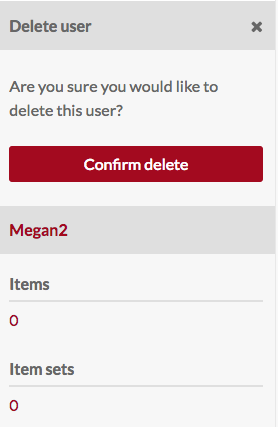

### Batch delete users
To delete a number of users at once, click the checkboxes next to their names on the Users table (see Batch edit users, above).

From the dropdown menu just above the email column, select "Delete selected" and click Go.

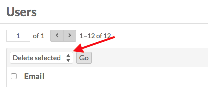

This will open a drawer on the right side of the screen with a message telling you the number of users you are about to delete. This action *cannot be undone*.

To permanently delete these users, click the red "Confirm Delete" button. To cancel, click the "X" in the upper right corner of the drawer.

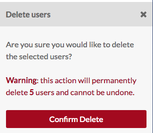

The "Delete all" action in the dropdown will delete all users excluding yourself. This action *cannot be undone* and should be used with extreme caution.

To permanently delete all users, you must check the "Are you sure" box before clicking the "Confirm Delete" button. To cancel, click the "X" in the upper right corner of the drawer. 

## Roles and permissions
The following is a detailed breakdown of permissions for each user role:

**Global Admin**

- Full privileges (create, edit, delete) of item, item sets, media, resource templates, site pages, sites, and users.
- Full privileges for modules - install, activate, configure, and use.
- Search, read, import, and delete privileges for vocabularies.

**Supervisor**

- Full privileges (create, edit, delete) of item, item sets, media, resource templates.
- Full power over all sites, including adding users, changing navigation and themes, using site-specific module utilities, and editing resources.
- Can create users at lower levels (editor, researcher, author, or reviewer). Cannot create other Supervisors or Global Admins.
- Use active modules that appear under the Modules sidebar category (such as CSV Import).
- View-only privileges for modules in the Admin > Modules tab.
- View-only privileges for vocabularies.

**Editor**

- Full privileges (create, edit, delete) of items, item sets, media, resource templates, and site pages.
- Can search, view, and create sites, and edit or delete sites they own.
- View-only privileges for vocabularies. Can see all logs.
- No access to modules, installation settings, or jobs.
- Can see other users of the installation and their email addresses, but not add users.

**Reviewer**

- Can search, view, create, and edit all items, item sets, and media. Can only delete those items, item sets, and media they have created.
- No access to sites unless they have been added as a site-specific user.
- View-only privileges for vocabularies and resource templates. Can see all logs.
- No access to modules.
- Can see other users of the installation and their email addresses.

**Author**

- Can search, view, and create items, item sets, resource templates, and media. Can only edit or delete content the user has created.
- Cannot see objects marked private, unless the object is a site that they have site-specific permissions for.
- No access to sites unless they have been added as a site-specific user.
- Search and view privileges for vocabularies and sites. Cannot see other users' logs.
- No access to modules.
- Can see other users of the installation and their email addresses.

**Researcher**

- Search and view privileges for all public items, item sets, resource templates, and media.
- Cannot see objects marked private, unless the object is a site that they have site-specific permissions for.
- No access to modules.
- Can see other users of the installation and their email addresses.

A user at any role can be added to a site at any level (Viewer, Creator, Manager). This will determine whether, say, a Researcher-level user added to a site as Manager can see all the other users added to that site.

<!--- note that a couple of modules display themselves to users who don't have permission. two so far: Item Sets Tree displays its Item Sets Tree page (under Modules at the bottom) to anyone, which is probably fine since it's just a display and not an editing page. Researcher and Reviewer can see the "Import" button for resource templates, but it creates an error page (import works for authors). --->
