# Items

Items are the building blocks of the Omeka system.

Items don't have to represent physical objects (photographs, maps, books), nor do they have to have [attached media](media.md) (a scan of a photo, or multiple page images, or a PDF). An item can be used as a node - a way to represent a person, place, or thing. You can use items and their classes to create separate types of nodes that serve the purposes of your sites.

Items can be linked to other items, or contained within item sets, to represent complex relationships. For example, an item used as a location can be linked to items representing events that happened at that location, and the event items can be linked to people items who were at that event, who themselves are linked to textual items that they created, or photographic items that they appear in. All of these items can be grouped in overlapping item sets that represent jurisdictions that contain locations, events, and people during a particular duration of time. Or you can use item sets to represent people, that contain their created works as items, and link those people item sets to events and photographs.

Many of these classes, and many resource templates to help you describe these types of items, already exist in a basic Omeka S installation, but you can modify them and add more as needed.

## Item permissions

When a user creates an item, they become the "owner" of that item. Most user levels have the ability to create items, and can always delete their own items. Only higher levels can delete items that others own.

| Category | Permission | Global Admin | Supervisor | Editor | Reviewer | Author | Researcher |
|-----|-----|---|---|---|---|---|---|
| Items & media | Add | Yes | Yes | Yes | Yes | Yes | No |
| | Edit | All | All | All | All | Their own | No |
| | Delete | All | All | All | Their own | Their own | No |
| Value annotations | Add/Edit | Yes | Yes | Yes | Yes | Yes | No |
| Private objects | View | Yes | Yes | Yes | Yes | No | No |

Note that when you change a user's role, for example from an Author to a Researcher, they will still own the items they created when they had permission to do so. Items are not transferred. Deleting a user orphans their items - they will appear as having no owner. You cannot currently search and batch-edit items without an owner, so the best practice is to re-assign these items before deleting the user account.

### Site permissions for items

All items in an Omeka S installation are available for addition to all sites, but must be added to a site either manually or through user-specific or site-specific settings.

Each site can be set to have all new items automatically added to it.

Each user can have [one or more sites to always add new items to by default](../admin/users.md#user-settings). If a user has a site set as their "Default sites for items", they must also be added to the site as a Creator or Manager in order for that setting to work.

| Category | Permission | Site Manager | Site Creator | Site Viewer | Global Admin | Supervisor |
|-----|-----|---|---|---|---|---|
| Items | Add to site | Yes | Yes (by default), manually no | No | Yes | Yes |
| | Remove from site | Yes | No | No | Yes | Yes |

### Public views for items

Items in an Omeka site can be browsed from a "Browse items" page that is automatically added to every site's navigation upon creation. Individual items, once added to the resource pool for a site, will bring up an individual item view page. The layout of this page is configured under the "Theme" tab, by using the "Configure resource pages" button. 

By default, the item view page shows the item's title at the top, then a rendering of any media attached to the item, then the property values as the text.

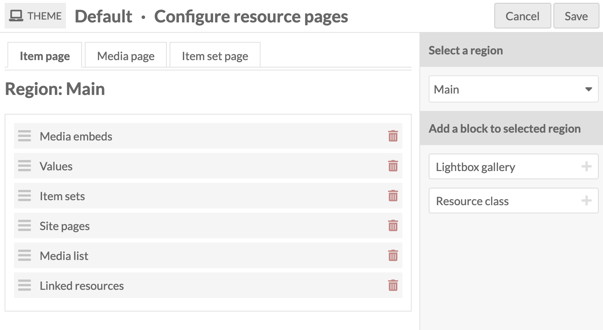

Any page blocks added to one of the regions available in the theme will only display on an individual item view page if it has content; otherwise, it will be hidden.

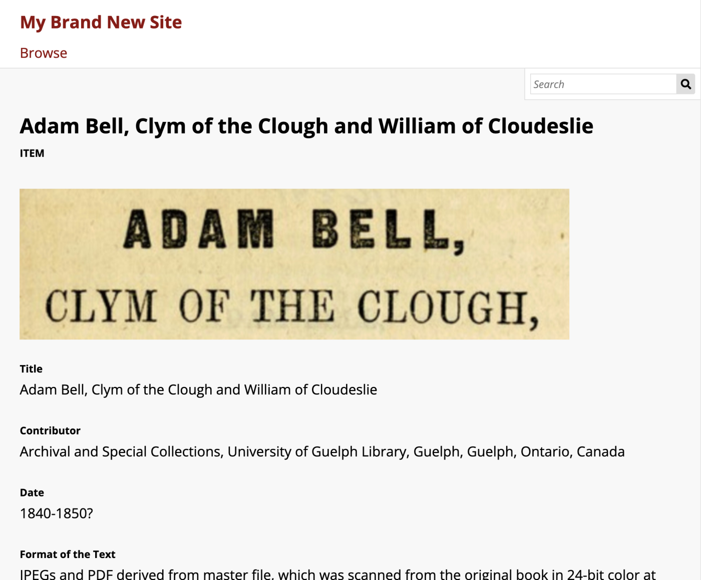

## The Items tab

Items are listed in the **Items** tab (with the box icon) in the left-hand navigation of the administrative dashboard.

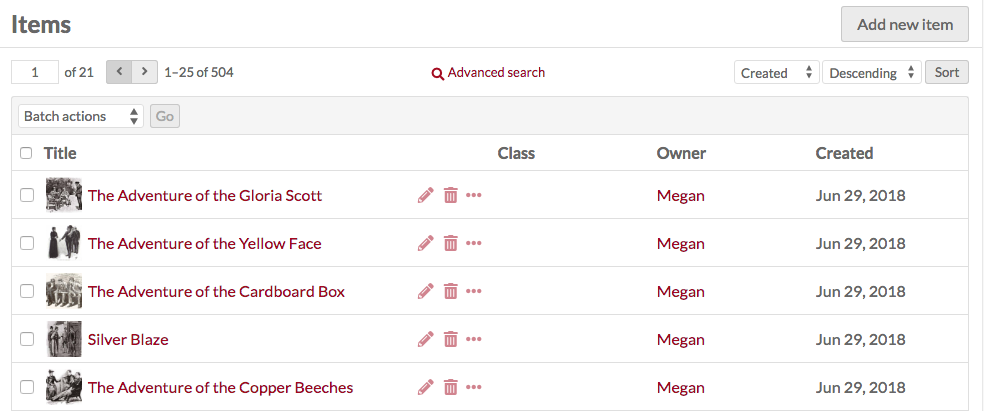

Each item appears as a row, with columns for:

- the **Title**
- icons to **edit** (pencil), **delete** (trash can), or **details** (ellipsis)
- the **Class**
- the item's **Owner**
- the date the item was **Created**. 

In the top right corner of the Items screen is the "Add new item" button.

Options for navigating and creating items sit in the header of the table of items.

- On the left side are controls for the pages of items, with forward and back arrows, and an editable box for the current page number — enter a valid page number and hit Enter to go to that page.

- In the center is a link for [Advanced Search](../search.md#item-advanced-search).

- On the right are options for sorting the table of items, with two dropdown menus. By default, items in the table are sorted by most recently-added items at the top (Created & Descending). The first lets you select between **Title**, **Identifier**, **Class**, **Owner**, and **(Date) Created**; the second allows you to sort by ascending (A-Z or earliest to latest) or descending (Z-A or latest to earliest). To apply, click the "Sort" button.

Between these and the table, on the left, is a dropdown for batch actions, including edit selected, edit all, delete selected, and delete all.

## View items

To quickly view the basic information about an item, click the **Details** (ellipsis) button in the row for the item, located next to the edit and delete buttons. This will open a drawer to the right of the list which displays the item’s title, description, Omeka identification number, visibility, item sets, any sites it is used in, and its attached media. Links to item sets and sites will take you to the corresponding administrative page; the arrow icon to the right of each site link will take you to the public view of that item in that site. 

For a more detailed look at an individual item, click on its title in the items browse table or when viewing its details.

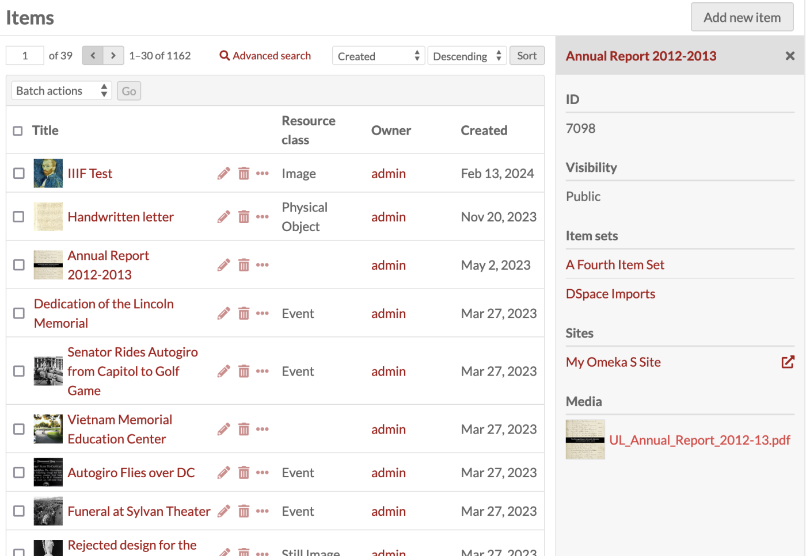

When you view an individual item, there are tabs for the item’s **Metadata** and its **Linked Resources**. The right side of the page displays the item’s media, any **sites** and **item sets** to which it belongs, its creation date, owner, and visibility.

### Linked resources

An item’s **linked resources** are other Omeka resources (items, item sets, or media) that are [linked to this item through their properties](#omeka-resource). Note that this section only shows resources that have been linked *to* this item (which have it for a property); resources that are linked *from* this item will display in the property they fill.

Linked resources are grouped by the property for which they use the current item. In the example below, the current item "William Shakespeare" is used for the properties "Creator", "References", and "list of authors" for the linked resources. 

You can filter linked resources to only display those referencing a specific property using the dropdown "Filter by property". It will only display properties actively in use.

When a resource is viewed on a public site, linked resources are displayed in a series of tables based on the metadata property in use. Resources are sorted by resource type (item, item set, or media) and only one type is displayed at a time. A resource without any linked resources will not display these tables. The tables can be included, excluded, or rearranged using [site theme settings, under "Configure resource pages"](../sites/site_theme.md#configure-resource-pages).

A resource with links to other resources that are not included in the given public site will display those non-included resources anyways. Those linked resources will appear to be part of the site (that is, you can click on them to see item and item set pages). [This setting can be turned off for each site](../sites/site_settings.md#show). When non-site resources are excluded, the item's metadata values and the linked resource tables will not display excluded Omeka resources.

Note that media pages do not display linked resource tables, whether items link to them or not.

The following item has a number of Omeka resources included in its "Contributors" property, showing as part of its metadata. It also has those same items linking back to it, showing in the linked resources table.

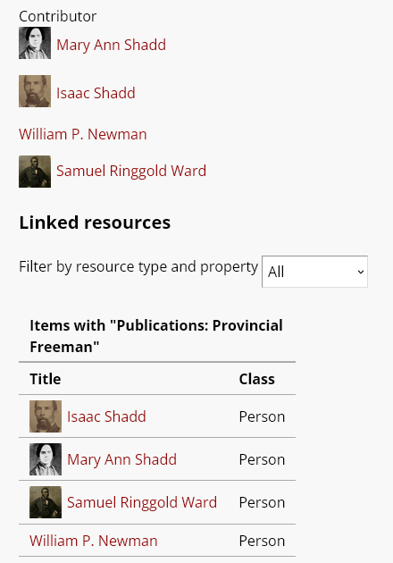

The display of Linked resources on resource pages can be configured on each site. Click on "Theme" and then click the button that reads "[Configure resource pages](../sites/site_theme.md#configure-resource-pages)", then decide if and where to display the "Linked resources" tables for each resource. 

You can also control whether resources that are linked will display those links even when the [resources in question are not included in the given site](../sites/site_resources.md). Under [Site settings, in the "Show" section](../sites/site_settings.md#show), you will find a checkbox for "Exclude resources not in site." 

## Add an item

To add a new item, begin by selecting the the "Add new item" button.

Before creating items, supervisors may want to create [Resource Templates](resource-template.md), which will load specific fields for various item types.

### Values

The Values tab is where you enter metadata, such as title, description, etc.

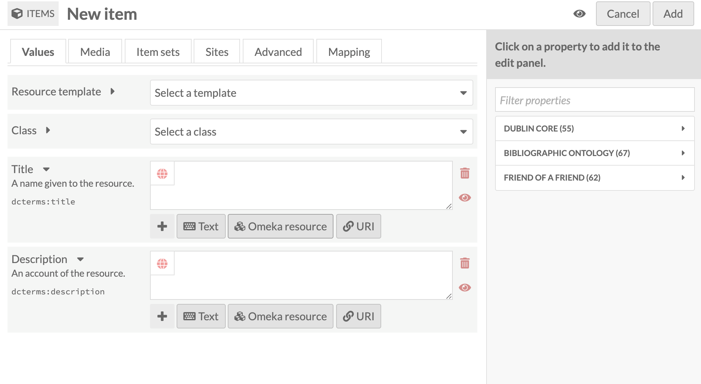

You can select a resource template from the drop-down menu. Resource templates are defined by the supervisors and editors.

- If using a resource template, the item class should automatically load.
- If not using a resource template, you may select a class from the dropdown menu (these are populated from the [Vocabularies](vocabularies.md) in your installation).

Add information to the properties that load. If you do not select a resource template or class, the Dublin Core properties Title and Description will load automatically.  

Whether or not you use a resource template, you can add more properties to the item using the drawer on the right side of the screen. You can simply open one of the vocabularies (Dublin Core, Bibliographic Ontology, etc.) and click on the property you want to add, or you can use the "Filter properties" box to search for a specific property (this is helpful when you have multiple large vocabularies).

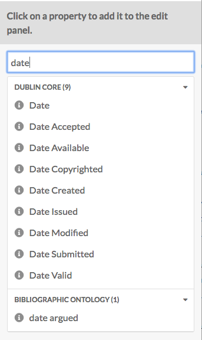

Clicking on the property label in the drawer will automatically add it to the item. If you add a property by accident, leave it blank and it will be removed from the item when you save your changes.

You may add text, a resource from the installation, or an external link in each field.

You can set individual properties as **private or public** using the eye icon for each property. Note that properties set to private are still visible to Global Admins, Supervisors, and Editors. Authors will be able to see all properties on items they own, but will not see private properties created by other users.

In the image below, the first property (Title) is public as indicated by the open eye icon. The second property (Description) is private as indicated by the slashed-through eye icon. Clicking or hitting enter on the eye icon toggles between public and private.

If you have multiple values for a property, you can **reorder** them by dragging and dropping. Click on the bar on the left of the value to grab that value, and drag it into the order that you want it.

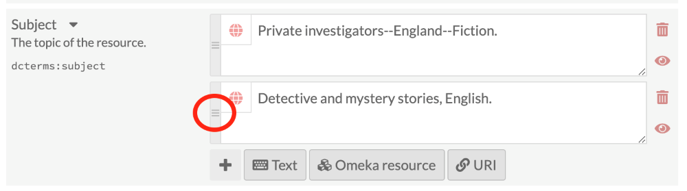

#### Text
Text fields allow for unformatted text entry. No markup is allowed in these fields (e.g. Markdown, HTML).

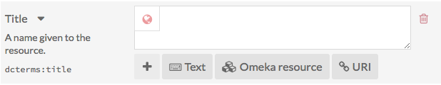

You can indicate the language for the content of a text input using the globe symbol above the input (see the image below). Click on the globe to activate a text field, then enter the [IETF two-letter Language tag](https://en.wikipedia.org/wiki/IETF_language_tag){target=_blank} code for the language in which the text is written.

#### Omeka resource

Choosing an Omeka resource as a metadata value creates an [internal link between the resource you are creating and the resource that fills that field](#linked-resources). 

When creating an item, you have the option to use either another item or an item set. If the item has media attached, you can also choose from within that media - not other media in the installation. 

Choosing a resource type will open a side drawer where you can browse all of those resources in the installation. You can use the search function at the top of the drawer to narrow down the list or to quickly find a specific resource. 

Once you select a resource, detailed information will load, and you must click "Select resource" to finish linking the resources. You can also click the "X" button in the upper right-hand corner to go back to the list of resources.

If you are using an **Item** resource for the property, you will be able to select an existing item or to create a stub of a new item. 

If you wish to use an existing item as your value, you will have three options for finding the item you want in the drawer. Open these options by clicking the triangle button next to the phrase "Filter search". This will open a menu with the following options to filter the items in the drawer:

- Filter by class: A dropdown where you can select any class provided by the vocabularies on the installation.
- Filter by item set: A dropdown where you can limit the items displayed in the drawer to only those associated with a particular item set.
- Filter by item ID: A text field where you can input the ID of the item you want to use. You can find an item's ID in the URL of its edit page; if you are editing the item and the URL is `admin/item/11547/edit` then the item's ID is 11547. An item ID will also appear in the right-hand drawer on its view page. You cannot enter a range or search by a partial number or a wild card - only an exact ID.

Once you enter something into a filter, you need to click on the magnifying glass icon in the search bar to apply your filters.

Item resources also have an option for "Quick add". When this switch is flipped, all of the items in the drawer have a checkbox. You can use these checkboxes to add multiple items as a property at once. Note that you can only edit one property at a time, so all of the items must populate the same property (e.g. "Creator", "Has Part").

If you wish to create a new item, you can create a stub for that item directly in the drawer by selecting the Create an Item option. You will then be presented with truncated item creation form where you can select a

- Resource Template
- Class
- Visibility for new item.

You can also input values for two basic values:
- Title
- Description.

Once you have completed the form, you can add the item stub and simultaneously select the item stub as the input for the property. You can return to the placeholder item to complete its description at a later time.

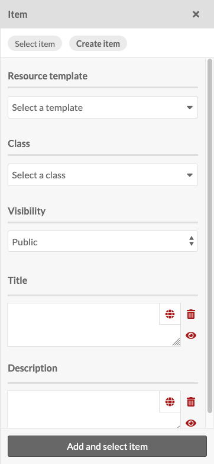

If you are using an **Item set** resource for the property, you will have two options for finding the item set you want in the drawer:

- Filter by class: A dropdown where you can select any class provided by the vocabularies on the installation.
- Filter by item set ID: A text field where you can input the ID of the item set you want to use. You can find an item set's ID in the URL of its edit page; if you are editing the item and the URL is `admin/item-set/15/edit` then the item set's ID is 15. An item set ID will also appear in the right-hand drawer on its view page. You cannot enter a range or search by a partial number or a wild card - only an exact ID.

Once you enter something into a filter, you need to click on the magnifying glass icon in the search bar to apply your filters.

Item set resources also have an option for "Quick add". When this switch is flipped, all of the item sets in the drawer have a checkbox. You can use these checkboxes to add multiple item sets as properties. Note that you can only edit one property at a time, so all of the item sets will populate the same property (e.g. "Creator", "Has Part").

#### URI

URI fields link to an external website or online resource. You can use this to indicate an authority file from elsewhere on the web, or even indicate resources in other Omeka platforms.

You can optionally provide a label that will obfuscate the URI, which is required. You can also enter in a [IETF two-letter Language tag](https://en.wikipedia.org/wiki/IETF_language_tag){target=_blank} to identify the language of whatever the URI points to.

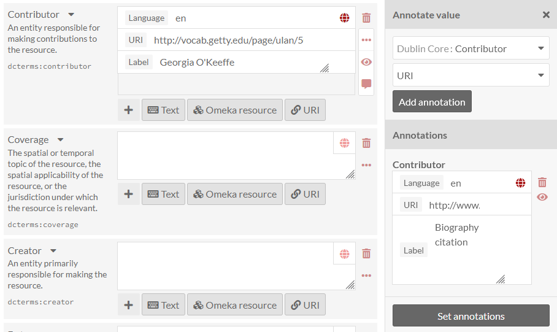

You may add other fields by selecting a property from the list on the right. Browse fields by vocabulary (Dublin Core, Bibliographic Ontology, etc.), or search in the **filter properties** bar above the list of properties and vocabularies.

#### Value annotation

When you input a value for a property associated with a resource, you are making a statement about that resource. If you choose, Omeka allows you to make statements about that statement. We call this value annotation. The advantage of value annotation is that you can choose to make ambiguous facts more concrete by annotating things like:

- Provenance: Where is this fact from?
- Time: When did this fact occur?
- Location: What is the location associated with this fact?
- Certainty: What is the confidence of this fact?
- Type: What type of concept/thing is this fact?

In the world of linked data, this process is know as [reification](https://www.w3.org/wiki/RdfReification){target=_blank}. Each value can have any number of annotations.

To create an annotation, click on the ellipsis on the right side of the value input interface, and then click on the annotation icon (the speech bubble).

The annotation sidebar will open to the right. Select any property that is available within the Omeka S installation to describe the relationship between the annotation and the value it describes. For instance, the value for associated with the property `dcterms:Contributor` might be annotated with more detail about the nature of the contribution. Or you may wish to simply include a note using the `dcterms:Description` field.

Select a data type for the annotation: a text field, a URI, or resource in your Omeka S installation. Modules may make additional data types available. Click the "Add annotation" button and a new field will appear below. Input your annotation. You can do this multiple times for the chosen value if desired. Then click "Set annotations" to finalize the process.

[Each site has a setting](../sites/site_settings.md#show) to indicate whether or not value annotations are visible to the public. This will include value annotations on item sets and media.

You can set controlled vocabularies for annotations using the [Custom Vocab module](../modules/customvocab.md). In this case, you do not need to apply a custom vocabulary to a property using a resource template; you can select any installed vocabulary from the value-type dropdown in the drawer. This will load your vocabulary's choices into a dropdown of terms.

### Media

Use the **Media** tab to add images, video, or other files to an item. See the [Media page of this manual](media.md) for more detailed information.

Using the buttons on the **Add New Media** menu on the right side of the screen, select a media type (Upload, URL, HTML, oEmbed, IIIF, or YouTube). Modules, such as [File Sideload](../modules/filesideload.md), can add more ways to gather media into Omeka. Alternatively, other modules can import materials from other platforms directly into Omeka as items with attached media, such as the [Zotero import](../modules/zoteroimport.md) module.

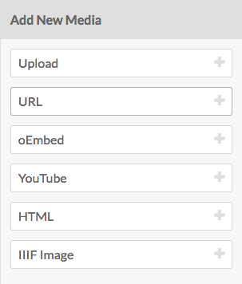

- **Upload**: Select one or more files to upload from your computer.
- **URL**: Import media via a URI.
- **HTML**: Add HTML content as a media resource for your item.
- **IIIF image**: Add an [IIIF image](https://iiif.io/api/image/3.0/){target=_blank} via URL.
- **IIIF presentation**: Add an [IIIF presentation](https://iiif.io/api/presentation/3.0/){target=_blank} via URL.
- **oEmbed**: Insert an embedded representation of an external URL. Note that this will only work with content from [existing oEmbed implementations](http://oembed.com/#section7){target=_blank} - use the URL in your browser’s location bar.
- **YouTube**: Add a link to embed a YouTube video. Use the URL from your browser’s location bar (with `/watch/` in it) rather than a `youtu.be` link.

You can edit media later by going by editing an item, navigating to the **Media** tab, and clicking the edit button (pencil icon) for a media when editing the item.

You can delete any media instance from the item's edit page using the delete button (trashcan icon) on the upper right corner of the media block.

If you have more than one media attached to an item, you can reorder them by dragging and drop each media instance block, using the icon of three lines in the upper left corner of the block as the anchor when dragging.

Omeka S uses the topmost media as the "primary media" for an item, to create thumbnail images for that item on browse and show pages. If you use something like an audio file as the primary media, Omeka will not generate a thumbnail, and will show a default thumbnail based on the file type. 

### Item sets
You can only add items to existing item sets.

From the right-hand menu, click on the owner of an item set, then click the name of the item set to add the item to that set.

You can also filter item sets using the text entry bar above the list of users.

To remove a connection between an item and item set, click the delete (trash can) button to the right of the item set title.

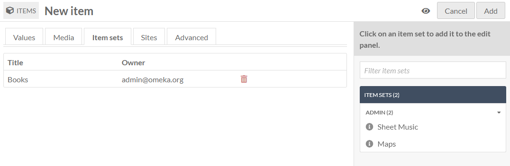

### Sites
Select sites to which to add your items.

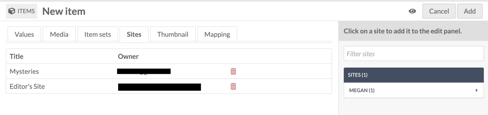

To add an item to a site, select a site from the menu in the right-hand drawer. You can filter sites by searching in the field at the top of the drawer.

If there are sites which have "auto-assign new items" turned on in their settings, you can use this tab to remove this item from those sites. Click the trash can icon on the right side of the site's row to remove it.

### Advanced
The advanced tab has two options. One lets you set a custom thumbnail for the item. The other allows you to change which user has ownership of the item.

#### Thumbnail

By default, Omeka S will use the topmost media to generate a thumbnail for the item. If you want to use a non-media image for the thumbnail for an item you can set it here.

When you use an asset thumbnail instead of uploading media, the asset thumbnail does not display on the item's public show page. This makes such thumbnails useful for items which have no media but which would benefit from a thumbnail for the browse view, or for items whose media does not render an elegant thumbnail, such as audio or video files.

The assets you select from and upload as thumbnails in this tab are the same as those created for [site logos](../sites/site_theme.md#logo).

To assign an asset as a thumbnail, click on the Select button in the main work area of the tab. This will open a drawer on the right side.

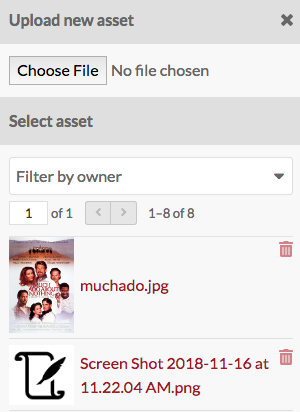

The drawer offers two options: upload a file using your browser, or select from existing assets. To select an existing asset, simply click on it and it will automatically be assigned to the item.

To remove an asset which you have assigned as a thumbnail, click the "Clear" button below the image of the asset. To replace it, click "Select" and either choose or upload a new thumbnail asset.

#### Owner

The ownership of an item is usually assigned to the user account that creates the item. You can use this dropdown to reassign ownership. The dropdown will load the user names (not email addresses) of users in the installation. Select a new user and save your changes.

### Visibility
Use the **make public/private** button (eye icon) to set whether the item is visible to the public or only to users of the Omeka S system.

Item is public: {style="display:inline;"}

Item is private: {style="display:inline;"}

Note that if an item is private, all the media attached is private, but an item which is public can have attached media which are set to be either public or private.

## Edit an item
Once you have created an item, you can edit it at any time, either by clicking the edit icon (pencil button) or clicking on the item's title and then clicking the "Edit" button in the upper right-hand corner of the screen.

To cancel out of editing, click the "Cancel" button at the top right of the screen.

Editing options are the same as when creating a new item, with the addition of the ability to add any media which has been saved to an item as a property.

### Media as property
Once you have created an item and added media to it, you will also have the option to use media **attached to that item** for a property.

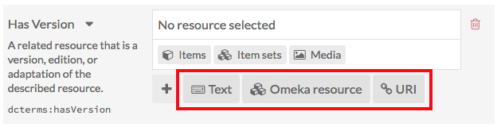

To use a media resource for a property, select the media option for the element (1). The drawer which opens will display all media attached to the item. Select the media which you want to use (2); this will switch the drawer to just that media (second image). Click the "Select Resource" button at the bottom of the drawer to complete the process (3).

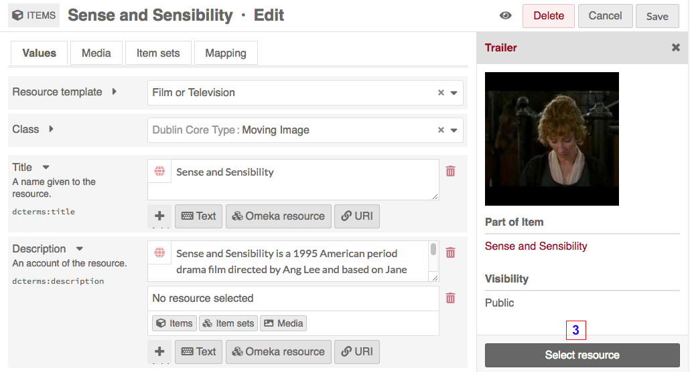

### Delete an item

To delete an item, you can:

- Click the trash can icon in the Items browse page. This will open a right-hand drawer to confirm the deletion.
- Click the title of the item in the table on the Items browse page, then click the "Delete" button at the top right of the screen.
- Use the batch-deletion methods described below to delete many items at once.

## Batch actions

From the browse page of items (`admin/item`) you can batch edit items, using the dropdown menu on the left near the pagination buttons. You can select multiple items using the checkboxes on the left of each item's row.

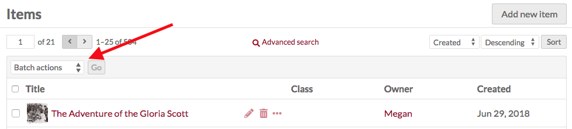

Editors, Supervisors, and Global Admins can batch-edit and batch-delete all items in the installation. Users that have Author-level permissions can batch-edit or batch-delete their own items, but not items of others. In this case, selecting all of the items on the page, or selecting all items, will only include items they own. Users at the Reviewer level cannot batch-delete all resources, but can batch-delete selected resources.

Batch actions are as follows:  

- Edit selected: edit only the items that are selected on the page
- Edit all: edit all the items returned by a search (default is all items)
- Delete selected: delete only the items that are selected on the page
- Delete all: delete all the items returned by a search (default is all items).

You can easily select all items on the page using the checkbox at the top of the Items table. The number of results per page is set in the [installation's global settings](../admin/settings.md#general).

!!! note
	Batch-editing activities are sometimes shown in the [Jobs log](../admin/jobs.md), found in the left-hand bar under the "Admin" heading. Only "Edit all" or "Delete all" operations appear here. Batch-editing only selected items, even a full page of items, will not appear here.

You can first use the "🔍 Advanced search" link to narrow down the items to a subset for editing. For example, you can use [Advanced search](../search.md#item-advanced-search) to limit to items that are not in any item sets, or items that are owned by a specific user. In the image below, the search is set to capture any item without a "Date created" value.

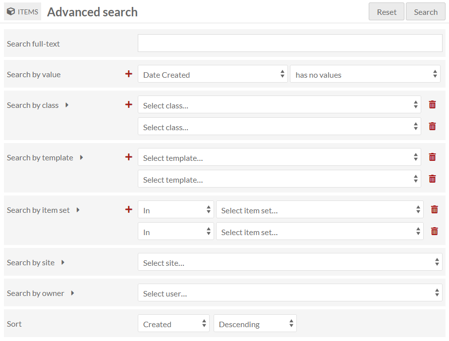

If you perform a search, or end up on the Items browse page from an Item set or other filter, you will once again see the browse page, with your selected parameters appearing at the top of the screen. From this browse screen you can select items manually for batch editing using the checkboxes on the left, or select all of the items on the page, or use the dropdown to edit all items that are currently in the subset.

If you complete a batch action from the next screen, you will return back to this same item subset.

### Batch editing

**Batch editing** items takes you to a new page. The items being edited will display on the right side in a drawer. Be sure to confirm the number of items being edited looks correct.

The batch edit form gives you the following options:  

- **Set visibility**: a radio button. Select from public or not public to make the item visible or not visible to logged-out users.
- **Set template**: a dropdown. Select from the installation's resource templates. You can remove templates from the selected items with the "[Unset template]" option. A search bar appears at the top of the dropdown menu if you would like to type to search.
- **Set class**: a dropdown. Select from classes of the installed vocabularies. You can remove all classes from the selected items with the "[Unset class]" option. A search bar appears at the top of the dropdown menu if you would like to type to search.
- **Set owner**: a dropdown. Select from users of the installation to choose who should be set as the owner of the selected items. Ownership determines who can edit and delete those items, outside the higher [user permission levels](../admin/users.md#roles-and-permissions).
- **Add to item set**: a dropdown and text field. Select from item sets on the installation, organized by owner, or type to search. You can add the selected items to multiple item sets: click in the text field again to see the remaining options.
- **Remove from item set**: a dropdown and text field. Select from item sets on the installation, organized by owner, or type to search. You can remove the selected items from multiple item sets: click in the text field again to see the remaining options.
- **Add to sites**: a dropdown and text field. Select from sites on the installation, or type to search. You can add the selected items to multiple sites: click in the text field again to see the remaining options.
- **Remove from sites**: a dropdown and text field. Select from sites on the installation, or type to search. You can remove the selected items from multiple sites: click in the text field again to see the remaining options.
- **Clear property values**: a dropdown and text field, with all the properties in all vocabularies. Selecting from this will remove any values in that property in the affected items. You can remove multiple property values at once: click in the text field again to see the remaining options.
- **Set value visibility**: a dropdown and text field, with radio buttons. Set the visibility of a specific property or properties to either public or not public. Unlike the radio buttons at the top of the form, this will only affect one or more metadata fields, instead of the entire item (for example, you may wish to hide the "Creator" value on some public items). Select a property from the text field (type to begin searching), and the choose either the "Public" or "Not public" radio button for this option. You can add multiple properties by clicking again within the text field, but they will all become either "Public" or "Not public".

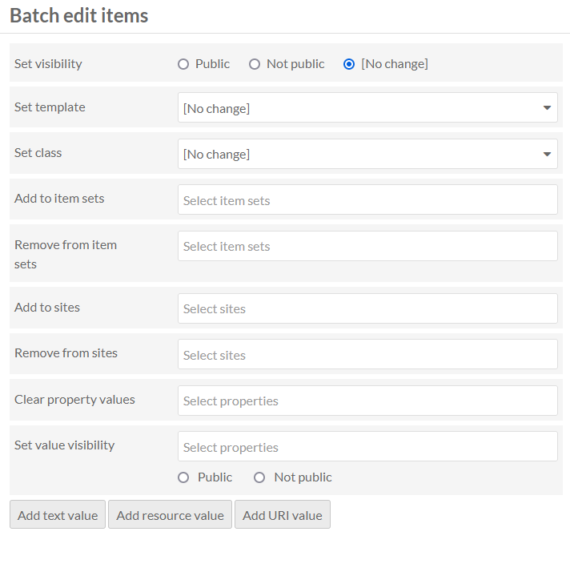

In addition, you can use the buttons at the bottom of the batch edit form to **convert existing values in any property from one data type to another**, such as a text value of "1900-01-01" into a date. 

You can also **add properties** to every item:

- Add text value
- Add resource value
- Add URI value.  

Selecting any of these will add a block to the form where you can select a property from the installed vocabularies and enter the value for that property.

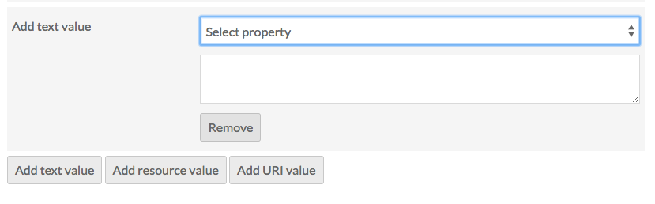

### Batch deleting

For the **delete actions**, a drawer will open on the right side of the screen telling you the number of items which will be deleted. Nothing will be deleted unless you click the red "Confirm Delete" button. This action cannot be undone. To opt out of deleting the items, click the "X" in the upper right corner of the deletion drawer. To confirm this action, check the "Are you sure" checkbox (for "Delete all" but not "Delete selected") and then click "Confirm Delete".

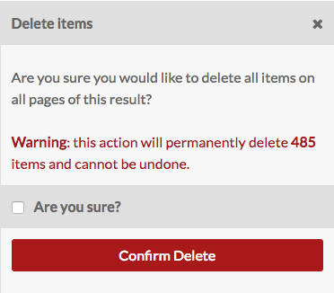

Individual modules may also add batch-edit actions. Those options are noted within the documentation for each module.
