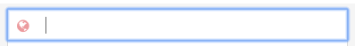
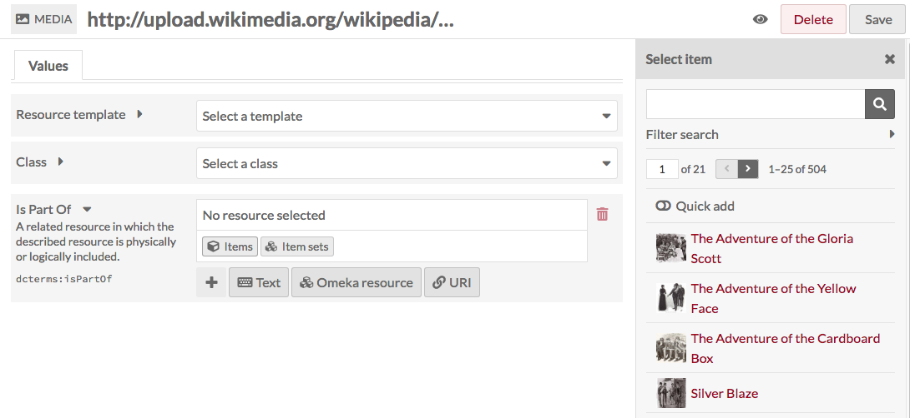
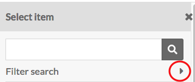
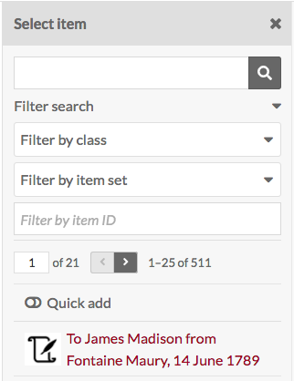
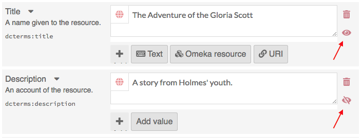

# Media

Media are only created by adding them to an Item. Media cannot exist independently. 

To view the media associated with an item, click on the media’s name in the right-hand sidebar on the item view page.

To view all media in the installation, navigate to the Items browse first. The media browse will appear below Items in the left-hand navigation.

## Add Media

Adding media includes uploading a file, or directly attaching content with oEmbed, YouTube URLs, or writing HTML.

Media can only be added via an [item](../content/items.md). 

## Browse media
To browse media, first go to the admin item browse. In the left hand navigation, an option for Media browse will appear under the Item browse (you may have to click on the triangle to expand the menu below Items)

Media are displayed in a table. Each media is a row, with columns for:

- Select media (a checkbox)
- Media *title*
- icons to *edit* (pencil), *delete* (trash can), or *view details* (ellipses)
- the media's *Class*
- the media's *Owner*
- and the date the media was *Created*. 

Options for navigating and creating items display above the table of items. 

On the left side is a display for the number of pages of media, with forward and back arrows. The current page number is an editable field - enter any valid page number and hit return/enter on your keyboard to go to that page. 

In the center top is a button for [Advanced Search](../../search#media-advanced-search). 

Just above the table on the right are options for sorting media, with two dropdown menus. The first lets you select between *Title*, *Class*, *Owner,* and *(date)Created*; the second allows you to sort ascending or descending. To apply, click the *sort* button.

Clicking on the title of any media will take you to its metadata page. This page displays any metadata in the main work area, with a sidebar on the right listing the visibility, associated item (an active link), date created, MIME type, Size, Ingester, Source, and links to the file derivatives.

## Edit Media
To edit existing media, you can:

- Go to the Browse page and click the pencil/edit icon for the media's row
- Go to the Media browse page, click on the title to view the media's metadata and then click the "*Edit media* button in the upper right hand corner
- Click on the media's name in the right-hand sidebar of an item's page to go to the media's metadata, and then click on *Edit media* from there.

Editing media is very similar to editing [items](../../content/items) or [item sets](../../content/item-sets).

### Values

If desired, you can select a resource template from the drop-down menu. Resource templates are defined by site administrators and editors.

- If using a resource template, the class should automatically load.
- If not using a resource template, you may select a class from the dropdown menu (these are populated from the [Vocabularies](vocabularies.md) in your installation).

Add information to the properties which load. If you do not select a resource template or class, the Dublin Core properties Title and Description will load automatically.

You may add text, a resource from the installation, or an external link in each field.  

Note that if you add the property `dcterms:title`, its contents will replace the autogenerated title of the media. This is useful if dealing with url or media uploads with auto-generated names.  

**Text** fields allow for unformatted text entry.

You can indicate the language for the content of an input using the globe symbol above the input (see the red arrow in the image below). Click on the globe to activate a text field, then enter the [ISO 639-1](https://en.wikipedia.org/wiki/List_of_ISO_639-1_codes) code for the language in which the text is written.

**Omeka Resource** fields create an internal link between the resource you are creating and the resource which fills that field. 

You have the option to use either an item, another media, or an item set. Once you select an item or item set, detailed information will load, and you must click *select resource* to finish linking the resources. You can also click the *X* button in the upper right-hand corner to go back to the list of items or item sets.

If you are using an Item resource for the property, you will have additional options for finding the item you want in the drawer. Open these options by clicking the triangle button next to the phrase "Filter search"

This will open a menu below the button with the following options to filter the items in the drawer:

- Filter by class: a dropdown where you can select any class provided by the vocabularies on the installation;
- Filter by item set: a dropdown where you can limit the items displayed in the drawer to only those associated with a particular item set
- Filter by item ID: a search field where you can input the ID of the item you want to use. You can find an item's ID in the url of it's edit page; if you are editing the item and the url is `admin/item/11547/edit` then the item's ID is 11547.

Item resources also have an option for "Quick add". When this switch is flipped, all of the items in the drawer have a checkbox. You can use these checkboxes to add multiple items as a property at once. Note that you can only edit one property at a time, so all of the items must populate the same property (ex, Creator, Has Part). 

     
**URI** fields link to an external website or online resource.

You may add other fields by selecting a property from the list on the right. Browse fields by vocabulary (Dublin Core, Bibliographic Ontology, etc), or search in the *filter properties* bar above the list of properties and vocabularies.

**Language** You can indicate the language for the content of an input using the globe symbol above the input (see the red arrow in the image below). Click on the globe to activate a text field, then enter the [ISO 639-1](https://en.wikipedia.org/wiki/List_of_ISO_639-1_codes) code for the language in which the text is written.

You can add properties by selecting from the list on the right side of the screen. You can either browse fields by vocabulary (Dublin Core, Bibliographic Ontology, etc), or search in the *filter properties* bar above the list of properties and vocabularies.

Automatically generated metadata, such as source, visibility, and part of item, cannot be edited. 

Use the *make public/private* button (eye icon) to set whether the media is visible to the public or only to users of the OmekaS install. 

 Public 

  Private

Note that if an item is private, all the media attached is private, but an item which is public can have attached media which are set to be either public or private.

You can set individual properties as Private or Publicly visible using the eye icon for each property. Note that properties set to private are still visible to Global Admins, Site Admins, and Editors will be able to see properties even when set to private. Authors will be able to see all properties on items they own, but will not see private properties created by other users.

In the image below, the first property (Title) is public as indicated by the open eye icon. The second property (Description) is private as indicated by the slashed-through eye icon. Clicking or hitting enter on the eye icon toggles between public and private. 

### Thumbnail
Not all media generate an elegant thumbnail, for example pdf or text file documents or some video files. You can use this tab to set a representative thumbnail for the media which will be used on browse pages but not on the page for the item or its media.

The assets you select from and upload as thumbnails in this tab are the same as those created for [site logos](../../sites/site_theme/#settings-options). 

To assign an asset as a thumbnail, click on the Select button in the main work area of the tab. This will open a drawer on the right side. 

The drawer offers two options: upload a file using your browser, or select from existing assets. To select an existing asset, simply click on it and it will automatically be assigned to the media. 

To remove an asset which you have assigned as a thumbnail, click the "Clear" button below the image of the asset. To replace it, click select and either choose or upload a new thumbnail asset.

## Batch editing

From the media browse page, you can batch edit media, using the dropdown menu on left just above the table of media. You can select multiple items using the checkboxes on the left of each item's row.

Batch actions are as follows:  

- Edit selected: edit only the items that are selected on the page
- Edit all: edit all the items returned by a search (default is all items)
- Delete selected: delete only the items that are selected on the page
- Delete all: delete all the items returned by a search (default is all items)

Choose one of these options and then click *Go*.

**Batch editing** media takes you to a new page. The media being edited will display on the right side in a drawer, while the batch edit form gives you the following options:  

- set visibility: radio buttons, select from Public, Not public, or No change
- set template: a dropdown, select from the installation's resource templates.
- set class: a dropdown, select from classes of the installed vocabularies.
- Clear language: a checkbox
- Set language: a text entry box.
- Clear property values: a dropdown menu with all the properties in all vocabularies, selecting from this will remove any values in that property in the affected items. Clear additional properties using the *Clear another property* button.

In addition, you can use the bottoms at the bottom of the batch edit form to add properties to every media:

- add text value
- add resource value
- add URI value  

Selecting any of these will add a block to the form where you can select a property from the installed vocabularies and enter the value for that property.

For the **delete actions**, a drawer will open on the right side of the screen telling you the number of media which will be deleted. Nothing will be deleted unless you click the red *Confirm Delete* button. This action cannot be undone. To opt out of deleting the media, click the X in the upper right corner of the deletion drawer. To confirm delete, check the "Are you sure" checkbox and then click *Confirm Delete*

