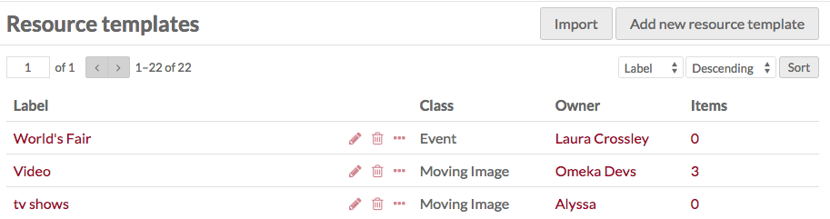
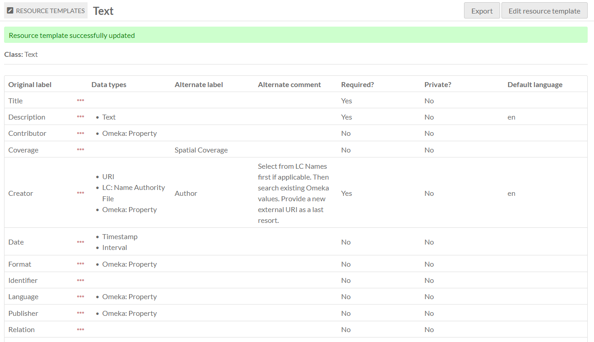
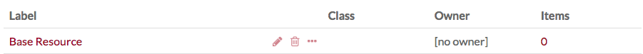
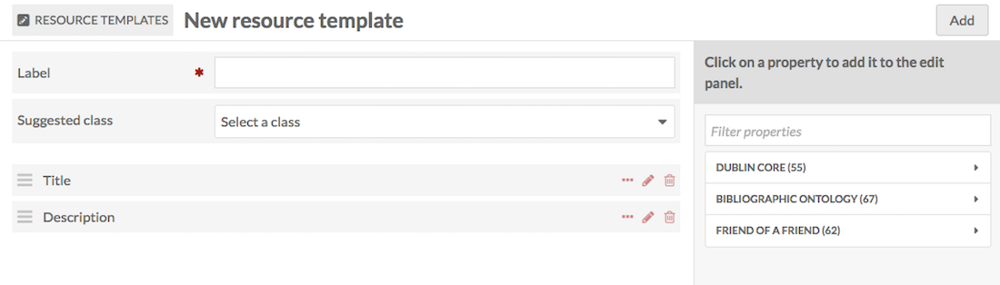
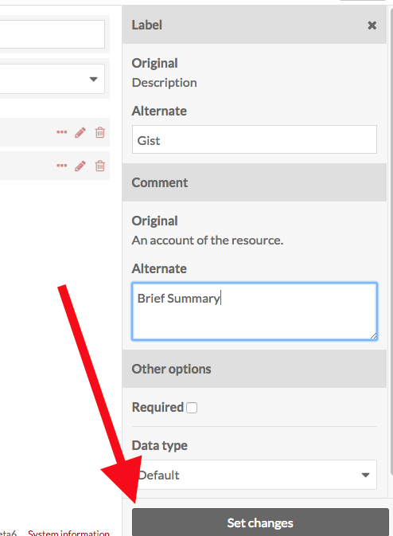
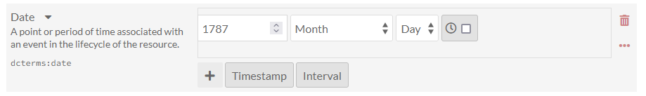
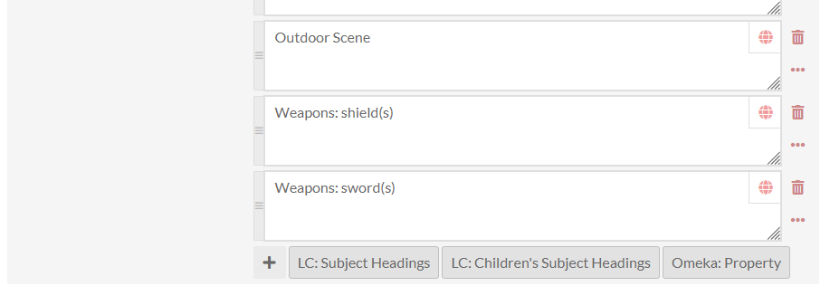
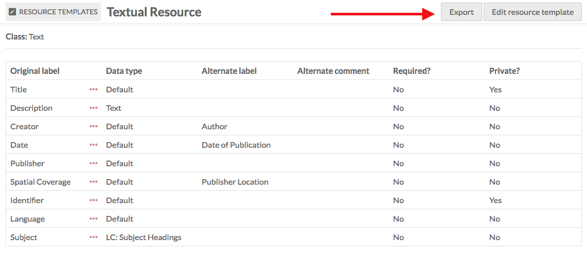
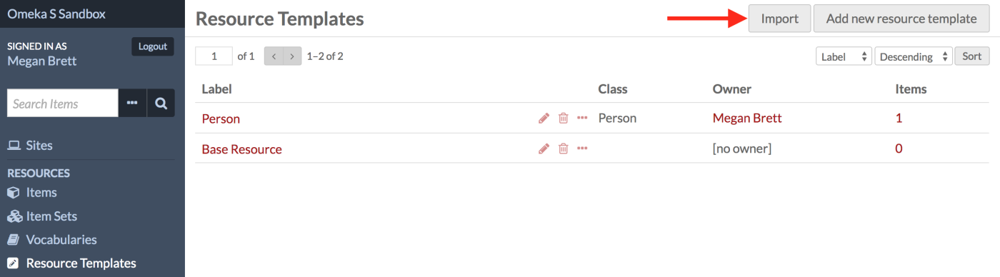
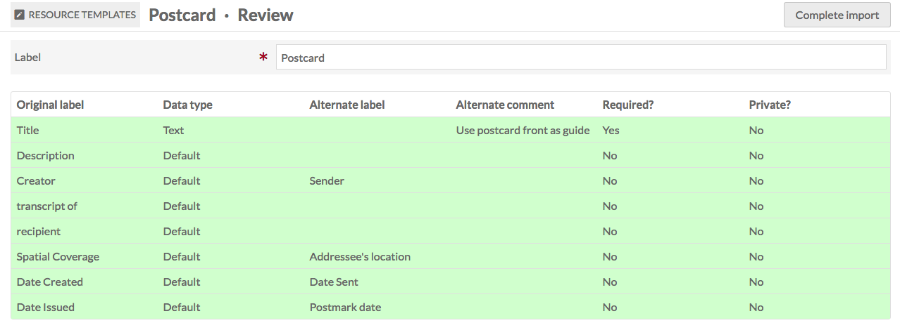

# Resource Templates

A **Resource template** is a set of pre-defined properties, optionally with a Class, to guide item creation and the interpretation of properties. 

Resource templates are managed from the administrative dashboard, accessed through the left-hand navigation under the section labeled **Resources**. 

On the left side above the table is a display for the number of pages of items, with forward and back arrows. The current page number is an editable field - enter any valid page number and hit return/enter on your keyboard to go to that page.

On the right side above the table are two drop-down menus which let you sort resource templates. You can sort by: **label**, **class**, **owner**, or number of **items** assigned to a template, and have these display in either ascending or descending order. 

You can use the icons in each template’s row to: **edit** (pencil), **delete** (trash can), or **view details** (ellipsis). If you click on the number of items listed for a template, it will take you to a list of all those items. 

[This screencast](https://vimeo.com/290924872){target=_blank} gives an overview of creating and applying resource templates:

<iframe src="https://player.vimeo.com/video/290924872?h=c6359076cd" style="position:absolute;top:0;left:0;width:100%;height:100%;" frameborder="0" allow="autoplay; fullscreen; picture-in-picture" allowfullscreen></iframe>

<a href="https://vimeo.com/290924872">Omeka S Resource Templates</a> from <a href="https://vimeo.com/omeka">Omeka</a> on <a href="https://vimeo.com">Vimeo</a>.

## Resource template permissions

When a user creates a resource template, they become the "owner" of that template. Most user levels have the ability to create templates, and can always delete their own templates. Only higher levels can delete templates that others own. 

| Category | Permission | Global Admin | Supervisor | Editor | Reviewer | Author | Researcher |
|-----|-----|---|---|---|---|---|---|
| Resource templates | Add | Yes | Yes | Yes | No | Yes | No |
| | Edit/Delete  | All | All | All | No | Their own | No |

Note that when you change a user's role, for example from an Author to a Researcher, they will still own the templates they created when they had permission to do so. Deleting a user orphans their templates - they will appear as having "[no owner]", and cannot be re-assigned to another user.

## View resource templates
Clicking on the title of a resource template takes you to a table view of all the properties and property options for that template.

Each property displays as a row in the table, with columns for:

- Original label, with an ellipsis button to see which the property's vocabulary, term, original comment, and number of items currently using the property
- Data type(s)
- Alternate label
- Alternate comment
- Whether the property is required
- Whether the property's values are private
- Whether the property has a default language (which can be overridden when entering values).

Use the buttons in the upper right of this page to export or edit the template. 

## Base Resource
All Omeka S installations include a "Base Resource" template which maps to the metadata fields required by the [Digital Public Library of America (DPLA)](https://dp.la/){target=_blank}. It will display in the table of resource templates as "Base Resource" with no owner. 

The Base Resource template contains the following Dublin Core fields: Title; Rights; Type; Creator; Date; Description; Format; Language; Spatial Coverage (Place); Publisher; Alternative Title: Contributor; Extent; Identifier; Relation; Is Replaced By; Replaces; RightsHolder; Subject; Temporal Coverage.

## Add a resource template
From the **Resource templates** tab in the Admin Dashboard, click the "Add new resource template" button.

The New resource template page will load with options for Label, suggested class, and the properties **Title** (`dcterms:title`) and **Description** (`dcterms:description`).

1. In the Label property, type the label for your new template. This will be the text displayed in the dropdown for resource templates when creating an item, so be sure that the label is clear.
1. If desired, select a class to associate with the template.
1. Add properties from the list of vocabularies in the menu on the right side of the screen. You can filter properties in the text box or select from a specific vocabulary using the arrows to the right of the vocabulary names. 
1. If desired, modify the property (see Property options, below).

Be sure to "Save" your resource template before leaving this page.

Users who select this resource template when creating an item will still be able to add other properties to the item, and they will only be required to fill out those fields you check as required.

### Property options
You can modify the display label, comment on the label, set a property as required, and set the default data type for each property in your template.

To do this, click the edit (pencil) icon in the row for the property you wish to modify. This will open a drawer on the right side of the screen with the ability to edit the properties.

You must click the "Set changes" button at the bottom of the drawer for each property that you edit before exiting the drawer or moving on to another property. If you do not click "Set changes", your edits will not be saved.

#### Label 
Change the displayed label of the property that appears when the template is applied to an item by entering the text you want to appear in the "Alternate" label field for each property. This will change the item editing page in the admin side as well as the item view page on the public side. 

#### Comment
Add alternate comments for the property in the "Alternate" field in this section. This will change the text under the property name when users are creating items using your resource template. Comments are for internal use only and display on the item editing page, but cannot be accessed from public pages. You can use this field to provide guidance and instructions to users with editing powers.
 
#### Other options 

The "Use for resource title" checkbox allows you to select a property to serve as the title for the resource, instead of the default (`dcterms:title`). This property will display in the "title" field on browse pages.

The "Use for resource description" checkbox allows you to select a property to serve as the description for the resource, instead of the default (`dcterms:description`). This property will display in the "description" field on browse pages. 

The "Required" checkbox sets whether a property is required when the template is in use. If checked, users will not be able to save an item or item set using this template without adding data for this property.

The "Private" checkbox sets the default visibility of the data for this property. If checked, any data added by a user for this property will only be visible to the owner of the item or item set, global administrators, site administrators, and editors. It will not be visible to the public. **Note**: Users working with the template will be able to toggle the visibility of this property on a case-by-case basis. This is only a default setting, not enforced.

##### Data types

There are three default data types in Omeka S. These data types allow you a simple text entry, or two types that provide dynamic linking to other resources: either resources inside your Omeka installation, or by URI to external sites. For example, you may wish to have a Person item, and use that Person in the Creator field of other items; or, you may wish to link to an external controlled vocabulary entry of the Creator, such as on Wikidata. 

Every field in every resource template offers all three of these data types by default, unless otherwise directed. Using the "Data type" dropdown, you can designate one or more data types for each property. Whichever you choose will be automatically loaded once someone is editing a resource using that template, and they will only be able to use those data types for the element when using this resource template. 

- Text: textual input. 
- URI: a link with label.
- Resource: users of the template can select from existing items, media, or item sets in the installation, or select any resource.
- Additional options may be added by modules: 
	- [Numeric Data Types](../modules/numericdatatypes.md) can restrict values to one of four numeric data types, providing a structured data entry. 
	- [Value Suggest](../modules/valuesuggest.md) will modify the textual entry field to provide suggested values from controlled vocabularies, but the user can ignore these suggestions and enter in any text. 
	- [Custom Vocab](../modules/customvocab.md) will **require** users to choose from one of the provided vocabulary entries as a property value. You can assign further data types (such as Text) as an alternative to the custom vocabulary if desired. 

You can select multiple data types, for example giving users the option of Text or Resource for input, but not URI. All choices will appear in the data types field with an "X" to the right of their label - click the "X" to remove that data type. 

Note that while suggested vocabulary data types are essentially text entries, selecting one or more of these will exclude the user from entering URI values unless this is also explicitly included as an option. You may need to add URIs if there are external vocabularies not included in Value Suggest that you wish to use as a fallback. Data types appear in the same order they appear in the dropdown, so you cannot prioritize data types by ordering them.

In the image above, textual subject entries can be added to using controlled vocabularies, as well as existing values already in the Omeka installation (by including "Omeka: Property" as the data type), all of which are supplied by the Value Suggest module.

Pre-existing values will not be changed when a resource template is edited, so existing data that does not conform to the new data type restriction will not be affected by these changes.

## Edit a resource template
You can edit the Base Resource template or any templates you create by clicking the edit icon in the table of resource templates, or by clicking "Edit" in the upper right hand corner when viewing a resource template.

If you decide you do not want to edit the template or do not wish to save your changes, simply click the "Cancel" button located between the "Delete" and "Save" buttons in the upper right hand corner of the window.

## Share resource templates
You can share a resource template between Omeka S installations by exporting and importing them.

### Export a resource template
To export a resource template from your Omeka S installation:

1. Go to the "Resource templates" menu on the main navigation.
1. Click the Label of the template you want to export.
1. On the resource template view page, click the "Export" button in the upper right corner of the screen.

Exporting a resource template will download it to your computer's default download location as a JSON file with the same name as the resource template's Label.

### Import a resource template

!!! note
	If you want to import a resource template that uses a [Custom Vocab](../modules/customvocab.md), you will need to manually reproduce the Custom Vocab on the second Omeka S installation *before* importing the resource template. You should also install and enable [Value Suggest](../modules/valuesuggest.md) before importing a template that uses it for data types.

To import a resource template (a JSON file exported from a different S installation) into your Omeka S installation:  

- Go to the **Resource Templates** tab on the main navigation
- Click the "Import" button in the upper right corner of the screen.

- On the Resource templates: Import page, click the "Choose File" button.
	- This will open your browser's file selection window. Choose the JSON file for the resource template you want to import.
- Click the "Review import" button.
	- On the Review page, you will be able to check that properties and property options are correct.
	- Imported templates which used [Value Suggest](../modules/valuesuggest.md) or [Custom Vocab](../modules/customvocab.md) will indicate in the Data type column what the original source was, and a dropdown to allow you to select a new Data type. If you do not have the necessary modules, the dropdown will only show the default options.

