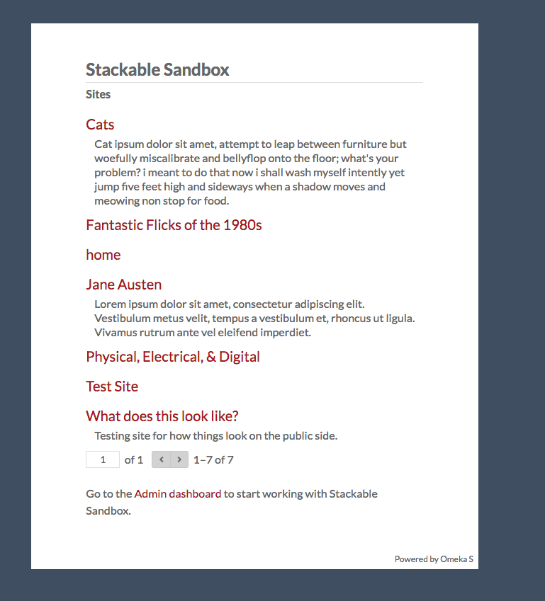

# Front Page

Omeka S allows users to build multiple distinct sites within one installation that are not necessarily connected to each other. Each installation has, by default, a front page that lists all of the sites in the installation. This page is accessed by going to the main URL of your Omeka S installation; if your [admin dashboard](admin-dashboard.md) was at `yourdomain.org/omekas/admin`, then you would find this page at `yourdomain.org/omekas/`.

The page displays all sites that a user has permission to see, along with the sites' summaries & thumbnails if they exist. If someone is not logged in, they will only see public sites. A logged-in Global Administrator, by contrast, would see all existing sites on the installation.

If you want this index page to be hidden from site visitors, a Global Administrator can select one public site on your installation to which visitors will be redirected when they navigate to your base URL (from `yourdomain.org/omekas/` to `yourdomain.org/omekas/s/yourmainsite/`). To do so:

- Go to Settings (the gear icon), then the General tab.
- Under the "Default site" option, use the dropdown menu to select one of your current sites. 
- To remove a selected site and revert back to the index page, click the small "X" on the right side of the dropdown.

You can customize a branded site index for your installation by creating a site, creating a page, and then using the ["List of sites" page block](sites/site_pages.md#page-blocks) to generate a list of all the sites in the installation. Then, use the "Default site" option to point to that site.