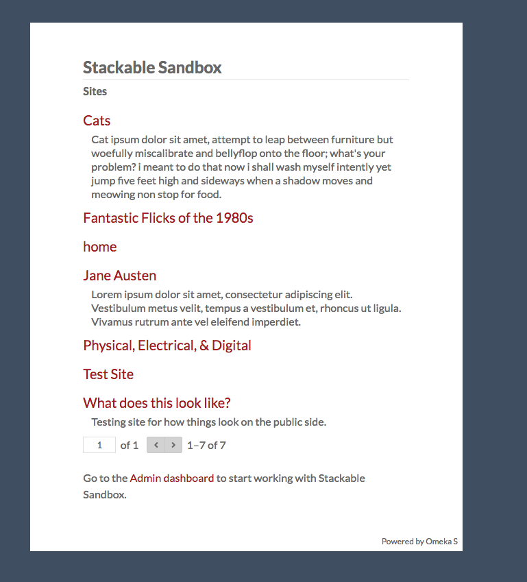

# Front Page

Omeka S allows users to build multiple distinct sites. They exist in one installation but are ndo not need to connect to each other. By default, each installation has a front page that lists all of the sites in the installation. You can access this page by going to the main URL of your Omeka S installation. If your [admin dashboard](admin-dashboard.md) is at `yourdomain.org/omekas/admin`, then you can find this page at `yourdomain.org/omekas/`.

The page displays all sites that a user has permission to see. It also displays the sites' summaries and thumbnails. A user can only see public sites unless they are logged in. A logged-in Global Administrator can see all existing sites on the installation.

You can choose to hide this index page from site visitors. A Global Administrator can select one public site from your installation to redirect visitors to from this index page. When they navigate to your base URL, they will instead see this site. For example, from `yourdomain.org/omekas/` to `yourdomain.org/omekas/s/yourmainsite/`. To do this:

- Go to Settings (the gear icon), then the General tab.
- Under the "Default site" option, use the dropdown menu to select one of your current sites. 
- Click the small "X" on the right side of the dropdown to remove a selected site and revert back to the index page.

You can customize a branded site index for your installation. You can do this by creating a site, creating a page, and using the ["List of sites" page block](sites/site_pages.md#page-blocks) to generate a list of all sites. Then, use the "Default site" option to point to that site.