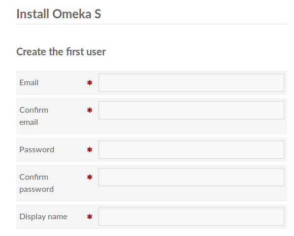
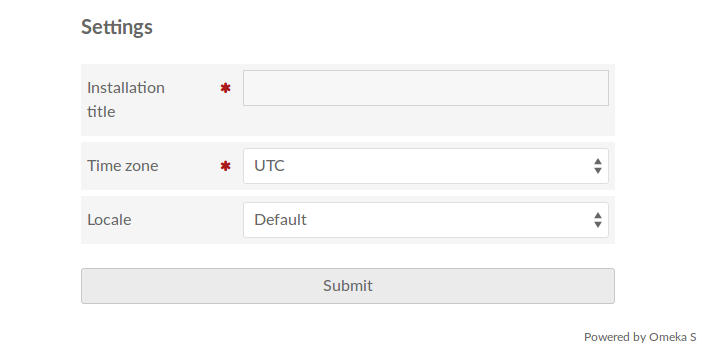
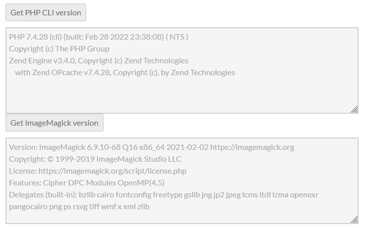

# Installing

## System requirements
In order to install Omeka S (latest version 4.2), you will need a server running the following:

- Linux
- Apache (with [AllowOverride](https://httpd.apache.org/docs/2.4/mod/core.html#allowoverride){target=_blank} set to "All" and [mod_rewrite](http://httpd.apache.org/docs/current/mod/mod_rewrite.html){target=_blank} enabled)
- MySQL, minimum version 5.7.9 (or MariaDB, minimum version 10.2.6)
- PHP, minimum version 8.1, with [PDO](http://php.net/manual/en/intro.pdo.php){target=_blank}, [pdo_mysql](http://php.net/manual/en/ref.pdo-mysql.php){target=_blank}, and [xml](http://php.net/manual/en/intro.xml.php){target=_blank} extensions installed. 
	- PHP 8.4 is not supported in Omeka S 4.1 or earlier, but is supported as of Omeka S 4.2 and later. 
- Optional, to create thumbnails: ImageMagick version 6.7.5 or greater, the PHP `imagick` extension, or the PHP `gd` extension.

[GD](https://secure.php.net/manual/en/intro.image.php){target=_blank} is a basic graphic library installed by default with PHP. It can create thumbnails for common image formats only (jpeg, gif, png). [Imagick and ImageMagick](https://www.imagemagick.org){target=_blank} are the same library and can create thumbnails for more than 200 formats. For more information, see the [Configuration page](configuration.md#thumbnails).

## Installation methods

### Install from download

!!! note
	Before you install Omeka S, you need to create a MySQL database and user. Omeka S must have a dedicated database; you cannot use a prefix for a database used by another system or Omeka S or Classic installation. For more information on creating a database and user, please see your hosting's support documentation or talk to your system administrator.

1. [Download the latest release from the release page](https://omeka.org/s/download/){target=_blank}.
1. Extract this downloaded zip file to your computer.
1. Inside the directory, open the `config/database.ini` file and add your MySQL username, password, database name, and host name. The user and database must be created before this step.
1. Upload this entire directory to your server, into the folder of your choice. For example, if your server is `https://yourwebsite.org/`, you may wish to install Omeka S into a folder located at `https://yourwebsite.org/myomekas/`. Make sure it has your updated `database.ini` file (do not upload the original zip file you downloaded).
1. Make sure the `files/` directory on the server is writable by Apache.
1. In your web browser, navigate to the `admin` page for your Omeka S installation, where you can complete the installation. For example, if you uploaded the directory contents to `https://yourwebsite.org/myomekas/`, then navigate to `https://yourwebsite.org/myomekas/admin`.

### Install from GitHub

Basic instructions for installing and updating from GitHub can be found in the [ReadMe](https://github.com/omeka/omeka-s/blob/develop/README.md){target=_blank} of the Omeka S GitHub repository.

Then, in your web browser, navigate to the admin page for your Omeka S installation (`https://yourwebsite.org/myomekas/admin`), where you can complete the installation.

### One-click installation

Hosting companies that use [Softaculous](https://softaculous.com/){target=_blank} and [Installatron](https://installatron.com/){target=_blank} should offer a one-click install of Omeka Classic and Omeka S. Check their application databases:

- [Omeka Classic](https://www.softaculous.com/softaculous/apps/educational/Omeka){target=_blank} and [Omeka S](https://www.softaculous.com/softaculous/apps/others/Omeka_S){target=_blank} on Softaculous
- [Omeka Classic](https://installatron.com/omeka?locale=en){target=_blank} and [Omeka S](https://installatron.com/omekas?locale=en){target=_blank} on Installatron.

The one-click installation process through Softaculous may allow you to create a database and user at the same time, and will edit the `config/database.ini` file for you.

Hosting suggestions from our users include:

-   [Reclaim Hosting](https://reclaimhosting.com/){target=_blank} - offers [Omeka S installations](https://support.reclaimhosting.com/hc/en-us/sections/204007617-Omeka){target=_blank} using Installatron, with some steps (including [manually setting the PHP path](#test-and-set-the-php-path))
-   [Dotblock](http://www.dotblock.com){target=_blank} - uses Softaculous
-   [HostGator](http://hostgator.com){target=_blank} - uses Softaculous
-   [TMD Hosting](https://www.tmdhosting.com){target=_blank} - uses Softaculous
-   [Webuzo](http://webuzo.com){target=_blank} - uses Softaculous.

## Initial setup

Once you have successfully installed Omeka S and configured the `database.ini` file, you must navigate to the admin URL of your Omeka S installation (something like `https://yourwebsite.org/myomekas/admin`).

The first time you point your browser to the newly installed site, you will need to enter information for the first user, along with basic information for your install. There are two sections on this page: **Create the first user** and **Settings**.

In the **Create the first user** section:

- Enter an **email** address, and type again to confirm
- Confirm the **password** and type again in the next input to confirm
- Enter a **display name** for the user.

Note that you can change all of these later in the [User](admin/users.md) management section of your install.



In the **Settings** section, enter:

- An **installation title** which will display on the admin site
- The installation's **time zone** (select from dropdown)
- select a **locale** for the language of the admin side of the installation.



You can changes these at any time in the in the [Settings](admin/settings.md) section of your [admin dashboard](admin-dashboard.md).

### Test and set the PHP path

Omeka S uses background jobs for some long-running tasks that operate on many items or just otherwise might take a long time. Omeka S uses the PHP CLI (command-line interface) to run these jobs, the `php` command. An invalid PHP path can cause a number of problems for your Omeka Classic installation. 

Omeka S by default will try to automatically detect the path to the PHP CLI on the server, but for some servers this detection doesn't work, or there are multiple different `php` commands to choose from. 

If you are [using Reclaim Hosting](#one-click-installation), you will have to manually set the PHP path when you install. See [their instructions here](https://support.reclaimhosting.com/hc/en-us/articles/1500005620481#omeka-s){target=_blank}.

Use the [System Information page](admin-dashboard.md#system-information) to verify that you installation has identified the correct PHP path. If there is an error when you click the button, that can indicate whether you need to set the configuration manually. 



See [Configuration Options](configuration.md) to learn about modifying thumbnail generation, setting the PHP path manually, and more. 

### Work with your installation

Once you have correctly configured all of the technical components of your Omeka S installation, you will want to begin by: adding other users; creating resource templates, vocabularies, and item sets; creating one or more sites; then adding items, and assigning those resources to your sites. Continue on with the user manual to learn more about these parts of Omeka S.

!!! note
	If you have an existing Omeka Classic or S installation, you may wish to look at modules such as the [Omeka Classic Importer](modules/omekaCimporter.md), the [Omeka S Item Importer](modules/ositemimporter.md), or the [CSV Import module](modules/csvimport.md), which can help you copy other types of data.

## Updating

### Update manually

1. Download the latest release from the release page.
1. Make a copy of your `/config` directory. You will need to restore your `local.config.php` and `database.ini` files from that copy.
1. Make a copy of your `.htaccess` file (in the root directory) if you have changed it, such as by [turning on error logging](errorLogging.md).
1. Make a copy of your `/modules` and `/themes` directories.
1. Make a copy of your `/files` directory.
1. Remove all Omeka S files, and replace them with the files from the updated zip file.
1. Replace your original `/config/local.config.php`, `/config/database.ini`, and `.htaccess` files.
1. Replace your original `/modules`, `/themes`, and `/files` directories.
    - For significant version updates, you may also have to install an updated version of your modules and themes. The release notes for the core version will indicate whether or not those updates will be likely. Once you complete your migrations using your browser, the modules and themes that require new versions will be clearly marked on their respective pages. The Modules page in your installation will tell you what needs to be updated; the Themes page under any of your Sites will indicate active themes that need updating. 
1. In your web browser, go to your site's admin page (`/myomekas/admin`) and run any migrations that are needed.

### Update from GitHub

Basic instructions for installing and updating from GitHub can be found in the [ReadMe](https://github.com/omeka/omeka-s/blob/develop/README.md){target=_blank} of the Omeka S GitHub repository.

## Install on Windows or Mac OS (development only)
Omeka S does not support proprietary or closed-source operating systems. However, for **basic development purposes** or for quick training, Omeka can run with [WAMP](http://www.wampserver.com){target=_blank}, [MAMP](https://www.mamp.info){target=_blank}, or similar tools.

Follow the standard installation instructions. You will need to make the following [configuration](configuration.md) changes to the file `config/local.config.php` to work.

First, the PHP path may need to be set if Omeka S cannot automatically detect the location of your PHP utilities on your local server. Open the `local.config.php` file and look for line 12:
```
    'cli' => [
        'phpcli_path' => null,
    ],
```

Fill out the `phpcli_path` value with the appropriate path for your operating system. For example, if you are using a MAMP environment, you may find the PHP utilities inside the MAMP installation folder at `MAMP\bin\php\php74`.

Second, you need to configure Omeka S to use the thumbnail-generating utility available on your local server. Open the `local.config.php` file and look for the following section:
```
    'service_manager' => [
        'aliases' => [
            'Omeka\File\Store' => 'Omeka\File\Store\Local',
            'Omeka\File\Thumbnailer' => 'Omeka\File\Thumbnailer\ImageMagick',
        ],
    ],
```
Edit the `Omeka\File\Thumbnailer` value to the following, based on what is available for your system:

- Replace the default thumbnailer with `Omeka\File\Thumbnailer\Gd`.
- Replace the default thumbnailer with `Omeka\File\Thumbnailer\Imagick`, and enable Imagick in the file `php.ini` of your server via the server admin interface or directly in the file.
- Keep the default thumbnailer `Omeka\File\Thumbnailer\ImageMagick`, but install the command line tool `imagemagick` and change the `imagemagick_dir` value to its directory. To install imagemagick, see the documentation of your server.

If you see the error `no input file specified`, you may need to edit the `.htaccess` file. Comment out line 8, `RewriteRule !\.(php[0-9]?|phtml|phps)$ - [NC,C]`. You may also need to comment out the lines following the block comment at line 17 ( “The following rewrites”) and replace them with `RewriteRule ^(.*)$ index.php`. 
