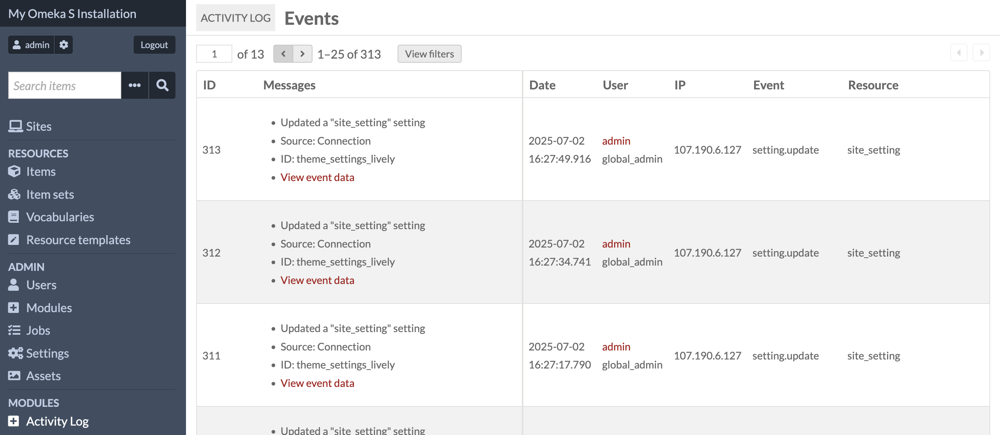
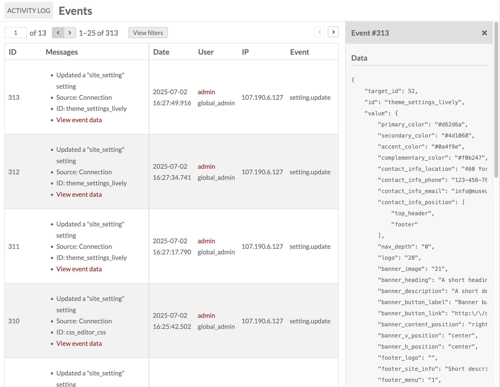
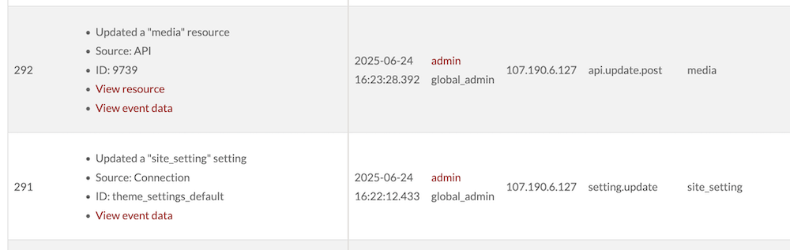
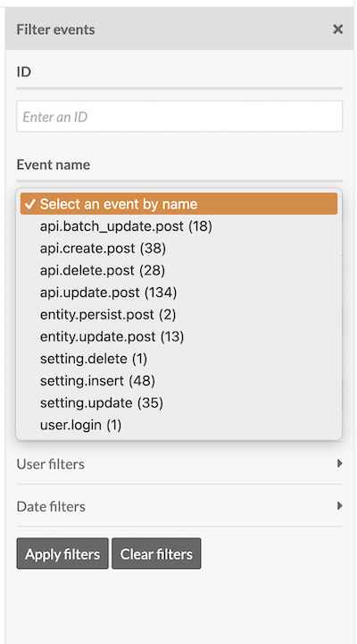
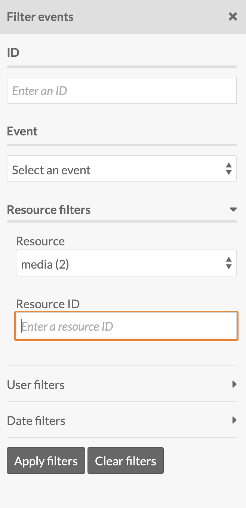
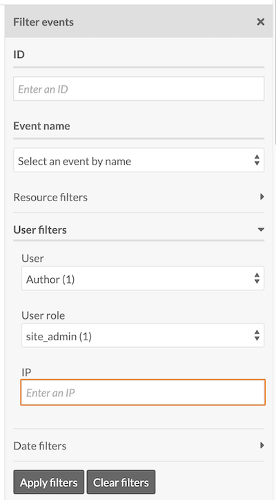
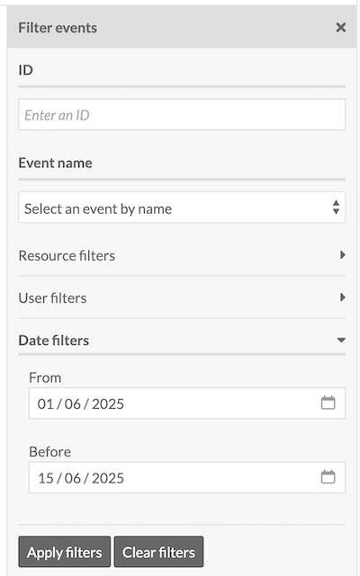
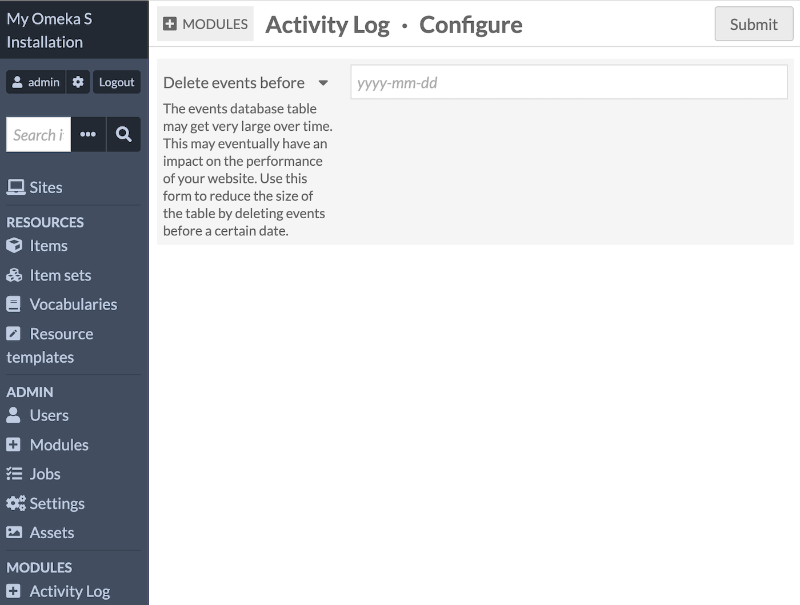

# Activity Log

The [Activity Log module](https://omeka.org/s/modules/activitylog/){target=_blank} allows you to gather information about changes made in the Omeka interface into one table. The module will show all changes made to resources, sites, installation settings, users, and module-added data points. 



Once activated on the [modules](index.md) tab of the admin dashboard, Activity Log has no required settings. It adds an entry to the Modules list in the left-hand sidebar, which takes users to the table of events. 

Activity Log is only accessible to users at the Global Admin and Supervisor levels. Only Global Admin can erase Activity Log data.  

## View events

Activity Log will record events when it is active. The table will reflect all changes made in the installation, by all users. The table is displayed in reverse-chronological order (newest events at the top). It only lists events that modify (create, update, and delete). It does not include read-only events (such as searching). 

The table includes the following columns:

- **ID**: The internal identifier of the event
- **Date**: The date/time of the event, using the installation's time zone
- **User**: The user who triggered the event, and the user's role. Where no user is logged in (such as contributions made using the [Collecting](collecting.md) module's public forms) this space will be blank. 
- **IP**: The IP address of the user, at the time of the event
- **Event name**: The type of event that was triggered by the user
- **Resource**: The ID of the resource that was modified by the user. If multiple resources, as in a bulk action, the IDs of all affected resources will be listed in the data. 
- **Messages**: Any messages that describe the event, in list form.

An event can be seen in more detail by clicking the "View event data" link in each table entry. This will open the right-hand drawer to show a technical version of the data saved to the database in the event. 



For example, an event in which multiple items (IDs 123, 124, and 125) are removed from a site (ID 01) will say:


```
{
    "request_options": {
        "collectionAction": "remove",
    },
    "request_content": {
        "o:site": [
            "01"
        ]
    },
    "request_ids": [
        "123",
        "124",
        "125"])
```

Some events, when related to a specific resource, will provide a link to that resource as well as a link to see more information.



### Filter events

Users with permission to view the Activity Log can filter events. Click the "View filters" button at the top of the table to open the right-hand drawer: 


- Filtering by event name will allow you to narrow down by the types of changes made: creation, deletion, updating, batch-updating, setting changes, etc.



- Filtering by resource will allow you to select from the resources inside the installation: item, media, item set, site, page, etc.



- Filtering by user will allow you to choose from the list of users who have made changes to the installation within Activity Log's collection range.



- Filtering by date will allow you to select one or two dates by calendar - a start date for events (on and after) and an end date.



Users may filter the events using the multiple available filters (you will see the count of each entry in parentheses):

- **ID**: Filter events by event ID
- **User**: Filter events by user
- **User role**: Filter events by user role 
- **IP**: Filter events by IP address
- **Event name**: Filter events by event name
- **Resource**: Filter events by resource name
- **Resource ID**: Filter events by resource ID
- **From**: Filter events by date from (on and after)
- **Before**: Filter events by date before.

Set the filters and click "Apply filters". The resulting page will show the filtered results. Click "Clear filters" to return to the default list.

#### Events captured

By default, the module will record the following event types. Modules may add more events, but they are not listed here.

- `user.login`
- `user.logout`
- `setting.insert`
    - for the "setting" resource
    - for the "site_setting" resource
    - for the "user_setting" resource
- `setting.update`
    - for the "setting" resource
    - for the "site_setting" resource
    - for the "user_setting" resource
- `setting.delete`
    - for the "setting" resource
    - for the "site_setting" resource
    - for the "user_setting" resource
- `api.create.post`for all API resources
- `api.update.post` for all API resources
- `api.delete.post` for all API resources
- `api.batch_create.post` for all API resources
- `api.batch_update.post` for all API resources
- `api.batch_delete.post` for all API resources
- `entity.persist.post`
    - for the "Omeka\Entity\Media" resource
    - for the "Omeka\Entity\ApiKey" resource
    - for the "Omeka\Entity\Module" resource
- `entity.update.post`
    - for the "Omeka\Entity\User" resource
    - for the "Omeka\Entity\Module" resource
- `entity.remove.post`
    - for the "Omeka\Entity\ApiKey" resource
    - for the "Omeka\Entity\Module" resource.

#### Export events

Administrators can export the data using the REST API:

```

/api-local/activity_log_event

```

## Delete events

From the Modules page, a Global Admin user can select "Configure" in the Activity Log entry. This offers the ability to delete all Activity Log entries before a given date. 



