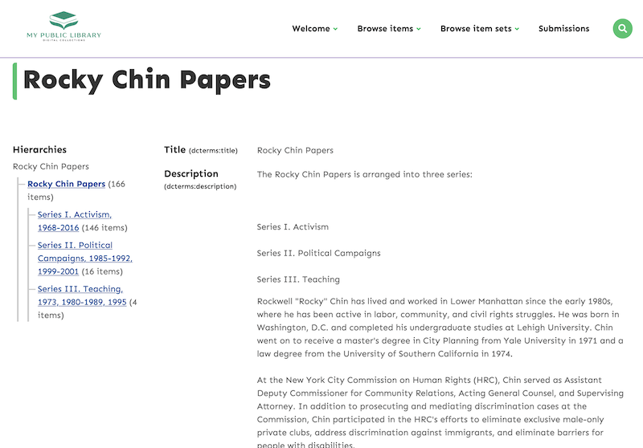
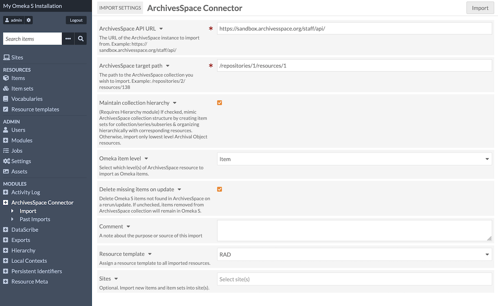
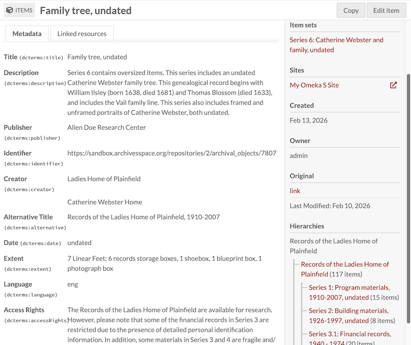
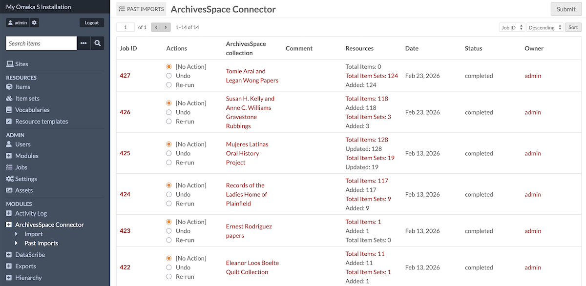

# ArchivesSpace Connector

The [ArchivesSpace Connector module](https://omeka.org/s/modules/ASpaceConnector){target=_blank} allows you to connect an Omeka S instance to a [ArchivesSpace repository](https://archivesspace.org){target=_blank} to import items and item sets from that repository. In addition to importing information, the Omeka S item will include a link back to the original item. This allows you to [refresh the information from the source when desired](#update-imported-resources).

Note that Omeka S cannot import digital files from ArchivesSpace at this time, only metadata. 

This connector relies on the ArchivesSpace API and its configuration. You will need an ArchivesSpace installation with a public API, and a precise set of configurations in your account to import materials correctly.

## Configure your ArchivesSpace installation

First, ensure your ArchivesSpace website has the API enabled. This may not be possible if you are using a hosted instance of ArchivesSpace. Verify that the API works by entering this URL into your browser and seeing what happens. 

Next, we recommend your collections be designed to accommodate Omeka S's data model. 

### ArchivesSpace objects

Generally, all containers (collections, series, sub-series, files, etc.) should be imported as Omeka item sets, with the Hierarchy module installed and active in order to organize those item sets into a hierarchy that matches the ArchivesSpace configuration. 

Your lowest-level ArchivesSpace objects should be either "files" or "items". These two object types can be imported as Omeka items, depending on the collection and your intentions. If the collection is already described down to an item level, using ArchivesSpace's "item" identifier, those can easily be imported as Omeka items. 

If the collection is described to a higher level, you can choose whether "files" in ArchivesSpace become Omeka items or item sets. This can allow you to later process more materials and include them at the item level while matching the first import. If you reconfigure your ArchivesSpace materials (such as changing "file" objects to "item" objects) we recommend undoing the original import and starting fresh. 

Note that Omeka S cannot import digital files from ArchivesSpace at this time, only metadata. 

### Metadata replication

ArchivesSpace has a configuration setting, enabled by default, to allow higher-level metadata to display on lower-level objects: "Inheritance". When this is active, the API output of ArchivesSpace sends information without context: that is, a collection-level extent will be duplicated in the metadata for all its lower-level objects that do not have their own extent - but it is not represented as "From the collection" in the API. 

Thus, we recommend turning this setting off when importing into Omeka, to ensure metadata is not replicated out of context. You can read about how to disable this setting in your installation using the [ArchivesSpace technical documentation](https://archivesspace.github.io/tech-docs/architecture/public/){target=_blank} - look for the "Inheritance" section. The [file to be edited is called `config-defaults.rb`](https://github.com/archivesspace/archivesspace/blob/master/common/config/config-defaults.rb){target=_blank}. 

## Configure your Omeka installation

The ArchivesSpace module has no configuration settings. It does not add any site-specific settings. 

We recommend installing and activating the Hierarchy module to best utilize the functionality of this connector. Hierarchies will automatically be created to represent the ArchivesSpace organizational system and will help you manage the item sets that are created with each import. 

## Import collections

In Omeka S, navigate to the section labelled "ArchivesSpace Connector" under Modules.

On the first form, enter the following information:

* **ArchivesSpace API URL**: the entire URL, including the `https://`. This should end with `/api`.
* **ArchivesSpace target path**: The portion of the URL for a specific collection. This will be in the form of `/repositories/1/resource/a`. 
* **Maintain collection hierarchy**: A checkbox to enable the import's connection with the Omeka S Hierarchy module. If unchecked, item sets will not be created with this import. 
* **Omeka item level**: Choose which of ArchivesSpace's object options will be imported as Omeka S items. You can choose "Items," "Files," or both. If you choose Items, higher-level containers objects (including Files) will be imported as Omeka item sets. 
* **Delete missing items on update**: A checkbox to change how re-runnning an import will behave. If checked, an item created on an earlier import but deleted in ArchivesSpace will be deleted in Omeka. If unchecked, updates will not delete missing objects. 
* **Comment**: A text field to provide a reminder to yourself or others about the detais of this import.
* **Resource template**: You can choose to apply one resource template to all of the items and item sets created by the import process. If you wish to use more than one (for example, one for created items and another for created item sets) you can batch-edit the resources after the import has completed, by using the links in the Past Imports table (see below). 
* **Sites**: Add imported resources to the following sites immediately. This field loads all sites by default. 

Click the "Import" button. If the information above has been correctly entered, you will see a new page with a green banner at the top indicating the Job number of the import. 

You can track the status of imports by navigating to the ArchivesSpace Connector "Past Imports" tab, or on the [Jobs](../admin/jobs.md) page of the admin dashboard.

!!! note
	Are your jobs starting and not completing? You might need to [set the path for PHP](../configuration.md#php-path) so that your system can perform the background process to make the items.

### Confirm the import

To confirm that the import has been successful, you can click on any of the imported resources (items or item sets) to see its view page in the admin side. The items will be automatically sorted into the relevant item sets, and so both resources will show the hierarchy as it stands. 

Once you have confirmed that the hierarchy has been created successfully, check that it has been added to each site you specified in the import settings. 

Then, ensure that the site-specific settigs for hierarchies is how you would wish your ArchivesSpace hierarachies to display. For example, you may not wish to show item counts if your imports have no objects imported as items. You may also wish to ensure that groupings' display pages are disabled and that hierarchies link directly to item sets instead, to show all imported metadata. 

## Past Imports

The "Past Imports" page displays a table of past ArchivesSpace imports, with the **Job ID** for the import, a radial option to **Undo** or **Re-run** the import, the repository’s **ArchivesSpace Collection** with a link to the API output for comparison (displayed as collection name if found), any **Comment** set to import, the number of **Resources** imported with a link to the advanced search results, the **Date** of the import, the import **Status**, and the **Owner** who initiated the import.

You can see the API output directly by clicking on the links under the "ArchivesSpace Collection" column. This can help you triangulate any errors that appear during the process, such as higher-level metadata appearing on lower-level objects.

## Update imported resources

To update resources created using the ArchivesSpace Connector, simply check "Re-run" and then click "Submit" on the "Past Imports" page. The resources will be updated, not re-imported. This allows you to use the Connector to sync data between ArchivesSpace and Omeka S installations. You can re-run more than one import at a time. You cannot change import settings when re-running an import. 

## Undo an import

You can view past imports from the "Past Imports" page. To undo a completed import and remove all associated resources, change the radial button for each import you wish to undo and click the "Submit" button. This will also delete any hierarchy that was created for the import. 