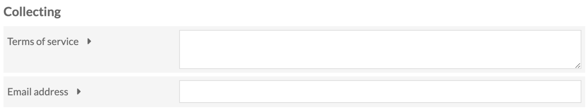
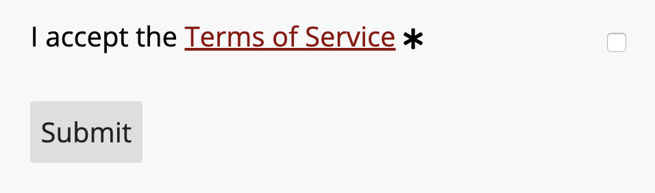
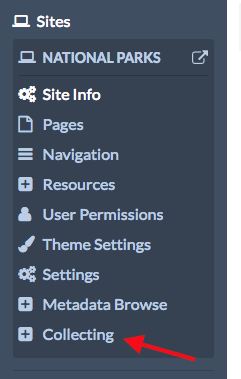
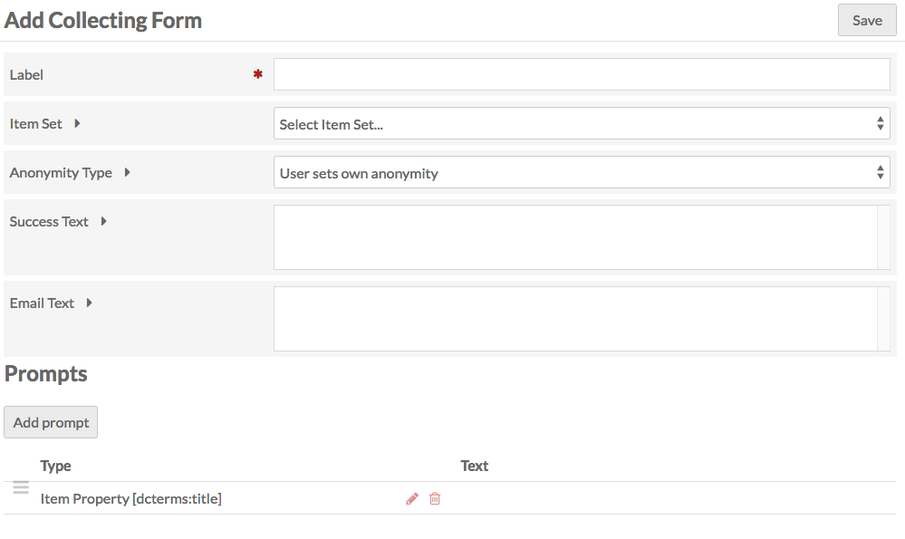
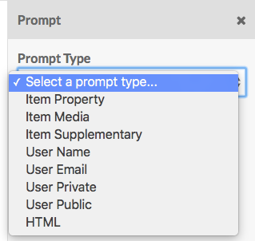
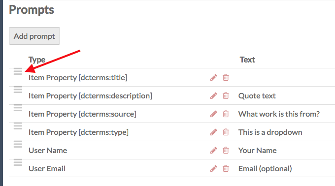
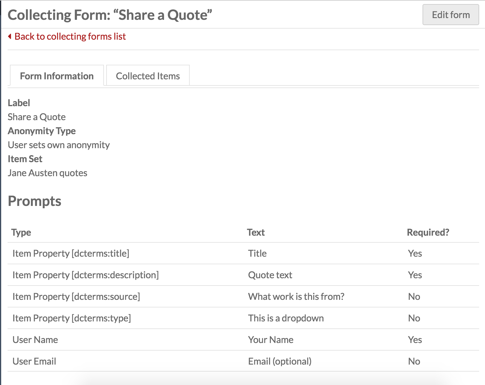
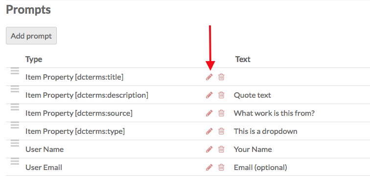
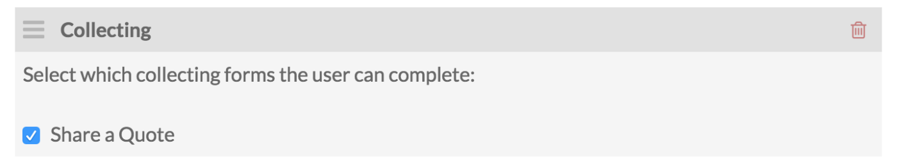
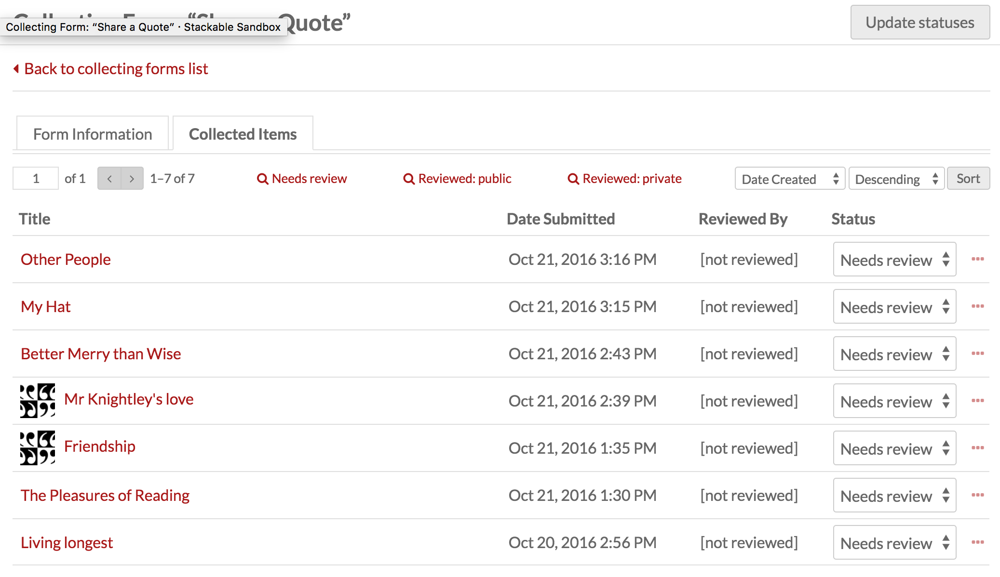

# Collecting

The Collecting module allows you to gather public contributions through your sites. 

Once activated on the [modules](../modules/index) tab of the admin dashboard, Collecting is configured on a site-by-site basis.

## Site settings

Collecting adds a section to your [site settings](../sites/site_settings/) where you can manage terms of service and email for the collecting forms for this site.

In this section are two fields:

**Terms of service** is a multi-line field where you can enter terms of services for material collected through this site. This text is linked from the form just above the submit button:

 
Clicking on the phrase "Terms of Service" will open a new window so that people filling out the form do not lose the information they have entered.

**Email address** allows you to set a custom address from which submission emails will be sent. If left blank, these emails will be sent from the administrator email address in the [Global Settings](../admin/settings) for the Omeka S installation. 

## Managing Collecting Forms

If Collecting is active, then a tab for Collecting will appear in the context menu for every site. 

Clicking on this will take you to a list of your collecting forms for that site. If you have just installed the module, the Collecting Forms page will display the message "This site has no collecting forms." To add a new form, click the *Add new form* in the upper right hand corner of the window.

### Add New Form
The Add Collecting Form page has two sections: the first has a set of fields and options for you to complete; the second is where you add and edit the prompts which will make up the form that site visitors see and fill out.

#### Fields and Settings
- *Label:* name the collecting form. The label will appear as a header above the form on the public side, so the label should be descriptive and helpful to both you and site visitors. 
- *Item Set:* select the item set to which you want to add collected items.
- *Anonymity Type:* a dropdown with three options:
     - "User sets own anonymity": users can decide whether they contribute anonymously and whether their items can be published).
     - "User Public and User Name inputs are publicly visible": both the user's name and their items will be made public
     - "User Public and User Name inputs are private": both inputs remain public. 
- *Success Text*: the message that displays on a new page if the item is successfully collected.
- *Email text*: the message in the email that will be sent to site visitors who submit an item, if you collect an email address from them.

#### Prompts
Prompts are listed in a table which gives their *Type* and the display *Text* on the public form. These prompts make up the form which site visitors will see (in addition to the label, discussed above).

To add a new prompt, click the *Add prompt* button just below the Prompts header. This will open a side drawer with a dropdown to select Prompt type.

On selection, the options for that type will load in the sidebar for you to edit, with a Save Changes button at the bottom of the options. 

The Collecting module has Prompt Types with options as follows:

**Item Property**: select a property from the installation's vocabularies for the visitor to use to describe the item.

- Property: select a property from the vocabularies (example: Description)
- Prompt Text: If you want the prompt to be something other than the property label.
- Input type: length and kind of input box. Choose from:
     - Text box (one line)
     - Text box (multiple line)
     - Select menu (dropdown)
	     - If you choose "Select menu," you will need to enter the options for the menu in the *Select Menu Options* field that will appear, with one option per line.
	 - Item resource (will appear as dropdown)
		 - This will offer the user the choice of existing items to add as a property value. You can paste anything after the `admin/` in the url of an advanced search to load specific items.
	 - [Custom Vocab](../modules/customvocab/) (requires that plugin to be installed). If selected, an additional dropdown will load. Use this to select from your existing Custom Vocabs. This will load as a dropdown for the users on the public side of the form.
	 - If you have [Numeric data types](../modules/numericdatatypes/) installed, you will also have the options:
		 - Numeric timestamp
		 - Numeric interval
		 - Numeric duration
		 - Numeric integer
 - Check the Required? box if the prompt is required.

**Item Media** allows visitors to add media to their item.
Media Type: 

- A dropdown for Media type, with the following options:
	- Upload one, which allows users to upload one file;
	- Upload multiple, which allows users to upload multiple files at once using the browser's native file picker (with shift or control keys); 
	- Map (requires Mapping module); 
	- URL;
	- HTML.
- Prompt Text: If you want the prompt to be something other than the property label.
- Check the Required? box if the prompt is required.

**Item Supplementary** additional information for the item, not linked to any particularly vocabulary or property.

- Prompt Text: If you want the prompt to be something other than the property label.
- Input type: length and kind of input box. Choose from:
     - Text box (one line)
     - Text box (multiple line)
     - Select menu (dropdown)
	     - If you choose "Select menu," you will need to enter the options for the menu in the *Select Menu Options* field that will appear, with one option per line.
 - Check the Required? box if the prompt is required.

**User Name** which will be used to assign the item owner. If the person using the form is a logged-in user of the Omeka S installation, this will autopopulate.

- Prompt Text: If you want the prompt to be something other than the property label.
- Check the Required? box if the prompt is required.

**User Email** where the person adding the item can give their email. If this is left blank, they will not receive an email with the text in the *Email Text* field.

- Prompt Text: If you want the prompt to be something other than the property label.
- Check the Required? box if the prompt is required.

**User Private** collect additional information from the user which will be kept private.

- Prompt Text: If you want the prompt to be something other than the property label.
- Input type: length and kind of input box. Choose from:
     - Text box (one line)
     - Text box (multiple line)
     - Select menu (dropdown)
	     - If you choose "Select menu," you will need to enter the options for the menu in the *Select Menu Options* field that will appear, with one option per line.
 - Check the Required? box if the prompt is required.

**User Public** collect additional information from the user which can be made public

- Prompt Text: If you want the prompt to be something other than the property label.
- Input type: length and kind of input box. Choose from:
     - Text box (one line)
     - Text box (multiple line)
     - Select menu (dropdown)
	     - If you choose "Select menu," you will need to enter the options for the menu in the *Select Menu Options* field that will appear, with one option per line.
 - Check the Required? box if the prompt is required.

**HTML** insert a block of HTML text into the form, for additional guidance, information, etc. The Prompt Text field for this prompt has WYSIWG formatting options.

You can rearrange the order of prompts by dragging and dropping them using the three-line icon on the far left of the Prompt Type label.

### Manage an existing form
Once you have at least one Collecting form, they will appear on the Collecting Forms page. Click the edit button (pencil) to edit the form. Click on the form label to see more information about the form and view collected items.

The form page has two tabs: Form Information and Collected Items

Form tabs show you the existing data for label, anonymity type, and item set, along with a table of all of the prompts, in order, with their type, text, and whether they prompt is required. 

To edit the form, click the *Edit form* button in the upper right hand corner.

The options are in the edit form page are the same as when adding a form. 

To edit a prompt, click the edit button (pencil) for the prompt. This will open the sidebar drawer for that prompt.

Rearrange the order of prompts by dragging and dropping them using the three-line icon on the far left of the Prompt Type label.

## Add a Collecting Form to Site Pages

To add a collecting form to a page:

1. Go to the page on which you want the form to appear (or add a new page for the form)
2. From the *Add New Block* sidebar select the *Collecting* block
3. On the Collecting block, click the box for the form you want to include. You can add more than one form to the page by checking more than one box.

## Managing Collected Items

Items added via a collecting form will appear in the Items section of the Admin Dashboard, but you will likely find it easier to manage them through the Collecting tab of the site to which through which they were collected. 

To see the items collected with a specific form, go to the Collecting tab in the context menu for the site and click on the form label. Then click the *Collected Items* tab.

This tab has a table of collected items with their: Title, the Date Submitted, Reviewed By, Status, and ellipses (three dots).

To see the collected information, including user name, email, etc, for any item, click on the more info ellipses. Clicking on an item title will take you to the item's edit page (under Items  not the site's context menu). 

A collected item can have one of three status messages: Needs Review, Public, and Private. To change the status of an item, select the desired status from the dropdown and then click the *Update statuses* button in the upper right corner.

When you update the status of an item from "Needs Review" to either "Public" or "Private", your name will appear in the row for that item as the user the item has been *Reviewed by*. If you have multiple people working on a site, this can help you keep track of who has approved the collected items. 

