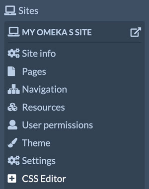
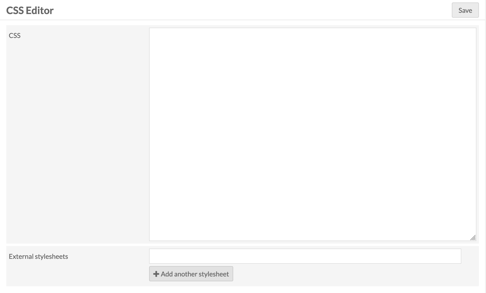
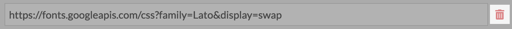
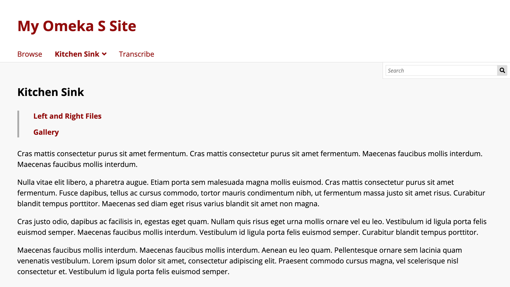
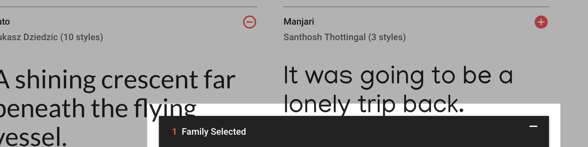
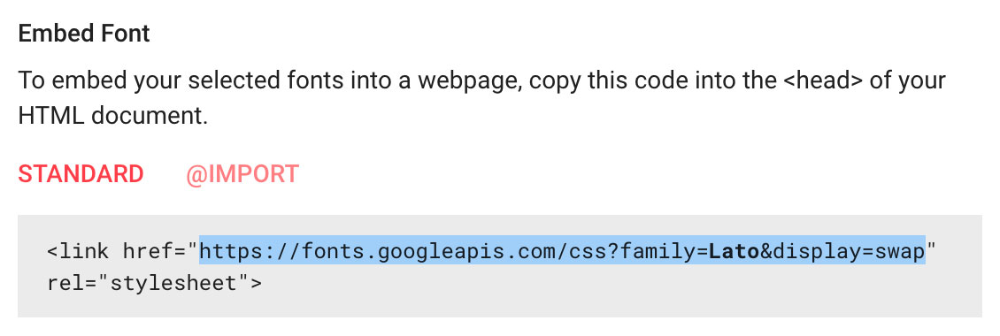
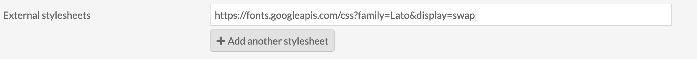
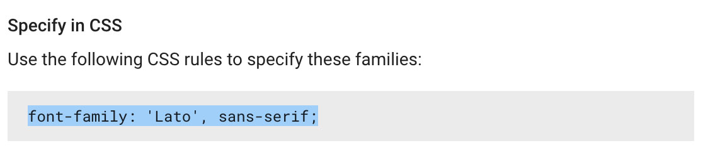
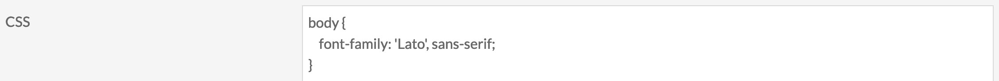
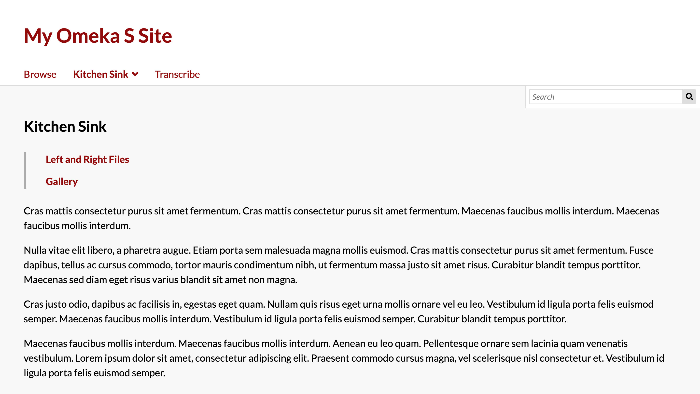

# CSS Editor

The [CSS Editor module](https://omeka.org/s/modules/CSSEditor){target=_blank} allows you to write CSS from the Omeka S admin interface.

Once activated on the [modules](https://omeka.org/s/docs/user-manual/modules/){target=_blank} section of the admin dashboard, CSS Editor is used on a site-by-site basis.

If you are new to working with CSS, we recommend the following free resources for getting started:

* [Mozilla's "Learn CSS"](https://developer.mozilla.org/en-US/docs/Web/CSS){target=_blank}
* [Codecademy's "Learn CSS" course](https://www.codecademy.com/learn/learn-css){target=_blank}
* [Marksheet's "CSS Basics"](https://marksheet.io/css-basics.html){target=_blank}

The easiest way to learn Omeka S page components for the sake of CSS editing is to use your browser's Inspect tool when looking at your chosen theme.

## Apply site-specific CSS

If CSS Editor is active, then a link for CSS Editor will appear in the context menu for every site.

The first large text area is where you write your individual styles. Use that text area as you would a stylesheet file. This will load a line in every public page of your chosen Omeka S site, in the head, that looks like this:

` <link href="/yoursiteslug/css-editor" media="screen" rel="stylesheet" type="text/css"> `

This line will appear after the stylesheets that come from Omeka's defaults and from your chosen theme. So, entries here should override other styles set in those files, unless they have been marked as `!important`. There may be other custom CSS loading in the header below this line, particularly from theme configurations such as the main accent color or banner height, that may override your custom CSS in turn.

CSS Editor also allows you to include external stylesheets by entering their URLs. There is no limit to the number of external stylesheet URLs you can enter. Each text input can take a single URL, and additional inputs can be created by clicking the "Add another stylesheet" button.

To remove external stylesheets, either clear the text inputs, or click on the trash can icon if there are multiple stylesheet fields.

## Tutorial: Using a Google webfont

You can make your Omeka S site more distinct by using a custom font. [Google provides a free library of webfonts](https://fonts.google.com/){target=_blank}, and this tutorial will demonstrate how to apply a webfont to an Omeka S site using the "Default" theme through the CSS Editor interface.

For reference, the "Default" theme begins looking like this, using the "Open Sans" font.

This tutorial will override "Open Sans" with the "Lato" font family.

1. Navigate to [Google Fonts](https://fonts.google.com/){target=_blank}. Find the "Lato" font family and click on the orange "+" button to select it.
   
2. A bar labeled "1 Family Selected" will appear in the lower right corner. Click on this bar.
   
3. The bar will open a panel with the information you'll need to use Lato in your site. The first section, "Embed this font", has the external stylesheet URL you need. Select the URL in the `href` attribute, as pictured.
   
4. Copy this URL into one of the "External stylesheets" inputs in CSS Editor.
   
5. Back in the Google Fonts panel, there is the second section titled "Specify in CSS". Copy the `font-family` rule.
   
6. For this tutorial, you are setting Lato as the site's default font. To do this, in the large "CSS" text area in CSS Editor, set the `body` element's font family using the rule you just copied.
   
7. Click the "Save" button in the top right corner. Now the "Default" theme should look like this.

