# CSV Import

The CSV Import module allows you to import items or users into your Omeka S install from a csv (comma separated values), tsv (tab-separated values) or odf (open document format) file. 

Please note that an import must have a specific import type. 

## Preparing your CSV file

Most spreadsheet editors (including Microsoft Excel, Google Sheets, and Apple Numbers) can export to csv format. 

CSV files for import must be encoded in UTF-8, so when exporting or saving a new document, be sure to check that the encoding is UTF-8.

If the spreadsheet is already created, take a moment to think about which columns you want to match to which vocabulary properties. 

*Note* Your csv file *must have a header row* in order for the module to process it correctly.

If you have multiple inputs for a single property, you can separate them with a secondary *multivalue separator*. For example, a work with multiple authors (E.B. White and William Strunk Jr.) with the column for Creator containing "E.B. White; William Strunk Jr" has a semicolon (;) as the multivalue separator. When imported into Omeka S, each of these would appear as a separate entry in the property (Creator: E.B. White and Creator: William Strunk Jr.)

### Automapping 
The module will automatically automap column headers if they conform to the property terms of your installation's [vocabularies](../content/vocabularies.md). For example, a CSV file with a column header "dcterms:title" would automap to the Dublin Core Title property when the CSV is loaded for mapping.

To find the terms you should use for your column headers, go to the Vocabularies tab from the admin dashboard. Click on the number of properties for the vocabulary you want to use (Dublin Core in the image below)

In the table of vocabulary properties, there is a column for *Term*. Use the Term for the property you want to automap in the CSV Import. For example, "dcterms:abstract" would automap to the Dublin Core property "Absract" and "foaf:firstName" would automap to the Friend of a Friend property "firstName"

In addition, there is a setting in the inital import settings to automap with simple labels - this will work with columns whose names match a vocabulary label, for example "Title" or "date". Note that this option defaults to Dublin Core before proceeding through other installed vocabularies. 

## Initial Import Settings

Start an import by clicking on the CSV Importer tab on the left-hand navigation. This will open the initial Import Settings page. 

- For the Spreadsheet option, use the *Choose File* button to select the file from your computer. 
- From the *CSV Column delimiter* dropdown, choose from the following options (this should match the formatting of your file)
	- comma (default)
	- semi-colon
	- colon
	- tabulation
	- carriage return
	- space
	- pipe

- From the *CSV column enclosure* dropdown, choose the option which encloses long text in your file:
	- double quote (default)
	- quote
	- hash

- From the *Import Type* dropdown, select what you are importing:
	- Item Sets
	- Items
	- Media (must relate to already existing Items)
	- Mixed resources (spreadsheet can inlcude Item Sets, Items, and Media)
	- Users

- Check the box to *Automap with simple labels.* This will automap not only specially formatted column headings but also column headings which match existing vocabulary property labels. Note that this option defaults to Dublin Core before proceeding through other installed vocabularies. 

- Comments are useful as they appear on the "Past Imports" page; make a note about what is being imported and any settings you may have on this page. 

Click the *next* button to continue with the import process. 

## Import Items
To import items, select "Items" under the "Import type" on the first page.

When you click next, the page will load with the following tabs:

### Map to Omeka S data
This tab displays a table with the columns from your spreadsheet as rows. Each row displays:

- a Checkbox
- Column header from the spreadsheet
- A plus symbol button for adding or modifying a mapping
- A wrench symbol button for spreadsheet column options
- A trash can to delete mappings
- A column to show options selected

#### Mapping options

To map a column header to a vocabulary property, click on the plus symbol button to the left of the column header. This will open a drawer on the right-hand side of the screen. 

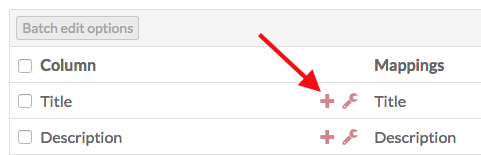

The drawer has multiple options for mapping:

**Properties** select a property to map the column data to, from any of the installed vocabularies. Use the Filter field to search the available properties for a specific property.

**Item-specific data** has a dropdown to set Item Set by selected property. If you have a column with data for an Item Set to which you want to add the item, you can set how it maps using this dropdown. You can either use the Item Set's internal ID, or any one of its properties (title, description).

**Generic data** also has a dropdown where you can set one of four options:

- *Resource template (by label):* set the template for an item by name. The name of the template as entered in the spreadsheet and the name of the template in Omeka S must match exactly.
- *Resource class (by term):* set the resource class for an item. The term for the class in the spreadsheet and in the Omeka S installation must match exactly.
- *Owner (by email address):* set an item's owner by email address. This must be the email address associated with the user's account in the Omeka S installation.
- *Visibility public/private:* set the visibility of the item. Use "private" or "public" in the spreadsheet. 

**Media source** If the column in your spreadsheet is a media source, select which kind from the dropdown: 

- HTML
- IIIF Image (link)
- oEmbed (link)
- URL
- YouTube (link)

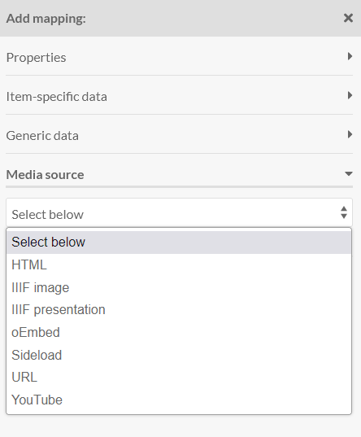

Be sure to click the "Apply Changes" at the bottom of the drawer or nothing you set here will be kept.

To remove a mapping, click the trash can icon in the row for that data mapping. It will remove *only* the mapping, not the column data. 

If you have data in a column in your CSV which you do not want to bring in to your Omeka S installation, simply do not map that column to a property or data type.

#### Column options
To access options for data in a column of your csv (represented by a row in the import table), click the wrench icon for that column heading. 

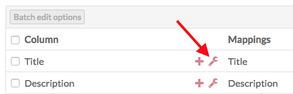

Column options are in addition to mappings. If you add options without also mapping column data to resource, media, or other data, nothing will be imported. 

This will open a drawer on the right side of the browser window with the following options: 

- **Use multivalve separator:** check this box to use the multivalue separator for data in this column. You set the multivalue separator in the initial import page, but you can change it in the Basic Settings tab.  
- **Language:** is a field where you can set the language for this column using the [IETF Language tag](https://en.wikipedia.org/wiki/IETF_language_tag) for the language in which the text is written. This will override what you have entered in basic settings. 
- **Data type:** is a dropdown with at least three options, which correspond to the [values](../content/items/#values) one can use when adding properties to an item:
	- Import as text (default).
	- Import as URL reference. You can set the label for the URI by including the desired text after a space, for example:  `http://example.com This Is The Label`
	- Import as Omeka S resource ID. Note that you must have the correct ID for the resource. A resources' ID is the number sequence at the end of the url when on the view or edit page, so for `/admin/item/11576` the ID is 11576.
	- If you have certain modules installed, such as Numeric Data Types, there may be additional data type options supplied by those modules.
- **Import values as private**: check this box to set all property values *in this column* private.

Be sure to click the Apply Changes button at the bottom of the drawer in order to save your changes. 

To remove a column option setting, click the wrench icon again and undo your changes manually.

#### Batch edit
When you select one or more rows in the table (columns from your csv file), you can use the "Batch edit options" button to apply the column options described above - multivalue separator, language, data type, and property privacy - to multiple csv columns at once. 

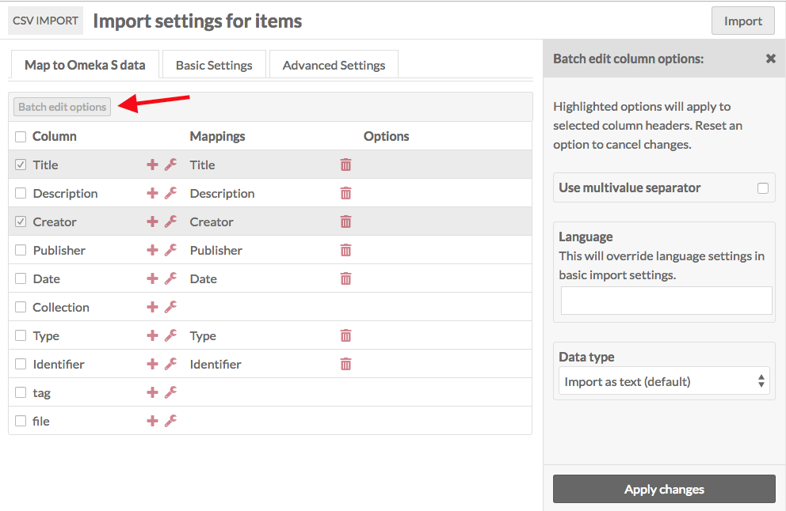

Be sure to click the Apply Changes button at the bottom of the drawer in order to save your changes. 

### Item import Basic Settings
These settings apply to the entire csv which you are importing. Note that some of these settings can be overwritten by column options in the Map to Omeka S data tab. 

- **Resource Template:** select a resource template from the drop-down menu to apply to the imported items. You can use the search field at the top of the dropdown to narrow results or find a particular template.
- **Class:** select a class from the drop-down menu to apply to the imported items. You can use the search field at the top of the dropdown to narrow results or find a particular class.
- **Owner:** set the owner for the Items by selecting a user from the drop-down menu. You can use the search field at the top of the dropdown to narrow results or find a particular user.
- **Visibility:** set the visibility of the imported items as public  or private. 
- **Item Sets:** add the imported items to a specific item set or sets using the dropdown menu.
- **Multivalue Separator:** enter the multivalue separator character here, if you have used one. 
      - The columns of data in your CSV should be separated by commas, however within those columns you can add a special character to create multiple inputs, for example a semicolon.
- **Language:** set the language of the values in the spreadsheet using the appropriate [IETF Language tag](https://en.wikipedia.org/wiki/IETF_language_tag).

### Item import Advanced Settings

There are two options on this tab which are only for advanced use. 

#### Action

This setting allows you to change the action of process from a straight import to one of the following options:

- **Create a new resource:** default option. Each row in the CSV will become a new resource.
- **Append data to the resource:** add new data to the resource.
- **Revise data of the resource:** replace existing data in the resource with data from the csv, except if empty.
- **Update data of the resource:** replace existing data in the resource with data from the csv, even when the cell is empty.
- **Replace all data of the resource:** remove all properties of the resource, and fill with new information from the sheet.
- **Delete the resource:** delete all matching resources

If you select one of these options from the dropdown, three additional settings will appear on the tab. These settings help the process determine which resources to take action on.

- **Resource identifier column:** Select from a dropdown of the columns in your CSV. This is the data from your spreadsheet which maps to existing data in your Omeka S installation. 
- **Resource identifier property:** select from a dropdown of all properties in your Omeka S installation. This should be the property in which you already have data, that you used to create the column data above. 
	- Example: if the data in the Resource identifier column is "Title" with the first row of data having a title "A Study in Scarlet," and you set Resource identifier property to "Dublin Core: Title," then the actions will operate on a resource already in your Omeka S installation whose dc:title property is "A Study in Scarlet".
	- This will only work with exact matches.
	- If you have more than one resource with matching data, it will only take action on the oldest resource. 
- **Action on unidentified resources:** This option determines what to do when no matching resource exists in the Omeka S installation, but the selected action only applies to an existing resource ("Append", "Revise", "Update", or "Replace"). This option is not used when the main action is "Create" or "Delete" Your options are two radio buttons:
	- Skip the row 
	- Create a new resource

#### Other advanced settings

In addition to the above, the Advanced Settings tab has an option to set the number of rows to process by batch. By default this is set to 20. However, if you are running into errors with an import you may want to set it to 5 or even 1 in order to troubleshoot and determine the source of the error. 

### Complete import
Once you have completed mappings, column options, and any settings, click the Import button in the upper right corner of the browser window. This should start the import and redirect you to the Past Imports tab. You should see a confirmation message saying "Importing in Job ID [number]"

## Import Item Sets
To import item sets, select "Item Set" under the "Import type" on the first page.

When you click next, the page will load with the following tabs:

### Map to Omeka S data
This tab displays a table with the columns from your spreadsheet as rows. Each row displays:

- a Checkbox
- Column header from the spreadsheet
- A plus symbol button for adding or modifying a mapping
- A wrench symbol button for spreadsheet column options
- A trash can to delete mappings
- A column to show options selected

#### Mapping options

To map a column header to a vocabulary property, click on the plus symbol button to the left of the column header. This will open a drawer on the right-hand side of the screen. 

The drawer has multiple options for mapping:

**Properties** select a property to map the column data to, from any of the installed vocabularies. Use the Filter field to search the available properties for a specific property.

**Item set-specific data** is a checkbox for "Open to additions." Check to allow other users to edit or add to the item set. Leave unchecked to have the item set be editable only by its creator, site admins, and global admins.

**Generic data** also has a dropdown where you can set one of four options:

- *Resource template (by label):* set the template for an item  set by name. The name of the template as entered in the spreadsheet and the name of the template in Omeka S must match exactly.
- *Resource class (by term):* set the resource class for an item set. The term for the class in the spreadsheet and in the Omeka S installation must match exactly.
- *Owner (by email address):* set an item set's owner by email address. This must be the email address associated with the user's account in the Omeka S installation.
- *Visibility public/private:* set the visibility of the item set. Use "private" or "public" in the spreadsheet. 

Be sure to click the "Apply Changes" at the bottom of the drawer or nothing you set here will be kept.

To remove a mapping, click the trash can icon in the row for that data mapping. It will remove *only* the mapping, not the column data. 

If you have data in a column in your CSV which you do not want to bring in to your Omeka S installation, simply do not map that column to a property or data type.

#### Column options
To access options for data in a column of your csv (represented by a row in the import table), click the wrench icon for that column heading. 

Column options are in addition to mappings. If you add options without also mapping column data to resource, media, or other data, nothing will be imported. 

This will open a drawer on the right side of the browser window with the following options: 

- **Use multivalve separator:** check this box to use the multivalue separator for data in this column. You set the multivalue separator in the initial import page, but you can change it in the Basic Settings tab.  
- **Language:** is a field where you can set the language for this column using the [IETF Language tag](https://en.wikipedia.org/wiki/IETF_language_tag) for the language in which the text is written. This will override what you have entered in basic settings. 
- **Data type:** is a dropdown with at least three options, which correspond to the [values](../content/items/#values) one can use when adding properties to an item:
	- Import as text (default).
	- Import as URL reference. You can set the label for the URI by including the desired text after a space, for example:  `http://example.com This Is The Label`
	- Import as Omeka S resource ID. Note that you must have the correct ID for the resource. A resources' ID is the number sequence at the end of the url when on the view or edit page, so for `/admin/item/11576` the ID is 11576.
	- If you have certain modules installed, such as Numeric Data Types, there may be additional data type options supplied by those modules.
- **Import values as private**: check this box to set all property values *in this column* private.

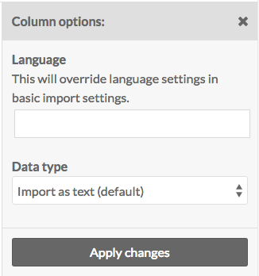

To remove a column option setting, click the wrench icon again and undo your changes manually.

#### Batch edit
When you select one or more rows in the table (columns from your csv file), you can use the "Batch edit options" button to apply the column options described above to multiple csv columns at once. 

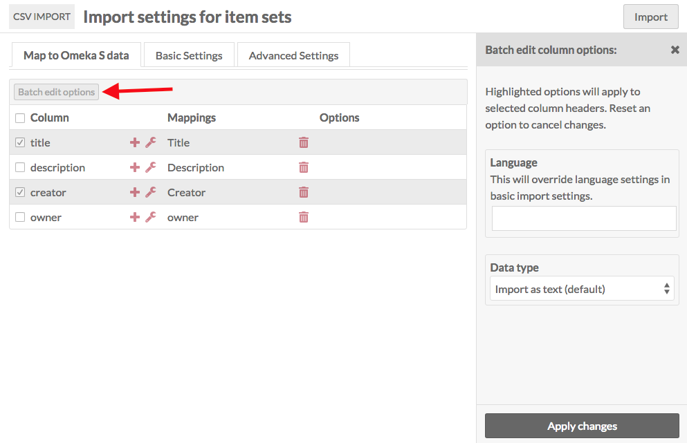

Be sure to click the Apply Changes button at the bottom of the drawer in order to save your changes. 

### Item Set import Basic Settings
These settings apply to the entire csv which you are importing. Note that some of these settings can be overwritten by column options in the Map to Omeka S data tab. 

- **Resource Template:** select a resource template from the drop-down menu to apply to the imported item sets. You can use the search field at the top of the dropdown to narrow results or find a particular template.
- **Class:** select a class from the drop-down menu to apply to the imported item sets. You can use the search field at the top of the dropdown to narrow results or find a particular class.
- **Owner:** set the owner for the item sets by selecting a user from the drop-down menu. You can use the search field at the top of the dropdown to narrow results or find a particular user.
- **Visibility:** set the visibility of the imported item sets as public  or private. 
- **Open/Closed to additions:** set whether users other than the owner (and site & global admins) will be able to add or edit the item sets.
- **Multivalue Separator:** enter the multivalue separator character here, if you have used one. 
      - The columns of data in your CSV should be separated by commas, however within those columns you can add a special character to create multiple inputs, for example a semicolon.
- **Language:** set the language of the values in the spreadsheet using the appropriate [IETF Language tag](https://en.wikipedia.org/wiki/IETF_language_tag).

### Item Set import Advanced Settings

There are two options on this tab which are only for advanced use. 

#### Action

This setting allows you to change the action of process from a straight import to one of the following options:

- **Create a new resource:** default option. Each row in the CSV will become a new resource.
- **Append data to the resource:** add new data to the resource.
- **Revise data of the resource:** replace existing data in the resource with data from the csv, except if empty.
- **Update data of the resource:** replace existing data in the resource with data from the csv, even when the cell is empty.
- **Replace all data of the resource:** remove all properties of the resource, and fill with new information from the sheet.
- **Delete the resource:** delete all matching resources

If you select one of these options from the dropdown, three additional settings will appear on the tab. These settings help the process determine which resources to take action on.

- **Resource identifier column:** Select from a dropdown of the columns in your CSV. This is the data from your spreadsheet which maps to existing data in your Omeka S installation. 
- **Resource identifier property:** select from a dropdown of all properties in your Omeka S installation. This should be the property in which you already have data, that you used to create the column data above. 
	- Example: if the data in the Resource identifier column is "Title" with the first row of data having a title "A Study in Scarlet," and you set Resource identifier property to "Dublin Core: Title," then the actions will operate on a resource already in your Omeka S installation whose dc:title property is "A Study in Scarlet".
	- This will only work with exact matches.
	- If you have more than one resource with matching data, it will only take action on the oldest resource.
- **Action on unidentified resources:** This option determines what to do when no matching resource exists in the Omeka S installation, but the selected action only applies to an existing resource ("Append", "Revise", "Update", or "Replace"). This option is not used when the main action is "Create" or "Delete" Your options are two radio buttons:
	- Skip the row 
	- Create a new resource

#### Other advanced settings
In addition to the above, the Advanced Settings tab has an option to set the number of rows to process by batch. By default this is set to 20. However, if you are running into errors with an import you may want to set it to 5 or even 1 in order to troubleshoot and determine the source of the error. 

### Complete import
Once you have completed mappings, column options, and any settings, click the Import button in the upper right corner of the browser window. This should start the import and redirect you to the Past Imports tab. You should see a confirmation message saying "Importing in Job ID [number]"

## Import Media
To import media, select "media" under the "Import type" on the first page.

In order to import media, you must have a column in the csv which will map to item data. Media cannot exist unless associated with an item. Note that if you are running an advanced job, such as an update or replace, then you do not have to have a column with associated item data. 

When you click next, the page will load with the following tabs:

### Map to Omeka S data
This tab displays a table with the columns from your spreadsheet as rows. Each row displays:

- a Checkbox
- Column header from the spreadsheet
- A plus symbol button for adding or modifying a mapping
- A wrench symbol button for spreadsheet column options
- A trash can to delete mappings
- A column to show options selected

#### Mapping options

To map a column header to a vocabulary property, click on the plus symbol button to the left of the column header. This will open a drawer on the right-hand side of the screen. 

The drawer has multiple options for mapping:

**Properties** select a property to map the column data to, from any of the installed vocabularies. Use the Filter field to search the available properties for a specific property.

**Media-specific data** has a dropdown to set the item to which the media should be added. You can either use the item's internal ID, or any one of its properties (title, description). A resources' interal ID is the number sequence at the end of the url when on the view or edit page, so for `/admin/item/11576` the ID is 11576

**Generic data** also has a dropdown where you can set one of four options:

- *Resource template (by label):* set the template for the media by name. The name of the template as entered in the spreadsheet and the name of the template in Omeka S must match exactly.
- *Resource class (by term):* set the resource class for the media. The term for the class in the spreadsheet and in the Omeka S installation must match exactly.
- *Owner (by email address):* set the media's owner by email address. This must be the email address associated with the user's account in the Omeka S installation.
- *Visibility public/private:* set the visibility of the media. Use "private" or "public" in the spreadsheet. 

**Media source** For the column in your spreadsheet which points to the media you are creating, select which kind of media it is from the dropdown: 

- HTML
- IIIF Image (link)
- oEmbed (link)
- URL
- YouTube (link)

Be sure to click the "Apply Changes" at the bottom of the drawer or nothing you set here will be kept.

To remove a mapping, click the trash can icon in the row for that data mapping. It will remove *only* the mapping, not the column data. 

If you have data in a column in your CSV which you do not want to bring in to your Omeka S installation, simply do not map that column to a property or data type.

#### Column options
To access options for data in a column of your csv (represented by a row in the import table), click the wrench icon for that column heading. 

Column options are in addition to mappings. If you add options without also mapping column data to resource, media, or other data, nothing will be imported. 

This will open a drawer on the right side of the browser window with the following options: 

- **Use multivalve separator:** check this box to use the multivalue separator for data in this column. You set the multivalue separator in the initial import page, but you can change it in the Basic Settings tab.  
- **Language:** is a field where you can set the language for this column using the [IETF Language tag](https://en.wikipedia.org/wiki/IETF_language_tag) for the language in which the text is written. This will override what you have entered in basic settings. 
- **Data type:** is a dropdown with at least three options, which correspond to the [values](../content/items/#values) one can use when adding properties to an item:
	- Import as text (default).
	- Import as URL reference. You can set the label for the URI by including the desired text after a space, for example:  `http://example.com This Is The Label`
	- Import as Omeka S resource ID. Note that you must have the correct ID for the resource. A resources' ID is the number sequence at the end of the url when on the view or edit page, so for `/admin/item/11576` the ID is 11576.
	- If you have certain modules installed, such as Numeric Data Types, there may be additional data type options supplied by those modules.
- **Import values as private**: check this box to set all property values *in this column* private.

To remove a column option setting, click the wrench icon again and undo your changes manually.

#### Batch edit
When you select one or more rows in the table (columns from your csv file), you can use the "Batch edit options" button to apply the column options described above to multiple csv columns at once. 

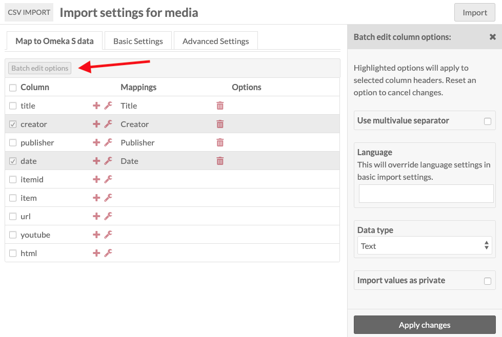

Be sure to click the Apply Changes button at the bottom of the drawer in order to save your changes. 

### Media import Basic Settings
These settings apply to the entire csv which you are importing. Note that some of these settings can be overwritten by column options in the Map to Omeka S data tab. 

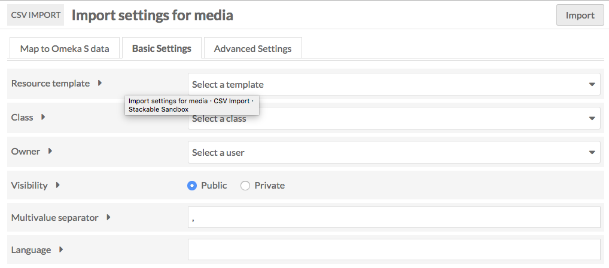

- **Resource Template:** select a resource template from the drop-down menu to apply to the imported media. You can use the search field at the top of the dropdown to narrow results or find a particular template.
- **Class:** select a class from the drop-down menu to apply to the imported media. You can use the search field at the top of the dropdown to narrow results or find a particular class.
- **Owner:** set the owner for the media by selecting a user from the drop-down menu. You can use the search field at the top of the dropdown to narrow results or find a particular user.
- **Visibility:** set the visibility of the imported media as public or private. 
- **Item Sets:** add the imported items to a specific item set or sets using the dropdown menu.
- **Multivalue Separator:** enter the multivalue separator character here, if you have used one. 
      - The columns of data in your CSV should be separated by commas, however within those columns you can add a special character to create multiple inputs, for example a semicolon.
- **Language:** set the language of the values in the spreadsheet using the appropriate [IETF Language tag](https://en.wikipedia.org/wiki/IETF_language_tag).

### Media import Advanced Settings
There are two options on this tab which are only for advanced use. 

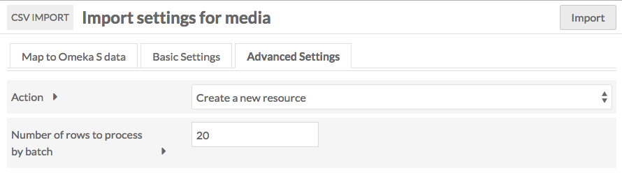

#### Action

This setting allows you to change the action of process from a straight import to one of the following options:

- **Create a new resource:** default option. Each row in the CSV will become a new resource.
- **Append data to the resource:** add new data to the resource.
- **Revise data of the resource:** replace existing data in the resource with data from the csv, except if empty.
- **Update data of the resource:** replace existing data in the resource with data from the csv, even when the cell is empty.
- **Replace all data of the resource:** remove all properties of the resource, and fill with new information from the sheet.
- **Delete the resource:** delete all matching resources

If you select one of these options from the dropdown, three additional settings will appear on the tab. These settings help the process determine which resources to take action on.

- **Resource identifier column:** Select from a dropdown of the columns in your CSV. This is the data from your spreadsheet which maps to existing data in your Omeka S installation. 
- **Resource identifier property:** select from a dropdown of all properties in your Omeka S installation. This should be the property in which you already have data, that you used to create the column data above. 
	- Example: if the data in the Resource identifier column is "Title" with the first row of data having a title "A Study in Scarlet," and you set Resource identifier property to "Dublin Core: Title," then the actions will operate on a resource already in your Omeka S installation whose dc:title property is "A Study in Scarlet".
	- This will only work with exact matches.
	- If you have more than one resource with matching data, it will only take action on the oldest resource. 
- **Action on unidentified resources:** This option determines what to do when no matching resource exists in the Omeka S installation, but the selected action only applies to an existing resource ("Append", "Revise", "Update", or "Replace"). This option is not used when the main action is "Create" or "Delete" Your options are two radio buttons:
	- Skip the row 
	- Create a new resource

#### Other advanced settings

In addition to the above, the Advanced Settings tab has an option to set the number of rows to process by batch. By default this is set to 20. However, if you are running into errors with an import you may want to set it to 5 or even 1 in order to troubleshoot and determine the source of the error. 

### Complete import
Once you have completed mappings, column options, and any settings, click the Import button in the upper right corner of the browser window. This should start the import and redirect you to the Past Imports tab. You should see a confirmation message saying "Importing in Job ID [number]"

## Mixed Resource Import
This resource option allows you to import a sheet with a mix of resource types: items, item sets, and media. 

### Map to Omeka S data
This tab displays an initial dropdown above a table with the columns from your spreadsheet as rows. Each row displays:

- a Checkbox
- Column header from the spreadsheet
- A plus symbol button for adding or modifying a mapping
- A wrench symbol button for spreadsheet column options
- A trash can to delete mappings
- A column to show options selected

The dropdown above the table is where you set which column in the csv file indicates whether the data in that row is an item, item set, or media. *You do not need to map this data in the table on this tab*

#### Mapping options TK

To map a column header to a vocabulary property, click on the plus symbol button to the left of the column header. This will open a drawer on the right-hand side of the screen. 

The drawer has multiple options for mapping:

**Properties** select a property to map the column data to, from any of the installed vocabularies. Use the Filter field to search the available properties for a specific property.

**Item-specific data** has a dropdown to set Item Set by selected property. If you have a column with data for an Item Set to which you want to add the item, you can set how it maps using this dropdown. You can either use the Item Set's internal ID, or any one of its properties (title, description).

**Item set-specific data** is a checkbox for "Open to additions." Check to allow other users to edit or add to the item set. Leave unchecked to have the item set be editable only by its creator, site admins, and global admins.

**Media-specific data** has a dropdown to set the item to which the media should be added. You can either use the item's internal ID, or any one of its properties (title, description). A resources' interal ID is the number sequence at the end of the url when on the view or edit page, so for `/admin/item/11576` the ID is 11576

**Generic data** has a dropdown where you can set one of four options:

- *Resource template (by label):* set the template for the media by name. The name of the template as entered in the spreadsheet and the name of the template in Omeka S must match exactly.
- *Resource class (by term):* set the resource class for the media. The term for the class in the spreadsheet and in the Omeka S installation must match exactly.
- *Owner (by email address):* set the media's owner by email address. This must be the email address associated with the user's account in the Omeka S installation.
- *Visibility public/private:* set the visibility of the media. Use "private" or "public" in the spreadsheet. 

**Media source** For the column in your spreadsheet which points to the media, select which kind of media it is from the dropdown: 

- HTML
- IIIF Image (link)
- oEmbed (link)
- URL
- YouTube (link)

Be sure to click the "Apply Changes" at the bottom of the drawer or nothing you set here will be kept.

To remove a mapping, click the trash can icon in the row for that data mapping. It will remove *only* the mapping, not the column data. 

If you have data in a column in your CSV which you do not want to bring in to your Omeka S installation, simply do not map that column to a property or data type.

#### Column options
To access options for data in a column of your csv (represented by a row in the import table), click the wrench icon for that column heading. 

Column options are in addition to mappings. If you add options without also mapping column data to resource, media, or other data, nothing will be imported. 

This will open a drawer on the right side of the browser window with the following options: 

- **Use multivalue separator:** check this box to use the multivalue separator for data in this column. You set the multivalue separator character in the initial import page, but you can change it in the Basic Settings tab. 
- **Language:** is a field where you can set the language for this column using the [IETF Language tag](https://en.wikipedia.org/wiki/IETF_language_tag) for the language in which the text is written. This will override what you have entered in basic settings. 
- **Data type:** is a dropdown with at least three options, which correspond to the [values](../content/items/#values) one can use when adding properties to an item:
	- Import as text (default);
	- Import as URL reference. You can set the label for the URI by including the desired text after a space, for example:  `http://example.com This Is The Label`
	- Import as Omeka S resource ID. Note that you must have the correct ID for the resource. A resources' ID is the number sequence at the end of the url when on the view or edit page, so for `/admin/item/11576` the ID is 11576.
	- If you have certain modules installed, such as Numeric Data Types, there may be additional data type options supplied by those modules.
- **Import values as private**: check this box to set all property values *in this column* private.

To remove a column option setting, click the wrench icon again and undo your changes manually.

#### Batch edit
When you select one or more rows in the table (columns from your csv file), you can use the "Batch edit options" button to apply the column options described above to multiple csv columns at once. 

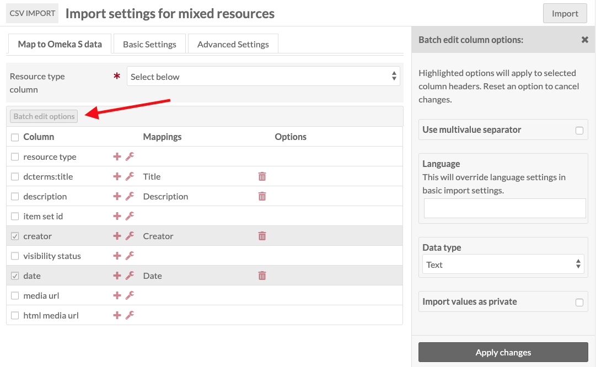

Be sure to click the Apply Changes button at the bottom of the drawer in order to save your changes. 

### Mixed resources import Basic Settings
These settings apply to the entire csv which you are importing. Note that some of these settings can be overwritten by column options in the Map to Omeka S data tab. 

- **Resource Template:** select a resource template from the drop-down menu to apply to the imported item sets. You can use the search field at the top of the dropdown to narrow results or find a particular template.
- **Class:** select a class from the drop-down menu to apply to the imported item sets. You can use the search field at the top of the dropdown to narrow results or find a particular class.
- **Owner:** set the owner for the item sets by selecting a user from the drop-down menu. You can use the search field at the top of the dropdown to narrow results or find a particular user.
- **Visibility:** set the visibility of the imported item sets as public  or private. 
- **Item Set open/Closed to additions:** set whether users other than the owner (and site & global admins) will be able to add or edit the item sets.
- **Item set for items:** select from a dropdown of existing item sets. 
- **Multivalue Separator:** enter the multivalue separator character here, if you have used one. 
      - The columns of data in your CSV should be separated by commas, however within those columns you can add a special character to create multiple inputs, for example a semicolon.
- **Language:** set the language of the values in the spreadsheet using the appropriate [IETF Language tag](https://en.wikipedia.org/wiki/IETF_language_tag).

### Mixed resources import Advanced Settings
There are two options on this tab which are only for advanced use. 

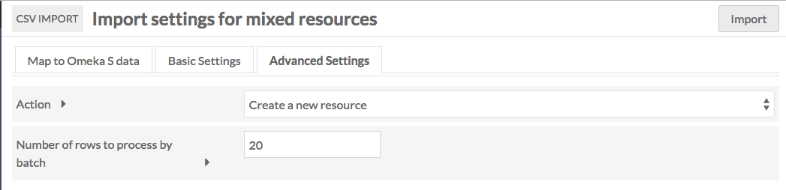

#### Action

This setting allows you to change the action of process from a straight import to one of the following options:

- **Create a new resource:** default option. Each row in the CSV will become a new resource.
- **Append data to the resource:** add new data to the resource.
- **Revise data of the resource:** replace existing data in the resource with data from the csv, except if empty.
- **Update data of the resource:** replace existing data in the resource with data from the csv, even when the cell is empty.
- **Replace all data of the resource:** remove all properties of the resource, and fill with new information from the sheet.
- **Delete the resource:** delete all matching resources

If you select one of these options from the dropdown, three additional settings will appear on the tab. These settings help the process determine which resources to take action on.

- **Resource identifier column:** Select from a dropdown of the columns in your CSV. This is the data from your spreadsheet which maps to existing data in your Omeka S installation. 
- **Resource identifier property:** select from a dropdown of all properties in your Omeka S installation. This should be the property in which you already have data, that you used to create the column data above. 
	- Example: if the data in the Resource identifier column is "Title" with the first row of data having a title "A Study in Scarlet," and you set Resource identifier property to "Dublin Core: Title," then the actions will operate on a resource already in your Omeka S installation whose dc:title property is "A Study in Scarlet".
	- This will only work with exact matches.
	- If you have more than one resource with matching data, it will only take action on the oldest resource. 
- **Action on unidentified resources:** This option determines what to do when no matching resource exists in the Omeka S installation, but the selected action only applies to an existing resource ("Append", "Revise", "Update", or "Replace"). This option is not used when the main action is "Create" or "Delete" Your options are two radio buttons:
	- Skip the row 
	- Create a new resource

#### Other advanced settings

In addition to the above, the Advanced Settings tab has an option to set the number of rows to process by batch. By default this is set to 20. However, if you are running into errors with an import you may want to set it to 5 or even 1 in order to troubleshoot and determine the source of the error. 

### Complete import
Once you have completed mappings, column options, and any settings, click the Import button in the upper right corner of the browser window. This should start the import and redirect you to the Past Imports tab. You should see a confirmation message saying "Importing in Job ID [number]"

## Import Users
When importing users, you can only bring in data related to the user table in Omeka S: the user's email, display name, and role. Any additional data in your CSV will not be imported.

### Map user import to Omeka S data
This is the only active tab for User import. The Basic and Advanced settings tabs are present but empty.

This tab displays an initial dropdown above a table with the columns from your spreadsheet as rows. Each row displays:

- a Checkbox
- Column header from the spreadsheet
- A plus symbol button for adding or modifying a mapping
- A trash can to delete mappings
- A column to show options selected

To map a column header to user information, click on the plus symbol button to the left of the column header. This will open a drawer on the right-hand side of the screen. 

The drawer has a dropdown for Users info, with three options:

- *Email:* the email address for the user;
- *Display name:* the user's display name
- *Role:* the user's [role](../admin/users/#roles-and-permissions) - for this column, use the role labels exactly as they appear in Omeka S. 

Once you have completed the mappings, click the Import button.

The CSV Import for Users does not have tabs for Basic or Advanced Settings. 

## Manage Past Imports

To review past imports, click on the CSV Importer module tab and select the Past Imports subtab. 

This will display a table with the following columns:

- An *Undo* Checkbox
- *Date* of import
- *Action* of the import (create, append, revise, update, replace, or delete).
	- Beneath the action description there are links to the job details and job log. 
- *Comment* entered on import or indicating an error
- *Result* the items updated, added, or deleted
- *Status* of import
- Import *Owner*

To see the details of an import, click the "Job details" link below the action description. To review logs, particularly in cases where an error occurred, click the "Log" link below the action description. 

## Undo an Import

To undo an import, click on the CSV Importer module tab and select the Past Imports subtab. 

Check the *Undo* box in the row of the import which you want to undo, and click Submit.

Depending on the size of the import, it may take some time to undo. On complete, the status of the import on the CSV Importer Past Imports table will say "Undone" followed by the date the import was reversed. 

## Troubleshooting
The following are known errors that can occur during an import:  

- **Encoding**: CSVs for import must be UTF-8 encoded. 
- Are your jobs starting and not completing? You might need to [set the path for PHP](../configuration/) so that your system can perform the background process to make the items.

## CSV Import with other modules
Some other modules add functionality to CSV import. If you have these modules installed and active, you will have access to the following options when using CSV import.

### Mapping
If you have [Mapping](../modules/mapping/) (minimum version 1.1.0) installed and active, you will have two additional options in the "Map to Omeka S data" tab when importing Items. Note that these options do not appear for any other import, including Mixed Resources. 

**Resource location:** set the location for the resource. Your column for this option can include one of the following forms of data:

- *Latitude* must be written as a single number (23.43 not 23° 26′).
- *Longitude* must be written as a decimal fraction using negative and positive to indicate west or east. (−91 rather than 91°W) 
- *Latitude/longitude* must be inputted as numbers separated by a slash, ex `52.19/ -1.71`

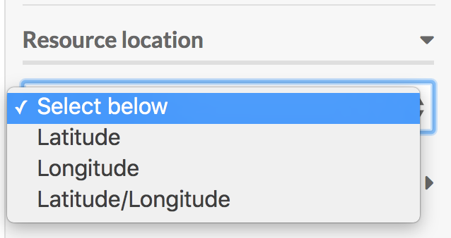

**Default map view:** sets the default map view for the item to which you are adding Mapping information. 

- *Map center latitude* must be written as a single number (23.43 not 23° 26′).
- *Map center longitude* must be written as a decimal fraction using negative and positive to indicate west or east. (−91 rather than 91°W) 
- *Default zoom* should be a number between 1 (most zoomed out) and 18 (most zoomed in)

### File Sideload
If you have [File Sideload](../filesideload) (minimum version 1.2.0) installed and active, you can use it as a source for media when running a csv import.

Everything on the *Map to Omeka S data* tab will be the same. When you add a mapping and choose the "Media source" option, you will see that there is now an option for "Sideload"

. 

For the data in this column, you need to include the full file name, including extension. So, for example, if you want to import a jpg file which is named "Jekyll_and_Hyde_Title" then the data in the media column of the csv you are importing should be `Jekyll_and_Hyde_Title.jpg`.

### Numeric Data Types
If you have [Numeric Data Types](modules/numericdatatypes/) installed and active, it will add the option to set a column data type as numeric data.

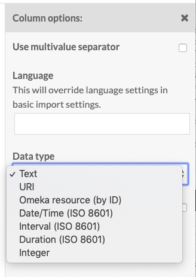
