# CSV Import

The [CSV Import module](https://omeka.org/s/modules/CSVImport){target=_blank} allows you to import items, item sets, media, and users into your Omeka S install from a CSV (comma-separated values), TSV (tab-separated values), or ODS (OpenDocument Spreadsheet) file. This module is only available to [Global Administrator and Supervisor users](../admin/users.md).

CSV Import requires your Omeka S installation to [have PHP working in order to run background import jobs](../install.md#test-and-set-the-php-path). Before using CSV Import, you should confirm that PHP is being recognized from the [System Information page](../admin-dashboard.md#system-information). 

## Prepare your CSV file

Most spreadsheet editors (including Microsoft Excel, Google Sheets, and Apple Numbers) can export to CSV, TSV, or ODS format. 

!!! note
	CSV files for import **must be encoded in UTF-8**, so when exporting or saving a new document, be sure to check that the encoding is UTF-8.

Most CSV Import options rely on you only importing one type of data: a list of items, a list of item sets, a list of media, etc. There is the option for a [mixed-resource import](#mixed-resource-import), requiring one column that identifies the type of each row.

If the spreadsheet is already created, consider which columns you want to match to which [vocabulary properties](../content/vocabularies.md). Your CSV file **must have a header row** in order for the module to process it correctly, so you may need to add a row at the top with column names.

If you have multiple inputs for a single property, you can separate them with a secondary **multivalue separator**. For example, a work with multiple authors (E.B. White and William Strunk Jr.) with the column for Creator containing "E.B. White;William Strunk Jr" has a semicolon (;) as the multivalue separator. When imported into Omeka S, each of these would appear as a separate entry in the property (Creator: "E.B. White" and Creator: "William Strunk Jr."). Note that the import will be the same whether you leave a space after your separator (as in "E.B. White; William Strunk Jr") or not. 

### Column names

You can manually map each column to its corresponding property, and you are required to manually map non-metadata columns, such as the file URL for upload. The module will automatically map metadata columns by the names provided in the header row, if they conform to the property terms of your installation's [vocabularies](../content/vocabularies.md) in the format `prefix:property`. For example, a CSV file with a column header "dcterms:title" would automap to the Dublin Core Title property when the CSV is loaded for mapping. You can modify these automapped columns before import.

To find the terms you should use for your column headers, go to the Vocabularies tab from the admin dashboard. Click on the number of properties for the vocabulary you want to use (for example, Dublin Core in the image below).

In the table of vocabulary properties, there is a column for **Term**. Use the Term as the column heading for the property you want to automap in CSV Import. For example, "dcterms:abstract" would automap to the Dublin Core property "Abstract" and "foaf:firstName" would automap to the Friend of a Friend property "firstName".

There is a setting in the inital import settings to automap with simple labels - this will work with columns whose names match a vocabulary label, for example "title" or "abstract", without supplying the term. Note that this option defaults to Dublin Core (`dcterms:title` and `dcterms:abstract`) before proceeding through other installed vocabularies.

If your column names are not exact and the automapping feature does not recognize them, you should still label them something helpful so that you can manually map them while importing.

If you have plans to batch-import metadata or properties that come with a module (such as latitude and longitude from the Mapping module) or using structured vocabularies that come from modules (such as the data types from the Value Suggest module), install and configure those modules first to ensure that the fields exist in your site's data model, before trying to enter information into those fields. Data may be lost if you uninstall those modules later.

## Initial import settings

Start an import by clicking on the CSV Import tab on the left-hand navigation. This will open the initial "Import Settings" page. For most spreadsheets directly exported from a software program into the correct format, these settings can be left on their defaults.

- Use the "Choose File" button to select a spreadsheet from your computer.
- From the **CSV column delimiter** dropdown, choose from the following options (this should match the formatting of your file) the character that separates different values in a row:
	- comma (default)
	- semi-colon
	- colon
	- tabulation
	- carriage return
	- space
	- pipe (`|`).

- From the **CSV column enclosure** dropdown, choose the option that encloses long text in your file, if applicable:
	- double quote (default)
	- quote
	- hash (`#`).

- From the **Import type** dropdown, select what you are importing:
	- Items
	- Item sets
	- Media (a column matching Media to already existing Items is required)
	- Mixed resources (spreadsheet can include Item sets, Items, and Media; a column identifying the type of each row is required)
	- Users.

- Check the box to **Automap with simple labels**. CSV Import will automatically map specially formatted column headings (in `prefix:property`); if you check this box, it will also automatically map any column headings that match existing vocabulary property labels (such as "Title"). 

- **Comments** will appear on the "Past Imports" page; you may find this useful to make a note about what is being imported and any settings you have chosen on this page, for example if you are working in batches or may wish to undo an import later.

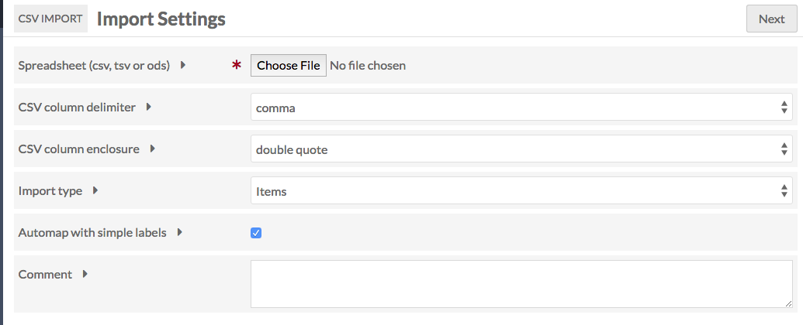

Click the "Next" button to continue with the import process.

## Import items
To import items, select "Items" under the "Import type" on the first page.

When you click "Next", the page will load with the following tabs:

### Map to Omeka S data 

This tab displays a table with the columns from your spreadsheet as rows. Each row displays:

- A checkbox
- The column header from the spreadsheet
- A plus symbol button for adding or modifying a mapping
- A wrench symbol button for spreadsheet column options
- A column displaying properties mapped, either automatically or manually
- A trash can to delete existing mappings
- A column to show the particular options selected (such as whether to look for multivalue separators, or visibility for that column).

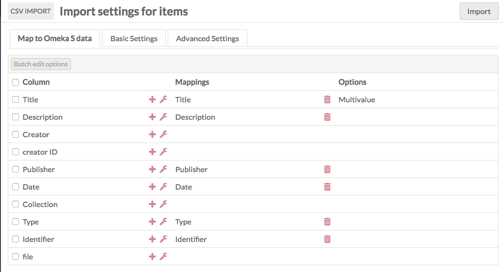

#### Mapping options

To map a column header to a vocabulary property, click on the plus symbol button. This will open a drawer on the right-hand side of the screen.

The drawer has multiple options for mapping:

**Properties** allows you to select a property to map the column data to, from any of the installed vocabularies. Use the "Filter" field to search for a specific property.

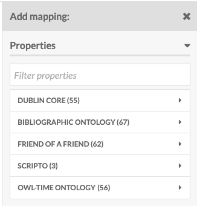

**Item-specific data** has a dropdown to set an Item set by selected property. If you have a column identifying an Item set to which you want to add each item (rather than putting all of the imported items into the same Item sets on the "Basic Settings" tab), you can set how it maps using this dropdown. You can either use the Item set's internal ID, or any one of its properties (such as title).

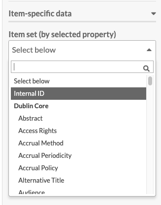

**Generic data** also has a dropdown where you can set one of four options:

- **Resource template (by label)**: Set the template for an item by name. The name of the template as entered in the spreadsheet and the name of the template in Omeka S must match exactly.
- **Resource class (by term)**: Set the resource class for an item. The term for the class in the spreadsheet and in the Omeka S installation must match exactly; reference the Vocabularies tab of your installation. For example, enter "dctype:Dataset", "dcterms:Location", "bibo:Interview", or "foaf:Person" with a colon separating the vocabulary prefix and the term, without spaces.
- **Owner (by email address)**: Set an item's owner by email address. This must be the email address associated with the user's account in the Omeka S installation.
- **Visibility public/private**: Set the visibility of the item. Use "private" or "public" in the spreadsheet.

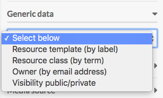

**Media source** allows you to import [media](../content/media.md#add-media-to-an-item) along with your items, by selecting the sourcing method from the dropdown:

- HTML
- IIIF image (link)
- IIIF presentation (link)
- oEmbed (link)
- URL
- YouTube (link).

Other options may appear here based on your active modules, such as File Sideload. 

Be sure to click the "Apply Changes" at the bottom of the drawer or nothing you set here will be kept.

To remove a mapping, click the trash can icon in the row for that data mapping. It will remove *only* the mapping, not the column data. 

If you have data in a column in your CSV that you do not want to bring in to your Omeka S installation, simply do not map that column to a property or data type.

#### Column options

Column options are in addition to mappings. If you add options without also mapping column data to resource, media, or other data, nothing will be imported. If you have multiple mappings set up on a single column in your data, these options will apply to all of them.

To access options for a column of your CSV (represented by a row in the import table), click the wrench icon for that column heading.

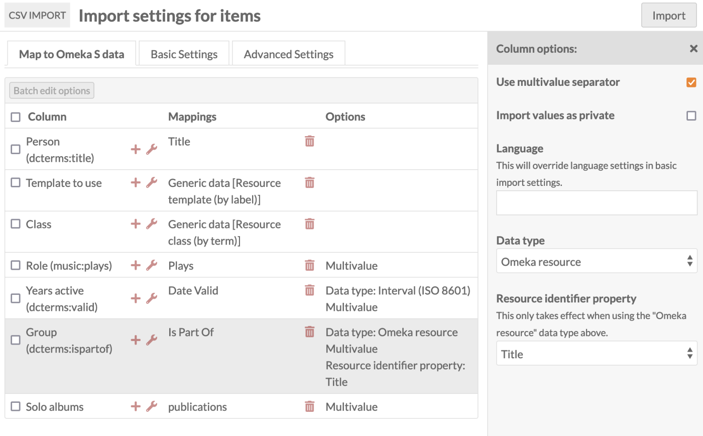

This will open a drawer on the right side of the browser window with the following options:

- **Use multivalve separator**: Check this box to use the multivalue separator for data in this column. You set the multivalue separator in the initial import page, but you can change it in the Basic Settings tab.  
- **Language**: Set the language for this column using the [IETF Language tag](https://en.wikipedia.org/wiki/IETF_language_tag){target=_blank} for the language in which the text is written. This will override what you have entered in basic settings.
- **Import values as private**: Check this box to set all property values *in this column* private.
- **Data type**: A dropdown with at least three options, which correspond to the [values](../content/items.md#values) one can use when adding properties to an item:
	- Import as text (default).
	- Import as URI reference. You can set the label for a URI by including the desired text after a space, for example: `http://example.com Label Text Goes Here`.
	- Import as Omeka S resource. This will create [linked resources](../content/items.md#linked-resources). If you select this option, you must choose which property values to match to find the intended Omeka resource in your installation, in the next **Resource identifier property** dropdown. This must be a unique property, so "Title" may not be a good choice. 
		- You can use the internal Omeka ID. A resource's ID is the number sequence at the end of the URL when on the view or edit page, so for `/admin/item/11576` the ID is 11576. You can also see the resource's ID in the right-hand drawer on the resource's view page. Items, item sets, and media all have IDs.
		- You can include resources that are being made in the same CSV, as long as the resources being linked to have already been created in earlier rows and can be found with the unique property value indicated here. If you wish to do this, we recommend setting the batch number low (even to 1) on the Advanced Settings tab, to ensure resources are being fully created before another new resource tries to link to them. 
	- If you have certain modules installed, such as [Numeric Data Types](../modules/numericdatatypes.md), there may be additional data type options supplied by those modules.

Be sure to click the "Apply changes" button at the bottom of the drawer in order to save your changes. To remove a column option setting, click the wrench icon again and undo your changes manually.

#### Batch edit
When you select one or more rows in the table (columns from your CSV file), you can use the "Batch edit options" button to apply the column options described above — multivalue separator, language, data type, and property privacy — to multiple CSV columns at once.

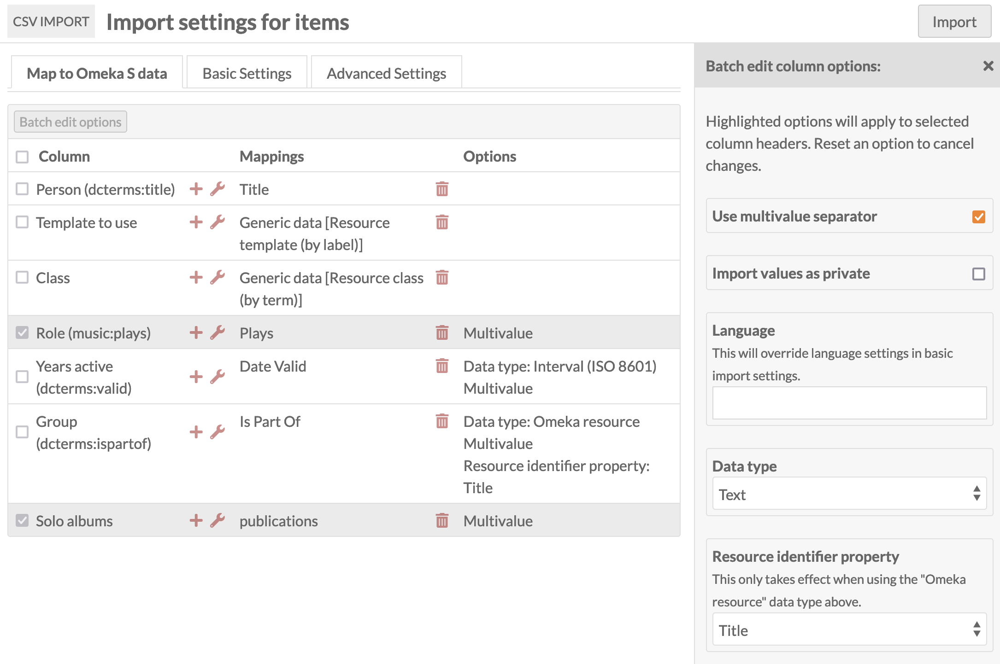

Be sure to click the "Apply Changes" button at the bottom of the drawer in order to save your changes.

### Basic Settings tab

These settings apply to the entire CSV you are importing. Note these settings can be overwritten by column options in the Map to Omeka S data tab. If a column is mapped for template, class, or owner, those values will override these settings; so will column settings for language and privacy.

- **Resource template**: Select a [resource template](../content/resource-template.md) from the drop-down menu to apply to the imported items. You can use the search field at the top of the dropdown to narrow results or find a particular template. Note that resource templates may have required fields, and items will not import without all the required fields of the selected template. For example, if your spreadsheet has entries without a `dcterms:title` value, and the resource template requires titles, those rows will not import and errors will appear in the log.
- **Class**: Select a class from the drop-down menu to apply to the imported items. You can use the search field at the top of the dropdown to narrow results or find a particular class.
- **Owner**: Set the owner for the Items by selecting a user from the drop-down menu. You can use the search field at the top of the dropdown to narrow results or find a particular user.
- **Visibility**: Set the visibility of the imported items as public  or private.
- **Item sets**: Add the imported items to a specific item set or sets using the dropdown menu.
- **Sites**: Add the imported items to the specified site or sites. Global and user-specific default sites will be preselected here.
- **Multivalue separator**: Enter the multivalue separator character here, if you have used one.
      - The columns of data in your CSV should be separated by commas, however within those columns you can add a special character to create multiple inputs, for example a semicolon. This is where you can specify multiple creators, multiple subjects, or other common uses.
- **Language**: Set the language of the values in the spreadsheet using the appropriate [IETF Language tag](https://en.wikipedia.org/wiki/IETF_language_tag){target=_blank}.

!!! note
	If you are uploading different formats of data (for example, some text-based creator names and some URI-based creator links) into the same field (`dcterms:creator`, in this case), use two columns (named something helpful like "dcterms:creator-text" and "dcterms:creator-uri") and, upon import, map those two columns to different data types. Use the wrench icon to open up column mappings and select the correct data type for each column.

### Advanced Settings tab

There are two options on the "Advanced Settings" tab.

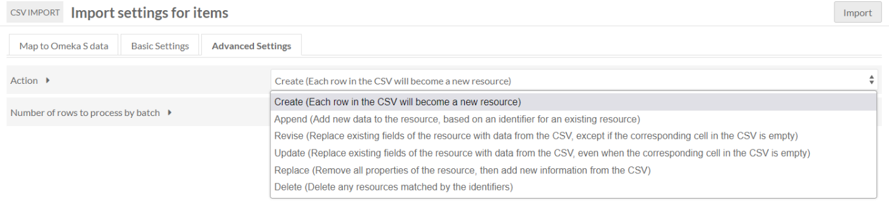

The "Action" setting allows you to change the action of process from a straight import to one of the following options:

- **Create a new resource**: Default option. Each row in the CSV will become a new resource.
- **Append data to the resource**: Add new data to the resource, based on an identifier for an existing resource. (Cannot be undone.) This option allows you to supply multiple values for the same item; each row will be appended (that is, you can append one title to an item in one row, and append another title to the same item in another row). Note that you cannot supply resource template or class assignations in the rows of your CSV with an Append process; you will get an error. 
- **Revise data of the resource**: Replace existing data of the resource with data from the CSV, *except if* the corresponding cell in the CSV is empty. (Cannot be undone.)
- **Update data of the resource**: Replace existing data of the resource with data from the CSV, *even when* the corresponding cell in the CSV is empty. (Cannot be undone.)
- **Replace all data of the resource**: Remove all properties of the resource, and fill with new information from the sheet. (Cannot be undone.)
- **Delete the resource**: Delete all matching resources. (Cannot be undone.)

If you select one of these options from the dropdown, three additional settings will appear on the tab. These settings help the process determine which resources to take action on.

- **Resource identifier column**: Select from a dropdown of the columns in your CSV. This is the data from your spreadsheet that identifies existing items in your Omeka S installation. Choose a unique identifier (for example, you might use the "Title" column from your CSV).  This column does not need to be mapped in the other tab.
- **Resource identifier property**: Select from a dropdown of all properties in your Omeka S installation. This should be the equivalent property in your Omeka S install to the column you selected above (for example, `dcterms:title`). This will only work with exact matches. If you have more than one resource with matching data, it will only take action on the oldest resource.
- **Action on unidentified resources**: This option determines what to do when no matching resource exists in the Omeka S installation, when your selected action applies to an existing resource ("Append", "Revise", "Update", or "Replace"). This option is not used when the main action is "Create" or "Delete". Your options are:
	- Skip the row and ignore its contents
	- Create a new resource with the information supplied.

In addition to the above, the Advanced Settings tab has an option to set the number of rows to process by batch. By default this is set to 20. However, if you are running into errors with an import you may want to set it to 5 or even 1 in order to troubleshoot and determine the source of the error.

!!! note
	Note that Appending data will allow you to supply multiple rows with the same identifier; each row's values will be appended alongside the ones before.

	Revising, Updating, and Replacing data will **erase** data that was supplied in earlier rows of your CSV, if later rows use the same identifier. If you wish to import multiple values (for example, two Creator values) in these processes, you can either: put them in two columns in the same row, mapped to the same property; or, put them in a single cell and use multivalue separators. Do not forget to specify your multivalue separator in the "Basic Settings" tab and check the "Use multivalue separator" box in the options (wrench icon) for each column.

### Complete import
Once you have completed mappings, column options, and settings, click the "Import" button in the upper right corner of the browser window. This should start the import and redirect you to the "Past Imports" tab. You should see a confirmation message in green at the top of the screen saying "Importing in Job ID [number]".

## Import item sets
To import item sets, select "Item Set" under the "Import type" on the first page.

When you click "Next", the page will load with the following tabs:

### Map to Omeka S data
This tab displays a table with the columns from your spreadsheet as rows. Each row displays:

- a checkbox
- The column header from the spreadsheet
- A plus symbol button for adding or modifying a mapping
- A wrench symbol button for spreadsheet column options
- A column displaying properties mapped, either automatically or manually
- A trash can to delete existing mappings
- A column to show the particular options selected.

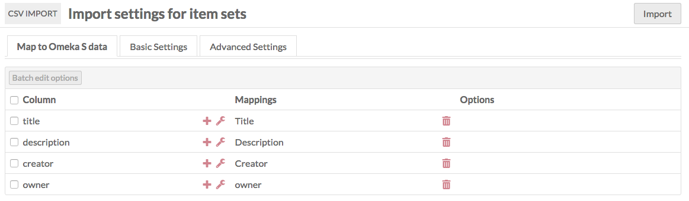

#### Mapping options

To map a column header to a vocabulary property, click on the plus symbol button to the left of the column header. This will open a drawer on the right-hand side of the screen.

The drawer has multiple options for mapping:

**Properties**: Select a property to map the column data to, from any of the installed vocabularies. Use the Filter field to search the available properties for a specific property.

**Item set-specific data** is a checkbox for "Open to additions". Check to allow other users to edit or add to the item set. Leave unchecked to have the item set be editable only by its creator, site admins, and global admins.

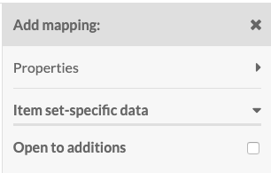

**Generic data** also has a dropdown where you can set one of four options:

- **Resource template (by label)**: Set the template for an item  set by name. The name of the template as entered in the spreadsheet and the name of the template in Omeka S must match exactly.
- **Resource class (by term)**: Set the resource class for an item set. The term for the class in the spreadsheet and in the Omeka S installation must match exactly; reference the Vocabularies tab of your installation. For example, enter "dctype:Dataset", "dcterms:Location", "bibo:Interview", or "foaf:Person" with a colon separating the vocabulary prefix and the term, without spaces.
- **Owner (by email address)**: Set an item set's owner by email address. This must be the email address associated with the user's account in the Omeka S installation.
- **Visibility public/private**: Set the visibility of the item set. Use "private" or "public" in the spreadsheet.

Be sure to click the "Apply Changes" at the bottom of the drawer or nothing you set here will be kept.

To remove a mapping, click the trash can icon in the row for that data mapping. It will remove *only* the mapping, not the column data.

If you have data in a column in your CSV which you do not want to bring in to your Omeka S installation, simply do not map that column to a property or data type.

#### Column options

Column options are in addition to mappings. If you add options without also mapping column data to resource, media, or other data, nothing will be imported.

To access options for data in a column of your CSV (represented by a row in the import table), click the wrench icon for that column heading.

This will open a drawer on the right side of the browser window with the following options:

- **Use multivalve separator**: Check this box to use the multivalue separator for data in this column. You set the multivalue separator in the initial import page, but you can change it in the Basic Settings tab.  
- **Language**: Set the language for this column using the [IETF Language tag](https://en.wikipedia.org/wiki/IETF_language_tag){target=_blank} for the language in which the text is written. This will override what you have entered in basic settings.
- **Import values as private**: Check this box to set all property values *in this column* private.
- **Data type**: A dropdown with at least three options, which correspond to the [values](../content/items.md#values) one can use when adding properties to an item:
	- Import as text (default).
	- Import as URL reference. You can set the label for the URI by including the desired text after a space, for example:  `http://example.com This Is The Label`
	- Import as Omeka S resource. This will create [linked resources](../content/item-sets.md#linked-resources). If you select this option, you must choose which property values to match to find the intended Omeka resource in your installation, in the next **Resource identifier property** dropdown. This must be a unique property, so "Title" may not be a good choice. 
		- You can use the internal Omeka ID. A resource's ID is the number sequence at the end of the URL when on the view or edit page, so for `/admin/item/11576` the ID is 11576. You can also see the resource's ID in the right-hand drawer on the resource's view page. Items, item sets, and media all have IDs.
		- You can include resources that are being made in the same CSV, as long as the resources being linked to have already been created in earlier rows and can be found with the unique property value indicated here. If you wish to do this, we recommend setting the batch number low (even to 1) on the Advanced Settings tab, to ensure resources are being fully created before another new resource tries to link to them. 
	- If you have certain modules installed, such as Numeric Data Types, there may be additional data type options supplied by those modules.

Be sure to click the "Apply changes" button at the bottom of the drawer in order to save your changes. To remove a column option setting, click the wrench icon again and undo your changes manually.

#### Batch edit
When you select one or more rows in the table (columns from your CSV file), you can use the "Batch edit options" button to apply the column options described above to multiple CSV columns at once.

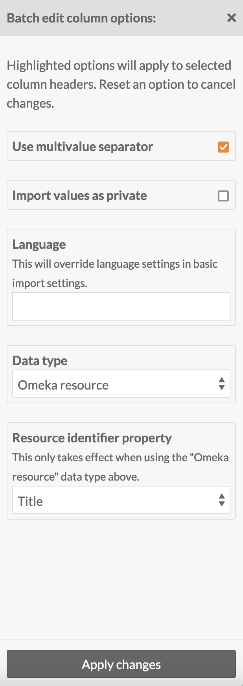

Be sure to click the "Apply changes" button at the bottom of the drawer in order to save your changes.

### Item set import Basic Settings tab

These settings apply to the entire CSV you are importing. Note these settings can be overwritten by column options in the Map to Omeka S data tab. If a column is mapped for template, class, or owner, those values will override these settings; so will column settings for language and privacy.

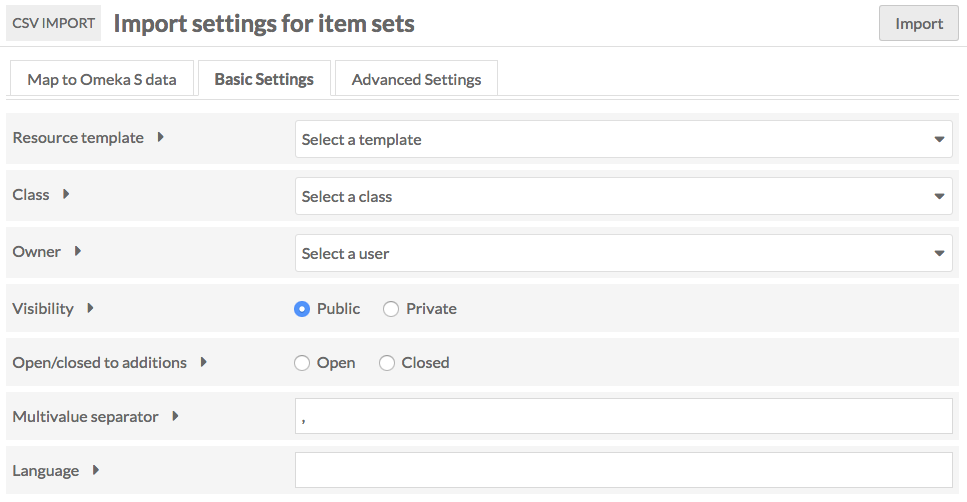

- **Resource template**: Select a resource template from the drop-down menu to apply to the imported item sets. You can use the search field at the top of the dropdown to narrow results or find a particular template.
- **Class**: Select a class from the drop-down menu to apply to the imported item sets. You can use the search field at the top of the dropdown to narrow results or find a particular class.
- **Owner**: Set the owner for the item sets by selecting a user from the drop-down menu. You can use the search field at the top of the dropdown to narrow results or find a particular user.
- **Visibility**: Set the visibility of the imported item sets as public or private.
- **Open/closed to additions**: Set whether users other than the owner (and site & global admins) will be able to add or edit the item sets.
- **Multivalue separator**: Enter the multivalue separator character here, if you have used one.
      - The columns of data in your CSV should be separated by commas, however within those columns you can add a special character to create multiple inputs, for example a semicolon.
- **Language**: Set the language of the values in the spreadsheet using the appropriate [IETF Language tag](https://en.wikipedia.org/wiki/IETF_language_tag){target=_blank}.

### Item set import Advanced Settings tab

The Advanced Settings tab has an option to set the number of rows to process by batch. By default this is set to 20. However, if you are running into errors with an import you may want to set it to 5 or even 1 in order to troubleshoot and determine the source of the error.

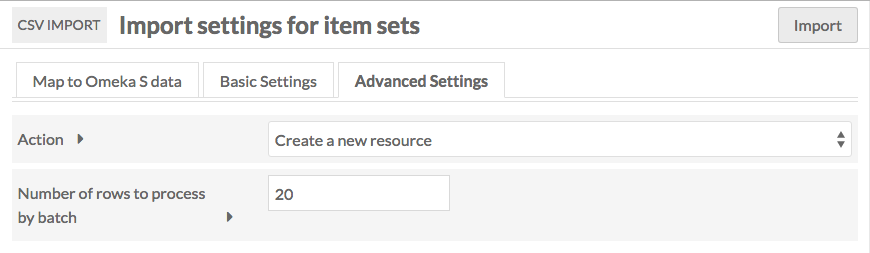

#### Action

This setting allows you to change the action of process from a straight import to one of the following options:

- **Create a new resource**: Default option. Each row in the CSV will become a new resource.
- **Append data to the resource**: Add new data to the resource, based on an identifier for an existing resource. (Cannot be undone.) This option allows you to supply multiple values for the same item set; each row will be appended (that is, you can append one title to an item set in one row, and append another title to the same item set in another row).
- **Revise data of the resource**: Replace existing data of the resource with data from the CSV, *except if* the corresponding cell in the CSV is empty. (Cannot be undone.)
- **Update data of the resource**: Replace existing data of the resource with data from the CSV, *even when* the corresponding cell in the CSV is empty. (Cannot be undone.)
- **Replace all data of the resource**: Remove all properties of the resource, and fill with new information from the sheet. (Cannot be undone.)
- **Delete the resource**: Delete all matching resources. (Cannot be undone.)

If you select one of these options from the dropdown, three additional settings will appear on the tab. These settings help the process determine which resources to take action on.

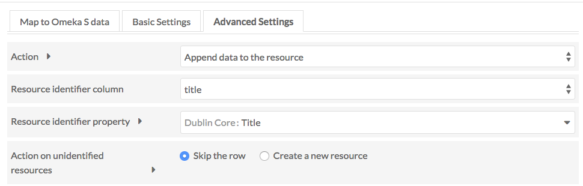

- **Resource identifier column**: Select from a dropdown of the columns in your CSV. This is the data from your spreadsheet which maps to existing data in your Omeka S installation. This column does not need to be mapped in the other tab.
- **Resource identifier property**: Select from a dropdown of all properties in your Omeka S installation. This should be the property in which you already have data, that you used to create the column data above.
	- Example: if the data in the Resource identifier column is "Title" with the first row of data having a title "A Study in Scarlet," and you set Resource identifier property to "Dublin Core: Title," then the actions will operate on a resource already in your Omeka S installation whose dc:title property is "A Study in Scarlet".
	- This will only work with exact matches.
	- If you have more than one resource with matching data, it will only take action on the oldest resource.
- **Action on unidentified resources**: This option determines what to do when no matching resource exists in the Omeka S installation, but the selected action only applies to an existing resource ("Append", "Revise", "Update", or "Replace"). This option is not used when the main action is "Create" or "Delete" Your options are two radio buttons:
	- Skip the row
	- Create a new resource.

!!! note
	Note that Appending data will allow you to supply multiple rows with the same identifier; each row's values will be appended alongside the ones before.

	Revising, Updating, and Replacing data will **erase** data that was supplied in earlier rows of your CSV, if later rows use the same identifier. If you wish to import multiple values (for example, two Creator values) in these processes, you can either: put them in two columns in the same row, mapped to the same property; or, put them in a single cell and use multivalue separators. Do not forget to specify your multivalue separator in the "Basic Settings" tab and check the "Use multivalue separator" box in the options (wrench icon) for each column.

### Complete import
Once you have completed mappings, column options, and any settings, click the "Import" button in the upper right corner of the browser window. This should start the import and redirect you to the Past Imports tab. You should see a confirmation message saying "Importing in Job ID [number]".

## Import media
To import media, select "Media" under the "Import type" on the first page.

In order to import media, you must have a column in the CSV that maps to item data. Media cannot exist unless associated with an item by a unique identifier (Omeka item ID, title, etc.). Note that if you are running an advanced job, such as an update or replace, then you do not have to have a column with associated item data, only a way to match the rows to media that already exist.

When you click "Next", the page will load with the following tabs:

### Map to Omeka S data
This tab displays a table with the columns from your spreadsheet as rows. Each row displays:

- a checkbox
- The column header from the spreadsheet
- A plus symbol button for adding or modifying a mapping
- A wrench symbol button for spreadsheet column options
- A column displaying properties mapped, either automatically or manually
- A trash can to delete existing mappings
- A column to show the particular options selected.

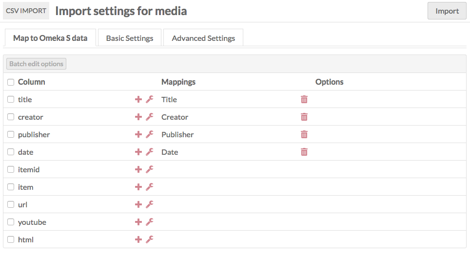

#### Mapping options

To map a column header to a vocabulary property, click on the plus symbol button to the left of the column header. This will open a drawer on the right-hand side of the screen.

The drawer has multiple options for mapping:

**Properties**: Select a property to map the column data to, from any of the installed vocabularies. Use the Filter field to search the available properties for a specific property.

**Media-specific data** has a dropdown to set the item to which the media should be added. You can either use the item's internal ID, or match with any one of its unique properties (title, description). An item's ID is the number sequence at the end of the URL when on the view or edit page, so for `/admin/item/11576` the ID is 11576. You can also see the item's ID in the right-hand drawer on the item's view page.

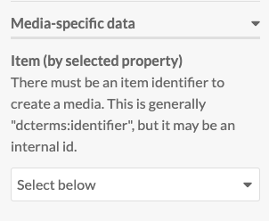

**Generic data** also has a dropdown where you can set one of four options:

- **Resource template (by label)**: Set the template for the media by name. The name of the template as entered in the spreadsheet and the name of the template in Omeka S must match exactly.
- **Resource class (by term)**: Set the resource class for the media. The term for the class in the spreadsheet and in the Omeka S installation must match exactly; reference the Vocabularies tab of your installation. For example, enter "dctype:Dataset", "dcterms:Location", "bibo:Interview", or "foaf:Person" with a colon separating the vocabulary prefix and the term, without spaces.
- **Owner (by email address)**: Set the media's owner by email address. This must be the email address associated with the user's account in the Omeka S installation.
- **Visibility public/private**: Set the visibility of the media. Use "private" or "public" in the spreadsheet.

**Media source**: For the column in your spreadsheet which points to the media you are creating, select which kind of media it is from the dropdown:

- HTML
- IIIF image (link)
- IIIF presentation (link)
- oEmbed (link)
- URL
- YouTube (link).

Other options may appear here based on your active modules, such as File Sideload. 

Be sure to click the "Apply Changes" at the bottom of the drawer or nothing you set here will be kept.

To remove a mapping, click the trash can icon in the row for that data mapping. It will remove *only* the mapping, not the column data.

If you have data in a column in your CSV which you do not want to bring in to your Omeka S installation, simply do not map that column to a property or data type.

#### Column options

Column options are in addition to mappings. If you add options without also mapping column data to resource, media, or other data, nothing will be imported.

To access options for data in a column of your CSV (represented by a row in the import table), click the wrench icon for that column heading.

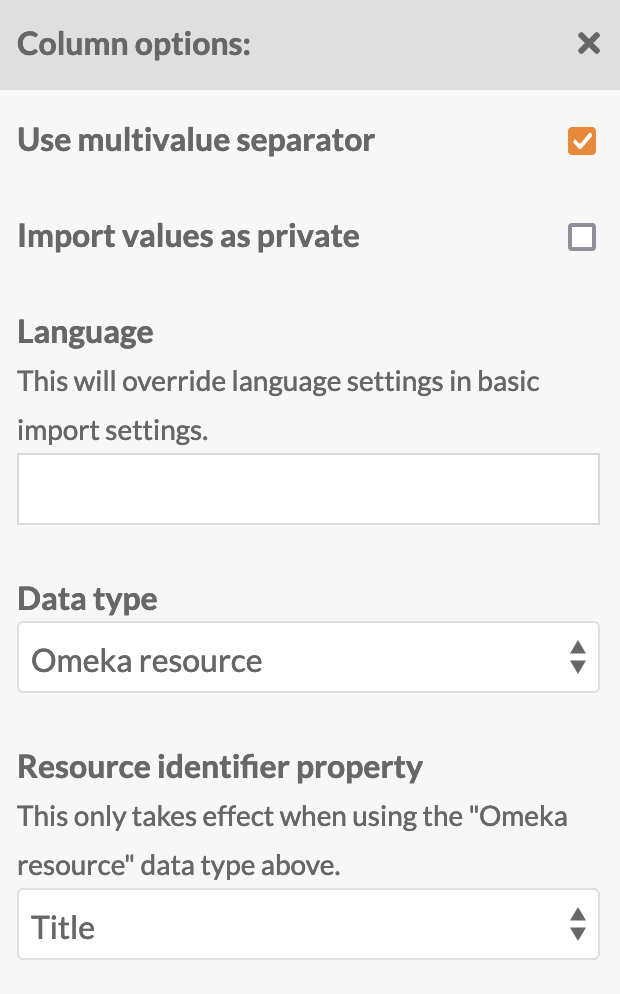

This will open a drawer on the right side of the browser window with the following options:

- **Use multivalve separator**: Check this box to use the multivalue separator for data in this column. You set the multivalue separator in the initial import page, but you can change it in the Basic Settings tab.  
- **Language**: Set the language for this column using the [IETF Language tag](https://en.wikipedia.org/wiki/IETF_language_tag){target=_blank} for the language in which the text is written. This will override what you have entered in basic settings.
- **Import values as private**: Check this box to set all property values *in this column* private.
- **Data type**: A dropdown with at least three options, which correspond to the [values](../content/items.md#values) one can use when adding properties to an item:
	- Import as text (default).
	- Import as URL reference. You can set the label for the URI by including the desired text after a space, for example:  `http://example.com This Is The Label`.
	- Import as Omeka S resource. This will create [linked resources](../content/media.md#omeka-resource). If you select this option, you must choose which property values to match to find the intended Omeka resource in your installation, in the next **Resource identifier property** dropdown. This must be a unique property, so "Title" may not be a good choice. 
		- You can use the internal Omeka ID. A resource's ID is the number sequence at the end of the URL when on the view or edit page, so for `/admin/item/11576` the ID is 11576. You can also see the resource's ID in the right-hand drawer on the resource's view page. Items, item sets, and media all have IDs.
		- You can include resources (items or item sets) that are being made in the same CSV, as long as the resources being linked to have already been created in earlier rows and can be found with the unique property value indicated here. If you wish to do this, we recommend setting the batch number low (even to 1) on the Advanced Settings tab, to ensure resources are being fully created before another new resource tries to link to them. 
	- If you have certain modules installed, such as Numeric Data Types, there may be additional data type options supplied by those modules.

Remember to click the "Apply changes" button. To remove a column option setting, click the wrench icon again and undo your changes manually.

#### Batch edit
When you select one or more rows in the table (columns from your CSV file), you can use the "Batch edit options" button to apply the column options described above to multiple CSV columns at once.

Be sure to click the "Apply changes" button at the bottom of the drawer in order to save your changes.

### Media import basic settings
These settings apply to the entire CSV you are importing. Note these settings can be overwritten by column options in the Map to Omeka S data tab. If a column is mapped for template, class, or owner, those values will override these settings; so will column settings for language and privacy.

- **Resource template**: Select a resource template from the drop-down menu to apply to the imported media. You can use the search field at the top of the dropdown to narrow results or find a particular template. 
- **Class**: Select a class from the drop-down menu to apply to the imported media. You can use the search field at the top of the dropdown to narrow results or find a particular class. 
- **Owner**: Set the owner for the media by selecting a user from the drop-down menu. You can use the search field at the top of the dropdown to narrow results or find a particular user. 
- **Visibility**: Set the visibility of the imported media as public or private.
- **Multivalue separator**: Enter the multivalue separator character here, if you have used one.
      - The columns of data in your CSV should be separated by commas; however, within those columns you can add a special character to create multiple inputs, for example a semicolon.
- **Language**: Set the language of the values in the spreadsheet using the appropriate [IETF Language tag](https://en.wikipedia.org/wiki/IETF_language_tag){target=_blank}.

### Media import advanced settings
There are two options on this tab which are only for advanced use.

The Action setting allows you to change the action of process from a straight import to one of the following options:

- **Create a new resource**: Default option. Each row in the CSV will become a new resource.
- **Append data to the resource**: Add new data to the resource. 
- **Revise data of the resource**: Replace existing data in the resource with data from the CSV, except if empty.
- **Update data of the resource**: Replace existing data in the resource with data from the CSV, even when the cell is empty.
- **Replace all data of the resource**: Remove all properties of the resource, and fill with new information from the sheet.
- **Delete the resource**: Delete all matching resources.

If you select one of these options from the dropdown, three additional settings will appear on the tab. These settings help the process determine which resources to take action on.

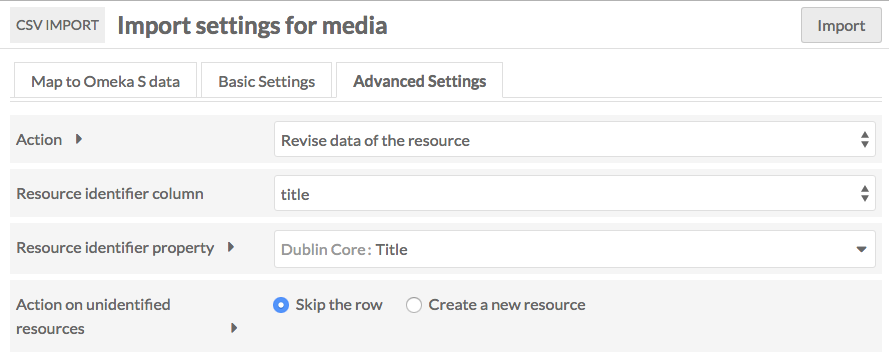

- **Resource identifier column**: Select from a dropdown of the columns in your CSV. This is the data from your spreadsheet which maps to existing data in your Omeka S installation. This column does not need to be mapped in the other tab.
- **Resource identifier property**: Select from a dropdown of all properties in your Omeka S installation. This should be the property in which you already have data, that you used to create the column data above.
	- Example: if the data in the Resource identifier column is "Title" with the first row of data having a title "A Study in Scarlet," and you set Resource identifier property to "Dublin Core: Title," then the actions will operate on a resource already in your Omeka S installation whose `dcterms:title` property is "A Study in Scarlet".
	- This will only work with exact matches.
	- If you have more than one resource with matching data, it will only take action on the oldest resource.
- **Action on unidentified resources**: This option determines what to do when no matching resource exists in the Omeka S installation, but the selected action only applies to an existing resource ("Append", "Revise", "Update", or "Replace"). This option is not used when the main action is "Create" or "Delete" Your options are two radio buttons:
	- Skip the row
	- Create a new resource.

In addition to the above, the Advanced Settings tab has an option to set the number of rows to process by batch. By default, this is set to 20. However, if you are running into errors with an import you may want to set it to 5 or even 1 in order to troubleshoot and determine the source of the error.

!!! note
	Note that Appending data will allow you to supply multiple rows with the same identifier; each row's values will be appended alongside the ones before.

	Revising, Updating, and Replacing data will **erase** data that was supplied in earlier rows of your CSV, if later rows use the same identifier. If you wish to import multiple values (for example, two Creator values) in these processes, you can either: put them in two columns in the same row, mapped to the same property; or, put them in a single cell and use multivalue separators. Do not forget to specify your multivalue separator in the "Basic Settings" tab and check the "Use multivalue separator" box in the options (wrench icon) for each column.

### Complete import
Once you have completed mappings, column options, and any settings, click the Import button in the upper right corner of the browser window. This should start the import and redirect you to the Past Imports tab. You should see a confirmation message saying "Importing in Job ID [number]".

## Mixed resource import
This resource option allows you to import a sheet with a mix of resource types: items, item sets, and media.

### Map to Omeka S data
This tab displays an initial dropdown above a table with the columns from your spreadsheet as rows. Each row displays:

- a checkbox
- The column header from the spreadsheet
- A plus symbol button for adding or modifying a mapping
- A wrench symbol button for spreadsheet column options
- A column displaying properties mapped, either automatically or manually
- A trash can to delete existing mappings
- A column to show the particular options selected.

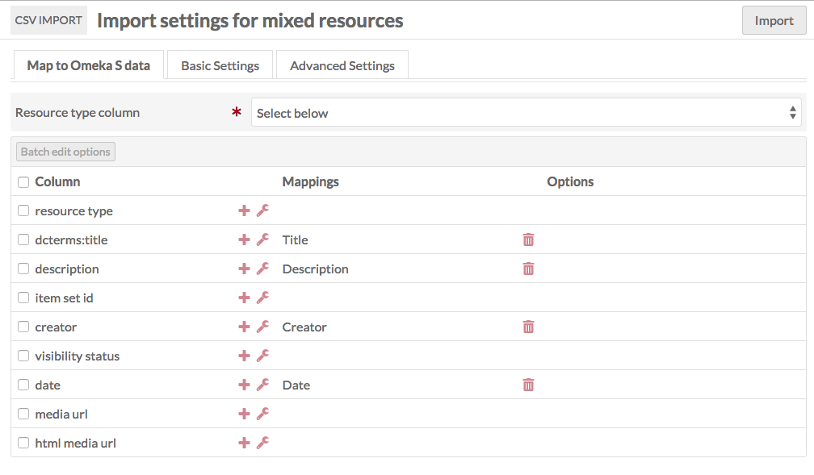

The dropdown above the table is where you set which column in the CSV file indicates whether the data in that row is an item, item set, or media. You do not need to map this data in the table on this tab. Values in this column can be `item` or `items`, `item set` or `itemset` or `itemsets` or `item sets`, or `media`. Other values, or empty fields, will lead to the row not being imported.

Rows with `media` in the resource type column need to indicate which item they are to be attached to, as in the [Media section above](#import-media), and require a media source to be included.

#### Mapping options

To map a column header to a vocabulary property, click on the plus symbol button to the left of the column header. This will open a drawer on the right-hand side of the screen.

The drawer has multiple options for mapping:

**Properties** select a property to map the column data to, from any of the installed vocabularies. Use the Filter field to search the available properties for a specific property.

**Item-specific data** has a dropdown to set Item Set by selected property. If you have a column with data for an Item Set to which you want to add the item, you can set how it maps using this dropdown. You can either use the Item Set's internal ID, or any one of its properties (title, description).

**Item set-specific data** is a checkbox for "Open to additions." Check to allow other users to edit or add to the item set. Leave unchecked to have the item set be editable only by its creator, site admins, and global admins.

**Media-specific data** has a dropdown to set the item to which the media should be added. You can either use the item's internal ID, or any one of its properties (title, description). An item's ID is the number sequence at the end of the URL when on the view or edit page, so for `/admin/item/11576` the ID is 11576. You can also see the item's ID in the right-hand drawer on the item's view page.

**Generic data** has a dropdown where you can set one of four options:

- **Resource template (by label)**: Set the template for the media by name. The name of the template as entered in the spreadsheet and the name of the template in Omeka S must match exactly.
- **Resource class (by term)**: Set the resource class for the media. The term for the class in the spreadsheet and in the Omeka S installation must match exactly.
- **Owner (by email address)**: Set the media's owner by email address. This must be the email address associated with the user's account in the Omeka S installation.
- **Visibility public/private**: Set the visibility of the media. Use "private" or "public" in the spreadsheet.

**Media source** For the columns in your spreadsheet that point to the media, select for each column from the dropdown:

- HTML
- IIIF image (link)
- IIIF presentation (link)
- oEmbed (link)
- URL
- YouTube (link).

Other options may appear here based on your active modules, such as File Sideload. 

Be sure to click the "Apply changes" at the bottom of the drawer or nothing you set here will be kept.

To remove a mapping, click the trash can icon in the row for that data mapping. It will remove *only* the mapping, not the column data.

If you have data in a column in your CSV that you do not want to bring in to your Omeka S installation, simply do not map that column to a property or data type.

#### Column options

Column options are in addition to mappings. If you add options without also mapping column data to resource, media, or other data, nothing will be imported.

To access options for data in a column of your CSV (represented by a row in the import table), click the wrench icon for that column heading.

This will open a drawer on the right side of the browser window with the following options:

- **Use multivalue separator**: Check this box to use the multivalue separator for data in this column. You set the multivalue separator character in the initial import page, but you can change it in the Basic Settings tab.
- **Language**: Set the language for this column using the [IETF Language tag](https://en.wikipedia.org/wiki/IETF_language_tag){target=_blank} for the language in which the text is written. This will override what you have entered in basic settings.
- **Import values as private**: Check this box to set all property values *in this column* private.
- **Data type**: A dropdown with at least three options, which correspond to the [values](../content/items.md#values) one can use when adding properties to an item:
	- Import as text (default).
	- Import as URL reference. You can set the label for the URI by including the desired text after a space, for example: `http://example.com This Is The Label`.
	- Import as Omeka S resource. This will create [linked resources](../content/items.md#linked-resources). If you select this option, you must choose which property values to match to find the intended Omeka resource in your installation, in the next **Resource identifier property** dropdown. This must be a unique property, so "Title" may not be a good choice. 
		- You can use the internal Omeka ID. A resource's ID is the number sequence at the end of the URL when on the view or edit page, so for `/admin/item/11576` the ID is 11576. You can also see the resource's ID in the right-hand drawer on the resource's view page. Items, item sets, and media all have IDs.
		- You can include resources that are being made in the same CSV, as long as the resources being linked to have already been created in earlier rows and can be found with the unique property value indicated here. If you wish to do this, we recommend setting the batch number low (even to 1) on the Advanced Settings tab, to ensure resources are being fully created before another new resource tries to link to them. 
	- If you have certain modules installed, such as Numeric Data Types, there may be additional data type options supplied by those modules.

Be sure to click the "Apply changes" button at the bottom of the drawer. To remove a column option setting, click the wrench icon again and undo your changes manually.

#### Batch edit
When you select one or more rows in the table (columns from your CSV file), you can use the "Batch edit options" button to apply the column options described above to multiple CSV columns at once.

Be sure to click the "Apply changes" button at the bottom of the drawer in order to save your changes.

### Mixed resources import basic settings

These settings apply to the entire CSV you are importing. Note these settings can be overwritten by column options in the Map to Omeka S data tab. If a column is mapped for template, class, or owner, those values will override these settings; so will column settings for language and privacy.

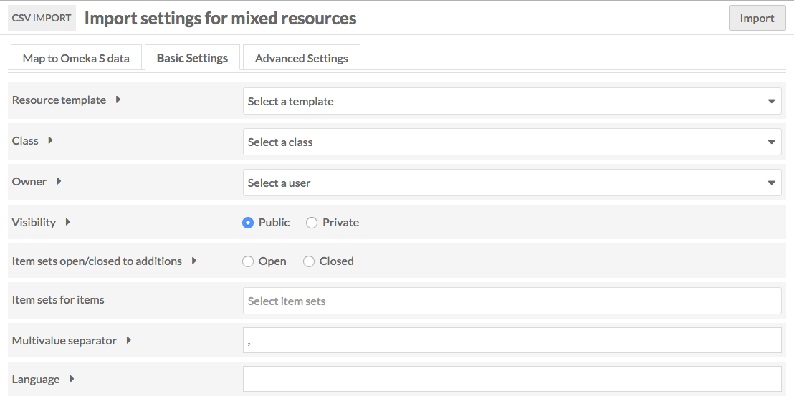

- **Resource template**: Select a resource template from the drop-down menu to apply to the imported item sets. You can use the search field at the top of the dropdown to narrow results or find a particular template.
- **Class**: Select a class from the drop-down menu to apply to the imported item sets. You can use the search field at the top of the dropdown to narrow results or find a particular class.
- **Owner**: Set the owner for the item sets by selecting a user from the drop-down menu. You can use the search field at the top of the dropdown to narrow results or find a particular user.
- **Visibility**: Set the visibility of the imported item sets as public  or private.
- **Item sets open/closed to additions**: Set whether users other than the owner (and site & global admins) will be able to add or edit the item sets.
- **Item set for items**: Select from a dropdown of existing item sets.
- **Sites for items**: Select one or more of your existing sites to add new items as resources.
- **Multivalue separator**: Enter the multivalue separator character here, if you have used one.
      - The columns of data in your CSV should be separated by commas, however within those columns you can add a special character to create multiple inputs, for example a semicolon.
- **Language**: Set the language of the values in the spreadsheet using the appropriate [IETF Language tag](https://en.wikipedia.org/wiki/IETF_language_tag){target=_blank}.

### Mixed resources import advanced settings

The Action setting allows you to change the action of process from a straight import to one of the following options:

- **Create a new resource**: Default option. Each row in the CSV will become a new resource.
- **Append data to the resource**: Add new data to the resource.
- **Revise data of the resource**: Replace existing data in the resource with data from the CSV, except if empty.
- **Update data of the resource**: Replace existing data in the resource with data from the CSV, even when the cell is empty.
- **Replace all data of the resource**: Remove all properties of the resource, and fill with new information from the sheet.
- **Delete the resource**: Delete all matching resources.

If you select one of these options from the dropdown, three additional settings will appear on the tab. These settings help the process determine which resources to take action on.

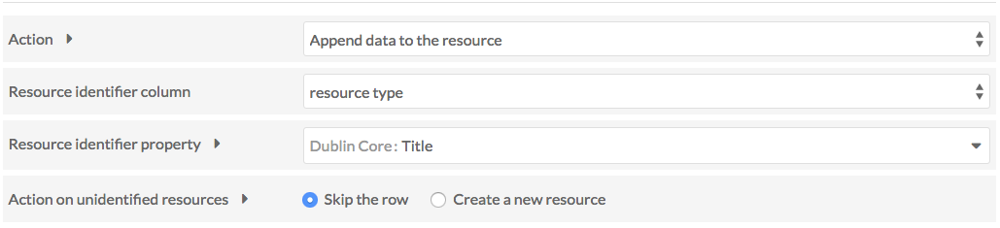

- **Resource identifier column**: Select from a dropdown of the columns in your CSV. This is the data from your spreadsheet which maps to existing data in your Omeka S installation.
- **Resource identifier property**: Select from a dropdown of all properties in your Omeka S installation. This should be the property in which you already have data, that you used to create the column data above.
	- Example: if the data in the Resource identifier column is "Title" with the first row of data having a title "A Study in Scarlet," and you set Resource identifier property to "Dublin Core: Title," then the actions will operate on a resource already in your Omeka S installation whose dc:title property is "A Study in Scarlet".
	- This will only work with exact matches.
	- If you have more than one resource with matching data, it will only take action on the oldest resource.
- **Action on unidentified resources**: This option determines what to do when no matching resource exists in the Omeka S installation, but the selected action only applies to an existing resource ("Append", "Revise", "Update", or "Replace"). This option is not used when the main action is "Create" or "Delete" Your options are two radio buttons:
	- Skip the row
	- Create a new resource.

In addition to the above, the Advanced Settings tab has an option to set the number of rows to process by batch. By default this is set to 20. However, if you are running into errors with an import you may want to set it to 5 or even 1 in order to troubleshoot and determine the source of the error.

!!! note
	Note that Appending data will allow you to supply multiple rows with the same identifier; each row's values will be appended alongside the ones before.

	Revising, Updating, and Replacing data will **erase** data that was supplied in earlier rows of your CSV, if later rows use the same identifier. If you wish to import multiple values (for example, two Creator values) in these processes, you can either: put them in two columns in the same row, mapped to the same property; or, put them in a single cell and use multivalue separators. Do not forget to specify your multivalue separator in the "Basic Settings" tab and check the "Use multivalue separator" box in the options (wrench icon) for each column.

### Complete import
Once you have completed mappings, column options, and any settings, click the Import button in the upper right corner of the browser window. This should start the import and redirect you to the Past Imports tab. You should see a confirmation message saying "Importing in Job ID [number]".

## Import users
When importing users, you can only bring in data related to the user table in Omeka S: the user's email, display name, and role. Any additional data in your CSV will not be imported. None of these can be multivalue properties.

This tab displays an initial dropdown above a table with the columns from your spreadsheet as rows. Each row displays:

- A checkbox
- A column header from the spreadsheet
- A plus symbol button for adding or modifying a mapping
- A trash can to delete mappings
- A column to show options selected.

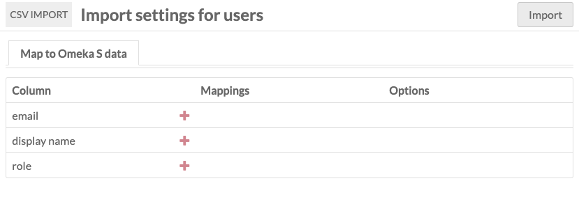

To map a column header to user information, click on the plus symbol button to the left of the column header. This will open a drawer on the right-hand side of the screen.

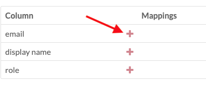

The drawer has a dropdown for Users info, with three options:

- **Email**: The email address for the user
- **Display name**: The user's display name
- **Role**: The user's [role](../admin/users.md#roles-and-permissions).

Role values to use in this import are as follows:

- `global_admin`
- `site_admin`
- `editor`
- `reviewer`
- `author`
- `researcher`.

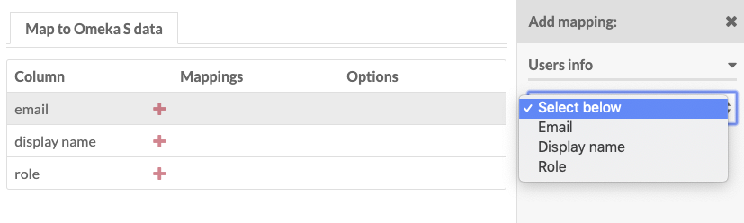

Once you have completed the mappings, click the "Import" button.

!!! note
	Users will **not** be notified via email when an account is created for them using CSV Import. Normally, when you create an account manually, the email address is sent a notification including a link to set their password. Currently, CSV Import does not send those emails and so users cannot set their own passwords. Site administrators must set passwords and then share them manually once users are created via CSV Import.

## Manage past imports

To review past imports, click on the CSV Import module and select the "Past Imports" tab.

This will display a table with the following columns:

- An **Undo** Checkbox
- **Date** of import
- **Action** of the import (create, append, revise, update, replace, or delete).
	- Beneath the action description there are links to the job details and job log.
- **Comment** entered on import or indicating an error
- **Result** the items updated, added, or deleted
- **Status** of import
- Import **Owner**.

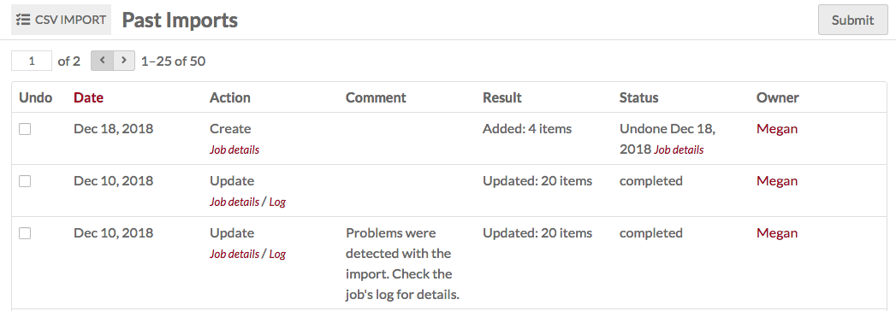

To see the details of an import, click the "Job details" link below the action description. To review logs, particularly in cases where an error occurred, click the "Log" link below the action description.

## Undo an import

To undo an import, click on the CSV Import module and select the "Past Imports" page.

Check the "Undo" box in the row of the import which you want to undo, and click "Submit".

Depending on the size of the import, it may take some time to undo. On complete, the status of the import on the "Past Imports" table will say "Undone" followed by the date the import was reversed.

## Troubleshooting
The following are known errors that can occur during an import:  

- **Encoding**: CSVs for import must be UTF-8 encoded.
- Are your jobs starting and not completing? You might need to [set the path for PHP](../configuration.md#php-path) so that your system can perform the background process to make the items.

## Integration with other modules
Some other modules add functionality to the CSV import process. If you have these modules installed and active, you will have access to the following options when using CSV Import.

### Custom Vocab
If you have [Custom Vocab](customvocab.md) installed and active, it will add your custom vocabularies as data types in Omeka. You can select these data types during your CSV Import. 

### Extract Text

When the [Extract Text module](extracttext.md) is enabled, text extraction will be attempted on any files ingested through a CSV Import process. If available, this will include Tesseract, an image processor that employs optical character recognition (OCR). You can disable individual extractors in the Configuration menu of Extract Text so that they do not run during your import. 

!!! note
	We recommend you disable Tesseract, or the entire Extract Text module, when performing an import including images such as photographs or drawings. OCR running on images without text in them will be very processor-heavy and may cause problems with your import. 

### File Sideload
If you have [File Sideload](filesideload.md) (minimum version 1.2.0) installed and active, you can use it as a source for media when running a CSV import.

Everything on the **Map to Omeka S data** tab will be the same. When you add a mapping and choose the "Media source" option, you will see that there is now an option for "Sideload".

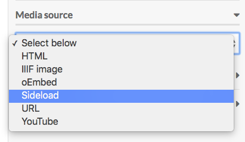

For the data in this column, you need to include the full file name, including extension. So, for example, if you want to import a JPG file named "Jekyll_and_Hyde_Title", then the data in the media column of the CSV you are importing should be `Jekyll_and_Hyde_Title.jpg`.

### Mapping
If you have [Mapping](mapping.md#csv-import-integration) (minimum version 1.1.0) installed and active, you will have additional options in the right-hand drawer when importing Items. Note that these options do not appear for any other import type, including Mixed Resources.

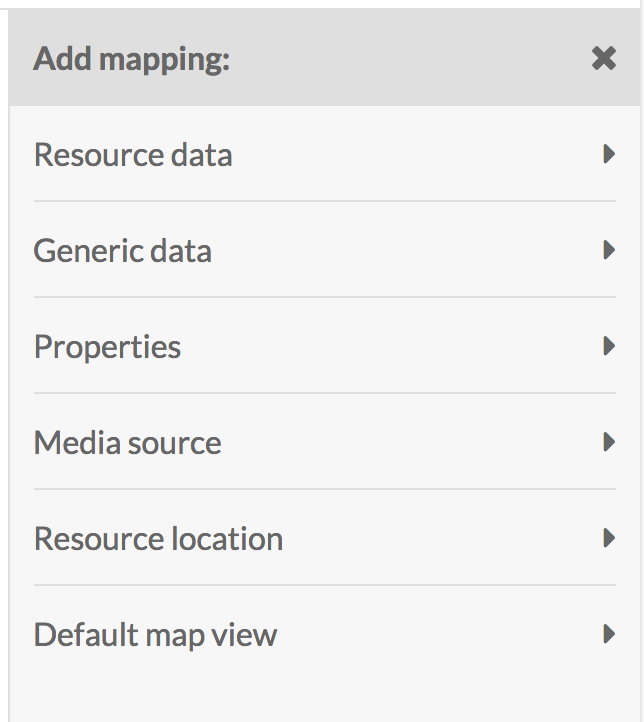

For more information, see the [section on the Mapping page](mapping.md#csv-import-integration).

### Numeric Data Types
If you have [Numeric Data Types](numericdatatypes.md) installed and active, it will add the option to set a column data type as numeric data.

Options are:

- Date/Time (ISO 8601)
- Interval (ISO 8601)
- Duration (ISO 8601)
- Number (integer or decimal).

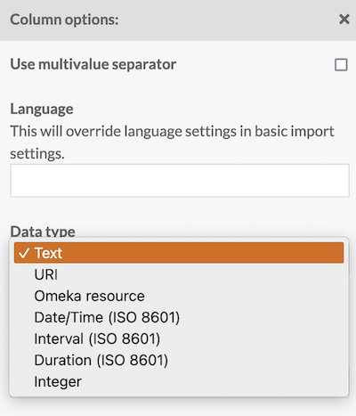

When importing data as numeric, it must be formatted precisely. Always check to be sure your data has imported correctly into the format of your choice; CSV Import will leave values empty if the formatting isn't recognized. 

Use the following ISO 8601 formats for importing [dates](https://en.wikipedia.org/wiki/ISO_8601#Dates){target=_blank}, including dashes between values:

- `2022`
- `2022-08` (year and month, no date)
- `2022-08-18`.

Use the following ISO 8601 formats to add [times](https://en.wikipedia.org/wiki/ISO_8601#Times){target=_blank} to your date values:

- `2022-08-18T17:26:49+00:00` ([time offset from UTC](https://en.wikipedia.org/wiki/ISO_8601#Time_offsets_from_UTC){target=_blank})
- `2022-08-18T17:26:49Z` ([coordinated universal time](https://en.wikipedia.org/wiki/ISO_8601#Coordinated_Universal_Time_(UTC)){target=_blank}). 

You cannot omit the year while providing a month and/or day. You cannot supply ordinal dates (as in, `2000-175` for the 175th day of the year 2000). 

UUse the following format for importing [intervals](https://en.wikipedia.org/wiki/ISO_8601#Time_intervals){target=_blank} with start and end points:

- `2007-03-01T13:00:00Z/2008-05-11T15:30:00Z` (Start and end).

Use the following ISO 8601 formats for importing [durations](https://en.wikipedia.org/wiki/ISO_8601#Durations){target=_blank}, expressed as number of years, number of months, number of days, etc.:

- `P23DT23H` (23 days & 23 hours)
- `P3Y6M4DT12H30M5S` (3 years, 6 months, 4 days, 12 hours, 30 minutes, & 5 seconds).
