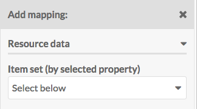

The CSV Import module allows you to import items or users into your Omeka S install from a csv (comma separated values), tsv (tab-separated values) or odf (open document format) file. 

Please note that an import must have a specific import type. 

## Preparing your CSV file

Most spreadsheet editors (including Microsoft Excel, Google Sheets, and Apple Numbers) can export to csv format. CSV files for import must be encoded in UTF-8, so when exporting or saving a new document, be sure to check that the encoding is UTF-8.

If the spreadsheet is already created, take a moment to think about which columns you want to match to which vocabulary properties. 

*Note* Your csv file *must have a header row* in order for the module to process it correctly.

If you have multiple inputs for a single property, you can separate them with a secondary *multivalue separator*. For example, a work with multiple authors (E.B. White and William Strunk Jr.) with the column for Creator containing "E.B. White; William Strunk Jr" has a semicolon (;) as the multivalue separator. When imported into Omeka S, each of these would appear as a separate entry in the property (Creator: E.B. White and Creator: William Strunk Jr.)

### Automapping 
The module will automatically automap column headers if they conform to the property terms of your installation's [vocabularies](../content/vocabularies.md). For example, a CSV file with a column header "dcterms:title" would automap to the Dublin Core Title property when the CSV is loaded for mapping.

To find the terms you should use for your column headers, go to the Vocabularies tab from the admin dashboard. Click on the number of properties for the vocabulary you want to use (Dublin Core in the image below)

In the table of vocabulary properties, there is a column for *Term*. Use the Term for the property you want to automap in the CSV Import. For example, "dcterms:abstract" would automap to the Dublin Core property "Absract" and "foaf:firstName" would automap to the Friend of a Friend property "firstName"

In addition, there is a setting in the inital import settings to automap with simple labels - this will work with columns whose names match a vocabulary label, for example "Title" or "date". Note that this option defaults to Dublin Core before proceeding through other installed vocabularies. 

## Importing

[Install and activate](../modules/index.md#installing-modules) the CSV Importer module. Once active, the module will add a tab to the left-hand navigation of your Omeka S install dashboard, under the Modules heading. 

Start an import by clicking on the CSV Importer tab on the left-hand navigation. This will open the initial Import Settings page. 

- For the Spreadsheet option, use the *Choose File* button to select the file from your computer. 
- From the *CSV Column delimiter* dropdown, choose from the following options (this should match the formatting of your file)
	- comma (default)
	- semi-colon
	- colon
	- tabulation
	- carriage return
	- space
	- pipe

- From the *CSV column enclosure* dropdown, choose the option which encloses long text in your file:
	- double quote (default)
	- quote
	- hash

- From the *Import Type* dropdown, select what you are importing:
	- Item Sets
	- Items
	- Media (must relate to already existing Items)
	- Mixed resources (spreadsheet can inlcude Item Sets, Items, and Media)
	- Users

- Check the box to *Automap with simple labels.* This will automap not only specially formatted column headings but also column headings which match existing vocabulary property labels. Note that this option defaults to Dublin Core before proceeding through other installed vocabularies. 

- Comments are useful as they appear on the "Past Imports" page; make a note about what is being imported and any settings you may have on this page. 

Click the *next* button to continue with the import process. 

### Import Items
To import items, select "Items" under the "Import type" on the first page.

When you click next, the page will load with the following tabs:

### Map to Omeka S data
This tab displays a table with the columns from your spreadsheet as rows. Each row displays:

- a Checkbox
- Column header from the spreadsheet
- A plus symbol button for adding or modifying a mapping
- A wrench symbol button for spreadsheet column options
- A trash can to delete mappings
- A column to show options selected

#### Mapping options

To map a column header to a vocabulary property, click on the plus symbol button to the left of the column header. This will open a drawer on the right-hand side of the screen. 

[A red arrow points to the plus sign button to the left of the word "title"](../modules/modulesfiles/csvimport_itemsMapButton.png)

The drawer has multiple options for mapping:

**Resource data** has a dropdown to set Item Set by selected property. If you have a column with data for an Item Set to which you want to add the item, you can set how it maps using this dropdown. You can either use the Item Set's internal ID, or any one of its properties (title, description).

**Generic data** also has a dropdown where you can set one of four options:

- *Resource template (by label):* set the template for an item by name. The name of the template as entered in the spreadsheet and the name of the template in Omeka S must match exactly.
- *Resource class (by term):* set the resource class for an item. The term for the class in the spreadsheet and in the Omeka S installation must match exactly.
- *Owner (by email address):* set an item's owner by email address. This must be the email address associated with the user's account in the Omeka S installation.
- *Visibility public/private:* set the visibility of the item. Use "private" or "public" in the spreadsheet. 

**Properties** select a property to map the column data to, from any of the installed vocabularies. Use the Filter field to search the available properties for a specific property.

**Media source** If the column in your spreadsheet is a media source, select which kind from the dropdown: 

- HTML
- IIIF Image (link)
- oEmbed (link)
- URL
- YouTube (link)

Be sure to click the "Apply Changes" at the bottom of the drawer or nothing you set here will be kept.

### Basic Settings

### Advanced Settings

