The CSV Import module allows you to import items or users into your Omeka S install from a csv (comma separated values) document. 

Please note that an import must be for either items or users, but cannot be for both.

Preparing your CSV file
-----------------------
Most spreadsheet editors (including Microsoft Excel, Google Sheets, and Apple Numbers) can export to csv format. CSV files for import must be encoded in UTF-8, so when exporting or saving a new document, be sure to check that the encoding is UTF-8.

If the spreadsheet is already created, take a moment to think about which columns you want to match to which vocabulary properties. 

*Note* Your csv file *must have a header row* in order for the module to process it correctly.

If you have multiple inputs for a single property, you can separate them with a secondary *multivalue separator*. For example, a work with multiple authors (E.B. White and William Strunk Jr.) with the column for Creator containing "E.B. White; William Strunk Jr" has a semicolon (;) as the multivalue separator. When imported into Omeka S, each of these would appear as a separate entry in the property (Creator: E.B. White and Creator: William Strunk Jr.)

### Automapping 
The module can automap column headers if they conform to the property terms of your installation's [vocabularies](../content/vocabularies.md). For example, a CSV file with a column header "dcterms:title" would automap to the Dublin Core Title property when the CSV is loaded for mapping.

To find the terms you should use for your column headers, go to the Vocabularies tab from the admin dashboard. Click on the number of properties for the vocabulary you want to use (Dublin Core in the image below)

In the table of vocabulary properties, there is a column for *Term*. Use the Term for the property you want to automap in the CSV Import. For example, "dcterms:abstract" would automap to the Dublin Core property "Absract" and "foaf:firstName" would automap to the Friend of a Friend property "firstName"

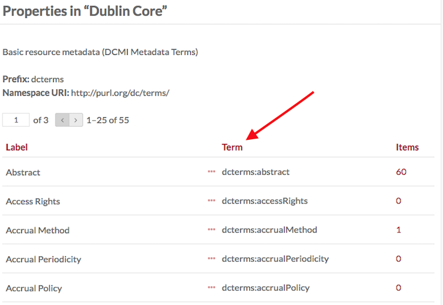

Importing
---------
[Install and activate](../modules/modules.md#installing-modules) the CSV Importer module. Once active, the module will add a tab to the left-hand navigation of your Omeka S install dashboard, under the Modules heading. 

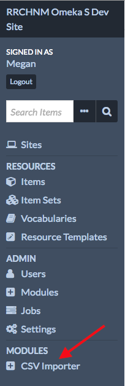

Start an import by clicking on the CSV Importer tab on the left-hand navigation. This will open the Import page. 
- Using the *Choose File* button, select the file from your computer. 
- From the *Import Type* dropdown, select whether you're importing *Items* or *Users* (scroll down for instructions for each of these types of import)
- Click the *next* button

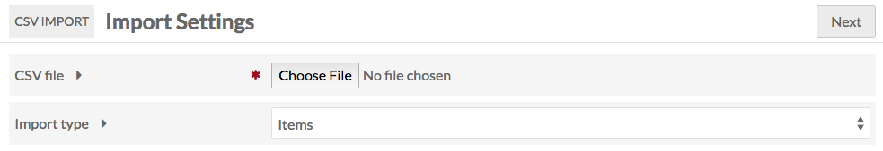

### Items Import
The next page of the Importer has two tabs:  

#### Basic Import Settings
has the following fields, none of which are required: 
- *Comment*: make a note on the import.
- *Resource Template*: select a resource template from the drop-down menu to apply to the imported items
- *Class*: select a class from the drop-down menu to apply to the imported items
- *Item Sets*: add the imported items to a specific item set or sets using the select menu (required)
- *Owner*: set the owner for the Items by selecting  from the drop-down menu.
- *Multivalue Separator*: enter the multivalue separator character here, if using
      - The columns of data in your CSV should be separated by commas, however within those columns you can add a special character to create multiple inputs, for example a semicolon.

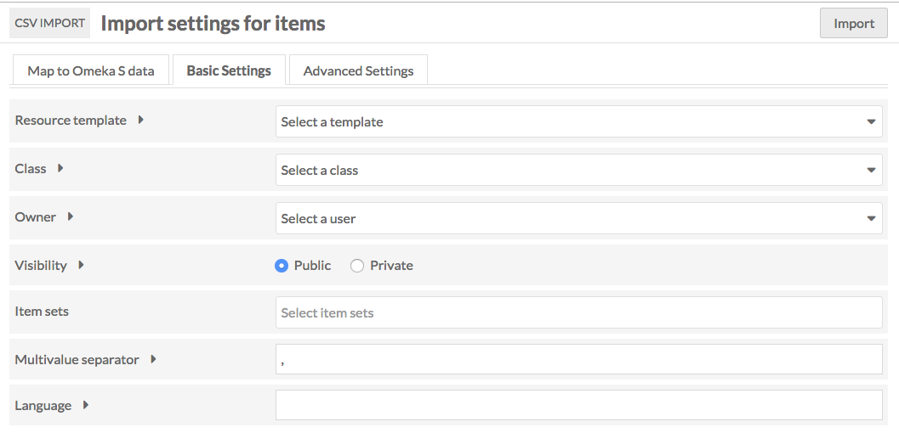

#### Map to Omeka S Data
Each column in your CSV file will appear as a block with a the *CSV Column* header, a space to indicate *Mappings* and mapping *Actions*. To map the data in a column, select one of the actions and a drawer will open with the options for that action.

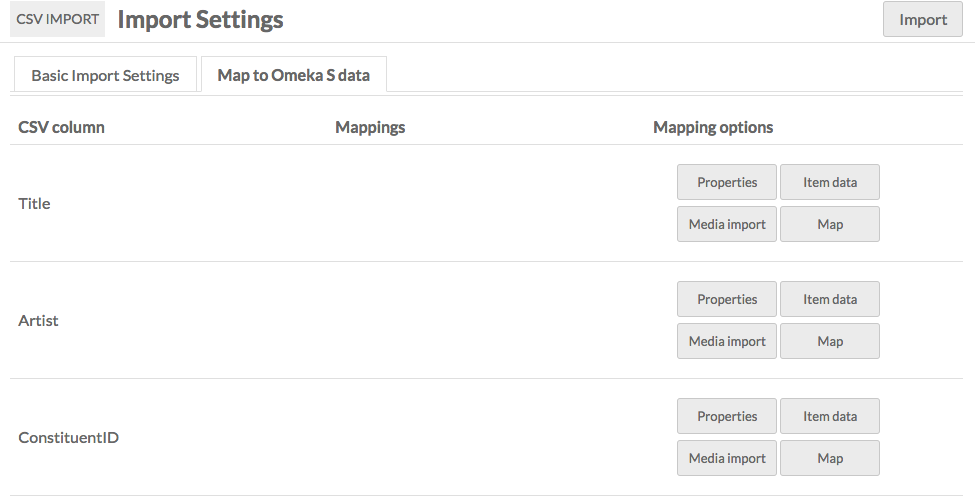

All actions have the option to indicate that this column data uses the multivalue separator.

**Map** 

(this option will only be available if you have installed the [mapping](../modules/mapping.md) module)
Select whether this column contains: 
- Latitude
- Longitude
- Latitude/Longitude (formatted in this manner)
- Default Latitude
- Default Longitude
- Default Zoom

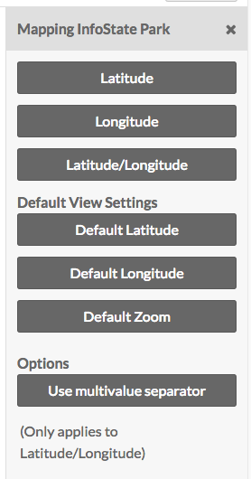

**Properties** 

Select from the properties of all installed vocabularies. You can search for a specific property using the *Filter properties* field at the top of the drawer. 
You can choose to import the content as a URL.

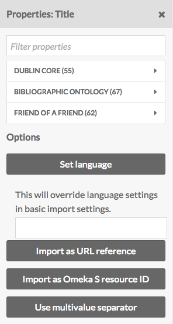

**Media Import**

Select one of the following:
- URL
- HTML
- IIIF Image
- oEmbed code
- YouTube

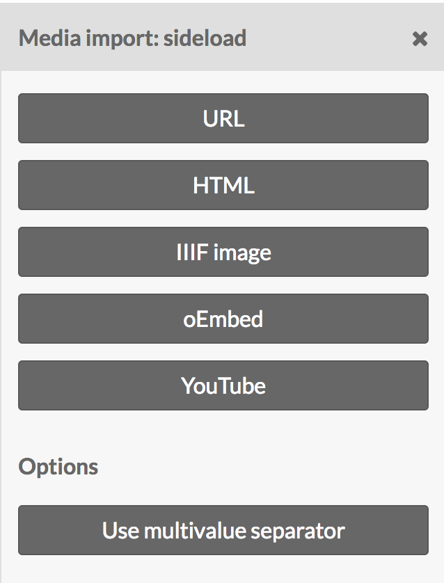

**Item Data**

These actions allow you to set the column data as:
- Item Set ID
- Resource Template Name
- Resource Class Name
- Owner Email Address
Note that these settings will override the basic settings, and must use email addresses, templates, classes, and IDs from this Omeka S install. 

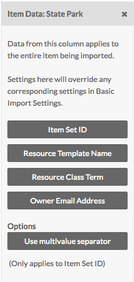

As soon as you select a mapping it should appear in the Mappings column of the table. To remove a mapping simply click the red delete (trash can icon) button to the right of the mapping - the mapping should immediately disappear.

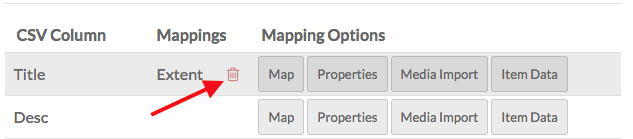

Once you have completed mapping, hit import. You should see a confirmation message saying "Importing in Job ID [number]"

### Users Import
The next page of the Importer has two tabs: 

#### Basic Import Settings
- *Comment*: make a note on the import.
- *Item Sets*: add the imported items to a specific item set or sets using the select menu (required)
- *Owner*: set the owner for the Items by selecting  from the drop-down menu.
- *Multivalue Separator*: enter the multivalue separator character here, if using
      - The columns of data in your CSV should be separated by commas, however within those columns you can add a special character to create multiple inputs, for example a semicolon.

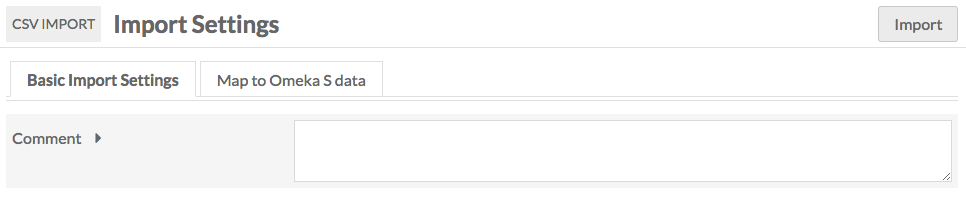

#### Map to Omeka S Data
Each column in your CSV file will appear as a block with a the *CSV Column* header, a space to indicate *Mappings* and mapping *Actions*. For the Users import, the only available action is Users Info.

You have three options to map User info to the column data:
- Email
- Display Name
- Role

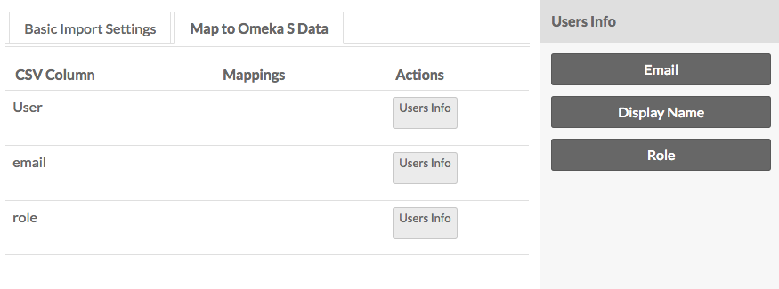

As soon as you select a mapping it should appear in the Mappings column of the table. To remove a mapping simply click the red delete (trash can icon) button to the right of the mapping - the mapping should immediately disappear.

Once you have completed mapping, hit import. You should see a confirmation message saying "Importing in Job ID [number]"

Manage Past Imports
--------------------------------------
To review past imports, click on the CSV Importer module tab and select the Past Imports subtab. 

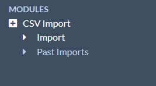

This will display a table with the following columns:
- An *Undo* Checkbox
- *JobID*
- *Comment* entered on import
- *Imported Content*
- *Date* of import
- *Status* of import
- Import *Owner*

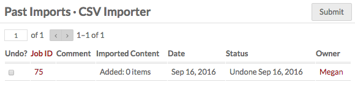

To see the details of an import, click the Job ID number in its row. This will give you a detailed job page with Status, start and end timestamps, Class, Owner, any Args, and a link to the import log at the bottom of the page. 

Confirm that the content has been imported in the Imported Content column.

Undo an Import
------------------------
To undo an import, click on the CSV Importer module tab and select the Past Imports subtab. 

Check the *Undo* box in the row of the import which you want to undo, and click Submit.

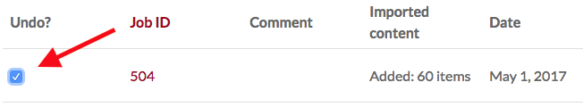

Depending on the size of the import, it may take some time to undo. On complete, the status of the import on the CSV Importer Past Imports table will say "Undone" followed by the date the import was reversed. 

Troubleshooting
---------------------
The following are known errors that can occur during an import:  
- **Encoding**: CSVs for import must be UTF-8 encoded. 
