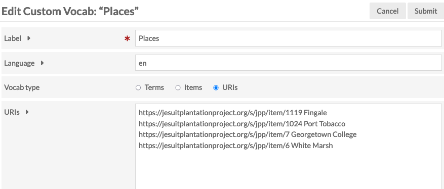
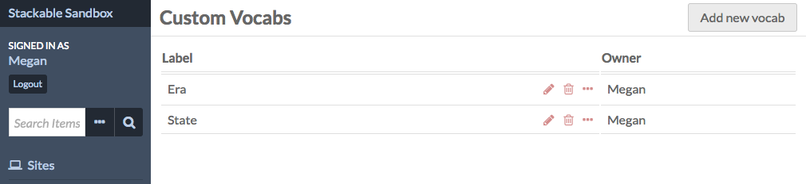
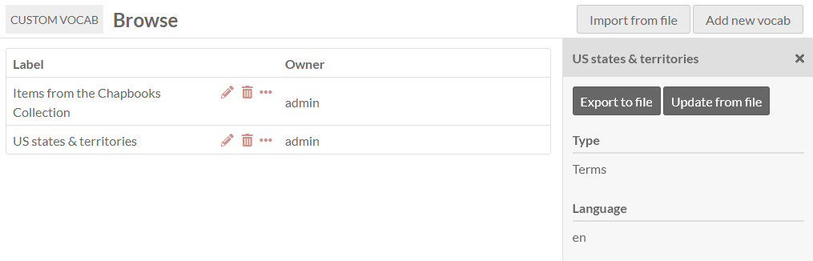
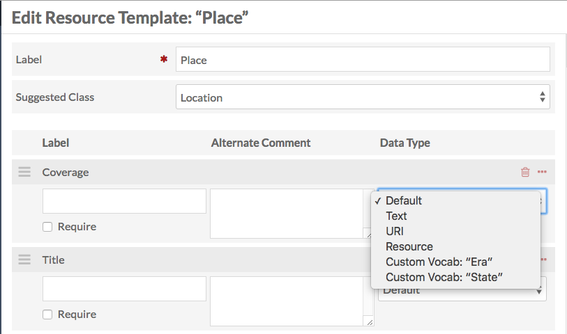
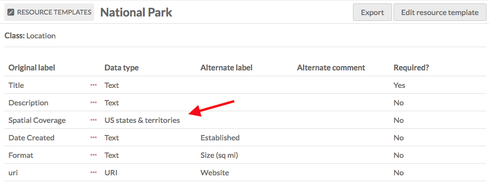
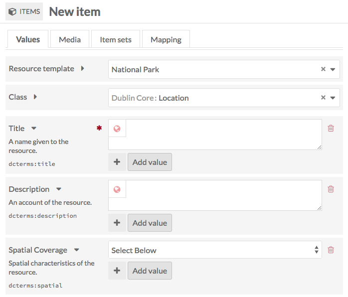
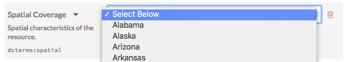
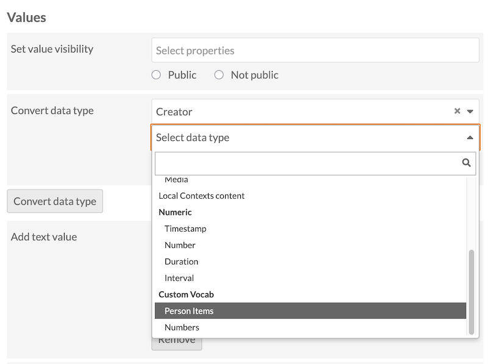

# Custom Vocab

The [Custom Vocab module](https://omeka.org/s/modules/CustomVocab){target=_blank} allows you to create a controlled vocabulary with your own entries. As a new [data type](../content/resource-template.md#data-types), you can then add the vocabulary to properties in resource templates. When using the template for an item, the property will load with a dropdown limited to the options of the controlled vocabulary, rather than a text entry box.

For example, you may want to create an institution-specific list of locations that correspond to different collections on your campus, or a controlled list of people or places related to your holdings. This can help reduce typos and name variations, and can allow you to offer [metadata browsing](../modules/metadatabrowse.md) for more fields.

Custom Vocab is available to users who are at the [Editor role and above](../admin/users.md).

## Create a custom vocab

Once you have installed and activated the module, go to the Custom Vocab section in the left-hand navigation, under Modules.

Click the "Add new vocab" button in the upper right-hand corner of the window.

The Add Custom Vocab page has four fields: Label, Language, Vocab Type ("Terms", "Items", or "URI"), and a field to input your options.

- **Label**: A name for the vocabulary. You may wish to include a reminder of the data type you choose for this vocabulary. 
- **Language** (optional): The language of the vocab, using the [ISO 639-1 language code](http://www.iso.org/iso/language_codes){target=_blank}.
- **Vocab type**: You can set the controlled vocabulary terms to a list of entered terms, to a list of existing items, or to a list of external URIs with or without labels. Depending on this selction, the following field will be:
	- **Terms**: A list of plain-text strings, one word or phrase per line.
	- **Items**: A drop-down of item sets in your Omeka S installation. Choosing one of these will create a custom vocab populated by items from that item set. When used, the property is filled out with a link to the resource in the installation. You may need to go and create an item set containing your intended items now - all items in the item set will be offered in the vocabulary. 
	- **URIs**: A list of URIs, one URI per line. To include a label, add a space and the label after the URI (for example, "http://viaf.org/viaf/136600716 Canada"). When used, the property will populate as a link to the external resource. If you are using a published vocabulary, check the [Value Suggest module](valuesuggest.md) first to see if your intended vocabulary is already included there. We recommend using that module if so. Alternatively, you can use Custom Vocab to supply standardized URIs to external terms but enter in your own desired labels. 

!!! note
	Note that manually-entered terms or URIs do not need to be unique when entered; the module will only retain a list of unique entries when saved. If you are entering identical URIs with different labels, only the final entry will be retained and earlier labels will be ignored.

## Manage custom vocabs

Once you have created at least one vocabulary, the Custom Vocab screen will display a table of your existing vocabularies. The table displays the Label, the buttons for edit, delete, and display information (an ellipsis icon), and the user account that is the owner of the vocabulary. 

There is also a button to "Import" a vocabulary using a file, in the top right. Importing will add a new listing to the table. If you are attempting to update an existing vocabulary in your installation, do not use the "Import from file" button; "Update" the vocabulary from its entry in the table.

Clicking the ellipsis will show you the language of a vocabulary as well as a full listing of its terms. There are two buttons that allow you to "Export" a vocabulary, which can then be shared with other Omeka installations, or to "Update" the existing vocabulary from a file. 

Items-type vocabularies cannot be exported or imported, as these vocabularies are lists of internal Omeka resources and cannot be replicated on another site. If you wish to publish your own Omeka resources as URIs, create a vocabulary of URIs using links to the items on a specific Omeka S site on your installation. 

When editing a custom vocabulary, you can change the label, language, or terms.

## Using a custom vocab

Custom Vocabularies are applied in two ways: 

1. Through [resource templates](../content/resource-template.md).
2. Through [data types](../content/resource-template.md#data-types) applied to existing property values. 

The first option will ensure all future items created using the resource template will require property values from your custom vocab. It will also affect existing items using the resource template, so that the next time those items are edited the custom vocab will appear. This will **not** affect existing values in those properties. 

The second option can take previously-entered text or URI values on existing items and register them as the options provided by your custom vocab. This will require exact text-string or URI matching. At this time, Omeka resource property values cannot be converted to a custom vocab. 

### Custom vocabs in templates

Go to the resource templates screen and either add a new or edit an existing template. Once you are on the template editing screen:

1. Add the property to which you want to apply the custom vocabulary.
1. Edit the property.
1. In the drawer which opens on the right, go to the "Other options" section and find the "Data type" dropdown.
1. Scroll through the dropdown and select the vocabulary you want to use.
1. Click "Set changes" at the bottom of the drawer.

Then save your changes to the template.

When you click the title of a resource template to see its details, the Custom Vocab will show up in the "Data Type" column of the table, in the corresponding property row.

When this resource template is used for an item, media, or item set, the designated property will always load as a dropdown menu with the values from the custom vocabulary. Remember that Custom Vocab **requires** users to use it. If you wish to only provide the custom vocab as an option, add a second data type or multiple data types that offers alternatives, such as a plain text field. 

In the following image, the resource template modified earlier is loaded for a new item. The "Spatial Coverage" field has a "select below" message and arrows indicating the property input is a dropdown menu.

The next image shows the dropdown open, displaying the values from the "US states & territories" vocabulary.

### Convert data types

You can also apply custom vocabularies as data types to existing values on existing resources, whether or not they are using any resource template. 

This can be helpful in the case of a CSV Import or other ingest that did not apply the correct data type at the time. Or in the case where manually-entered values can now be matched to a controlled vocabulary online (perhaps one that your institution has itself published). 

Select multiple resources from the browse page in the admin interface, then choose the batch option "Edit selected" (or "Edit all"). On the next screen, look for the "Convert data type" option in the "Values" section near the bottom of the form. This will allow you to choose a property from all the selected items and apply a custom vocab as a data type. 

This data-type setting will apply to existing values in the property if possible. Text values, if they are an exact match to the entries in a text custom-vocab list, will work. URIs, if they are an exact match to the entries in a URI custom-vocab list, will also work. You cannot assign URIs via matching labels. 

You cannot convert linked resources to a custom vocab at this time. 

!!! note
	Note that if you have entered a URI value and a label, then convert that to the custom vocab data type, your original label will be replaced by the custom-vocab label.

You can confirm the success of a conversion by editing one of the items and seeing that the original value has been replaced with a dropdown menu showing the other options in the custom vocab. 

If you have, for example, plain-text-formatted URI values on existing items and wish to convert them so that they match a custom vocabulary of URIs, that can be done in a two-stage process. First, convert the items' property values from text to URI using the same batch-editing process; then, convert those URIs into your chosen custom vocabulary. 