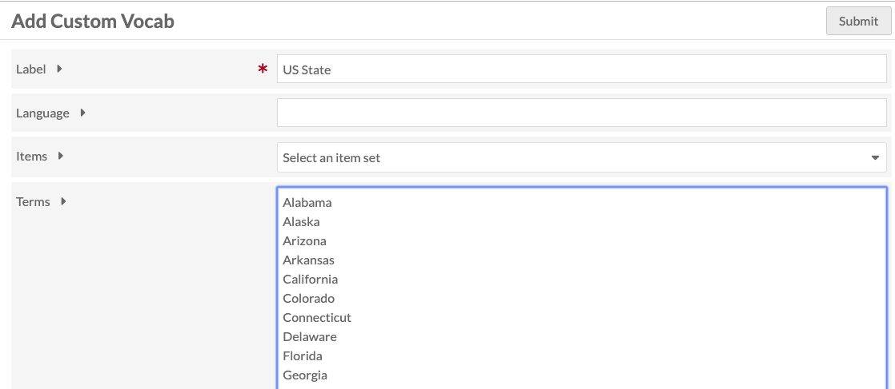

# Custom Vocab

The Custom Vocab module allows you to create a controlled vocabulary and add it to a specific property in a resource template. When using that template for an item, the property will load with a dropdown limited to the options of the controlled vocabulary, rather than a text entry box.

## Create a Custom Vocab

Once you have installed and activated the module, go to the Custom Vocab tab in the left-hand navigation, under the Modules heading. 

Click the Add a New Vocab button in the upper right-hand corner of the window. 

The Add Cusom Vocab page has four fields: Label, Language, Items, and Terms. 

- *Label* a name for the vocabulary, which you will use to find it when adding to a resource template.
- *Language* (optional) of the vocab using the [ISO 639-1 language code.](http://www.iso.org/iso/language_codes)

You can set the controlled vocabulary terms either to a list of existing items or to a list of entered terms:
- *Items* offers a drop-down of Item Sets in your Omeka S installation. Choosing one of these will create a custom vocab populated by items from that item set. When used, the property is populated as an Omeka Resource, not text.
- *Terms* for the custom vocab, one word or phrase per line. This populates the property as text.

Hit submit to save changes.

## Manage Custom Vocabs

Once you have created at least one vocabulary, the Custom Vocab module tab will display a table of your existing vocabularies. The table displays the *Label*, the buttons for edit, delete, and display information, and the *Owner* or creator of the vocabulary. 

When editing a custom vocabulary, you can change the label, language, or terms.

## Using a Custom Vocab

Custom Vocabularies are applied through [resource templates](../content/resource-template.md). 

Go to the Resource Templates and either add new or edit an existing template. Once you are editing the template:

1. Add the property to which you want to apply the Custom Vocab.
2. Edit the property
3. In the drawer which opens on the right, go to the Other options section and find the Data type dropdown.
2. Scroll through the dropdown and select the Custom Vocabulary you want to use
3. Click set changes at the bottom of the drawer.

Be sure to save your changes

When you click the title of a Resource Template to see its details, the Custom Vocab will show up in the Data Type table heading.

When this Resource Template is used in an Item or Item Set, the designated properties will always load as a drop down menu with the values from the custom vocabulary.

In this image, the Resource Template modified earlier is loaded for a new item. See that Spatial Coverage has a "select below" message and arrows indicating the property input is a drop down menu.

This image shows the dropdown open, displaying the values from the "US states & territories"  vocabulary.

