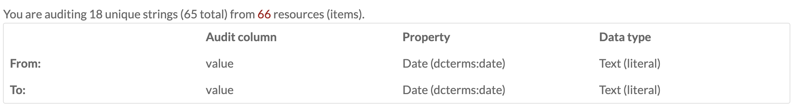

An Omeka S module for low-level auditing and cleaning of resource metadata. It is designed to be used to prepare resource metadata for use in visualizations.

Changes made in Data Cleaning cannot be easily undone. Due to the powerful nature of the module, it can only be used by Global Administrator users. 

Before running any audit, make sure you have a recent backup of your data. 

Once you have [installed](index.md#installing-modules) DataCleaning, it will be added to the modules available on the left-hand navigation of your administrative view.

## Running an audit
From the main tab for Data Cleaning (found under modules in the left-hand navigation), click the "Prepare new audit" button in the upper right corner of the page. 

### Prepare Audit
This will open the Prepare audit form, which has the following options: 

**Resource type:** select the resource type you want to audit from a dropdown. Options are items, item sets, or media.

**Resource query:** in this field, you must enter a search query which will return the resources you want to audit. To get the data for this field, open a new window or tab and run an advanced search for the resource type. On the results page, copy everything in the url (browser address bar) after the `?`

**Audit column:** sets what will be audited. Select from a dropdown for value, uri, or value_resource_id.  

**Property:** selects the property to audit. This dropdown will load all properties from all vocabularies on your installation. When open, the top of the dropdown functions as a search to allow you to locate a property more quickly. 

**Data type:** select from a dropdown of data types to audit. This includes standard data types for Omeka S, as well as any additional data types added by other modules, for example Numeric Data Types. 

The **advanced options** allow you to store audit corrections in a new location in the resources:
 
**Target audit column:** Select the column in which corrections will be stored. You do not need to select a target if it is the same as the audit column above. Options are value, uri, or value_resource_id. 

**Target property:** Select the property as which you want corrections to be stored. You do not need to select a target if it is the same as the property above. This dropdown will load all properties from all vocabularies on your installation. When open, the top of the dropdown functions as a search to allow you to locate a property more quickly. 

**Target data type:** Select the data type that corrections will be stored as. You do not need to select a target if it is the same as the data type above. This dropdown includes standard data types for Omeka S, as well as any additional data types added by other modules, for example Numeric Data Types. 

Once you have entered information in all relevant fields, click the Submit button in the upper right corner. 

You can exit out at any time by clicking the Cancel button. 

### Audit data
Clicking submit in the Prepare audit page will take you to the Audit Data page. 

At the top of the page, just under the header, will be a message telling you how many unique strings you are editing and for how many resources. The number of resources is a link to the resources returned by the search query you entered on the previous page. 

Below this message is a table stating the data being audited. There are three columns: Audit Column, Property, and Data Type.  There are two rows, From and To. Be sure to double check the information in this table before proceeding. 

 

## Sample Workflow
This is a sample workflow for a user who wants to audit the titles of items in a specific item set:

- In the left-hand navigation, go to the Data Cleaning module
- Click on "Prepare new audit" button (top right)
- Select criteria (expand arrows for info):
	- Resource type: "Item"
	- Resource query: item_set_id[]=1234
	- Audit column: "value"
	- Property: "Dublin Core: Title"
	- Data type: "Text"
- Ignore the "Advanced" section
- Click "Submit" (top right)
- Audit the "From: value" column for potential corrections or removals
- Make corrections by entering the correct text into the "To: value" column
- Make removals by checking the "Remove" checkbox
- Click "Submit" (top right)
- Click to confirm the submission
- Refresh the "Past audits" page until the job is marked as "Completed"
- Check the items to see if the values were corrected and removed.