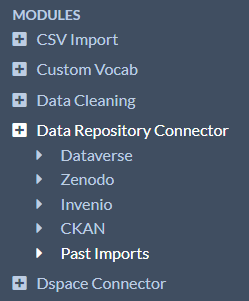
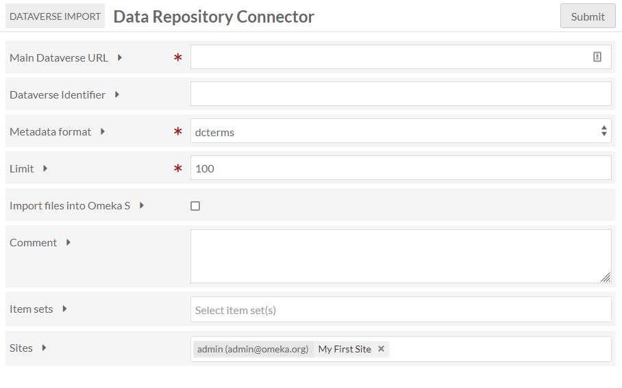
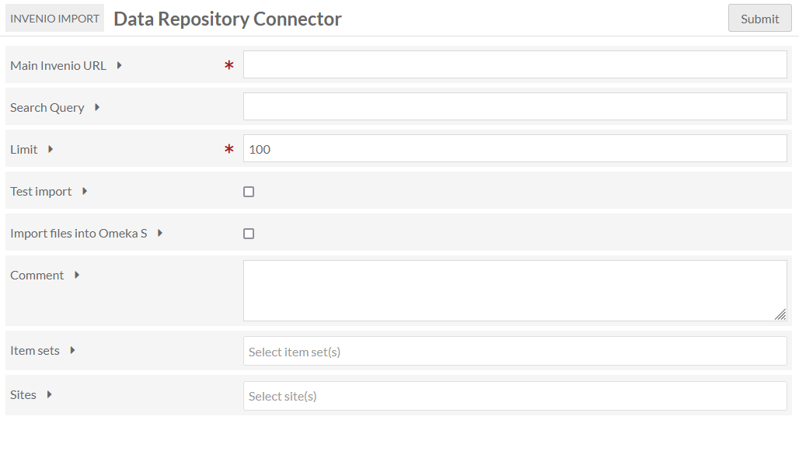

# Data Repository Connector

The [Data Repository Connector module](https://omeka.org/s/modules/DataRepositoryConnector/){target=_blank} allows users to import records and/or data files from several different data repository platforms: Dataverse, Zenodo, Invenio, and CKAN. Once imported, these items can be updated at any time by re-running the original import from the Past Imports page.

The Data Repository Connector adds an entry in the left-hand Modules menu. When you click on the name of the module or the plus-sign icon to the left, the menu will expand to display links for the four import options. The module opens to the Past Imports page by default.

This module is available to users at the Global Admin and Supervisor levels.

## Import data

### Shared options

Regardless of the service you have selected, you will be provided with the following options:

+ **Limit**: The maximum number of results to retrieve in a single batch. If you notice errors or missing data, try lowering this number. Increasing it might make imports faster. (This field is required. Default is 100.)
+  **Test import**: If checked, the Connector will ONLY import the number of results indicated in Limit field above. This is useful for previewing the metadata mapping from the source to Omeka S, and to ensure the connection works.
+ **Import files into Omeka S**: If checked, media associated with a record will be imported into Omeka S. If not, no media will be included in the import.
+ **Comment**: A note about the purpose or source of this import. This will appear on the Past Imports page and can be helpful to track your progress.
+ **Item sets**: The items sets to import items into.
+ **Sites**: The sites to import items into. You may see a default site appear here.

Once you have filled out these fields as well as those specific to the option you have selected, click "Submit".

### Dataverse

If you select Dataverse, you will see a screen with the following options:

+ **Main Dataverse URL**: The URL of the main Dataverse site. (This field is required.)
+ **Dataverse Identifier**: The identifier of the Dataverse to import from. If blank, all datasets under the **Main Dataverse URL** will be imported, which could be large.
+ **Metadata format**: The metadata format to export from Dataverse. The options for Dataverse are "dcterms", "oai_dc", and "schema.org". The format must exist as a [vocabulary](../content/vocabularies.md) in your Omeka instance before import, which you can retrieve from [purl.org](http://purl.org/dc/elements/1.1/){target=_blank} and [schema.org](https://schema.org/docs/developers.html){target=_blank}. (This field is required.)

### Zenodo

If you select Zenodo, you will see a screen with the following options:

+ **Zenodo Community ID**: The short string identifying which Zenodo community to import from. Found in the URL after "https://zenodo.org/communities/" and before any search parameters. (This field is required.)
+ **Metadata format**: The metadata format to export from Zenodo. The only option for Zenodo is "oai_dc". The format must exist as a [vocabulary](../content/vocabularies.md) in your Omeka instance before import, which you can retrieve from [purl.org](http://purl.org/dc/elements/1.1/){target=_blank}. (This field is required.)

### Invenio

If you select Invenio, you will see a screen with the following options:

+ **Main Invenio URL**: The URL of the main Invenio site. (This field is required.)
+ **Search Query**: A term that will narrow the imported results. If blank, all datasets under the **Main Invenio URL** will be imported, which could be large. You can use the [ElasticSearch query syntax](https://www.elastic.co/guide/en/elasticsearch/reference/current/search-your-data.html){target=_blank}. Examples: "oceanography", "access_right:open".

### CKAN

If you select CKAN, you should see a screen with the following options:

+ **Main CKAN URL**: The URL of the main Dataverse site. (This field is required.)
+ **CKAN Organization**: The identifier of the CKAN organization to import from. If blank, all datasets under the **Main CKAN URL** will be imported, which could be large.

### Check import status

After you have hit "Submit", you will be taken to the Past Imports page, where your most recent import job will appear in a green bar at the top of the page. You can track the status of the import by reloading the Past Imports page, or by clicking to the Jobs page found in the Admin section of the left-hand navigation.

!!! note
	Are your jobs starting and not completing? You might need to [set the path for PHP](../configuration.md#php-path) so that your system can perform the background process to make the items.

## Review imports

Click on Data Repository Connector on the left-hand navigation of the admin dashboard, which will bring up the Past Imports page.

The table of past imports includes: 

- columns to **Undo** and *Re-run** past jobs,
- the **Job ID** for the import, 
- the link to the **Data repository** originally supplied (displaying which of the four sources was used), 
- any **Comments** made during import, 
- the number of **Items** affected (separated by **Added** and **Updated**), 
- the **Date** of the import, 
- the import **Status**, and 
- the **Owner** who initiated the import.

If a particular import was undone or re-ran, the "Status" column will indicate that. You can see a subset of the affected items from each job by clicking on the "Total" link under the "Items" column.

### Update imported resources

To update resources created using the Data Repository Connector, simply "re-run" an import from the same source. The resources will be updated, not re-imported. This allows you to use the Connector to sync data between your data repositories and the Omeka S installation. 

Go to the Past Imports page. Under the "Re-run" column, check the box for each import you wish to update, then press "Submit". 

!!! note
	Re-running an import will erase any metadata modifications you have made to the items since the original import.

### Undo an import

You can undo a completed import and remove all associated items at any time. This will completely erase those items and any metadata editing you have done to them. 

Go to the Past Imports page. Under the "Undo" column, check the box for each import you wish to undo, then click "Submit".
