# DataScribe

The [DataScribe module](https://omeka.org/s/modules/DataScribe){target=_blank} adds detailed transcription tools to Omeka S items, so that your users can transcribe text into structured data sets. 

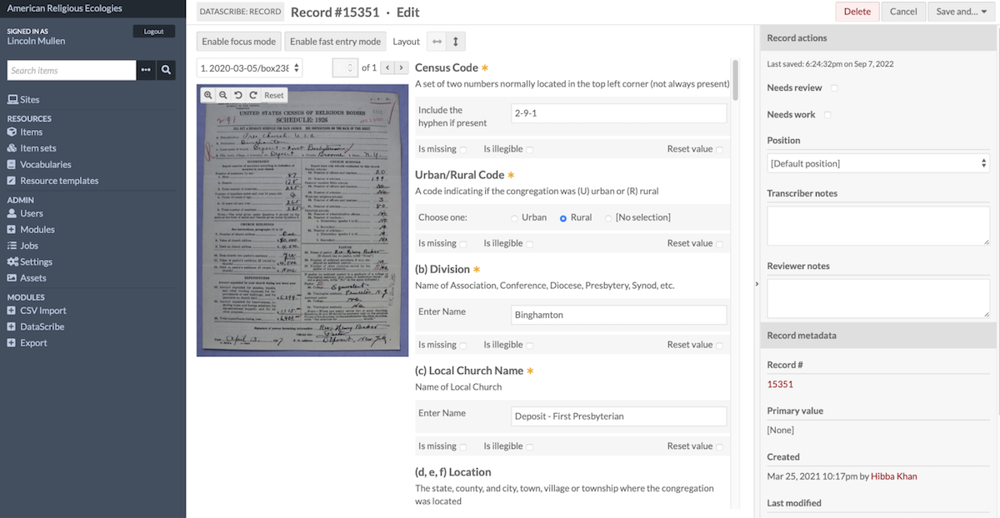

Scholars often collect sources, such as government forms or institutional records, intending to transcribe them into datasets which can be analyzed or visualized. This module enables scholars to identify the structure of the data within their sources, speed up the transcription of their sources, and reliably structure their transcriptions in a form amenable to computational analysis. Scholars can turn sources into tables of data stored as numbers, dates, categories, and more. Because the DataScribe module builds on Omeka S, it allows scholars to display transcriptions alongside the source images and metadata, to crowdsource transcriptions, and to publish their results on the web.

!!! note
	Detailed user instructions, tutorials, and case studies are available on [the Wiki for this module](https://github.com/omeka-s-modules/Datascribe/wiki/){target=_blank}, found in [the module's Github repository](https://github.com/omeka-s-modules/Datascribe){target=_blank}. This manual page will link there for futher information when available. 

## Permissions

DataScribe adds functionality exclusively to the administrative side of Omeka S. Users must be logged in to add transcriptions to structured data forms. An Omeka S user of any level can be assigned a role specific to the DataScribe dashboard: transcriber or reviewer. Only Global Admins and Supervisors can assign users to these roles, create new DataScribe projects, and manage them.

DataScribe projects set to "public" visibility can be seen by any logged-in user; "private" projects can still be seen by users at the Supervisor or Global Admin levels. 

## Requirements

In order to be able to export datasets, the directory `/files/assets` in your Omeka S installation must be writable by the system.

### File types

The DataScribe transcription interface currently supports the following file types:

- image/bmp
- image/gif
- image/jpeg
- image/png
- image/svg+xml.

If you have TIFF or PDF files, you will need to convert them to one of the above formats.

## Terminology

DataScribe is a module that uses Omeka S items and item sets to facilitate the transcription of structured data (that is, information written in columns and rows or recorded in other sorts of tables).

**Project**: a dataset or group of datasets. Some DataScribe uses might have multiple projects, others might just have one. Each project has at least one dataset. You access all DataScribe projects through the dashboard.

**Dataset**: a group of documents with the same data framework (table structure, set of rows and columns, etc). A dataset might capture all of the information recorded on a historical document, or only part of the document. DataSets are created using Item Sets in Omeka S. Datasets are made up of items.

**DataScribe Items** correspond to items in Omeka S - it is a one-to-one correlation. Every DataScribe item also exists as an item in the Omeka S installation. The Omeka S item is where you can find metadata (information) about the source, rights, etc. for each item. The media files which you view when transcribing are attached to the Omeka S items. Note that a DataScribe item can be in more than one dataset. When transcribing, an item has at least one Record.

**Records** are individual pieces of data for an item. A single DataScribe record will appear as a row when the transcribed data is exported. In terms of a general workflow transcription happens at the record level and review happens at the item level. However transcribers may leave notes and flag individual records for attention even when the full item is not ready to be reviewed.

**Transcriber**: an Omeka S user (of any level) can be designated a DataScribe transcriber. This user will be able to transcribe items that have been assigned to them through projects. 

**Reviewer**: an Omeka S user (of any level) can be designed a DataScribe reviewer. This user can review and approve records and items created by others. 

## The DataScribe dashboard

See this guide on the wiki: [The DataScribe dashboard](https://github.com/omeka-s-modules/Datascribe/wiki/Dashboard){target=_blank}.

## Build a project

!!! note
	The module wiki has information on [project planning and conceptualizing how DataScribe can be configured for your materials](https://raw.githubusercontent.com/wiki/omeka-s-modules/Datascribe/Site-docs/support/projectplanning.md){target=_blank}. You may wish to read that and plan out your projects, forms, and datasets before installing or working with DataScribe. 

The first step for working in DataScribe is to create a new project. When you log into an installation and land on the DataScribe dashboard, you may see all the projects that other users have created in DataScribe (if your permission level is high enough). However, the “My projects” section of the dashboard will be empty. There is a button in the upper right hand corner that will allow you to “Add new project.”

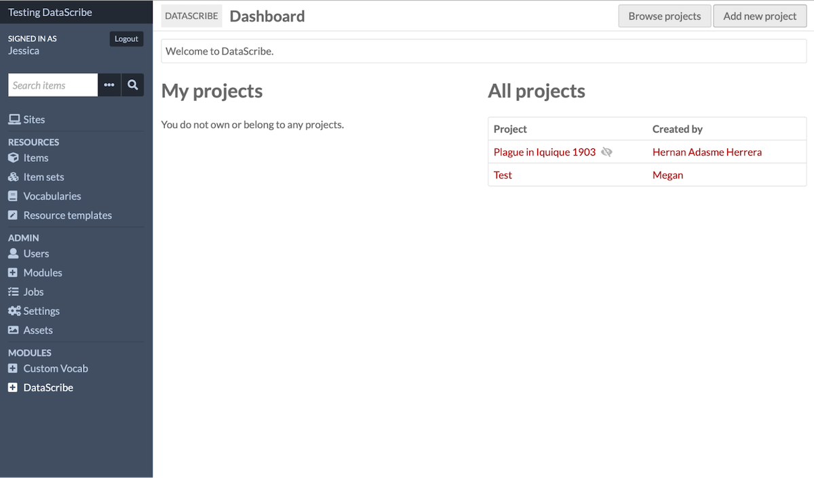

All projects are required to have a name, which you set up in the “Configuration” tab (and can edit later). You may also optionally give your project a description. 

You must decide whether your project is going to be public (visible to other people on the installation) or private. There is a crossed eye icon next to the “Add” and “Cancel” buttons - clicking it will allow you to toggle private mode off and on again. The default mode is private.

Next you need to add users to a project. If you are both creating the project and working on the project, this step will include adding yourself as a user, even if there is no one else working on the project with you. Despite being project owner, you are not automatically made a user on the project. This means that projects may be set up by people who are managing the Omeka S install but are not necessarily part of individual project teams.

On the right hand side of the screen will be a menu that displays all the users in the Omeka S installation. You can either use the alphabet menu items (expandable by clicking the triangle) to browse and find users or you can use the “Filter users” field to search for users by name. Once you find a user you want to add, you click on their name to add them to the project.

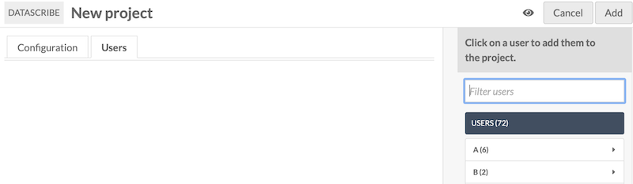

Once you have added a user to the project, you need to set their project role. All users are automatically started as Transcriber and there is a dropdown menu that can be used to change their project role to Reviewer if necessary.

Add yourself if you plan to use your current user account to work as either a transcriber or reviewer. If you are a Supervisor or Global Admin and only plan to administer the project, you don't need to add yourself - you will always have access to all projects on the installation. 

Complete the process of adding a project by clicking the “Add” button in the upper right hand corner. This adds the project to DataScribe and will redirect you to the new project dashboard.

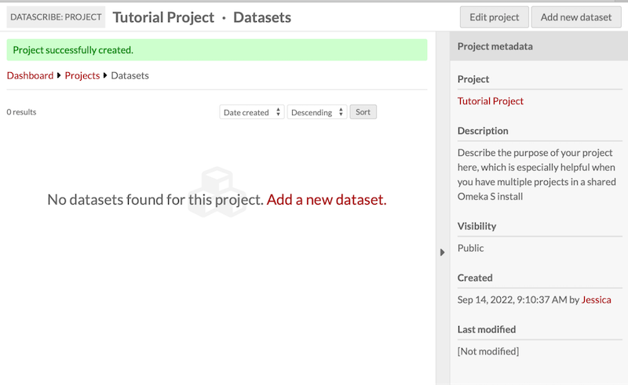

You will see a green banner across the top of your screen letting you know that the project was successfully created.  From here you can use the “Edit project” button in the top right hand corner to go back and change any of the project details you initially set up or to add additional users. Alternatively, you can move to the next stage of project building and add a new dataset.

## Build a form

Forms provide the framework for the structured transcription in DataScribe. When building forms for your datasets, take some time to look at your sources and think about how you want to organize your forms. With some sources, it might be worth creating multiple forms to capture distinct subsets of data on the same page.

DataScribe uses Omeka S item sets as the basis for datasets. Datasets are a group of documents with the same data framework (table structure, set of rows and columns, etc). A dataset might capture all of the information recorded on a historical document, or only part of the document. Each dataset has one transcription form.

You will need to create a unique item set for each form type you intend to create. For example, if you have data with variations over time - like the Bills of Mortality or the US Census - you will need to create different item sets for each variation in the form which you want to capture.

This tutorial will walk you through the process of planning and creating a form from a historical source with structured data. The tutorial uses [Gore’s Liverpool Directory for 1860](https://archive.org/details/goresliverpooldi1860lond){target=_blank} as its example, but you should be able to substitute your own sources if you wish.

### Assess the source

Before you start creating your form in DataScribe, look through the source and ask these questions:

-   What information do I need to capture for the analyses I want to do?
-   What outputs will be most helpful for that analysis?

Go through the original source. Write down all of the possible data points on the page. Then decide which ones are relevant to your questions and therefore need to be included on your form(s).

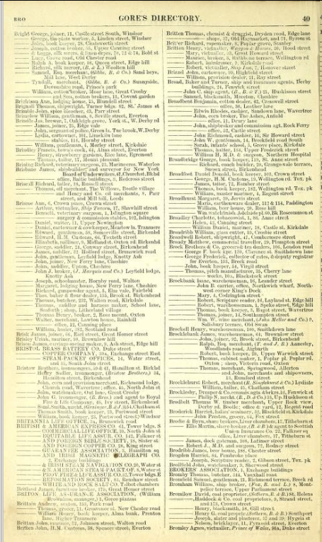

In this page from the _Gore's Liverpool Directory_, there are at least 11 potential data points: page number, last name, first name, listing type (person, business, etc), description, street number, street name, other address information, second address street number, second address street name, other information for second address. How you organize these is up to you and can be guided by your research questions.

### Match data points and form fields

You will be building your form in DataScribe, which has a defined set of options for fields.

|Field |Input type |Options|
--- | --- | --- |
|Checkbox |Checkbox | Set box checked by default|
|Date|Dropdown menus|Set minimum and maximum year. Set default year, month, and/or day|
|DateTime|Dropdown menus|Set minimum and maximum year. Set default year, month, day, hour, minute, and/or second|
|Number|Numbers only. Decimals with a point, not comma.|Set minimum and maximum value.|
|Radio|Click a radio button|Enter options for the radio button by entering each one on a new line|
|Select|Dropdown menu|Enter options for the select button by entering each one on a new line|
|Text|Single line text entry|Set a minimum or maximum length|
|Textarea|Large text area|Set the number of rows for the field’s height
Time|Dropdown menus|Set default hour, minute, and/or second|

In addition, you can set any field as required. If a transcriber leaves a required field blank, DataScribe flags that record as invalid.

One field must be designated as the primary field, which acts as the identifier for the record.

Use the worksheet or your own document to decide what fields you want to use for when building your form or forms. You may need to create multiple forms to best capture data from a source.

One form for the example page could be as follows:

| Data in source | Field type      | Optional settings | Notes |
| :----------------|:----------------|:------------------|:----- |
| Name (R, P)  | Text            |                   | Separate into first and last? Or one field for both? |
| Listing type  | Select or radio |  | Individual, business, organization, etc. |
| Descriptor     | Textarea        |                   | Write as given in the directory, so "insurance agents" or "jun. tobacconist"  |
| Street number  | Number          |                   | If given |
| Street name    | Text            |                   | Can concatenate with number in export |
| Area           | Text or select  |                   | Is this standardized enough to make a select field? |

Note: Required fields marked with R. Primary fields marked with P.

### Build a form using your plan

You can build a form for your dataset when adding or editing the dataset. On the form builder tab, use the plan you wrote as a guide for adding field blocks to the form.

This image shows the form outlined above in the process of being created. The user has saved the form at least once, which is why the `Name` and `Listing type` fields have the right label instead of just `New field`. The block for descriptor is open to show the guidance which has been added to the field description, as suggested in the notes above.

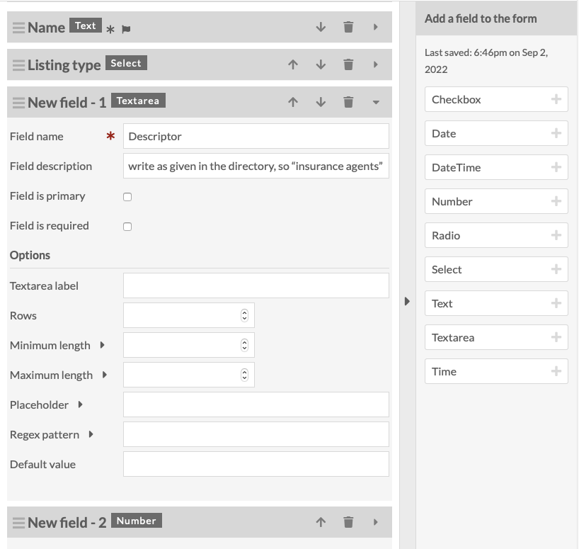

### Import and export forms

In a DataScribe project you may need to use the same or similar forms for multiple datasets. Rather than making the same form over and over, you can export the form from an existing dataset and reuse it. This is particularly helpful when you have longer forms.

Note that you can only import a form when you are adding a new dataset. You can’t import a form to an existing dataset. 

<iframe src="https://player.vimeo.com/video/1192402311?badge=0&amp;autopause=0&amp;player_id=0&amp;app_id=58479" frameborder="0" allow="autoplay; fullscreen; picture-in-picture; clipboard-write; encrypted-media; web-share" referrerpolicy="strict-origin-when-cross-origin" style="position:absolute;top:0;left:0;width:100%;height:100%;" title="Export and Import Forms in DataScribe"></iframe>

#### Export a dataset form

Go to the dataset where you have already built the form you want to use or modify. Scroll all the way to the bottom of the dataset page. In the right hand drawer there is a heading for “Export form”. Below the heading is a link with the text “Click to export form (JSON)”.

Click on the link to download the form. The default title for any exported form is "form_export": if you plan on using the form more than once, or are going to export multiple forms, rename the file when downloading.

#### Import a dataset form

You can **only** import an existing form when creating a new dataset.

Remember that a dataset is based on an item set, so organize your applicable items into an item set, then create a new dataset based on that item set, and import the form during that creation process. 

Create a new dataset that will use the same form you exported earlier. Add information for the title (required) and select an item set to use. If you do not add guidelines when creating the dataset, be sure to add some in the future.

Towards the bottom of the "Add Dataset" form, there is an option to import a form. Click the button. Then, using your browser’s file manager, find the form file you have already downloaded. Be sure to save. Click “Add new dataset”.

When you go in to edit your new dataset, you should now see the form you imported. From here, you can also add, delete, or modify fields as needed for this specific dataset.

## Sync a dataset

<iframe src="https://player.vimeo.com/video/1192402310?badge=0&amp;autopause=0&amp;player_id=0&amp;app_id=58479" frameborder="0" allow="autoplay; fullscreen; picture-in-picture; clipboard-write; encrypted-media; web-share" referrerpolicy="strict-origin-when-cross-origin" style="position:absolute;top:0;left:0;width:100%;height:100%;" title="DataScribe - Sync Dataset"></iframe>

Syncing updates the dataset with the items currently in the Omeka S item set. Make sure you synchronize your datasets and item sets frequently, especially any time items are added or removed from the item set in the Omeka S installation.

For example, you may have started a project and created a form to match an item set full of similar-seeming items, such as pages from the Census. Then you find that there is a change to the format of each page at some point in time. You can create a second item set, move the later items from the first item set to the second, copy (export and re-import) your first form and modify it to accommodate the second format you've discovered, sync the project to show the current items in each item set, and continue transcribing the later items. 

Once you have created the dataset, you will be taken to the dataset browse page. A message should appear in the main work area which says “No items found. Sync this dataset.”

To sync your dataset you have two options.

First, you can click the phrase ”Sync this dataset” located at the center of the Dataset dashboard, and then click again in the right hand drawer to confirm the syncing. The first sync will populate the dataset with items from the source item set.

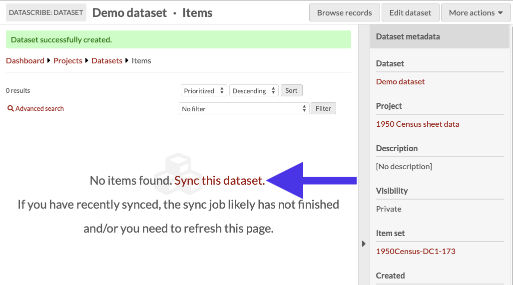

Second, you can use the "More actions" dropdown menu located in the upper right corner of the window and select the “sync dataset” option. This action is always available, even after you have begun transcribing the items in the dataset.

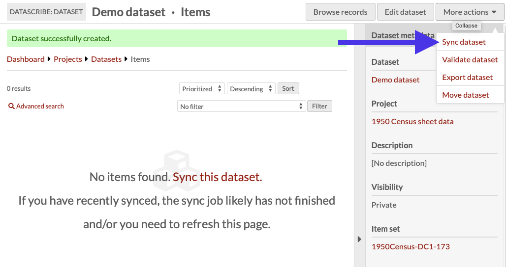

Refresh the dataset’s page to check the items. The syncing process updates the dataset to match the items in the source Omeka S item set. 

Be aware that any items which have been removed from the Omeka S item set will be deleted from the DataScribe dataset, along with any records which have been created for those items.

Finally, remember that syncing does not send any information from DataScribe to Omeka S. DataScribe data (saved in forms) stays in the module's own database entries, and does not transfer into visible metadata on Omeka S items. 

## Transcribe an item

[There is more detailed information about transcribing on the wiki](https://github.com/omeka-s-modules/Datascribe/wiki/Transcribing-data){target=_blank}.

To begin transcribing, go to the Items page of your dataset. You will see all the items in that dataset. Once you filter items "locked to me", you are able to click on any one of those items.

You will be led to the Records page. Records of transcriptions will be in the center of the screen. On the right side of the screen there are Item Actions with the lock status, meaning only the reviewer and the person it is locked to can edit it. In the top right corner, click on "Add New Record".

### The transcribing screen

The center right contains your form to fill out according to the image on the center left of your screen. An asterisk means that field is a required field to fill in.

Under "Guidelines" there are specific instructions that the project manager can leave for transcribers to follow as they are working.

On the right side of the screen there is a panel called "Record actions", for extra notes for transcribers or reviewers.

On the top left there are three buttons to adjust the screen for better workflow. ‘Enable Focus Mode’ allows you to remove side panels from view while transcribing. ‘Fast Entry Mode’ removes extra check boxes from the form. The third button is a layout modifier: you can choose horizontal view (image side-by-side with form) or vertical (image above form).

In the top right corner, click ‘"Save And..." to either stay on the record if you save periodically or return to the records page.

Back on the records page, there is a drop-down menu on the right-side panel under Item Actions for "Submission Status". Click on that to select "Submit For Review" and you are done.

<iframe src="https://player.vimeo.com/video/1192402313?badge=0&amp;autopause=0&amp;player_id=0&amp;app_id=58479" frameborder="0" allow="autoplay; fullscreen; picture-in-picture; clipboard-write; encrypted-media; web-share" referrerpolicy="strict-origin-when-cross-origin" style="position:absolute;top:0;left:0;width:100%;height:100%;" title="How to Transcribe with DataScribe"></iframe>

### Transcribe non-digitized sources 

[See the tutorial on the wiki](https://raw.githubusercontent.com/wiki/omeka-s-modules/Datascribe/Site-docs/resources/tutorials/nondigitizedsources.md){target=_blank}.

## Review transcriptions

[There is more detailed information about reviewing transcriptions on the wiki](https://github.com/omeka-s-modules/Datascribe/wiki/Reviewing-transcriptions){target=_blank}.

Reviewers check transcriptions after transcribers complete the transcription on a DataScribe item and submit it for review. You will either approve the transcription or send it back to the transcriber to correct.

There are multiple ways to find the records for review. The easiest way is to look under My Projects and select All Items needing review under the dataset you wish to review. Once you reach a dataset page, you can filter for items that need review.

As a reviewer, you will see all the filter options available to transcribers as well as “Items that need review” and “Items that I reviewed.” Select the “Items that need review” option, click the Filter button to see only the items that need review.

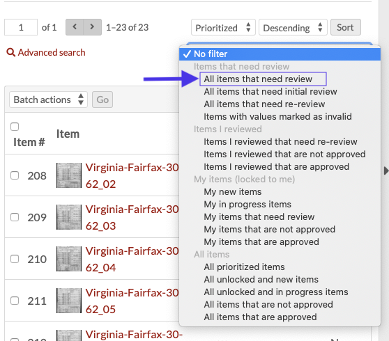

You can sort these items based on title, the date the item was submitted for review, the item’s review history, and if the item is prioritized or not.

Once you find the item to review, select the item title to view the records page. Your project guidelines should determine the relationship between records and items.

A red exclamation point icon next to any record number indicates a problem with the required fields in the records. Other transcription issues, such as misspellings, accidentally skipping over fields, or illegible sections require you to check the entire form.

It is possible to scroll through the record table to see the entries without the item image, but this depends on the level of review the project guidelines require.

At this point, reviewing a transcription is a lot like transcribing one. Click the pencil icon to go to the DataScribe form.

You can check Needs Work and leave notes on the record. If you are transcribing multiple records per item, the Record actions on the right-hand side will let reviews mark the specific record.

You can leave notes on the item level under Item Actions. From here, you will click “save… and return to records.”

Setting a Review status for the item is your last step. The item must be set either `approved` or `not approved`. Under the Review status, select “Mark as approved” or “Mark as not approved”.

If the item is not approved, you should leave a note in the item or record to direct the transcriber on what issues to correct and to mark only the areas in need of review when the item is resubmitted.

Click “save” to ensure your changes are saved.

<iframe src="https://player.vimeo.com/video/1192402312?badge=0&amp;autopause=0&amp;player_id=0&amp;app_id=58479" frameborder="0" allow="autoplay; fullscreen; picture-in-picture; clipboard-write; encrypted-media; web-share" referrerpolicy="strict-origin-when-cross-origin" style="position:absolute;top:0;left:0;width:100%;height:100%;" title="DataScribe- How to Review"></iframe>

## Export a dataset 

You can begin exporting your dataset as soon as you have at least one approved item. First you need to validate the dataset. To do this, go to the “More Actions” dropdown in the upper right-hand corner of the browser window. Select “Validate dataset”.

When you click this option, a drawer opens up explaining what the validation does. To validate the dataset, click the button in the drawer. You can refresh the page and check the timestamp of the most recent validation in the Dataset Metadata drawer to ensure that it has run properly.

<iframe src="https://player.vimeo.com/video/1192400871?badge=0&amp;autopause=0&amp;player_id=0&amp;app_id=58479" frameborder="0" allow="autoplay; fullscreen; picture-in-picture; clipboard-write; encrypted-media; web-share" referrerpolicy="strict-origin-when-cross-origin" style="position:absolute;top:0;left:0;width:100%;height:100%;" title="DataScribe - Export Data"></iframe>

Once the data is validated, you can export your dataset. From the “More actions” dropdown, select “Export dataset.” Click the export dataset button and wait for the job to finish. You can see the timestamp of the last export in the Dataset metadata drawer.

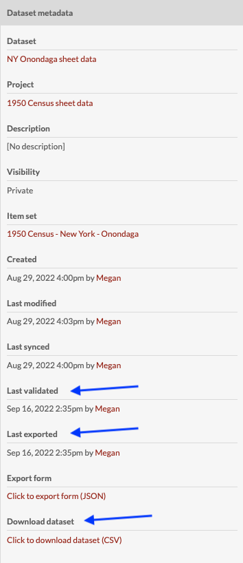

To access the export, use the “Click to download dataset (CSV)” link at the bottom of the dataset metadata sidebar. If you click the link, it will open the csv data in your browser window. To save the file right-click or control-click and use your browser’s menu to save the linked file to your computer.

Every DataScribe export has columns for the Omeka item number, the DataScribe item number, the DataScribe record number, and the DataScribe record position.

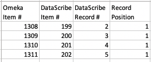

## Import an existing dataset 

[See the tutorial on the wiki](https://raw.githubusercontent.com/wiki/omeka-s-modules/Datascribe/Site-docs/resources/tutorials/reimportdata.md){target=_blank}.
