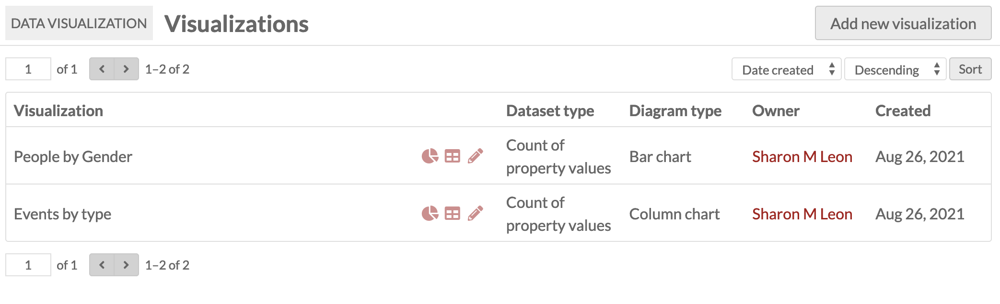
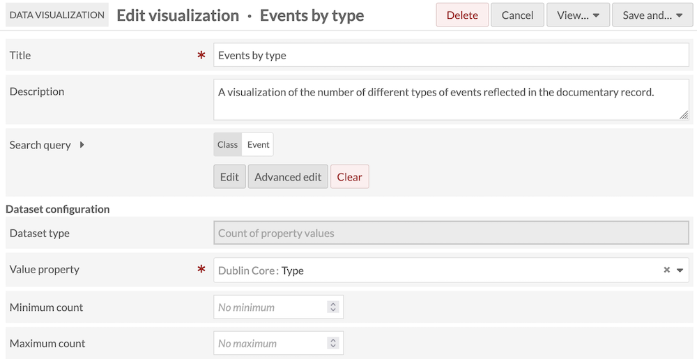
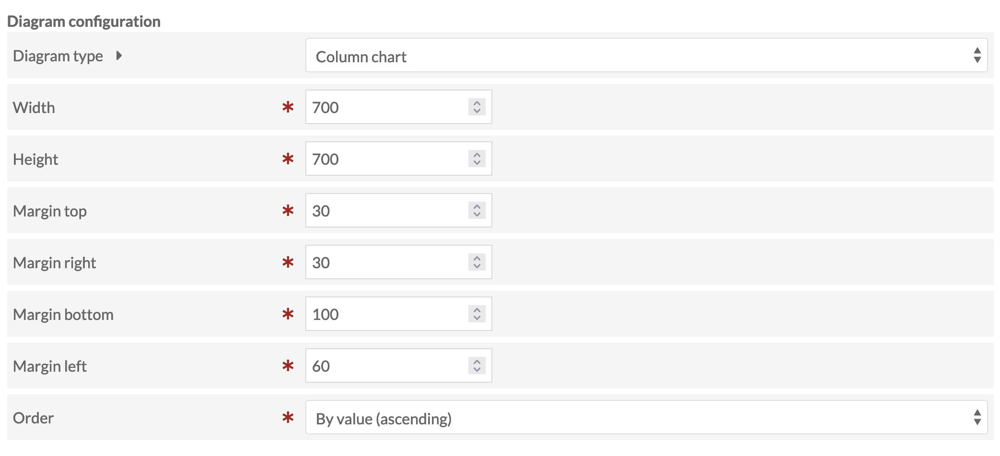
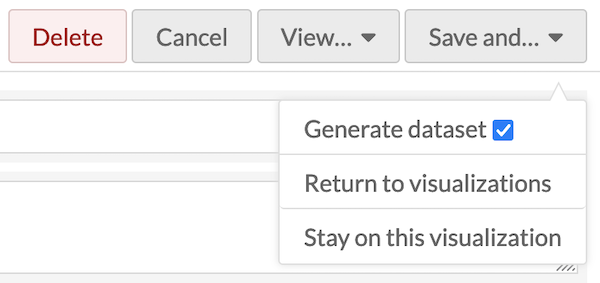
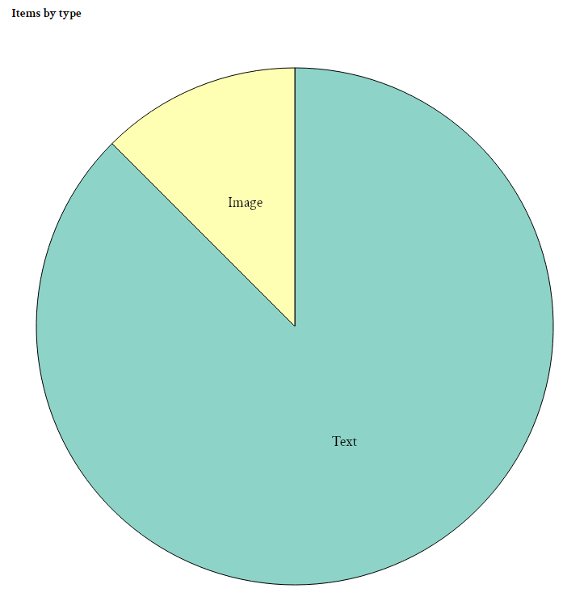
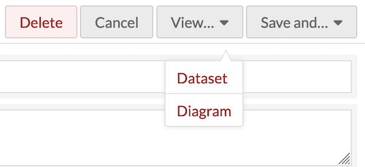
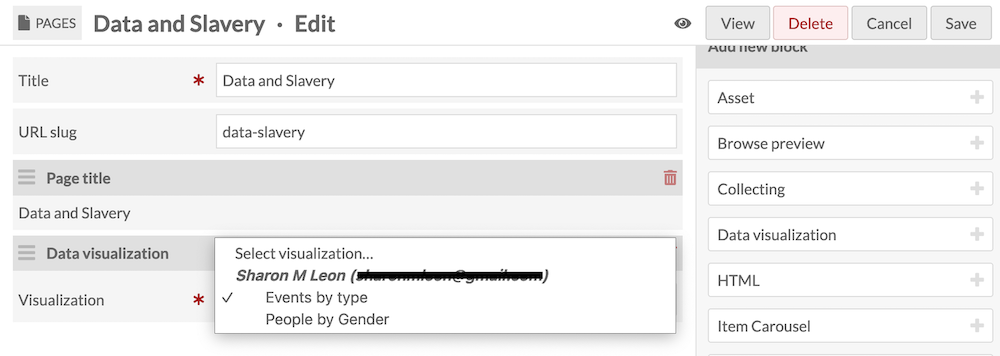

# Data Visualization

The [Data Visualization module](https://omeka.org/s/modules/Datavis){target=_blank} allows site administrators are able to generate datasets and render diagrams that reflect their data. Once installed and activated on the Modules section of the admin dashboard, Data Visualization is managed on a site-by-site basis. You can add your data diagrams to site pages using page blocks.

## Data visualizations by site
If the Data Visualization module is active, a section for Data Visualization will appear in the menu for individual sites. Clicking this link will take you to a list of all visualizations created for the site. 

You can sort the visualizations by either date or title in ascending or descending order. You cannot batch-edit visualizations, including deletion, nor can you duplicate existing visualizations or copy them to other sites.

### Adding a data visualization
After clicking the Data Visualization link under a site, you can create a new visualization by clicking the "Add new visualization" button.

You will then have the option select what you would like to visualize. The five options include:

1. **Count of items in item set**, which visualizes the count of items that are assigned to selected item sets.
2. **Count of items with classes**, which visualizes the count of items that are instances of selected resource classes.
3. **Count of items with properties**, which visualizes the count of items that have selected properties.
4. **Count of items with property values**, which visualizes the count of items that have selected values of a selected property.
5. **County of property values**, which visualizes the count of values of a selected property.

Once you select what you would like to visualize, click the "Next" button. You will then be on the "Add visualization" page, where you can describe and configure visualization.

- Each visualization requires a Title.
- You may add a prose Description of the visualization.
- Use the Search Query interface to set the pool if resources to visualized. To input a search query, select either the "Edit" button or the "Advanced edit" button. If you choose to leave this blank, the visualization will incorporate all items assigned to that site.
    - If you select "Edit", a sidebar will open allowing you to search full-text, search by value, search by class, search by template, search by item set, or search by owner. You can either "Preview", "Reset", or "Apply" your search by selecting the corresponding button at the bottom of the search sidebar.
    - If you select "Advanced edit", you will only need to fill in the provided textbook. To save your search query click "Apply", or you can "Cancel" your search.

#### Data configuration
The options for data configuration will reflect the "Dataset type" you selected initially:

##### Count of items in item sets
If you are creating a count of items in a item set, you will be able to select the item sets by clicking inside the item sets box and selecting from the dropdown menu. If you do not complete this step, you will receive an error when attempting to generate your data set.

##### Count of items with classes
If you are creating a count of items with classes, you will be able to select the classes by clicking inside the classes box and selecting from the dropdown menu. If you do not complete this step, you will receive an error when attempting to generate your data set.

##### Count of items with properties
If you are creating a count of items with properties, you will be able to select the property by clicking inside the "Property" box and selecting from the dropdown menu. You may add more than one property. If you do not complete this step, you will receive an error when attempting to generate your data set.

##### Count of items with property values
There are two fields you need to complete under "Dataset configuration" when creating a count of items with properties: "Value property" and "Values". First, you must use the drop down menu to select the value property from the dropdown menu. Then, you can enter the specific values, separated by new lines, into the textbox. If you fail to fill out either of these fields you will receive an error when attempting to generate your data set.

##### Count of property values
When configuring your data set for counting property values, you must select a value property from the dropdown menu. If you do not complete this step, you will receive an error when attempting to generate your dataset. There are additionally two other optional configuration fields: "Minimum count" and "Maximum count." You can set the minimum and maximum counts by either typing the desired number or using the up and down arrows on the right side of the box.

#### Diagram configuration
Under Diagram Configuration, you will be able to select the kind of diagram you would like to produce for your visualization. Options include bar chart, column chart, and pie chart.

If you select **bar chart** or **column chart**, you will be asked to input the width and height of your visualization as well as the top, right, bottom, and left margins. Additionally, you will be able to use a dropdown menu to order your data by value (ascending), by value (descending), by label (ascending), or by label (descending).

If you select **pie chart**, you will only be asked to input the width, height, and margins.

If you edit your visualization to change the Diagram Configuration after your initial visualization is produced, you will lose your current diagram configuration.

You can only generate one diagram per dataset; if you wish to present multiple diagrams of the same information, create more visualizations with the same queries and settings.

## Generating your visualization
Once you have configured your visualization, click the "Save and..." button, select the box to "Generate dataset" and click "Stay on this visualization."

Once your visualization is complete, you can click the "View..." button and select "Dataset" or "Diagram."

If you select "Dataset," a new browser tab will open that displays your dataset in JSON.

If you select "Diagram," a new browser tab will open to a new public page on your site, containing your diagram. This page will continue to be publicly available on your site as long as the visualization exists, but you don't need to link to it from anywhere. You can insert your visualizations as page blocks instead (see below).

If the text is cramped in the axes of your graph, go back and adjust the margins.

You can save your work and select "Return to Visualizations," which will bring you to a browse list of all of your visualizations, where you can view the diagram or dataset, or edit the visualization.

## Publishing your visualization
Data Visualizations are published by adding them to site pages, as page blocks.

To a new or existing page, add a "Data visualization" block. In the new block, use the dropdown menu to select the visualization you would like to add to the page.

Then, save the page edits. To remove the block, click the trash can icon in the block heading.

