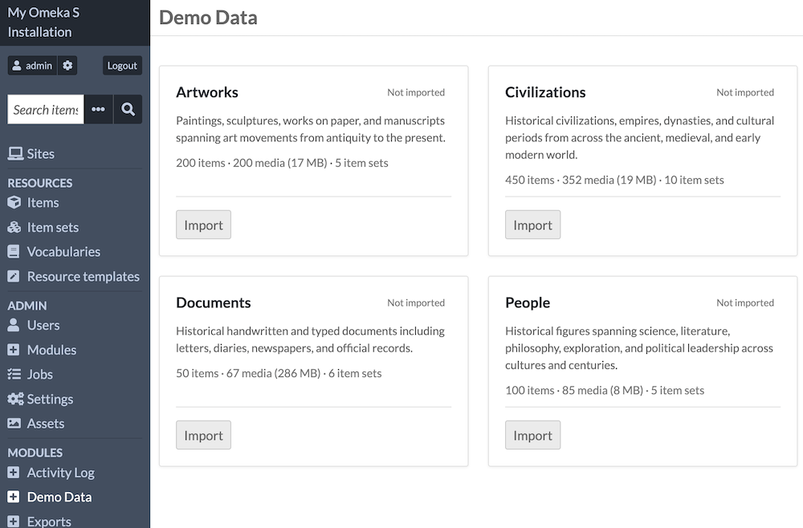
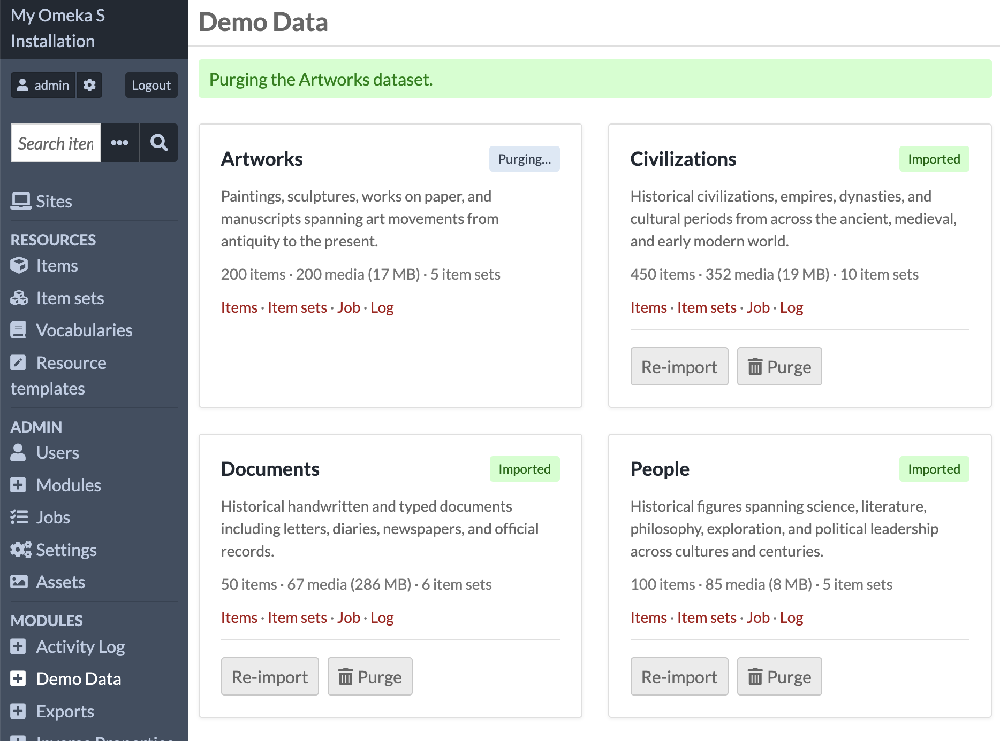

# Demo Data

The [Demo Data module](https://omeka.org/s/modules/DemoData){target=_blank} imports sample datasets of Omeka S items for development, testing, and evaluation. The datasets use realistic cultural heritage content to demonstrate the breadth of Omeka S's data model — vocabularies, resource classes, value types, media, and modules working together across four distinct domains.

Demo Data provides data in formats supported by other modules. The [Numeric Data Types](NumericDataTypes.md) module is optional; when active, date, duration, interval, and integer fields are stored as structured numeric values rather than plain text. The [Mapping](Mapping.md) module is optional; when active, geographic coordinates are displayed as map markers.

The interface for this module is only available to users at the Global Administrator and Supervisor levels. Resources created will be available to all users, but ownership will be the user that imported the dataset. 

## Using Demo Data

Upon installation and activation, "Demo Data" will appear as an option under the "Modules" section of the left-hand sidebar in the administrative dashboard. 

The administrative screen of "Demo Data" offers information on the four available sample datasets. Each is described with a short summary, and the number of items, media, and item sets that will be created in your installation. Each dataset has an "Import" button. 

When an "Import" button is clicked for any of the datasets, an indicator will appear to show that the dataset is importing. You can then click on the "Job" or "Log" links to keep track of the background process.

You can refresh this page by clicking again on the "Demo Data" link in the sidebar. When the import is finished, the dataset will show "Imported" in green beside the data title. 

Links are now available to see the Items and Item sets created for this dataset. 

!!! note
	Imported resources will not be added to any sites. Users can manually add the items to a site to view their display on the public side of Omeka.  

You will now have "Re-import" or "Purge" buttons available for each imported dataset. 

Purging a single dataset will remove the related resources from your installation, but the module is still occupying storage space on your server. Purging will remove the related resource template of each dataset as well as all its resources. 

x

### Uninstalling

The module requires storage space of roughly 220 megabytes. This is by far the largest Omeka Team module. It is intended to provide Omeka S users with sample items for learning various features. When you are done with it, it should be both uninstalled in the interface and manually deleted from the `/modules` folder of your server to free up storage space. 

Note that the module imports a "Demo Data" vocabulary when it is first installed. This exists in your installation whether you have imported a dataset or not. This vocabulary is removed when the module is uninstalled, along with all other resources and resource templates. You do not need to purge datasets before uninstalling the module. 

## Datasets

Each dataset creates its own item set(s) and resource template on import. Re-importing a dataset fully replaces the previous data.

| Dataset | Items | Media |
|---|---|---|
| Artworks | 200 | 200 |
| Civilizations | 450 | 450 |
| Documents | 50 | 62 |
| People | 100 | 100 |

You can find the resource templates created under the names "Demo Data: [Dataset]".

### Artworks

This dataset is roughly 17MB. 

Paintings, sculptures, drawings, and manuscripts spanning antiquity to the 20th century, organized by movement and period. Exercises resource templates with alternate property labels, URI identifiers, numeric date values, map markers, inter-item links, and media with title and creator property values. 

### Civilizations

This dataset is roughly 47MB. 

Historical polities — kingdoms, empires, dynasties, and cultural periods — from across the ancient, medieval, and early modern world. The largest dataset at 450 items. Exercises all four NumericDataTypes (timestamp, duration, interval, integer), map markers with bounding boxes, inter-item links, and media with title property values.

### Documents

This dataset is roughly 174MB. 

Historical handwritten and typed documents including letters, diaries, newspapers, and official records from the 15th through 20th centuries. Several items have multiple media files representing individual pages of a multi-page document; each page carries a title property value. Includes large TIFF and PDF files.

### People

This dataset is roughly 14MB. 

Historical figures spanning science, literature, philosophy, exploration, and political leadership across cultures and centuries. Exercises value annotations (approximate birth and death dates flagged with a qualifier value), language-tagged title values (native-language names in 15 languages), URI identifiers, numeric date values, map markers, and media with title property values.
