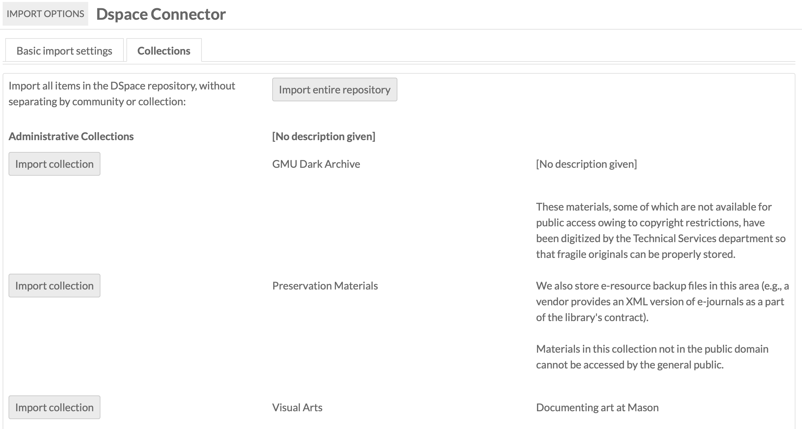
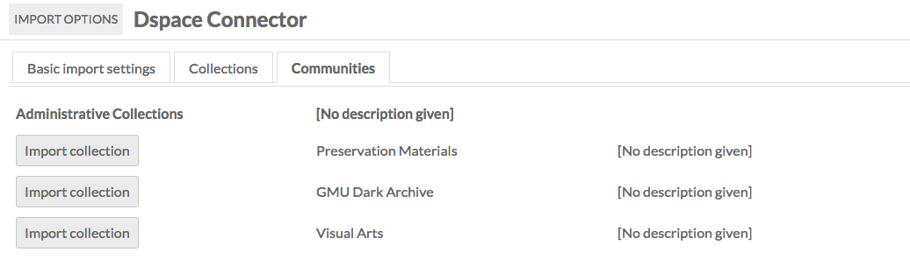
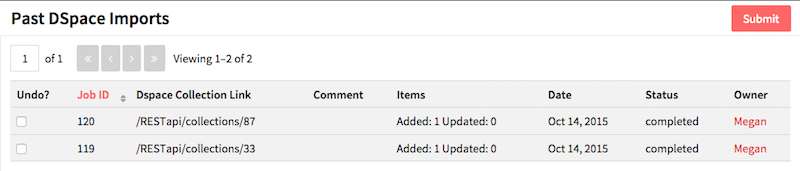

# DSpace Connector

DSpace Connector is a [module](index.md) for Omeka S which allows you to connect an Omeka S instance to a DSpace repository to import items from that repository. In addition to importing information, the Omeka S item will include a link back to the original item.

To install DSpace Connector, follow the instructions for [Installing Modules](index.md#installing-modules) on the Modules documentation.

Note that DSpace Connector only works with DSpace versions 4 and higher.

You can view past imports by going to the DSpace Connector tab on the left-hand navigation of the admin dashboard and clicking the *Past Imports* sub-tab.

## Import Data
To use DSpace Connector, navigate to the tab labelled *DSpace Connector* on the left-hand navigation of the admin dashboard. 

To import from a DSpace Repository: 

On the first form, enter the following information: 

* *DSpace site URL* for the Repository - note that you have to enter the entire url, including the `http://` (required);
* *Endpoint* for the api (required. by default this is "rest" but may be changed in the DSpace instance);
* *Limit* or maximum number of results to retrieve at once. 

Then click *Get collections and communities*

If the information above has been correctly entered, you will proceed to the DSpace Connector Import Options page. This has three tabs. 

### Basic Import Settings
This tab has three options:

* *Import files into Omeka S*: click this checkbox to import files in addition to metadata.
* *Item Set*: select an item set from the dropdown into which to import the items. 
* *Comment*: for any comments you have.

 

### Collections and Communities
These tabs will display the list of collections and communities, respectively, for the DSpace repository. You can only import one collection or community at a time.

To import a collection or community, click the Import button to the left of its name. This will automatically begin the import.

You can track the status of the import by navigating to the DSpace Connector > Past Imports tab or on the [Jobs](../admin/jobs.md) tab of the left-hand navigation on the admin dashboard.

- Are your jobs starting and not completing? You might need to [set the path for PHP](../configuration/) so that your system can perform the background process to make the items.

## Review Imports
Go to the DSpace Connector tab on the left-hand navigation of the admin dashboard, click on DSpace Connector and then click on Past Imports, which should appear below the DSpace Connector tab.

This page displays a table of Past DSpace Imports, with a checkbox option to *Undo*, the *Job ID* for the import, the repository’s *Dspace Collection Link*, any *Comments* made during import, the number of *Items* imported, the *Date* of the import, the import *Status*, and the *Owner*, or user who initiated the import.

## Update Imported Resources
To update resources created using the DSpace Connector, simply re-run an import from the same source. The resources will be updated, not reimported. This allows you to use the Connector to synch data between your DSpace and Omeka S installations.

## Undo an Import
To undo a completed import and remove all associated items, go to the DSpace Connector tab on the left-hand navigation of the admin dashboard, click on DSpace Connector and then click on Past Imports, which should appear below the DSpace Connector tab.

Check the box for each import you wish to undo and click submit. The 

