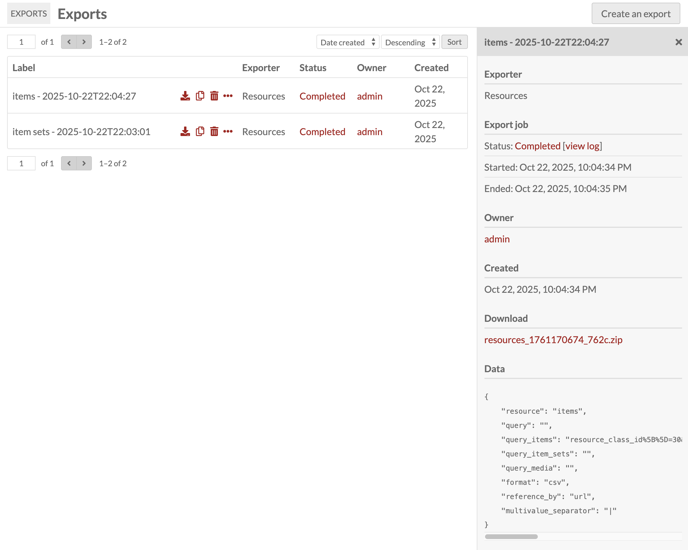
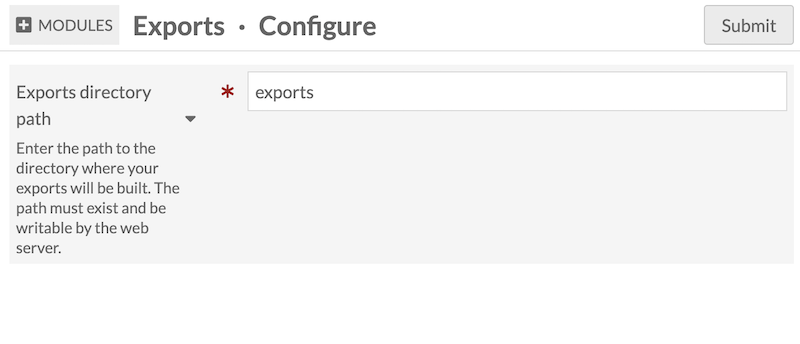
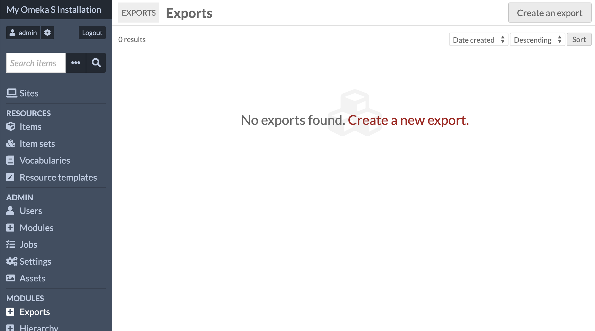
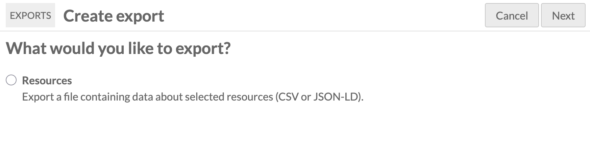
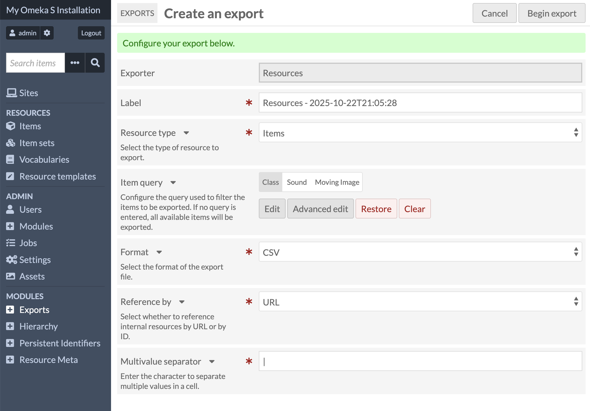
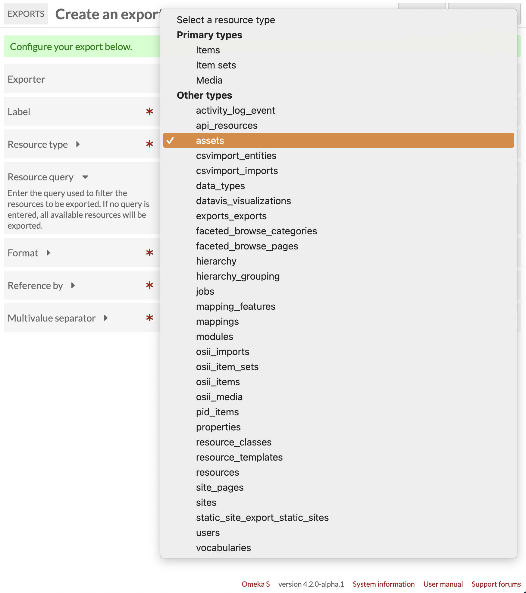
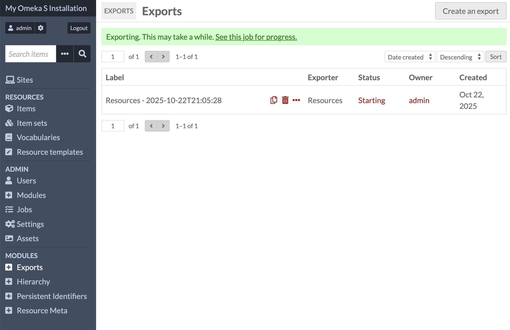

# Exports

The [Exports module](https://omeka.org/s/modules/ExtractText){target=_blank} will create an export of information about your Omeka S installation's resources, assets, and more. The module can generate CSV or JSON-LD files with both metadata and internal information about your items, item sets, or media, as well as resource templates, vocabularies, assets, jobs, sites and site pages, users, and information added by modules. 



## System requirements

The module requires two folders inside your installation to be writeable. One is a temporary folder where the export files are assembled, and is set in your configuration. The other is the permanent place where the export output will be stored and made available for you to download. This folder will be inside the `/files` folder of your installation, called "exports". 

The module will not create `/files/exports` upon installation, but when you start your first export. If you encounter errors, you may need to either change permissions on your `/files` directory to allow this creation, or manually create the `/files/exports` directory and set its permissions. 

### User permissions

This module can be used by any user at the Author level and above. Researcher-level users can view the table of past exports but not generate new exports. 
Users can export information about private resources (sites, pages, items, item sets, etc. without visibility) using this module. 

## Configuration



On this page you must set a folder on your server, inside your Omeka S installation directory, for the temporary export files to be created. Enter in the path relative to your installation's location. 

You must create the directory first on your server, and set its permissions to writeable, before you save this page. The module will check that the folder exists and is writeable when you save the page, and give an error message if there is a problem. 

## Export resources



Find the "Exports" entry in the "Modules" section of the sidebar, and then click "Create an export" in the top right corner to set up your export. 



At this time the screen only offers one option. Future or third-party versions of this module may add more exporting options. 



On the next page you will set up your export to pull information from your chosen entries in the installation database. 

**Label**: While the module fills in a default name for this export, you can specify something easier to remember, such as the type of information you are exporting. 

**Resource type**: Select one type of information to export. The three main types of resources you can choose are items, item sets, or media. You can use a query to filter specific types of these resources, such as by resource template, class, metadata value, etc. 

You can also choose other information in the databse of your installation, including data stored by modules. This can include information about past imports from CSV Import or Omeka S Item Importer, hierarchies from Hierarchy, vocabularies, resource templates, and more. 



The options, excluding additional options added by modules, include:

- Primary types:
	- Items
	- Item sets
	- Media
- Other types:
	- API resources
	- Assets
	- Data types
	- Jobs
	- Mappings
	- Modules
	- Properties
	- Resource classes
	- Resource templates
	- Resources
	- Site pages
	- Sites
	- Users
	- Vocabularies.

**Item query, or Resource query:** Once you have chosen an option to export, you can narrow the results with queries. You can build a query using the selector sidebar for resources (items, item types, and media). For other resource types you can manually enter in a text query. For example, you can enter the following to narrow down your assets according to the owner:

```
owner_id=2
```

**Format**: You can export information into a CSV or into a JSON-LD file (file extensions `.csv` or `.json`). Either choice will come wrapped in a ZIP file for download. 

** Reference by**: This field is an option for CSV exports. For resources, you can either fill fields with absolute URLs (such as "https://yourinstallation.org/api/items/123") or with internals IDs only. This will affect fields for files, such as the fields with media derivatives (which might look like "https://yourinstallation.org/files/large/123abc.png").

**Multivalue separator**: This field is an option for CSV exports. The default character is a vertical pipe (|) character. You can change this if desired. Other common separators include commas and semi-colons; we recommend choosing a character that does not appear in the dataset. 



Once you start the export, you will be returned to the table of past exports. You will see a green bar at the top of the screen indicating that the job has begun, with a link to watch the job's status. If you refresh this page, you will see the table with the export status indicated. You can also find this information on the Jobs page accessible in the sidebar. 

## The Exports table


When an export is complete, you will see a download icon in the table row that, on click, will download a ZIP file containing the export you specified (a CSV or JSON file). 

Once you have created exports, you can view information about them by clicking the ellipsis (three dots) icon in the table row. This will open up a sidebar where you can review the settings you used. 

You can re-run an export with the copy (two identical pages) icon, or delete its record from the installation database (and any files it created) with the delete (trashcan) icon. This will bring up a confirmation window. 

## Exported files

The module will output all metadata associated with the chosen resource type, including internal information such as the item owner and links to all the attached media and their derivatives. 

You will see, if you export a CSV, column headings such as `dcterms:title:literal` (the metadata vocabulary, field, and data type), as well as internal values `o:id`, `o:owner`, `o:is_public`, `o:created`, etc. 
