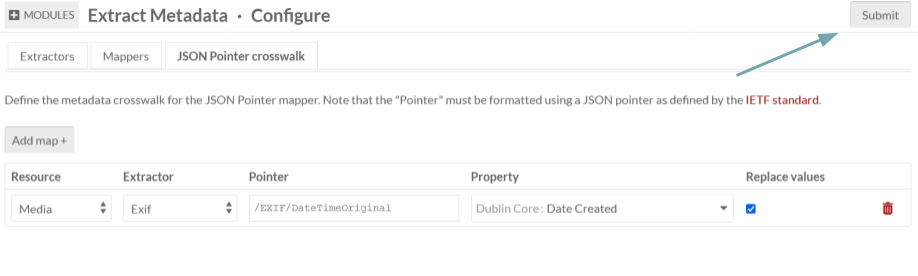
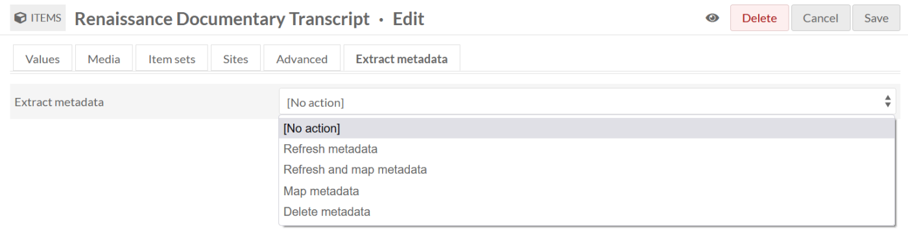
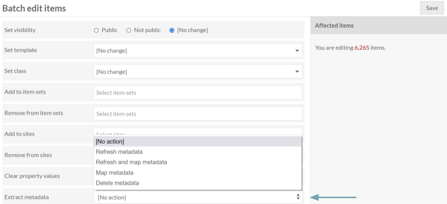

# Extract Metadata

The [Extract Metadata module](https://omeka.org/s/modules/ExtractMetadata) allows site administrators to extract embedded metadata from media files. 

The module adds a new "Extract metadata" tab to each media page, which will allow you to manually extract any embedded metadata found on the file. It also adds an "Extract metadata" field to the batch-editing page. When enabled, it automatically works on newly uploaded files. 

A good workflow is to install and configure the module, batch-extract metadata from existing files in your database, map them to your chosen media metadata fields, and then simply allow the module to continue extracting metadata from files in the future.

## Configuring the module

When configuring the module, you can:

- View and enable/disable extractors: You can choose from five different extractors, including ExifTool, Tika, Exif, getID3 and OHMS (see below).
- View and enable/disable mappers: You can either select to enable no mappers or JSON Pointer.
- Configure the metadata crosswalk for the JSON Pointer mapper (if enabled). If you decide to use the JSON pointer mapper, you will need to define the metadata crosswalk. 
    1. Click the "Add map +" button.
    1. Select the Resource, Extractor, and Property from dropdown menus.
    1. Provide a Pointer formatted using a JSON pointer as defined by the [IETF standard](https://datatracker.ietf.org/doc/html/rfc6901).
    1. If you would like to replace the metadata values through this pointer, make sure to select the checkbox to the right of these fields.

When you are finished configuring the module, click the "Submit" button in the upper right corner of the screen.

## Adding media

Once the module is configured and extractors are enabled, they will act on every file as you add it to an item or as an asset. The module will automatically:

- Extract metadata from the file using enabled extractors
- Save the metadata as text alongside the media
- Map metadata to media values if a mapper is enabled.

You can view the extracted metadata on the media pages, on the "Extract metadata" tab.

## Editing media and items

A user can edit media metadata attached to items by directly editing the individual item or by using the batch-edit functions.

### Editing items
When editing a media/item, a user can choose to perform a number of actions, accessed through the Extract Metadata tab on the Item edit view. Select one of the four options from the dropdown menu.

- Refresh metadata: (re)extract metadata from files
- Refresh and map metadata: (re)extract metadata from files and map metadata to resource values
- Map metadata: Map extracted metadata to resource values
- Delete metadata: Delete extracted metadata.

Be sure to click the "Save" button in the top right corner of the screen to execute the selected action.

### Batch editing

From the Items Browse screen, select the items you would like to batch edit. From the batch edit page, you can select any of the four action options from the "Extract metadata" dropdown menu. This will perform the action on all items selected for inclusion in the batch edit. 

## Extractors

Extractors extract metadata from files. Note that extractors must be enabled on the module configuration page. This module comes with four extractors, but more can be added depending on your need. Your server may already have support for these utilities, but if you are having trouble, double-check to see if the dependency is installed.

### ExifTool

Used to extract many types of metadata from many types of files. Requires the [ExifTool](https://exiftool.org/) command-line application.

### Exif

Used to extract EXIF metadata that is commonly found in JPEG and TIFF files. Requires PHP's [exif](https://www.php.net/manual/en/book.exif.php) extension.

### getID3

Used to extract many types of metadata from many types of files. Uses the [getID3](https://github.com/JamesHeinrich/getID3) PHP library, which comes with this module.
 
### Tika

Used to extract many types of metadata from many types of files. Requires the [Apache Tika](https://tika.apache.org/) content analysis toolkit. Java must be installed and the path to the `tika-app-*.jar` file must be configured in `config/module.config.php` under `[extract_metadata_extractor_config][tika][jar_path]`.

### OHMS

Added by the [OHMS Embed module](ohmsembed.md). Used to extract metadata generated by the Oral History Metadata Synchronizer Editor and contained in the XML file generated by that system. The OHMS extractor can use JSON pointers to map the metadata to Omeka resources. For more information, see the [OHMS Embed module](ohmsembed.md). 

## Mappers

Mappers map extracted metadata to resource values. Note that a mapper must be enabled on the module configuration page. This module comes with one mapper. Best practice for using this module with other mappers would be to fork the module code; see [our developer documentation for more details](https://omeka.org/s/docs/developer/modules/).

### JSON pointer

You can map extracted metadata to media or item metadata properties using [JSON pointers](https://datatracker.ietf.org/doc/html/rfc6901). You must define your own metadata crosswalk in the module configuration page under the "JSON Pointer crosswalk" tab.

You may wish to extract metadata from a few files first and see what information can be pointed to, then test some options on where best to map them.

One common example is to map a JPEG file's creation date to Dublin Core's "Date Created" property. The pointer points to the `DateTimeOriginal` value in the Exif metadata output, which you can view if you go to a media item and look at the "Extract metadata" tab. 

Set up the mapper as follows:
+ Resource: [Media or Item]
+ Extractor: "Exif"
+ Pointer: `/EXIF/DateTimeOriginal`
+ Property: "Dublin Core : Date Created"
+ Replace values: [checked or unchecked].

Once you've saved this map, perform the "Map metadata" action on one file or in a batch, and, if your JPEG file includes `DateTimeOriginal`, the media should now have a "Date Created" value.

## Integration with IIIF Presentation

This module can automatically provide accurate width, height, and duration metadata for IIIF content resources published by the [IIIF Presentation module](iiifpresentation.md). This is useful for IIIF viewers that require strict validation against the IIIF specification. Note that this is only available if the metadata has already been extracted by the ExifTool extractor.
