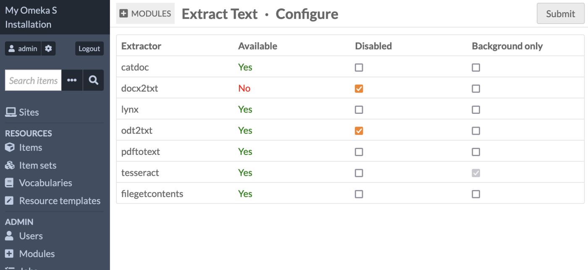
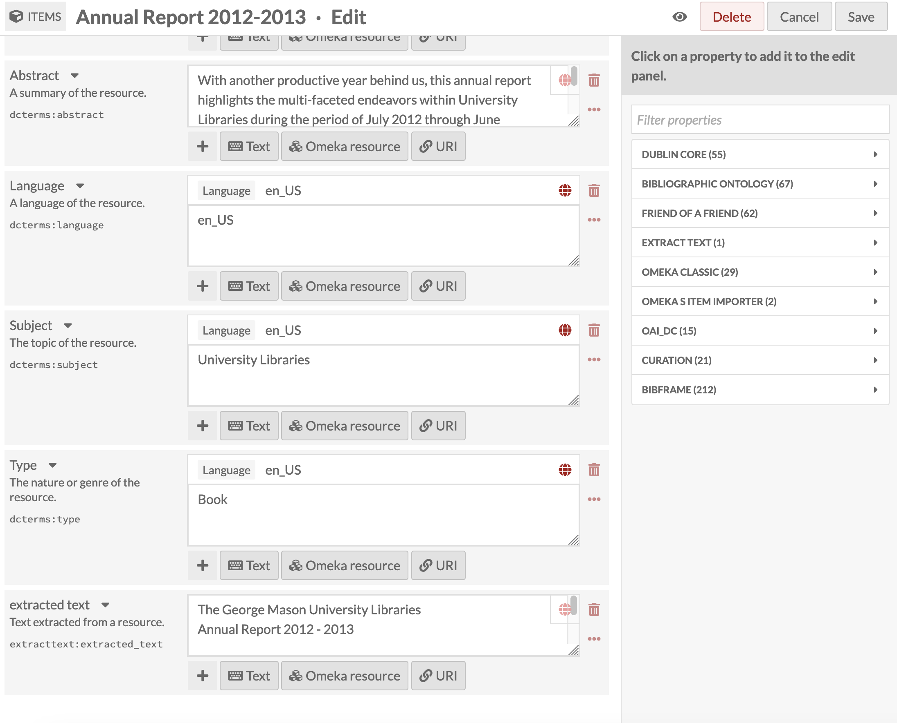
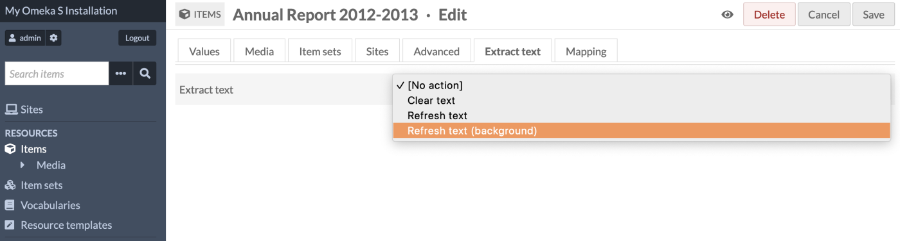
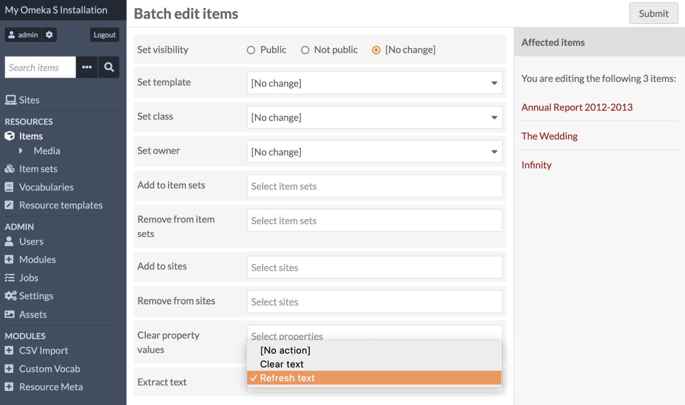

# Extract Text

The [Extract Text module](https://omeka.org/s/modules/ExtractText){target=_blank} will extract text from files to make them searchable and machine readable.

When enabled, Extract Text adds a new metadata vocabulary with one field, with a textual data type, at both the item level and at the media level, with the name "extracted text" and the slug `extracttext:extracted_text`. It is set to public by default on item view pages.

It adds an "Extract text" tab to each item editing page, where you can refresh or remove extracted text. It also adds a batch-editing option to extract or clear text from existing files in your database. When active, it will automatically extract text from files uploaded in [CSV Import](../modules/csvimport.md).

When the module is deactivated, items with text in the "extracted text" fields will not be changed; the field will still display.

If you have more than one file attached to one item, the cumulative extracted text will appear in one single field at the item level, in the order that the files are added. New files will have their extracted text appended to the end of the field.

## System requirements

Potential supported file formats for this module are:

- doc
- docx
- html
- odt
- pdf
- rtf
- txt
- xml
- bmp, gif, jp2, jpg, png, tiff, and webp (with Tesseract).

You must have the necessary extractors available on your server for the module to run for these filetypes. To see which filetypes will run on your installation, go to the "Extract Text" entry under Modules, and click the "Configure" button. This will load a table showing you which extractors are available on your server.

## Configuration

On this page you can view which extractors are installed, active, and running in the background. You can enable or disable specific extractors, and configure them to run as background jobs only, which can be more efficient on your server. 

Tesseract runs in the background only as it can be very processing-heavy. Depending on the size of your other files, such as PDFs, you may also wish to set other extractors to run in the background only. Background-only extractors will not run when new media are uploaded, but they will run with CSV Import jobs and when using batch-editing tools.

When "Background only" is not checked, the extractor will run on file upload, on "Refresh text", and on "Refresh text (background)".

The extractors required are:

- **catdoc**, used to extract text from DOC and RTF files.
- **docx2txt**, used to extract text from DOCX files.
- **lynx**, used to extract text from HTML files.
- **odt2txt**, used to extract text from ODT files.
- **pdftotext**, used to extract text from PDF files.
- **filegetcontents**, used to extract text from TXT files.
- **domdocument**, used to extract text from XML files.
- **tesseract**, used to recognize text characters from image files. 

The following image files are supported by Tesseract if compiled with the required libraries:

- BMP (image/bmp)
- GIF (image/gif)
- JP2 (image/jp2)
- JPG (image/jpeg)
- PNG (image/png)
- TIFF (image/tiff)
- WEBP (image/webp).

!!! note
	Note that some file extensions or media types may be disallowed in your installation's [global settings](../admin/settings.md#security). The module does not automatically add or remove any files based on activation or your configuration settings. 

	You may need to manually add new file extensions and media types with an administrator account if you are upgrading the module to add new extractor functionality, such as XML. For example, add "text/xml" to the media types box and add "xml" to the file extensions box. 

If you do not have one or more desired extractor tools installed on your server, check with your hosting service or your local server administrator.

## Extracting text from media

To extract text from media, you can choose several actions:

- Manually extract text from one media, when the media is uploaded, or later from its media editing screen
- Manually extract text from all media associated with one item, from its item editing screen
- Batch-extract text from all media associated with several items, from the batch-editing page
- Batch-extract text from a [CSV Import](../modules/csvimport.md) containing media uploads.

Extract Text is configured to run automatically when a new piece of media is uploaded anywhere, whether via a CSV Import or by uploading one or more pieces of media to an item. The text extraction may not run with other types of imports or connectors added by modules. 

You can manually erase or re-run extracted text by editing the item or media. To change the automatic output, navigate to the "Extract Text" tab on an item or on a specific piece of media.

You can clear (erase) all of the recognized text currently in the `extracttext:extracted_text` field, or you can refresh it. At the item level, this will extract fresh text from all of the item's media, in order, and output it all to the field as one value. 

At the media level, this will erase or refresh only the text from that piece of media. The updated text will appear in the item metadata in order of the media files. 

When "Refresh text" is selected, the extractor will run in the foreground, which could take a few minutes. The page will refresh itself when the extraction is completed. 

When "Refresh text (background)" is selected, all extractors will run including any extractor set to run in the background only (including Tesseract). This will result in a job appearing in the "Jobs" tab on the left-hand side. Go there to check for completion or errors. 

If media on an item are rearranged, Extract Text will automatically rearrange its output to match.

### Batch editing

You can clear or refresh text from more than one item at a time (or more than one media, selected manually). Extract Text appears as a new field on the batch-edit screen. This will function as a foreground job only, and you must wait for the operation to complete. Background extractors will not run from a batch-edit operation.

### CSV Import integration

[CSV Import](../modules/csvimport.md), when adding new media to your Omeka installation, will include a text extraction process, including all foreground and background extractors, on every single file. 

!!! note
	If you wish not to run specific text extraction along with an import, you must disable the extractors in the Extract Text configuration before starting a CSV Import. We recommend you do this when uploading images that do not contain text such as photographs, as Tesseract will take a long time attempting to recognize text inside images.

## Languages

Extract Text's extractors, particularly Tesseract's optical character recognition, are configured to recognize English text by default. To set other languages for recognition, [see the Readme](https://github.com/omeka-s-modules/ExtractText){target=_blank}.

## Other configuration options

The following extractors have configuration options:

**filegetcontents**:

- offset: The offset where the reading starts (default 0)
- maxlen: Maximum length of data read (default null).

**pdftotext**:

- f: First page to convert (default null)
- l: Last page to convert (default null).

**tesseract**:

- l: Language/script (default 'eng')
- psm: Page segmentation mode (default 3)
- oem: OCR Engine mode (default 3). 

[See the Readme](https://github.com/omeka-s-modules/ExtractText){target=_blank}.