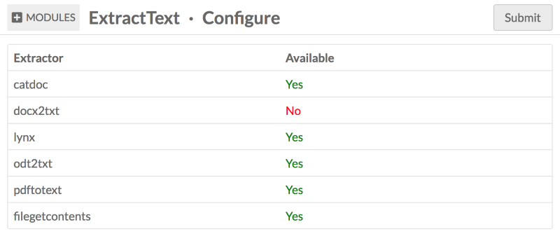

# Extract Text

Once installed, this module will extract text from files to make them searchable and machine readable. The extracted text will be added to a property called "extracted text" in a vocabulary unique to that module.

Supported file formats for this module are:

- doc 
- docx
- html
- odt
- pdf
- rtf
- txt

Please note that you must have the necessary extractors available on your server for the module to run for these filetypes. To see which filetypes will run on your installation, go to the Modules tab on your Omeka S installation and click the configure button for Extract Text. This will load a table showing you which extractors are available:

The extractors are:

- catdoc, used to extract text from DOC and RTF files.
- docx2txt, used to extract text from DOCX files.
- lynx, used to extract text from HTML files.
- odt2txt, used to extract text from ODT files.
- pdftotext, used to extract text from PDF files.
- filegetcontents, used to extract text from TXT files.
