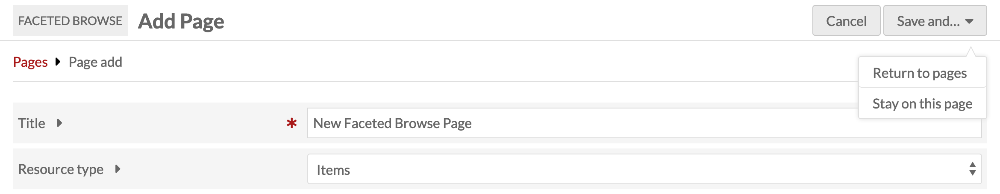
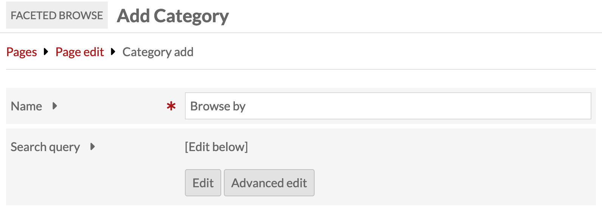
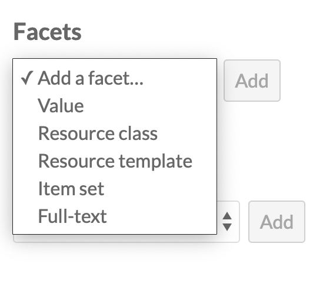
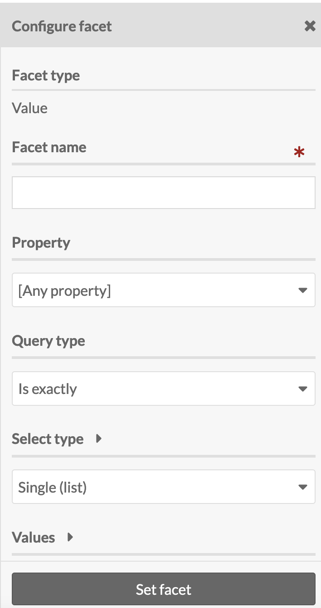
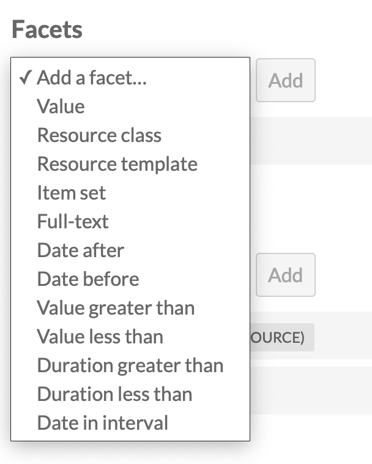
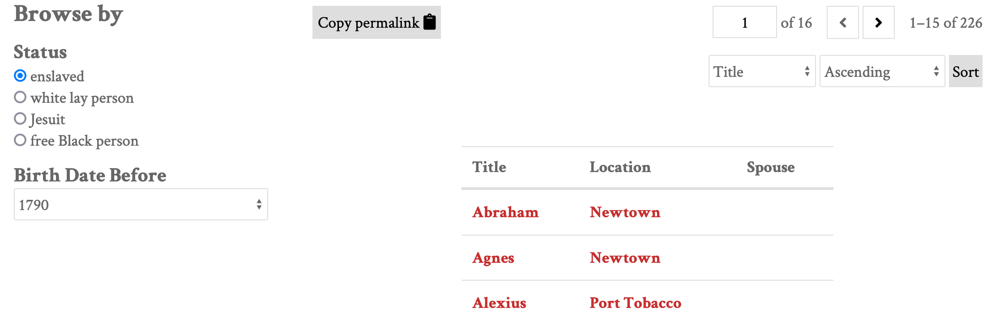
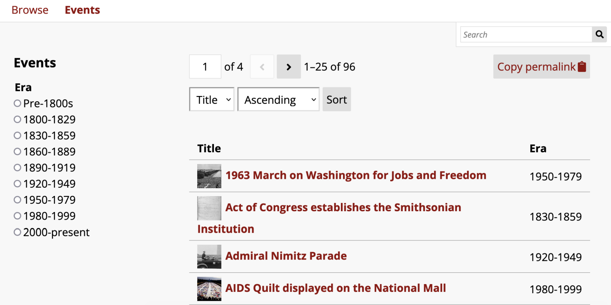
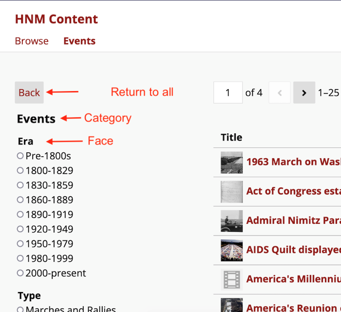

# Faceted Browse

The [Faceted Browse module](https://omeka.org/s/modules/FacetedBrowse){target=_blank} lets you create "browse resource" pages with facets - filter and sort functions - that site visitors can use.

With this module, site managers are able to configure faceted browse pages and add them to their sites. End users are then able to browse through categories of resources and use the facets to narrow the results in a logical and intuitive manner. This functionality is similar to the filtering options on many websites and should be easy for users to manage as long as you have clear language.

The [public view](#public-views) section below shows how these facets display for single and multi-category pages.

Faceted browse pages exist as separate [pages](../sites/site_pages.md), which can be added to the [navigation](../sites/site_navigation.md) in a similar fashion to default browse pages. You *cannot* add faceted browsing to a page as a block, or as part of an existing browse page.

Once activated, Faceted Browse is configured on a site-by-site basis.

## Terminology

A quick guide to the terms used to describe the aspects of a faceted browse page.

- Category: a group of resources (items, item sets, or media) to which facets are applied on a specific page.
- Column: information to display for each resource in the category. Once you have at least one column, the items will display in a table form (not a grid).
- Facet: an aspect of a resource - usually part of the metadata - which becomes a way to filter the resources in the category.

## Creating and managing Faceted Browse pages

Once the Facet Browse module is active, a tab for Faceted Browse will appear in the context menu for every site. Clicking on this tab will take you to a list of all of your Faceted Browse pages for that site.

Site managers must create Faceted Browse pages before they can be added to the site's navigation.

### Adding a Faceted Browse page

Create a new page by clicking the "Add a page" button. This takes you to a new page where you can add basic information for the page and start adding categories. 

The **title** functions the same as the title of a regular page: it will show up in navigation and display when the page is active.

Use the **resource type** dropdown to select the resource type that you would like to let users browse on this page: Items, Item Sets, or Media.

Save the page and select "Stay on this page" to continue creating the faceted browse.

If you are returning to edit existing pages, you can also save your edits and return to the list of pages by selecting "Save and Return to page".

### Categories

Once the page has been created, the user can create a Category, which is a group of resources which you want users to be able to browse with facets.

Click the "Add" button and give your category a name.

Use the search query interface to set the pool of resources that users will browse. The "Edit" button opens a drawer on the right hand side of the browser window which works exactly like [advanced search forms](../search.md#item-advanced-search) for items, media, and item sets. The "Advanced edit" button allows you to input a query string.

After setting the pool of resources, you can create facets and add columns to your browse display. Once you are done creating your facets and setting your display columns, save your category.

You can have more than one category per page. See [Multiple categories on one page](#multiple-categories-on-one-page) for how this functions on the public view.

### Facets

Facets work within the categories you have created. You can have one or more facets for each category. These are the selections that site visitors will use to narrow down the list of items.

You can create facets from the following options: Value; Resource class; Resource Template; Item Set; Full text.

Once the type is selected, click the "Add" button. A drawer will open on the right side of the browser window with options to configure the facet. The image below shows the drawer options for the Value facet:

You can add more than one type of facet to each page and category.

**Value** facets correspond to the [values](../content/items.md#values) within a specific property for each item.

Give the facet a name (required). This will display on the public view, so make sure it will be legible to your visitors.

Use the dropdown to select which property to use for the facet.

Set the Select type for the browse faceting. This sets how site visitors interact with the options in the Values field:

- Single (list). Visitors can select only one, all options are displayed in a list.
- Multiple (list). Visitors can select multiple, all options are displayed in a list.
- Single (dropdown menu). Visitors can select only one, all options are given in a dropdown menu.
 - Text Input. Visitors can type in text to search items that have property values corresponding to that text input.

 For the Select types that include a list or a dropdown menu you will need to set a Query type. If the query type is

- "Is exactly": Visitors will have to enter a value that is an exact match to the property value.
- "Is not exactly": Visitors can enter an exact value to be excluded from the the property values.
- "Contains": Visitors can enter a value that matches any part of the property value.
- "Does not contain": Visitors can enter a value to be exluded from any part of the property value.
-  "Is resource with ID": Visitors will enter the resource ID.
-  "Is not resource with ID": Visitors will enter a resource ID to be excluded.
-  "Has any value": Visitors will enter the property label.
-  "Has no values": Visitors will enter the property label.

For the Single (list) and Multiple (list) Select types, Page creators can choose to truncate the values available on this list that is visible to the site visitor by setting a number in the "Truncate values" option. Leaving the input blank will list all values.

Next, enter the Values that will make up the facets. Each value should be on a separate line.
   -  Check the "Show all available values" box to get a sense of the data that is available for input. This will return existing values in the property you selected above. You may click the "Add all" button to populate the list of values.
   -  The formatting of the value input will depend up on the query type selected above. If the query type is

      -  "Is exactly": enter a value that is an exact match to the property value.
      -  "Contains": enter a value that matches any part of the property value.
      -  "Is resource with ID": enter the resource ID followed by any value (usually the resource title), separated by a single space.
      -  "Has any value": enter the property ID followed by any value (usually the property label), separated by a single space.

When you are satisfied with your settings, click the "Set facet" button.

**Resource class** allow visitors to narrow items by their resource class.

Give the facet a name (required).

Set the Select type for the browse faceting:

- Single (list). Visitors can select only one, all options are displayed in a list.
- Multiple (list). Visitors can select multiple, all options are displayed in a list.
- Single (dropdown menu). Visitors can select only one, all options are given in a dropdown menu.

Select the Classes that will make up the facets from the dropdown menu.

Check the "Show all available classes" box to get a sense of the data that is available for input.

When you are satisfied with your settings, click the "Set facet" button.

**Resource template** allow visitors to narrow items by their [resource template](../content/resource-template.md).

Give the facet a name (required).

Set the Select type for the browse faceting:

- Single (list). Visitors can select only one, all options are displayed in a list.
- Multiple (list). Visitors can select multiple, all options are displayed in a list.
- Single (dropdown menu). Visitors can select only one, all options are given in a dropdown menu.

Select the Resource templates that will make up the facets.

Check the "Show all available templates" box to get a sense of the data that is available for input.

When you are satisfied with your settings, click the "Set facet" button.

**Item set** allows visitors to narrow items by [item set](../content/item-sets.md).

Give the facet a name (required).

Set the Select type for the browse faceting:

- Single (list). Visitors can select only one, all options are displayed in a list.
- Multiple (list). Visitors can select multiple, all options are displayed in a list.
- Single (dropdown menu). Visitors can select only one, all options are given in a dropdown menu.

Select the item sets that will make up the facets.

Check the "Show all available item sets" box to get a sense of the data that is available for input.

When you are satisfied with your settings, click the "Set facet" button.

**Full-text** adds a text search bar which will narrow down the displayed items based on what the visitor inputs.

Give the facet a name (required).

When you are satisfied with your settings, click the "Set facet" button.

#### Numeric Data Types

If you are using the Numeric Data Types module, you will have additional facet types to work with, including Date after, Date before, Value greater than, Value less than, Duration greater than, Duration less than, Date in interval.

Once you have selected a facet type, you will be able to configure the facet to operate with the properties that use a numeric data type.

In the public view, the faceting will be controlled through a dropdown menu.

### Columns

If you do not set any columns, the items on the page will initially just display in the default format for your site (grid or list). Once filtered, items will display in a table. The display of the browse list of results defaults to include the title and description for the resource, just as is the case with other browse lists.

You can configure the information displayed about the results by adding columns of metadata to the display for your faceted browse. On the public view of a facted browse, users can sort by a column by selecting it from a dropdown menu. This column can then be sorted in ascending or descending order. If you would like to prevent users from sorting by a certain column, you can check the "Exclude sort by" checkbox when configuring that column to exclude it from the dropdown menu.

Select a type of column to add from the dropdown menu: Title (link to resource); Value; Resource class; Resource template; Item set; ID.

Once the type is selected, click the "Add" button. A drawer will open with options to configure the column.

**Title (link to resource)**

Give the column a name (required). When you are satisfied with configuring the column, click the "Set column" button.

**Value**

Give the column a name (required). Select a Property to be displayed (required). Then, set the maximum number of values for that property. To display all values, set the input to blank.

When you are satisfied with configuring the column, click the "Set column" button.

**Resource class**

Give the column a name (required).

When you are satisfied with configuring the column, click the "Set column" button.

**Item set**

Give the column a name. (Required) Set the maximum number of item sets to be displayed. To display all values, set the input to blank.

When you are satisfied with configuring the column, click the "Set column" button.

**ID**

Give the column a name (required). When you are satisfied with configuring the column, click the "Set column" button.

## Add a Faceted Browse page to the site navigation

Click on the [Navigation tab](../sites/site_navigation.md) for your site. From the "Add a custom link" list in the page sidebar, select the "Faceted browse" option.

Give your custom link a label (required), and select from your dropdown list of faceted browse pages (required).

You may add as many Faceted browse custom links as you desire.

Drag and drop your pages into the desired place in your site navigation, and then save your work.

## Public views

The public view of a faceted browse should look familiar to many viewers:

In this image, the facet is Era, displayed as a single-choice list. The items for this page are displayed in columns with the title and era for each item.

### Multiple categories on one page

When there are multiple categories on a page, it will load with all of the resources from all categories displayed and the categories available in a submenu.

Once a user clicks on a category, the resource list will change to display only that category, and the facets will replace the categories in the submenu. Users can use a "back" button on the page to return to the full list of categories.

