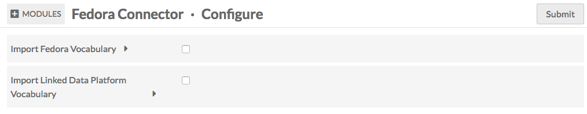
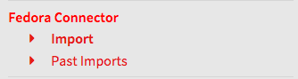
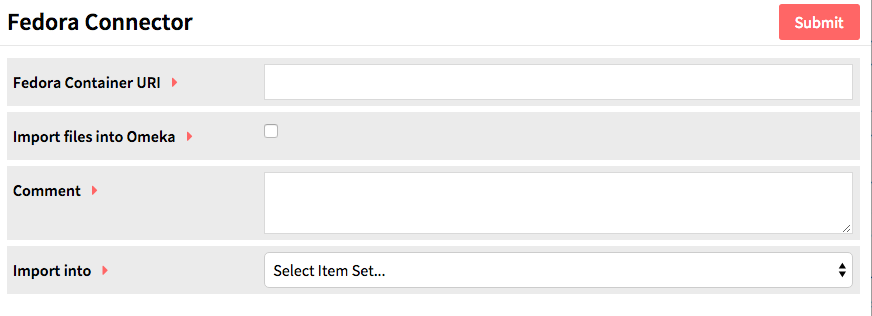

# Fedora Connector

Fedora Connector is a [module](../modules/index.md) for Omeka S which allows you to connect an Omeka S instance to a [Fedora](https://duraspace.org/fedora/) 4 repository in order to import items from containers in that repository. In addition to importing information, the Omeka S item will include a link back to the original item.

To install Fedora Connector, follow the instructions for [Installing Modules](../modules/index.md#installing-modules) on the Modules documentation. Following a successful installation you should be redirected to the configuration page for Fedora Connector.

Note that Fedora Connector only works with version 4 of Fedora.

## Configuration
There are two options for configuring Fedora Connector, both of which enable the creation of [vocabularies](../content/vocabularies.md) in your Omeka S install.

The first checkbox offers the option to import the Fedora Vocabulary into your Omeka S install’s Vocabularies. The second checkbox offers the option to import the Linked Data Platform Vocabulary into your Omeka S install’s Vocabularies. If you do so, data in these vocabularies will also be imported into Omeka S.

You can check these boxes when you first install Fedora Connector, or at a later point via the `Configure` button in the [Modules](../modules/index.md#managing-modules) list

## Import Data
To use Fedora Connector, navigate to the tab labelled *Fedora Connector* on the left-hand navigation of the admin dashboard. This will automatically take you to the Import sub-tab.

You should see a screen with the following options:

* *Fedora Container URI* for the Repository, Collection or Resource you wish to import (required)
* *Import files into Omeka* checkbox, check yes if you want to import media and other files attached to content (optional, recommended)
* *Comment* for example, any notes to yourself or other users of the installation (optional)
* *Import into* a selected [Item Set](../content/item-sets.md), if desired (optional--note that the Item Set must already exist in order to import into it)

When the data is complete, press submit. You can track the status of the import by navigating to the Fedora Connector > Past Imports tab or on the [Jobs](../admin/jobs.md) tab of the left-hand navigation on the admin dashboard.

- Are your jobs starting and not completing? You might need to [set the path for PHP](../configuration/) so that your system can perform the background process to make the items.

## Undo an Import
To undo a completed import and remove all associated items, go to the Fedora Connector tab on the left-hand navigation of the admin dashboard, click on Fedora Connector and then click on Past Imports, which should appear below the Fedora Connector tab.

Check the box for each import you wish to undo and click submit.
