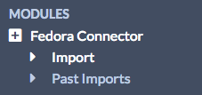
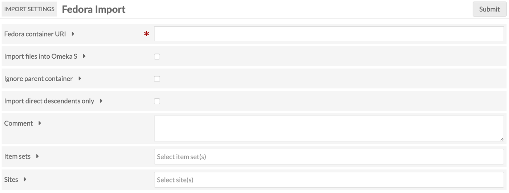
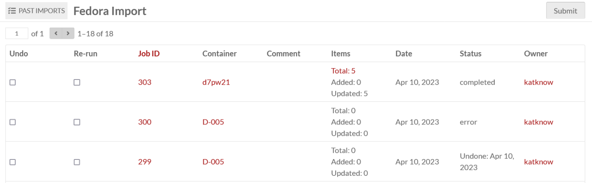

# Fedora Connector

The [Fedora Connector module](https://omeka.org/s/modules/FedoraConnector){target=_blank} allows you to connect an Omeka S instance to a [Fedora](https://duraspace.org/fedora/){target=_blank} 4 repository in order to import items from containers in that repository. In addition to importing information, the Omeka S item will include a link back to the original item.

Note that Fedora Connector only works with version 4 of Fedora.

## Configuration
There are two options for configuring Fedora Connector, both of which enable the creation of [vocabularies](../content/vocabularies.md) in your Omeka S install.

The first checkbox offers the option to import the Fedora Vocabulary into your Omeka S install’s Vocabularies. The second checkbox offers the option to import the Linked Data Platform Vocabulary into your Omeka S install’s Vocabularies. If you do so, data in these vocabularies will also be imported into Omeka S.

You can check these boxes when you first install Fedora Connector, or at a later point via the "Configure" button in the [Modules](../modules/index.md) list.

## Import data
To use Fedora Connector, navigate to the section labelled "Fedora Connector" under Modules in the left-hand navigation of the admin dashboard. This will automatically take you to the Import page.

You should see a screen with the following options:

* **Fedora Container URI** for the Repository, Collection or Resource you wish to import (required).
* **Import files into Omeka** checkbox: check yes if you want to import media and other files attached to content (optional, recommended).
* **Ignore parent container** checkbox: check yes to only import descendents of the parent container given in Container URI, not the parent container itself (optional).
* **Import direct descendents only** checkbox: check yes to only import direct descendents of the container given in Container URI (no children of children). If unchecked, all resources below container will be imported recursively (optional).
* **Comment** to add information about this job that will display on the Past Imports page (optional).
* **Item Sets** add imported items to a selected [Item Set](../content/item-sets.md), if desired (optional--note that the Item Set must already exist in order to import into it).
* **Sites**: add imported items to the specified site or sites. Global and user-specific default sites will be preselected here (optional).

When the data is complete, press "Submit". You can track the status of the import by navigating to the Fedora Connector > Past Imports page, or on the [Jobs](../admin/jobs.md) section.

!!! note
	Are your jobs starting and not completing? You might need to [set the path for PHP](../configuration.md#php-path) so that your system can perform the background process to make the items.

## Review imports

The "Past Fedora Imports" page displays a table of past Fedora imports, with a checkbox option to **Undo**, a checkbox option to **Re-run**, the **Container** of the import (ID with hyperlink to the container), any **Comments** made during import, the number of **Items** imported with a link to the advanced search results, the **Date** of the import, the import **Status**, and the **Owner**, or user who initiated the import.

## Undo an import
To undo a completed import and remove all associated items, go to the Fedora Connector section under Modules, then click on the Past Imports page.

Check the box for each import you wish to undo and click "Submit".
