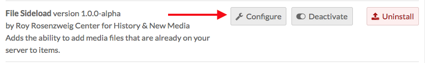

# File Sideload

This module adds the ability to add media files that are already stored on the server where your Omeka S installation lives. 

File Sideload is compatible with [CSV Import](../modules/csvimport.md). 

## Create a Directory

Create a directory (folder) on your server. It can be within the File Sideload module directory or on the same level as the Omeka S installation. 

Upload files into this directory using your File Transfer Protocol (ftp) client. All files must be in this directory to be accessible; any content in a subdirectory will not register with the module. 

Note that when browsing these files from the module to add as media, you will only see the filenames, so you should name the files as clearly as possible ("StudyInScarlet_coverpapge" is better than "img001").

## Configuration

After installing the module, you will need to configure the module to tell it where the directory is located. 

From the modules tab of the left hand navigation, scroll to File Sideload and click the configure button.

The File Sideload module has two configuration options. 

**Sideload Directory**: the complete path, relative to the server root, of the directory in which the files are stored. 

   - If you have shell access to the directory via terminal, you can copy and paste the results of the command "pwd". 
   - If you are using a ftp application, copy out the path in the location bar of the application.

**Delete sideloaded file?** If checked, any file added to an item as media will be deleted from the sideload directory, as the file is now saved as media in the Omeka S installation. 

If unchecked, the files will remain in the directory, and available to be added as media to any item, until you manually remove them using an ftp or shell client.

Add a sideload file to an item
------------------------------
With File Sideload installed and configured, and files in the directory, you can now use the module to add media to items. 

When editing an item, go to the *Media* tab. The Add New Media sidebar now includes a button for Sideload (at the very bottom).

Clicking on the button adds a Sideload media block. There are two fields:

- *Title*: Give the media file a new title (optional)
- *File*: select a file from this dropdown menu. The menu will load the file names as they appear in the directory. Select one from the dropdown and save changes.

