# Hierarchy

The [Hierarchy module](https://omeka.org/s/modules/Hierarchy){target=_blank} adds the ability to organize your Omeka S item sets into trees. This module is similar to [Collection Tree](https://omeka.org/classic/plugins/CollectionTree/){target=_blank} for Omeka Classic - you can create ordered or multi-level organizational systems.

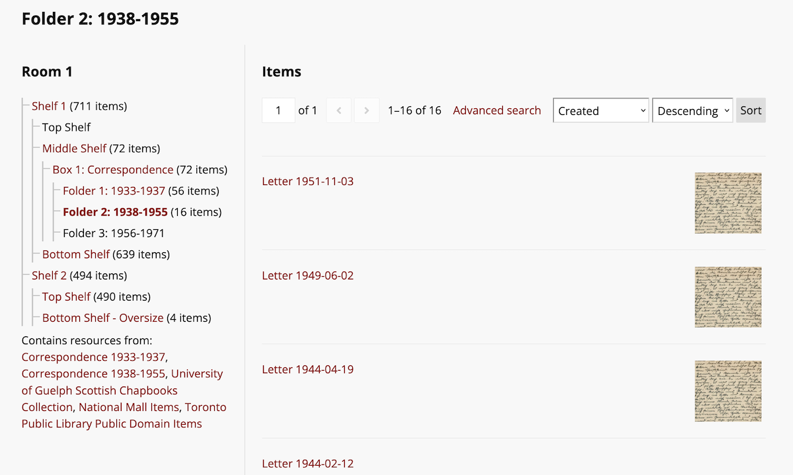

Any number of groupings can be created in the module; a parent can have any number of children. You can choose to have higher-level groupings reflect the total number of items in all the item sets included at lower levels. 

Hierarchies are displayed on each site with [resource page blocks](../sites/site_theme.md#configure-resource-pages) for items and item sets, and with a ["Hierarchy" page block](../sites/site_pages.md#page-blocks). Hierarchies can be added to individual sites for display, and can be configured on a site-by-site basis.

Hierarchies can be created by users at the Supervisor and Global Administrator levels. Hierarchies are displayed [on individual sites by users with permission](../sites/site_users.md) to modify the resource page blocks, and the permission to edit pages. 

## Plan your groupings

An Omeka S item can be in many item sets, according to your needs. But item sets cannot contain other item sets. Hierarchies do not change this - rather, they are a supplemental way of indicating a relationship between item sets. 

For example, if you organize your items by creator (in a "Shakespeare, William" item set, a "Marlowe, Christopher" item set, and so on) these item sets might be considered "siblings" to one another: equivalent concepts, but unordered. You can use a hierarchy to order these item sets chronologically by the creators' lifetimes, or by most to least items, or alphabetically, or any other system you choose. 

You could also organize them in groupings by country of origin, the language used in their works, or other categories. If you have a "Works in German" item set, containing miscellaneous items as well as items also in the "Mann, Thomas" item set, you could nest the item sets of German authors under the "Works in German" item set as a way to indicate that relationship.

Another example might be organizing items by artifact type: paintings, sculptures, archaeological finds, documents, photographs. These item sets will not be modified but can be supplemented by adding larger categories such as "Artworks" and "Paper Items" and "Three-Dimensional Objects" to group the relevant item sets together. One hierarchy can contain the same item set more than once, so you can have a hierarchy as follows:

- Artworks
	- Paintings
	- Sculptures
	- Photographs
- Three-Dimensional Objects
	- Sculptures
	- Archaeological Finds
- Paper Items
	- Documents
	- Photographs.

Remember that item sets, resource classes, and templates can also help you provide multiple points of organization and context for your items. 

Hierarchies can be set up in different ways depending on the site settings you plan to use for them - whether you wish to create only one grouping per item set, linking directly to the item set pages, or whether groupings will be used to show a combination of all their children groupings' items. We recommend looking at the site settings section, below, while planning your collections. 

A hierarchy in Omeka S does not add metadata relationships to item sets (e.g., `relation` or `hasPart` values). The information created in a hierarchy is stored only in the module data, and does not modify the item sets themselves.

## Create a hierarchy

In the "Modules" section of the sidebar, find the "Hierarchy" page. Click the "Add Hierarchy" button to start your first hierarchy.

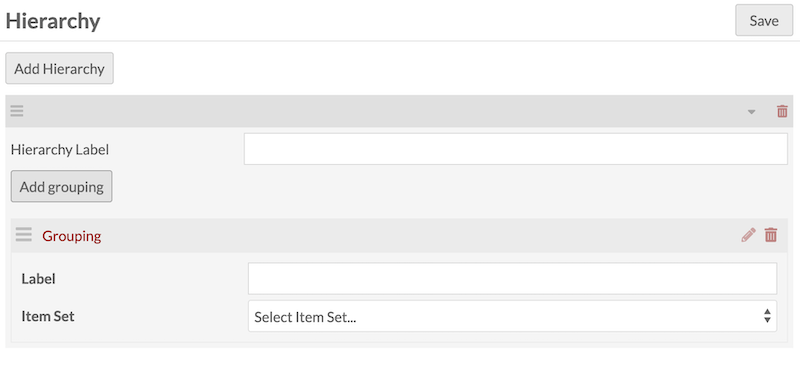

You can optionally give your new hierarchy a label, or leave it blank. 

Hierarchies are made by creating and rearranging groupings into trees. Click the "Add grouping" button to add your first grouping. You can optionally give it a label or leave it blank. You can also optionally set your grouping to be equivalent to an existing item set. 

If you leave the grouping label blank, the item set's name will be displayed. If you fill in the label, that will be displayed instead, wherever the hierarchy appears. 

!!! note
	If you neither fill in the grouping label nor choose an item set, the grouping will appear in the tree as "[Untitled]". We recommend you employ at least one of the two options. 

Then, drag and drop your groupings into your desired order or tree structure. Groupings can be dragged to become children of other groupings, or ordered to be siblings of each other. When a grouping is being dragged, look for small arrows that indicate where to drop it - to be a sibling of another grouping (an arrow underneath), or to be a child of the grouping (an arrow in the center). 

Add as many groupings as you need, filling out labels and selecting item sets where necessary. Combine this with creating new item sets and adding items to them as needed. 

For example, you may wish to create a five-level archival organizational system as follows:

- A Collection [the hierarchy]
	- Series 1
	- Series 2
	- Series 3
		- Sub-series 3.1
			-  Folder 3.1.1 [set to an item set]
				- [Items]

Every entry in the list above is a grouping with a label but no item set, except for the bottom-most level, which is set to the item set containing the relevant items in Omeka. 

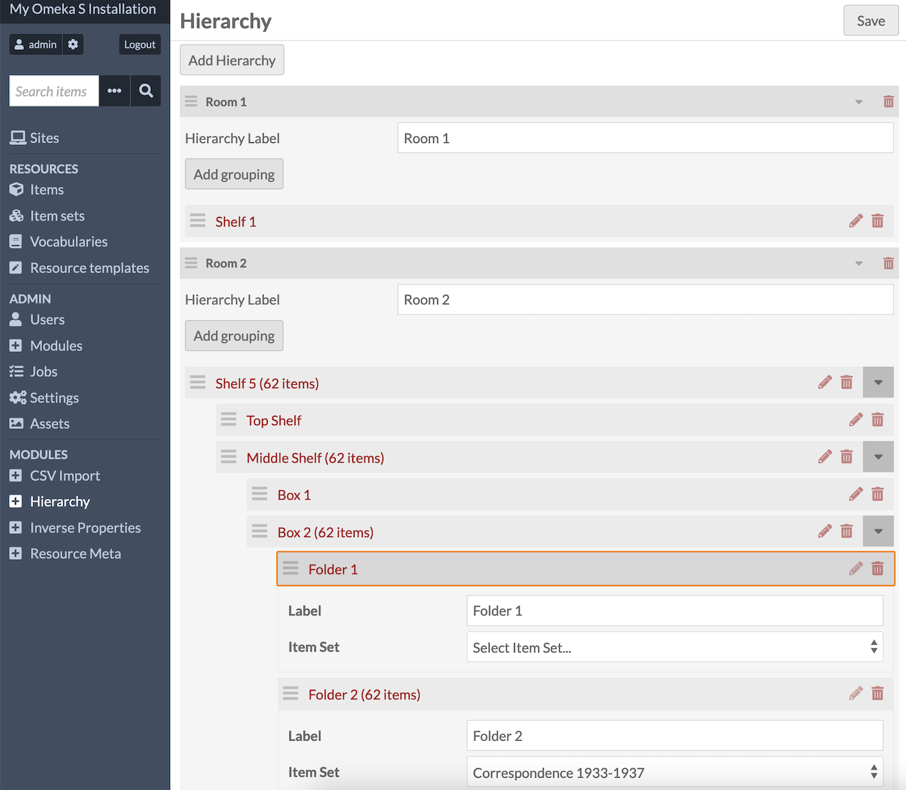

You can create as many hierarchies as you wish, with as many levels as needed, and reuse your item sets wherever you wish. In this way you can create multiple points of access to your collections, according to different topics or browse methods. 

If you delete a grouping (the trash can icon to the right), its children will not be deleted with it. Instead, they will be promoted up to the level of the deleted grouping. 

Remember to save your changes before navigating away from the module page. 

## Add a hierarchy to a site

From the Sites tab of the left-hand navigation, pick a site and then choose "Hierarchy" in the list.

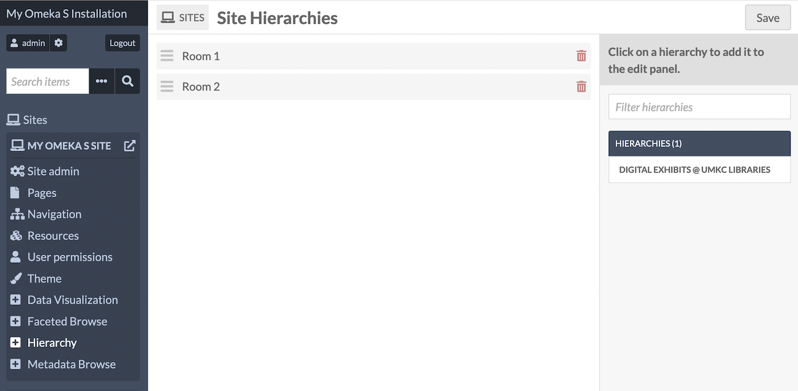

All of your hierarchies are listed on the right. Add them to each site as desired. The order that hierarchies are arranged on this page is the order they will display on this site; you can drag and drop them once added. Then save the page. 

## Site configuration

From the Site Admin page, select the "Settings" tab, and scroll down to the "Hierarchy" section. 

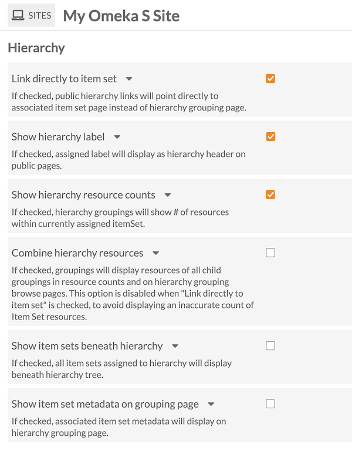

The Hierarchy module has six configuration options for each site:

- **Link directly to item set**: If checked, the hierarchy will not link groupings to their own custom public pages; the hierarchy's link structure will send users directly to item set pages.
    - This will disable the "Combine hierarchy resources" setting below. 
    - If you choose to link directly to item sets in the hierarchy, there will be no public links available to the groupings pages, although those pages will still exist on the site. Site visitors can access the grouping pages created by this module if you supply those links to them in some other way (such as in your navigation). So, the "Show item set metadata" setting may become redundant as it only affects grouping pages. You may also wish to turn off the "Show item sets beneath hierarchy" setting.
- **Show hierarchy label**: If checked, the hierarchy's assigned label will display as the hierarchy header on public pages. If unchecked, the hierarchy will display without a label. You can also leave individual hierarchy labels blank. This only applies to the hierarchy headers; individual groupings' labels are unaffected by this setting. 
- **Show hierarchy resource counts**: If checked, hierarchy grouping labels will be followed by the number of resources within the currently assigned item set, in parentheses.
- **Combine hierarchy resources**: If checked, groupings will display the resources of all child groupings in resource counts and on grouping browse pages. If you show resource counts for each level of your hierarchy, and if you also combine those counts, you will see the total number of items of each grouping and its children. If those items are in more than one included item set, they will not be counted twice. 
- **Show item sets beneath hierarchy**: If checked, a paragraph will display below the hierarchy with a list of all item sets that have been added to the groupings in the hierarchy. This is a way to provide direct links to item sets' view pages independently of the hierarchy's own link structure. 
- **Show item set metadata on grouping pages**: If checked, the assigned item set's title, description, and image will display on each grouping's browse page. This will not show children groupings' item set information, only the one item set linked to the given grouping.

Note that in the following image, the grouping label is shown in the hierarchy on the left, while the full item set title is shown in the area on the right, alongside the item set description and thumbnail. 

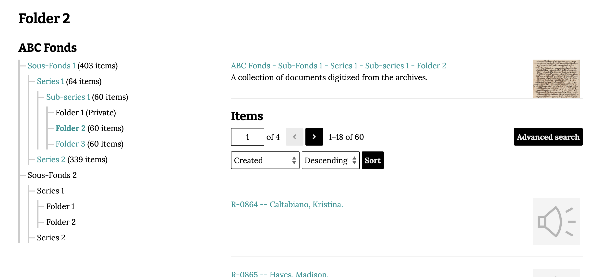

## Display hierarchies on a site

Public pages will display the hierarchy as a tree. Groupings with items in them will be links; groupings without any items will be displayed in plain text. 

Depending on your site settings, each link in the hierarchy will point to a public page, in the form `yourinstallation.org/s/your-site/hierarchy/01`. This will display the chosen hierarchy at left, and all the items contained in the given grouping at right (either all the items in the attached item set, or including all the children items as per your site settings). 

Depending on your site settings, underneath the hierarchy on these pages will be a list of all the item sets that are included in the full hierarchy, so that users can navigate to those if needed. (See the image at the top of this page for an example.) On site page blocks and on resources (items and item sets), this section will not display. 

!!! note
	Public display will depend on whether the included item sets are added to the site as resources. If an item set is included in a hierarchy but not added to the site, the text "(Private)" will appear after the label, and it will be unlinked with no resource count. In the image above, "Folder 2" is a public item set that is not included in the site. Item sets with visibility set to "private" will not be available to logged-out users; they will also display as unlinked and with "(Private)" after the label. They will appear as normal to logged-in users, and in hierarchies in the administrative interface. 

You can display hierarchies in two ways on your sites: 

- By adding resource page blocks to item and item set view pages
- By adding page blocks to site pages. 

Remember that all of the hierarchies displayed on a given site will be formatted according to the site-wide settings. For example, you cannot display combined resource counts in one area of your site and grouping-specific counts in other areas. 

### Resource blocks

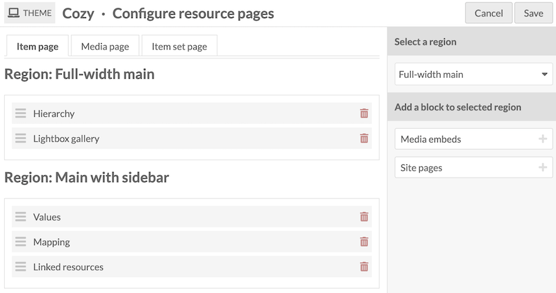

Select a site, then select the "Theme" tab in the left sidebar. Click the "Configure resource pages" button next to "Edit theme settings". 

On item pages, you can add the "Hierarchy" resource block to any region offered by your theme. This will display all the hierarchies that apply to the item, limited to the hierarchies added to the site. If an item is in more than one item set, all of the item sets' hierarchies will be displayed (according to which hierarchies and which item sets are added to the site as resources) in the order specified in the site-specific configuration. 

Note that the item may be in more than one item set, and any of those item sets that are included in your hierarchy will be displayed in bold. In the image above, you can see an item view page with a hierarchy displayed. More than one grouping is highlighted in bold, indicating that the item is in all of those groupings/item sets. 

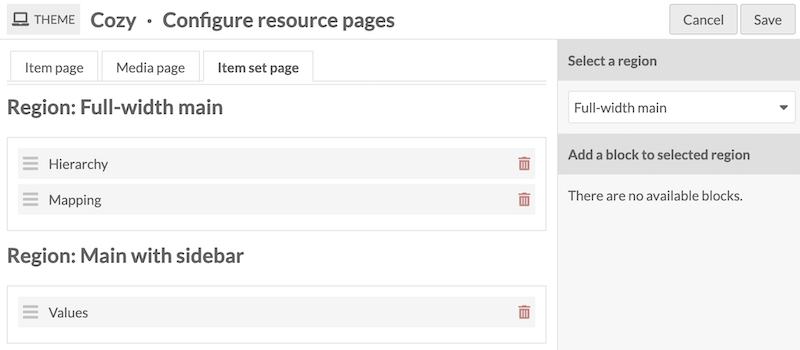

On item set pages, you can add the "Hierarchy" resource block to any region offered by your theme. This will display all the hierarchies that apply to the item set (if the hierarchies are added to the site).

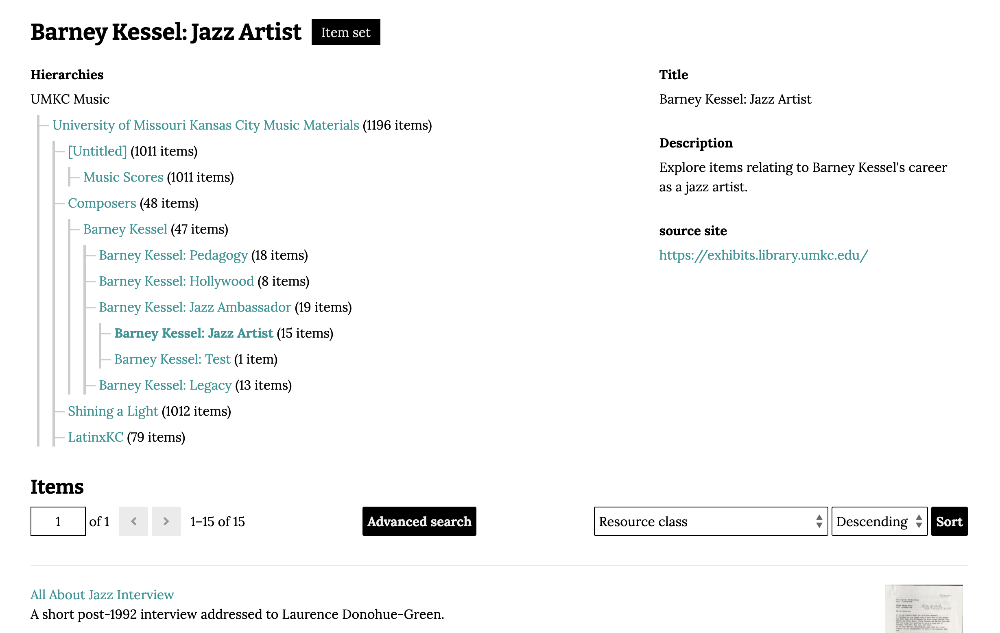

### Page blocks

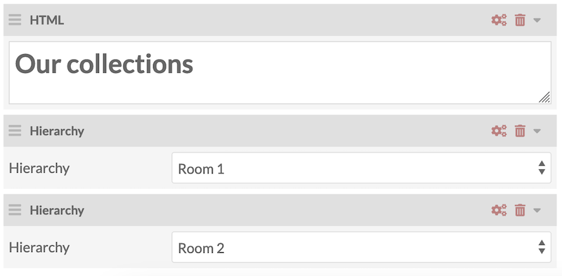

When adding the Hierarchy page block to a page, you can select one hierarchy at a time to display. You can add multiple page blocks. 

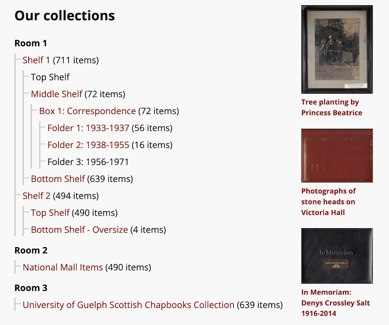