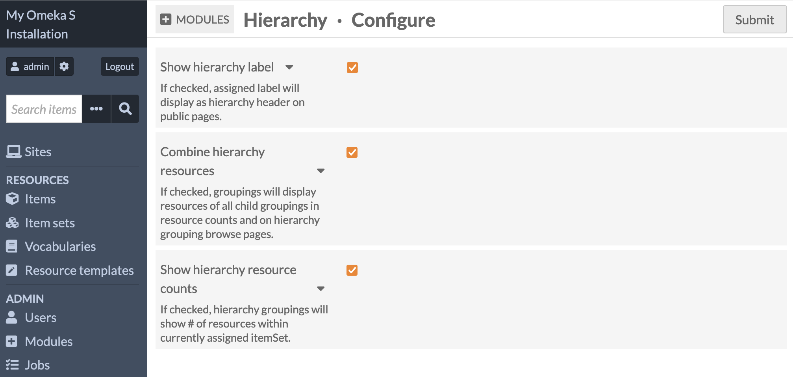

# Hierarchy

The [Hierarchy module](https://omeka.org/s/modules/Hierarchy){target=_blank} adds the ability to organize your Omeka S item sets into trees. This module is similar to [Collection Tree](https://omeka.org/classic/plugins/CollectionTree/){target=_blank} for Omeka Classic - you can create multi-level organizational systems, for example to reflect a room, shelf, box, and folder organization system for your physical objects.

Any number of groupings can be created in the module; a parent can have any number of children. You can choose to have higher-level groupings reflect the total number of items in all the item sets included at lower levels. 

Hierarchies are displayed on each site with resource page blocks for items and item sets, and with a "Hierarchy" page block.  

Hierarchies can be created by users at the Supervisor and Global Administrator levels. Hierarchies are displayed [on individual sites by users with permission](../sites/site_users.md) to modify the resource page blocks, and the permission to edit pages. 

## Plan your groupings

An Omeka S item can be in many item sets, according to your needs. But item sets cannot contain other item sets. Hierarchies do not change this - rather, they are a supplemental way of indicating a relationship between item sets. 

For example, if you organize your items by creator (in a "Shakespeare, William" item set, a "Marlowe, Christopher" item set, and so on) these item sets might be considered "siblings" to one another: equivalent concepts, but unordered. You can use a hierarchy to order these item sets chronologically by the creators' lifetimes, or by most to least items, or alphabetically, or any other system you choose. 

You could also organize them in groupings by country of origin, the language used in their works, or other categories. If you have a "Works in German" item set, containing miscellaneous items as well as items also in the "Mann, Thomas" item set, you could nest the item sets of German authors under the "Works in German" item set as a way to indicate that relationship.  

Another example might be organizing items by artifact type: paintings, sculptures, archaeological finds, documents, photographs. These item sets will not be modified but can be supplemented by adding larger categories such as "Artworks" and "Paper Items" and "Three-Dimensional Objects" to group the relevant item sets together. One hierarchy can contain the same item set more than once, so you can have a hierarchy as follows:

- Artworks
	- Paintings
	- Sculptures
	- Photographs
- Three-Dimensional Objects
	- Sculptures
	- Archaeological Finds
- Paper Items
	- Documents
	- Photographs.

Remember that item sets, resource classes, and templates can help you provide multiple points of organization and context for your items. 

## Create a hierarchy

In the "Modules" section of the sidebar, find the "Hierarchy" page. Click the "Add Hierarchy" button to start your first hierarchy.

You can optionally give your new hierarchy a label, or leave it blank. 

Hierarchies are made by creating and rearranging groupings into trees. Click the "Add grouping" button to add your first grouping. You can optionally give it a label or leave it blank. You can also optionally set your grouping to be equivalent to an existing item set. 

If you leave the grouping label blank, the item set's name will be displayed. If you fill in the label, that will be displayed instead, wherever the hierarchy appears. 

!!! note
	If you fill in neither label nor item set, the grouping will appear in the bullet list as a blank. Therefore, we recommend you employ at least one of the two options. 

Add as many groupings as you need, filling out labels and selecting item sets where necessary. Combine this with creating new item sets and adding items to them as needed. 

For example, you may wish to create a five-level archival organizational system as follows:

- A Collection [the hierarchy]
	- Series 1
	- Series 2
	- Series 3
		- Sub-series 3.1
			-  Folder 3.1.1 [set to an item set]
				- [Items]

Or, you may wish to reflect a physical organizational system of artifacts:

- Room 1 [the hierarchy]
	- Shelf 1
		- Top Shelf
			- Box 1
			- Box 2
			- Box 3
				- Folder 1 [set to an item set]
					- [Items]
				- Folder 2 [set to an item set]
					- [Items]

Every entry in the lists above is a grouping with a label but no item set, except for the bottom-most level, which is set to the item set containing the relevant items in Omeka. 

You can create as many hierarchies as you wish, with as many levels as needed, and reuse your item sets wherever you wish. In this way you can create multiple points of access to your collections, according to different topics or browse methods. 

If you delete a grouping (the trash can icon to the right), its children will not be deleted with it. Instead, they will be promoted up to the level of the deleted grouping. Remember to save your changes before navigating away from the module page. 

## Configuration

From the Modules page of the left-hand navigation, scroll to "Hierarchy" in the list and click the "Configure" button.

The Hierarchy module has three configuration options:

- **Show hierarchy label**: If checked, the hierarchy's assigned label will display as the hierarchy header on public pages. If unchecked, nothing will display. You can also leave individual hierarchy labels blank. 
- **Combine hierarchy resources**: If checked, groupings will display resources of all child groupings in resource counts and on hierarchy grouping browse pages.
- **Show hierarchy resource counts**: If checked, hierarchy groupings will show the number of resources within currently assigned item set.

These settings are installation-wide and will apply to any site where hierarchies show. 

!!! note
	If you show resource counts for each level of your hierarchy, and if you also combine those counts, note that some items may be counted multiple times if those items are in more than one item set. For example, if you had 20 items in a "Public domain" item set, and 15 of those same items were also in the "Photographs" item set, and you put both of those item sets below one grouping, you might see "35" where you might only expect 20. Consider your organizational system thoroughly when using this feature.   

## Add hierarchies to a site

You can display hierarchies in two ways on your sites: 

- By adding resource page blocks to item and item set view pages.
- By adding page blocks to site pages. 

### Resource page blocks

Select a site, then select the "Theme" tab in the left sidebar. Click the "Configure resource pages" button next to "Edit theme settings". 

On the Items view page, you can add the "Hierarchy" resource block to any region given by your theme. This will display all the hierarchies that apply to the item. If an item is in more than one item set, all of the item sets' hierarchies will be displayed. 

This display will depend on whether the applicable item sets are added to the site as a resource. 

### Page blocks

When adding the Hierarchy page block to a page, 

## CSV Import integration

With CSV Import, you can add media to items via File Sideload. Provide a column with the filenames, not full URLs, pointing to the files in your Sideload directory. Add the mapping to Media source > Sideload.

When using CSV Import with your Sideload directory, we recommend you un-check the file deletion setting in the File Sideload module configuration. CSV Import may delete files from your Sideload directory even if an import job has failed or stalled. You should always manually check the results of CSV Import before deleting the files it has imported. 
