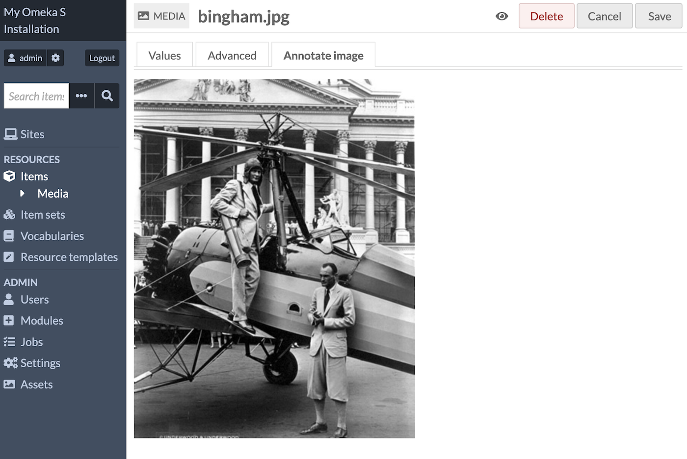
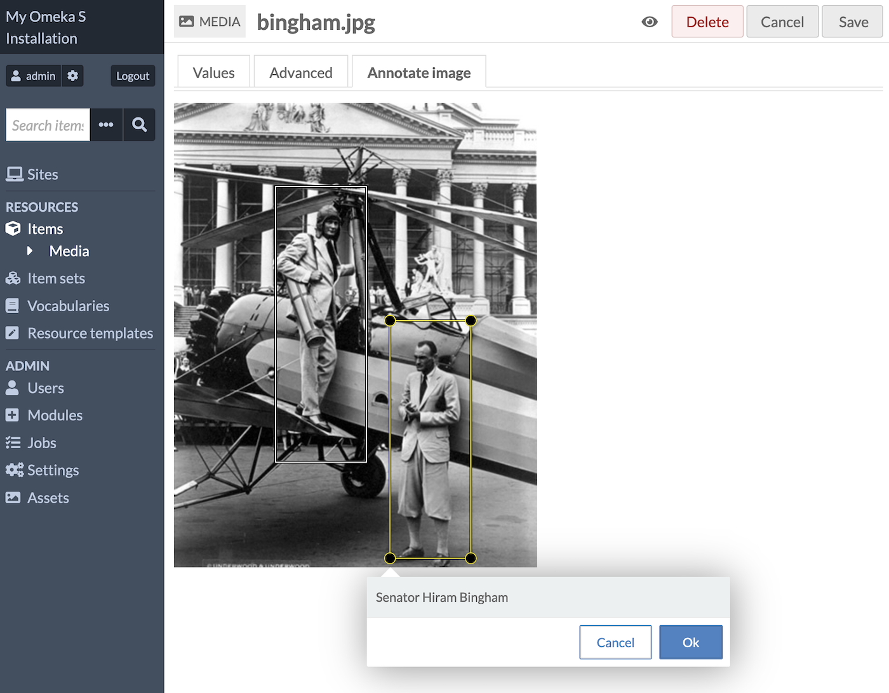
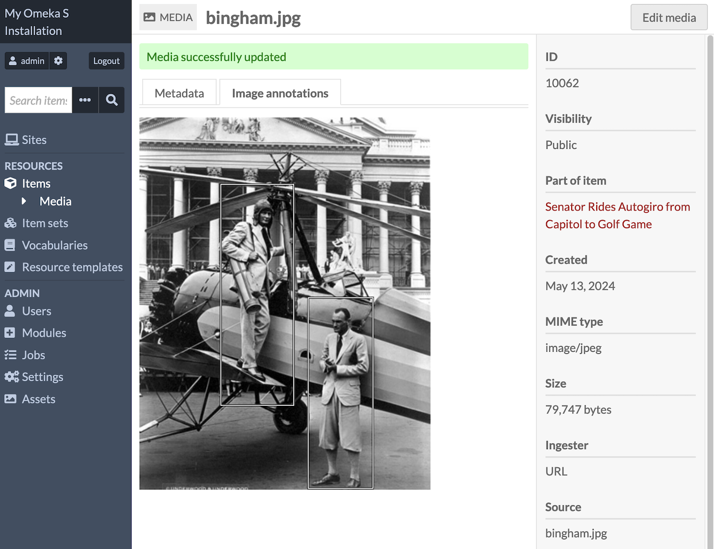
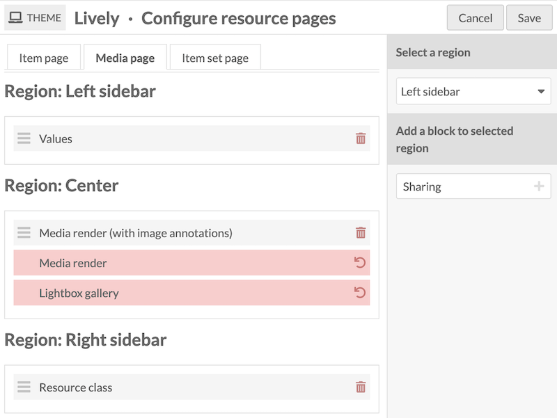
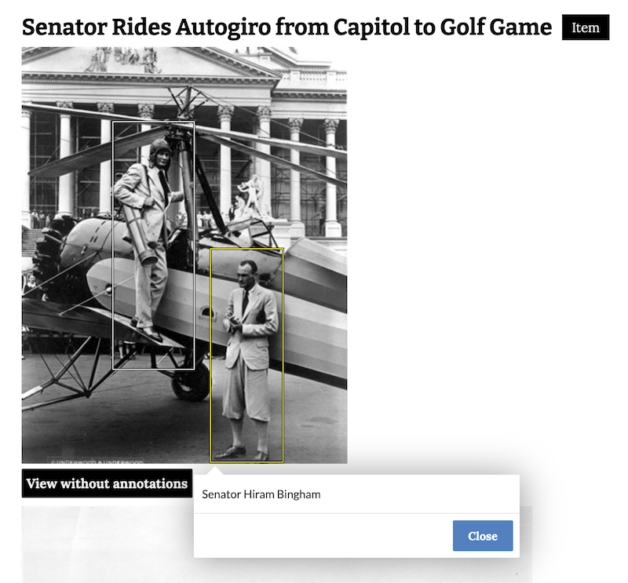
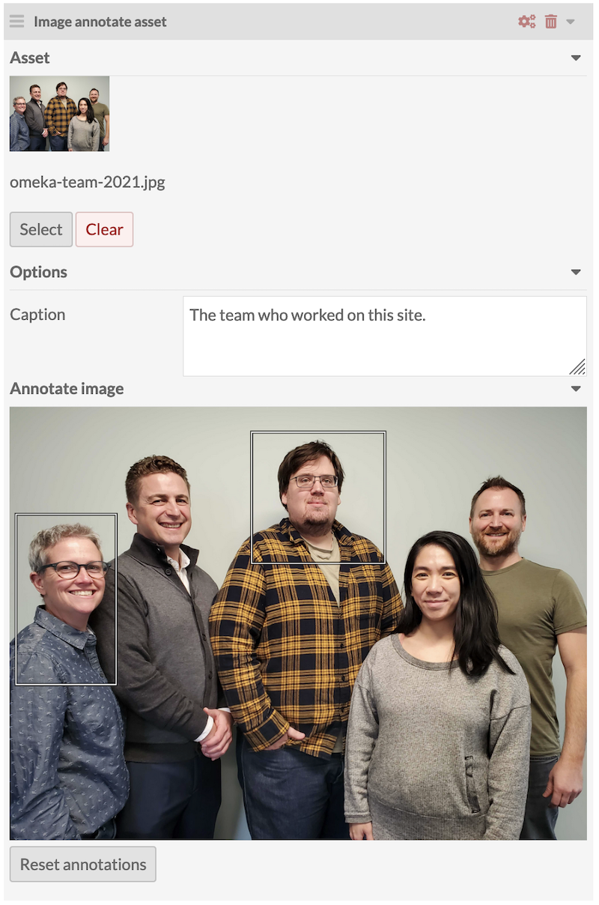
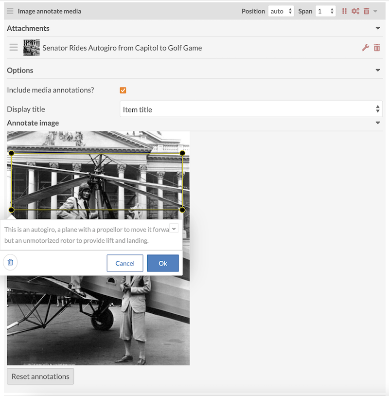
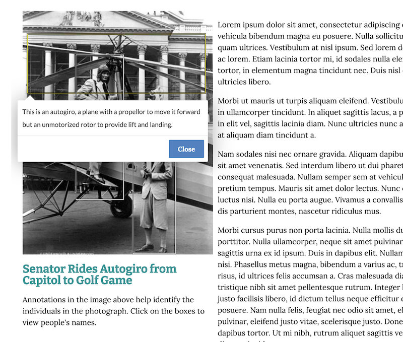

# Image Annotate

The [Image Annotate module](https://omeka.org/s/modules/ImageAnnotate/){target=_blank} allows site users to attach information to coordinates in image files. This includes [installation assets](../admin/assets.md) and [media attached to items](../content/media.md). 

This module adds a new "Annotate image" tab to the media editing interface on the admin side. Here, the selected image can be drawn upon. Users can draw rectangles and add area-specific text captions. It adds new [resource blocks](../sites/site_theme.md#configure-resource-pages) to display annotations on item and media view pages. It also adds new [page blocks](../sites/site_pages.md#page-blocks) that can add and display annotations in site pages. 

You can annotate the full sized-thumbnail that Omeka S creates for media that generates image thumbnails. This includes PDFs, which get a thumbnail of the first page. While you can annotate things like video thumbnails, you will only see your annotations in certain contexts where the original media does not display. 

Depending on your purpose, you can annotate the media files themselves as attached to items. You can also make the annotations available installation-wide or annotate media only in the context of a specific site page. Consider whether you wish the annotation to be widely available For example, when identifying all people in a photograph. Or, would you rather limit it to the context of an exhibit or essay. For instance, pointing out one particular person of note. You can combine media annotations with page-specific annotations if desired.

Skip to the [section on page blocks](#page-blocks) if you only wish to annotate images when building exhibits. 

### Permissions

Users at the Author level and above can annotate images. Authors can only annotate media that they own. Users at Reviewer or higher can annotate any media in the installation. 

Page blocks can be added by anyone with permission to edit a page. 

## Annotate media

Once you install the module, there are no installation-wide configuration options. 

You can find the "Annotate image" tab by navigating to a specific piece of media. You can do this either via an item's attached media or from the media table. 

You can annotate images with rectangular selections. This can be as large or small as you want. When  you create a rectangle, enter a caption. A caption is required to save the annotation. Be sure to save the annotation on the image, and then save the page.

Once you save the annotations, the "Image annotations" tab appears in view mode. Now annotations can be interacted with as though on a public page. 

If you wish to modify existing annotations, you can edit the media again. You can also  edit or remove the annotations that have been saved. Delete individual annotations with the red trash can icon, or click the "Reset annotations" button to remove all the annotations. 

## Publish annotations

Annotations appear on sites via resource page blocks and page blocks in sites. They do not appear anywhere by default. You will have to modify each site on which you wish the annotations to appear. 

### Resource page blocks

To render image annotations on item view and media view pages, you must add the resource page blocks.  

On the [site theme page](../sites/site_theme.md), click the ["Configure resource pages" button](../sites/site_theme.md#configure-resource-pages). 

On the "Item page" tab, you will see a new block called "Media embeds (with image annotations)". If you replace the normal "Media embeds" block with this block, image annotations will show where available. Otherwise, media will appear on item view pages as normal. 

On the "Media page" tab, you will see a new block called "Media render (with image annotations)". If you replace the normal "Media render" block with this block, image annotations will show where available; otherwise media will appear on media view pages as normal. 

Where image annotations are available, a button will appear on the public item and media view pages. It will read "View annotations". This button will appear below each image that has annotations. When clicked, the annotations will appear. They are hidden by default. The button will change to "View without annotations". 

If you usually use the Lightbox gallery to display your media on item and media view pages, this cannot be modified to include image annotations. If you wish to show annotations, you must use the Media embed or Media render formats. 

For videos and PDFs, the "View annotations" button will appear alongside the usual multimedia render. When clicked, the multimedia will be replaced with its annotated thumbnail. Modules such as PDF Embed may determine whether a media frame or its thumbnail displays in certain places. For example, the item or media view page. 

### Page blocks

This module adds two page blocks: "Image annotate asset" and "Image annotate media". 

When displaying an asset image with annotations, you will have the choice to add a text caption to the image.

When displaying a media image with annotations, you can add a caption in the same style as a Media embed page block. You can also choose to display the item title or media title as a clickable link below the image. 

You can add page-specific annotations to the media in the page block options. It is your choice whether or not to display the annotations saved to the media itself. If you both display the media's own annotations and draw page-specific annotations, the public page will show both sets of boxes. 

When you choose a media, such as a video or PDF, where only the thumbnails are images, the full-size thumbnail will display on the page with its annotations. Users will not be able to see the full video or PDF on the page.

Once the page has been saved with block-specific annotations, the block will include a "Reset annotations" button. This erases all the block-specific annotations, but not the annotations saved to the media itself.  
