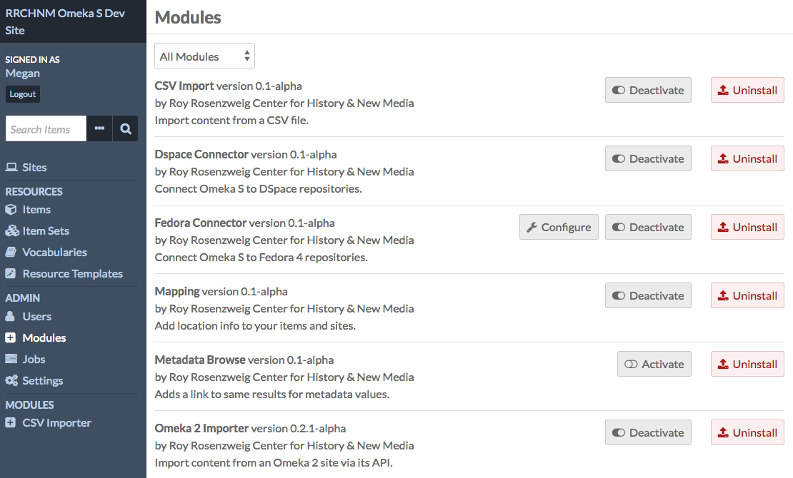
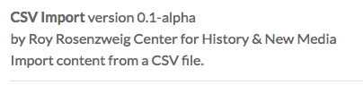
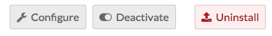
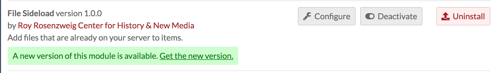
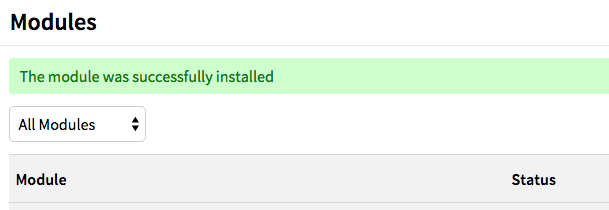
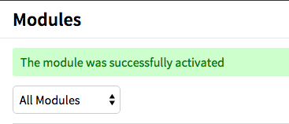
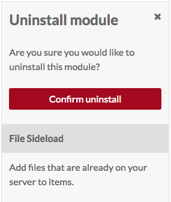

# Modules Management

Modules extend the functionality of your Omeka S installation and sites. 

## Managing Modules

To see what modules are installed on your Omeka S site, click on the Modules link on the left-hand navigation of your [admin dashboard](../admin-dashboard.md)

Note that only Global Administrators can install and manage modules. Site Administrators can browse installed modules. Other users do not have access to this tab.

Any modules which have been installed on the Omeka S install should appear in the list of Modules. Each module displays the name of the module with the version number, creator, and a summary of its function. 

There are multiple buttons which can appear to the right of a module’s label. Each button has both an icon and a label describing its action:

- *Configure* (a wrench icon): some modules have settings which can be adjusted. Click this icon to adjust settings for the module in this row.
- *Activate/Deactivate* (sliding switch): when a module is active, the slider area background is transparent and the switch is to the left. When inactive, the background of the slider area background is opaque and the switch is to the right.
- *Install/Uninstall* (arrow and rectangle): use this button to install or uninstall a module. When the arrow is coming from the rectangle, the button will uninstall the module. When the arrow is pointing into the rectangle, the button will install the module.

When a module has a new release, it will display on the browse page with a message in green stating "A new version of this module is available. Get the new version," with a link to the download page for the module. (See updating, below, for more information)

## Installing Modules
### Add the Module to Omeka S
In order to appear in the *Modules* table on the Modules tab of the Admin Dashboard for your Omeka S installation, modules must be manually added to the modules folder of the installation, using an FTP program or an ssh connection.

Modules which have been registered with Omeka are available on the [Modules](https://omeka.org/s/modules/) page of the Omeka S site. Other modules may be made available by their authors in other locations.

To add a module to the site using FTP

1. Download the zipped module to your computer.
1. Open your FTP client, log on to the server that houses  the Omeka S install and navigate to the `/modules` folder (this should be located in the main folder of the install).
1. Upload the zipped module to the `/modules` folder 
1. Unzip the module

Please note that if you are downloading the folder for a module from GitHub rather than the [Module Directory](https://omeka.org/s/modules/), you need to be sure to download the [latest release](https://help.github.com/en/articles/linking-to-releases) rather than the version in active development. If you are unsure how to do this, please consult the [GitHub help files](https://help.github.com/en).

You can also use ssh to clone a module directly from that module's git repository. Do this only if you are comfortable with git, github, and working with ssh.

### Install the Module
To install a module, navigate to the Modules tab on the left-hand navigation of the admin dashboard of your Omeka S installation.

Find the module in the table and click the install button.

The module is now installed. You should see a success message once the page reloads. For modules with configuration options, you will be taken immediately to the configuration page for that module. For all other modules the Modules page will simply reload. On the Modules page, the *Status* of the module should change from “Not Installed” to “Not Active”

Modules are automatically activated when installed. 

### Activating Module
If you have a module which is installed but inactive, click the activate button to use the module.

You should see a success message once the page reloads, and the *Status* of the module should change from “Not Active” to “Active”

## Configuring a module
Some, but not all, modules include the option to configure settings for that module. If an active module displays the *configure* (wrench) button, you may configure that module.

Information regarding configuration options for individual modules can be found on the documentation page for those modules.

## Uninstalling a module
Removing a module is essentially installing in reverse:

1. Deactivate the module by clicking the *deactivate* button
1. Uninstall the module by clicking the *uninstall* button
1. A drawer will open on the right side of the window asking you to confirm that you want to uninstall the module. Click “Confirm Uninstall” to continue.

The uninstalled module will continue to appear on your Modules page unless the folder for the module is removed from the /modules folder on the Omeka S installation, which can be done via FTP or SSH.

## Updating a module
To update a module using FTP:

1. From the Modules tab on your Omeka S installation, deactivate the module you're going to update.
2. From the Omeka S website or other source, download the latest release of zipped module to your computer.
1. Open your FTP client and log on to the server that houses the Omeka S install.
2. Navigate to the /modules folder (this should be located in the main folder of the install).
3. Move the old copy of the module to your desktop (or somewhere else on your local machine where you will be able to find it).
4. Use your FTP client to upload the zipped folder for the latest version of the module to the /modules folder 
5. In your FTP client, unzip the new version module
6. On the Omeka S installation dashboard, go to the Modules tab and activate the new version of the module.

If you are concerned about problems with the update, be sure to keep the older version of the module on your local machine in case you have to switch them back. You would roll back in the same way you updated.

If you run into problems while updating, turn on [error logging](../errorLogging) and post on the [Omeka Forum](https://forum.omeka.org/c/omeka-s/modules). 
