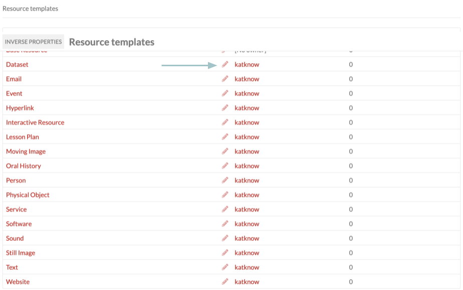
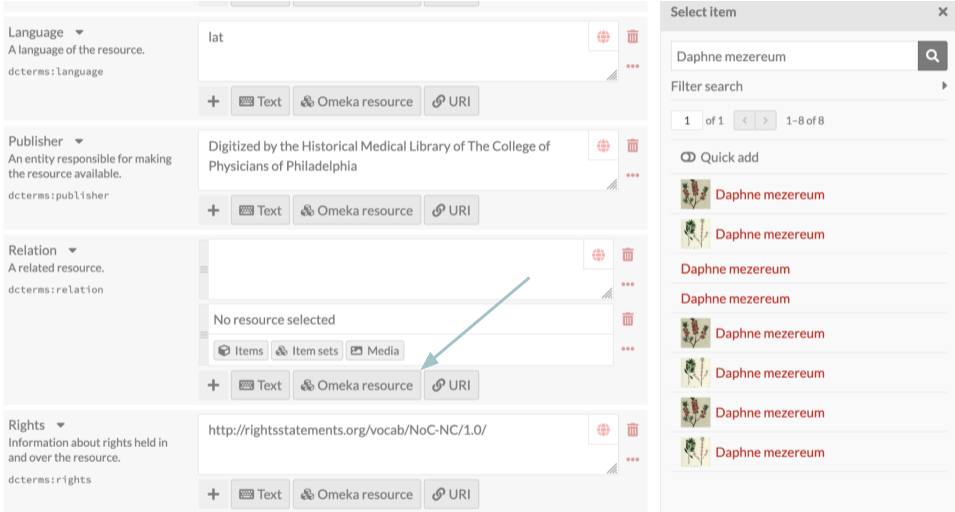
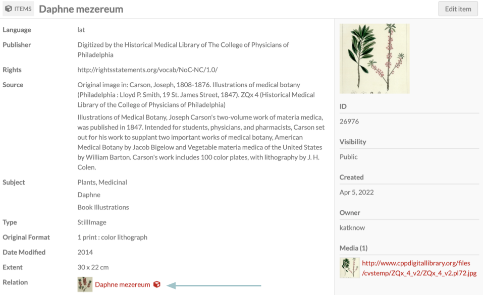

# Inverse Properties

The [Inverse Properties module](https://omeka.org/s/modules/InverseProperties/){target=_blank} allows administrators to define inverse properties between resources (items, item sets, and media) so that property values can be concretely linked in both directions. 

In Omeka S, resources in an installation can be linked to others - [items](../content/items.md#linked-resources) to other items, item sets, or its own media; [media](../content/media.md#omeka-resource) to items or item sets; [item sets](../content/item-sets.md#linked-resources) to other item sets or to items. These links are added through metadata values - for example, using a "William Shakespeare" person item as the value for "Creator" on a "Much Ado About Nothing" play item. When you view the person item, you will see inbound links in the Linked Resources table. 

These metadata links appear as one way by default - you edit the play item, but the person item is not affected. The Inverse Properties module makes that one-way link into a two-way link - adding a reciprocal metadata value to the person item to represent that person's relationship to the play item. (For example, the Friend of a Friend property "Publications" could be used to fill out multiple publications authored by the person.)

Some inverse properties are obvious (Dublin Core's "Has Part" is the intended inverse of "Is Part Of", for example) but others are flexible to the type of items in the installation. Thus, your installation's inverse property relationships need to be specified manually.

Inverse links created in this way can save time on data entry and be useful in [data visualizations](datavisualization.md), advanced or faceted browsing, and [batch-importing](csvimport.md) resource relationships.

### Suggested inverse properties

- Dublin Core (`dcterms:`):
	- Replaces & Is Replaced By (`dcterms:replaces`; `dcterms:isreplacedby`)
	- Requires & Is Required By
	- References & Is Referenced By
	- Has Format & Is Format Of
	- Has Part & Is Part Of
	- Has Version & Is Version Of
	- Relation (can be its own inverse property).
- Bibliographic Ontology (`bibo:`):
	- citedBy and cites
	- presents and presentedAt
- Friend of a Friend (`foaf:`):
	- depicts & depiction
- [Relationship](http://purl.org/vocab/relationship) (`relationship:`)
	- Child of & Parent of 
	- Spouse of (can be its own inverse property).

You can form inverse pairings with properties from two different vocabularies (for example, Dublin Core's "Creator" and Friend of a Friend's "publications"). 

You can also define an inverse pairing between different resource types: for example, between an item set and an item, or between an item and a media. These mixed-resource pairings do not need to use the same resource template. For example, a "person" item may have a "community" item set as the value in the "Is Part Of" property. With the inverse property set up in a "person" resource template, the related item set will be given the "Has Part" inverse property regardless of its own resource template or existing metadata. 

## Assign inverse properties in resource templates

Once the module is installed, it should appear in the left-hand navigation. When you select Inverse Properties, you will be taken to a table of available resource templates. In addition to label and owner, there is a column indicating each template's inverse property count. To use Inverse Properties, start by editing a resource template with the pencil icon. 

You might have a "Person" template that includes things like "Spouse", "Child", and "Parent" as properties that you intend to use to show reciprocal relationships with other resources. 

To assign an inverse property, select an inverse for that property from the dropdown menu. You can either scroll through the list of options or use the search bar to jump to a specific property. Be careful, in installations with multiple vocabularies, to select the intended one from the correct vocabulary. 

Note that setting a single pairing will only mean that editing the first value will create the second value. Editing the second value will not create the first value, unless you set that as a separate pairing. For example, setting "Child of" to have the inverse "Parent of" will mean that saving a "Child of" value will create a "Parent of" value, but saving a "Parent of" value will **not** create a "Child of" value. You must set "Parent of" to have the inverse "Child of" as well.

The exception to this would be setting a self-pairing, such as "Spouse of" or "Relation". 

Once you have selected all the inverse properties for that resource template, click "Submit" in the upper right corner to save your changes.

## Inverse properties in action

When adding or editing an item, select a resource template that has inverse properties. Then, in a property that has an inverse, click "Omeka resource". Then, click the resource type (such as "Item") and select the resource you wish to add from the drawer. After clicking on the resource's title, be sure to click the "Select resource" button at the bottom of the drawer to add the item to the metadata field. You can add multiple resources at once with the "Quick add" switch. 

Once you have finished editing the item, click "Save". The item you added as a linked resource should now appear on the item's show page.

If you click on the resource you just linked, you should see that the inverse property value was created automatically.

If you delete a value, its inverse will not automatically delete. You must delete each value manually from its own resource.

### Batch-update inverse properties

If you have linked resources already set up and then activate Inverse Properties and assign pairings in resource templates, you can batch-create your reciprocal values using the batch-edit function. Go to Items, Media, or Item Sets in the left-hand navigation, then select a number of resources (use the Advanced Search to find all resources using the template). Then use the "Batch actions" dropdown to edit the selected resources, or all resources in the search results. 

On the batch-edit form you will see an entry for "Inverse properties". Use the checkbox to indicate that all inverse properties set for all the resources you've selected should generate their pairings. Then "Submit" the form. 

!!! note
	Inverse Properties will **not** work with [CSV Import](csvimport.md). Import linked resources as usual, then use the batch-editing form to update the inverse pairings.
