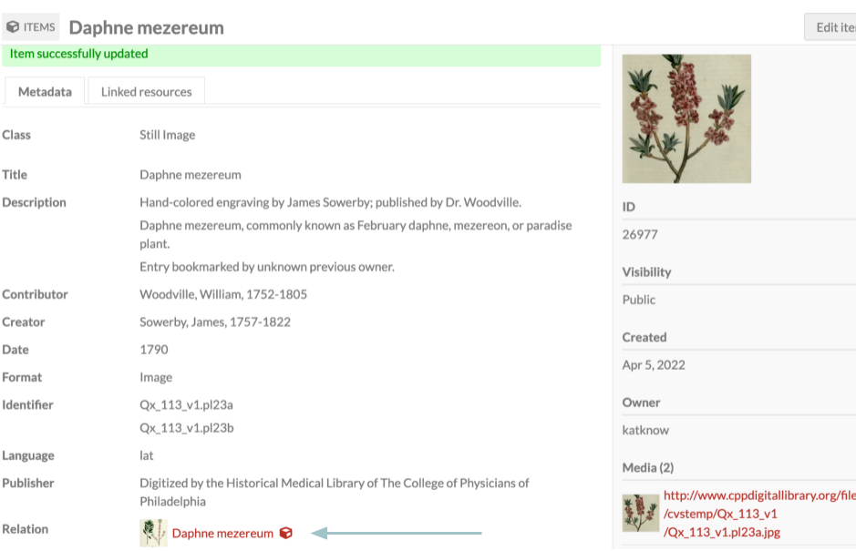

# Inverse Properties

The [Inverse Properties module](https://omeka.org/s/modules/InverseProperties/){target=_blank} allows administrators to define inverse properties between resources (items, item sets, and media) so that property values can be concretely linked in both directions. 

In Omeka S, resources in an installation can be linked to others - [items](../content/items.md#linked-resources) to other items, media, and item sets; media to other media; [item sets](/content/item-sets.md#linked-resources) to other item sets and to items. These links are added through metadata values - for example, using a "William Shakespeare" person item as the value for "Creator" on a "Much Ado About Nothing" play item. When you view the person item, you will see inbound links in the Linked Resources table. 

These links appear as one way by default - you edit the play item, but the person item is not affected. The Inverse Properties module makes a one-way link into a two-way link - adding a reciprocal metadata value to the person item to represent that person's relationship to the play item. (For example, the Friend of a Friend property "Publications" could be used to fill out multiple publications authored by the person.)

Some inverse properties are obvious (Dublin Core's "Has Part" is the intended inverse of "Is Part Of", for example) but others are flexible to the type of items you are creating. Therefore, your inverse property relationships will need to be custom-specified by you.

Inverse links created in this way can save time on data entry and be useful in [data visualizations](datavisualization.md), advanced or faceted browsing (for example, by adding many people who lived in a specific location, and then browsing using that location), and [batch-importing](CSVImport.md) resource relationships.

### Suggested inverse properties

- Dublin Core (`dcterms:`):
	- Replaces & Is Replaced By (`dcterms:replaces`; `dcterms:isreplacedby`)
	- Requires & Is Required By
	- References & Is Referenced By
	- Has Format & Is Format Of
	- Has Part & Is Part Of
	- Has Version & Is Version Of
	- Relation (can be its own inverse property).
- Bibliographic Ontology (`bibo:`):
	- citedBy and cites
	- presents and presentedAt
- Friend of a Friend (`foaf:`):
	- depicts & depiction
- [Relationship](http://purl.org/vocab/relationship) (`relationship:`)
	- Child of & Parent of 
	- Spouse of (can be its own inverse property).

You can form inverse pairings with properties from different vocabularies. You can also define an inverse pairing between an item set and an item, or an item and a media, as long as both resources are using the same template (and there are no unintended consequences using the same template for both resource types). 

## Assigning inverse properties in resource templates

To use Inverse Properties, you must have at least one resource template that has properties using the default or resource data types. You might have a "Person" template that includes things like "Spouse", "Child", and "Parent" as properties that have some intended utility as reciprocal relationships. 

Once the module is installed, it should appear in the left-hand navigation. When you select Inverse Properties, you will be taken to a table of available resource templates. In addition to label and owner, there is a column indicating each template's inverse property count. To add inverse properties to a resource template, click edit (the pencil icon).

To assign an inverse property, select an inverse for that property from the dropdown menu. You can either scroll through the list of options or use the search bar to jump to a specific property. You can select a property from any vocabulary.

Note that setting a single pairing will only mean that editing the first value will create the second value. Editing the second value will not create the first value, unless you set that as a separate pairing. 

For example, setting "Child of" to have the inverse "Parent of" will mean that saving a "Child of" value will create a "Parent of" value, but saving a "Parent of" value will **not** create a "Child of" value. You must set "Parent of" to have the inverse "Child of" as well. 

The exception to this would be setting a self-pairing, such as "Spouse of". 

Once you have selected all the inverse properties for that resource template, click "Submit" in the upper right corner to save your changes.

## Inverse Properties in action

When adding or editing an item, select a resource template that has inverse properties. Then, in a property that has an inverse property,  click "Omeka resource". Then, click "Item" and select the item you wish to add from the drawer. After selecting the item, be sure to click "Select resource" at the bottom of the drawer to add the item to the metadata field.

Once you have finished editing the item, click "Save". The item you added as a linked resource should now appear on the item's show page.

If you click on the resource you just linked, you should see that the inverse property value was created automatically.

If you delete a value after setting it or having it automatically created using the module, its inverse will not automatically delete. You must delete the second value manually from its own resource. 

There is no way to batch-update the items on your installation that already have property values, to create the inverse property values.

Inverse Properties works with [CSV Import](CSVImport.md): when doing a batch-import of resources that provide linked resources as property values, the inverse properties will be created as long as the resources are set to use the resource template where the inverse property is set.