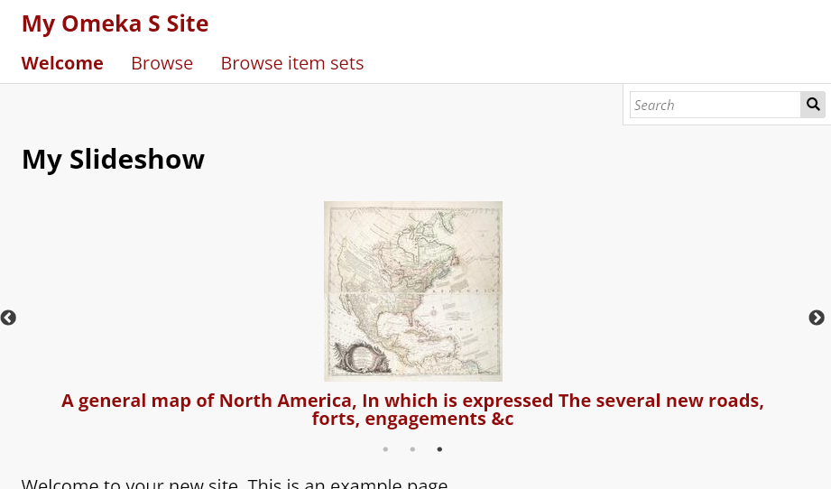
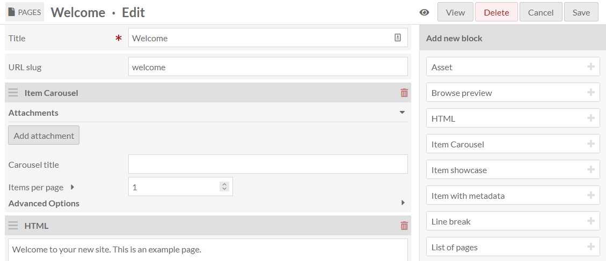
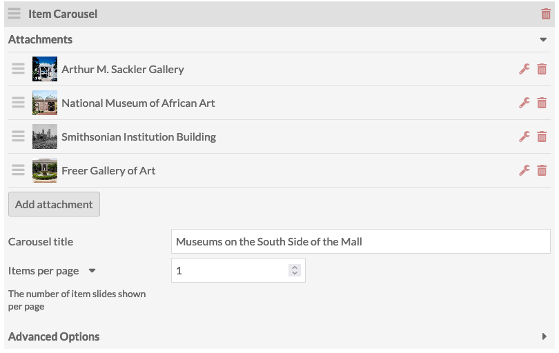
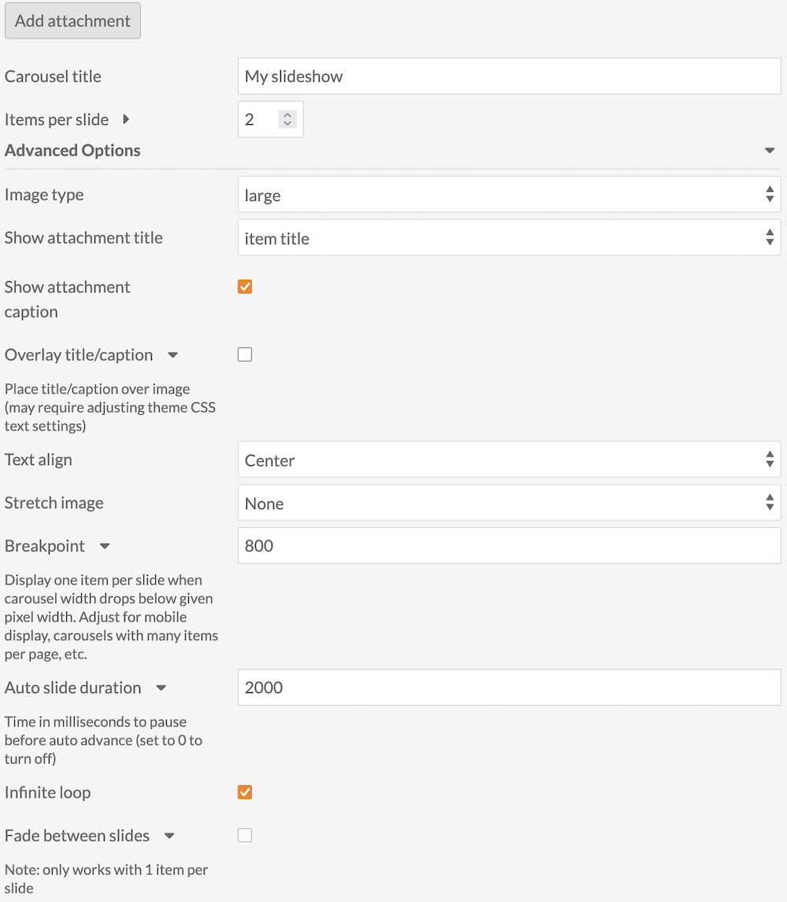
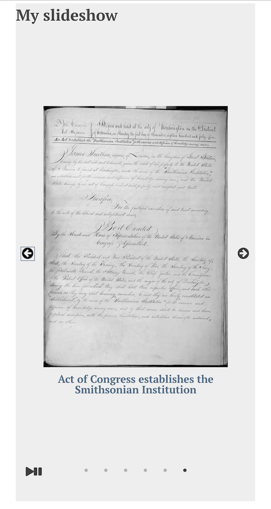

# Item Carousel Block

The [Item Carousel Block module](https://omeka.org/s/modules/ItemCarouselBlock){target=_blank} allows you to add a slideshow block to [Site Pages](../sites/site_pages.md#page-blocks).

Once activated, Item Carousel Block adds an "Item Carousel" page block to the list available from the page editing interface.

## Attaching items

When editing a page, add an Item Carousel page block found in the right-hand list. Click the "Add attachment" button to add a selection of items to the block. This will open a sidebar on the right side of the page to browse and select items.

Once you have selected items to attach, you can click the configuration wrench to select each media thumbnail to show, and to add a caption for each item. Attachments may be reordered by dragging and dropping.

## Basic configuration
The block includes two basic configuration settings:

Add a title for the carousel, and select the number of items that appear on the page at one time. The block must show at least 1 item, and can show a maximum of 10 items. When you choose an item, you select a specific media from that item. You can also enter caption text here.

## Advanced options
Using the drop-down menu within the block, you can access a number of advanced options to further configure the appearance of the block.

You can use those settings to:

- Select the Thumbnail type for the attachment. The options are [large, medium, or square](../configuration.md#thumbnails).
- Decide which attachment title to show. The setting options include item title, media title, or no title.
- Decide whether or not to show an attachment caption, as set within the attachments.
	- If you have selected to show the title and/or caption, you can decide whether or not to overlay the title/caption on the attached image. View and refresh the public page to see how this appears. Note that selecting this option might necessitate making some adjustments to your theme's CSS.
- Set the alignment for your title/caption. The setting options are left, right, and center.
- Decide to stretch the image from your attached item to fill the slide space. The options include None, Fill width, Fill height, and Fill entire slide.
- Set a "breakpoint" width for the carousel. Above this number of pixels in width, your chosen number of items will appear per slide; below this, only one item will show at a time. This is for mobile device compatibility, but can depend on the number of items you are displaying and the size of the thumbnails you have chosen. If you have one item per slide, ignore this setting. You can leave this blank. 
- Set the duration of time that the slide in the carousel pauses before automatically advancing to the next item. The duration is in milliseconds (so, a value of "1000" would switch slides once per second). **Set the duration to 0 to disable auto advance**.
- Set whether the slides should advance in an infinite loop, so that once the carousel cycles through the attached items, the cycle will begin again.
- Decide to implement a fade between the advancing attachment slides. Note: This option only works when you have set your carousel to 1 item per page (and not when the breakpoint is triggered).

## Public views

On your public page, the carousel will automatically be as tall as your tallest item, including title and caption text, depending on the advanced settings above. It will be as wide as the page block allows according to your [page design and settings](../sites/site_pages.md).

!!! note
	Your carousel may look and behave differently on mobile and smaller devices than on a computer screen. Be sure to view your public page in different configurations to ensure items are accessible by site visitors. 

A carousel viewed on a laptop browser:

And the same carousel on a mobile device - note that the breakpoint setting has reduced the visible items to 1:

