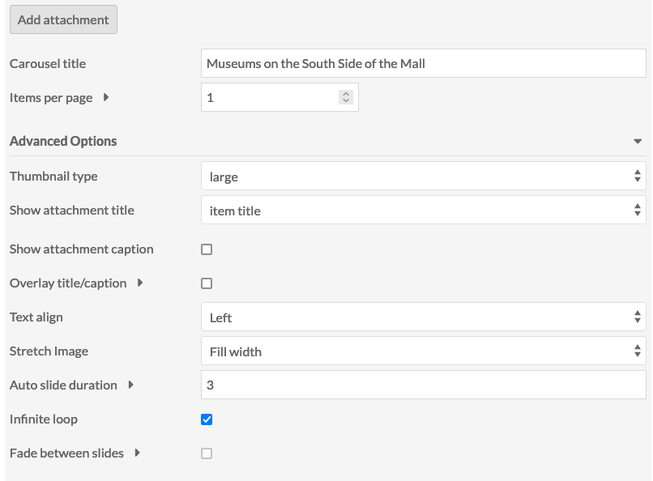

# Item Carousel Block

Item Carousel Block is a [module](../modules/index.md) that allows you to add a carousel block to [Site Pages](../sites/site_pages).

To install Item Carousel Block, follow the instructions for [Installing Modules](../modules/index.md#installing-modules) on the Modules documentation.

Once activated on the modules tab of the admin dashboard, Item Carousel Block adds a block to the list available from the page edit interface.

## Attaching Items
Click the _Add Attachment_ button to add an item to the block. This will open a sidebar on the right side of the page to browse and select items.

Once you have selected the items to attach, you can click the configuration wrench to select the media thumbnail to show and to add a caption.

Attachments may be reordered by dragging and dropping. 

## Basic Configuration
The block includes two basic configuration settings. 

You may add a title for the carousel.

You can select the number of items that appear on the page at one time. The block must show at least 1 item, and can accommodate showing a maximum of 10 items.

## Advanced Options
Using the drop-down menu within the block, you can access a number of advance options to further configure the appearance of the block. 

You can use those settings to:

- select the Thumbnail Type for the attachment. The options are large, medium, or square.
- decide which attachment title to show. The setting options include item title, media title, or no title.
- decide whether or not to show an attachment caption.
  - If you have selected to show the title and/or caption, you can decide whether or not to overlay the title/caption on the attached image. Note selecting this option might necessitate making some adjustments to your theme's CSS to achieve the appearance that you desire.
  - Additionally, you may set the alignment for your title/caption. The setting options include left, right, and center.
- set if you would like to stretch the image from your attached item to fill the slide space. The options include None, Fill width, Fill height, and Fill entire slide
- set the duration of time that the slide in the carousel pauses before automatically advancing to the next item. The duration is set in milliseconds. NOTE: Set the duration to 0 to disable auto advance.
- set the slide to advance in an infinite loop so that once the carousel cycles through the attached items, the cycle will begin again.
- decide to implement a fade between the advancing attachment slides. Note: This option only works when you have set your carousel to 1 item per page.
