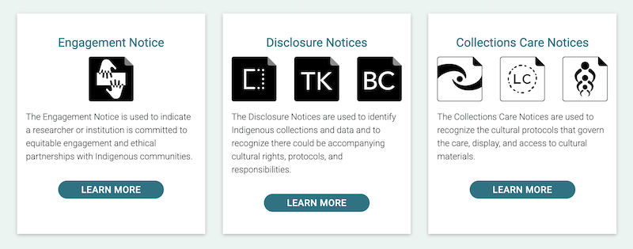
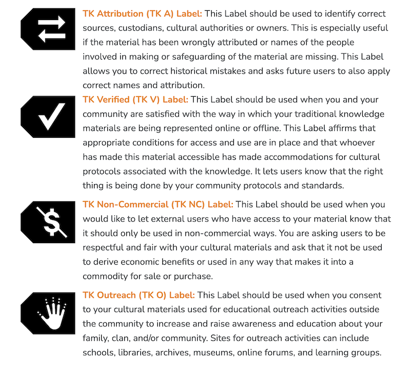
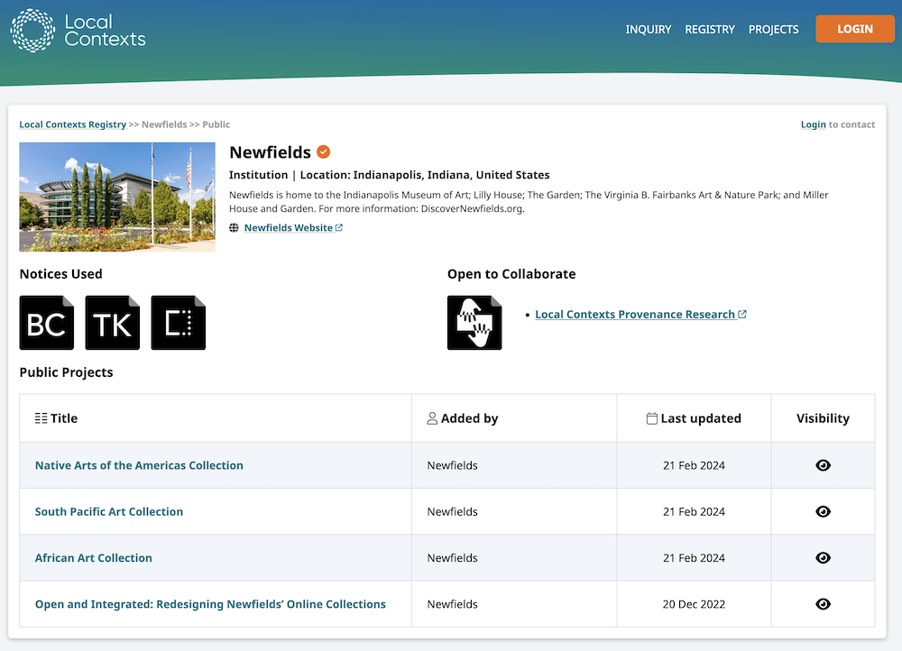

# Local Contexts

The [Local Contexts module](https://omeka.org/s/modules/LocalContexts){target=_blank} allows users to apply [Local Contexts](https://localcontexts.org/){target=_blank} labels and notices to Omeka S sites, pages, and resources. This requires setting up a Local Contexts account and creating Projects in their registry. Then enter the API key into Omeka to bring the chosen [labels](https://localcontexts.org/labels/about-the-labels/){target=_blank} and [notices](https://localcontexts.org/notices/about-the-notices/){target=_blank} over and apply them to items, sites, and pages. 

## What are Local Contexts?

Local Contexts a global initiative that supports Indigenous communities with tools that can reassert cultural authority in heritage collections and data. Local Contexts has three components of note to Omeka users: Notices, Labels, and Projects.

### Notices

This text is from the [Local Contexts website](https://localcontexts.org/notices/about-the-notices/){target=_blank}:

> *The Notices are tools for institutions and researchers to identify Indigenous collections and data and recognize Indigenous rights and interests. The Notices were developed to create pathways for partnership, collaboration, and support of Indigenous cultural authority.*

> *Notices can be applied to websites, publications, datasets, museum exhibitions, items in a collection, genetic samples, and more. Institutions and researchers can generate Notices using the Local Contexts Hub.*

> *There are three categories of Notices: Engagement, Disclosure, and Collections Care Notices. See below for more information on the different types of Notices.*

### Labels

This text is from the [Local Contexts website](https://localcontexts.org/labels/about-the-labels/){target=_blank}:

> *The Traditional Knowledge (TK) and Biocultural (BC) Labels are tools for Indigenous communities and local organizations. Developed through sustained partnership and testing within Indigenous communities across multiple countries, the Labels allow communities to express local and specific conditions for sharing and engaging in future research and relationships in ways that are consistent with already existing community rules, governance, and protocols for using, sharing, and circulating knowledge and data.*

> *Labels can be applied to websites, publications, datasets, museum exhibitions, items in a collection, genetic samples, and more. Communities can customize and apply their TK and BC Labels using the Local Contexts Hub.*

### Projects

This text is from [The Local Contexts website](https://localcontexts.org/support/getting-started-on-the-hub/){target=_blank}:

> *What is a Local Contexts Project?*

> *Local Contexts Projects describe the context where Labels or Notices are being applied. For example, a Project could include: a website, university syllabus, dissertation, research publication, dataset, museum exhibition, archival record, item in a collection, library database, photography collection, voucher specimen, and/or metadata about a record.*

> *When you create a Local Contexts Project, you will be asked for Project details and contacts, and have the option to add metadata.*

> *Creating Projects allows institutions and researchers to generate Notices and engage, acknowledge, and make visible Indigenous interests in collections, information, and data. Communities may then choose how and when to add their Labels.*

> *Community accounts can apply customized Labels to Projects they create in the Hub, as well as to Projects they have been sent by institution and researcher accounts. You can see Projects that have been added to the Hub publicly on the Projects Board.*

## Preparing to use the Local Context plugin

Local Contexts notices are meant to encourage engagement with members of Indigenous communities, in the form of community created labels or notices. An "Open to Collaborate" notice, for example, indicates that collaboration is welcome. As a result, you must be prepared to manage that collaboration. Be sure, if you are using notices, that your Omeka site has a means for Indigenous community members to participate: account creation for Indigenous community members, the ability to add Local Contexts Projects and labels to the site, a contact form, comments on items, or a plan for staff responsiveness to contributions. Think about your intended workflow for improving your collections in collaboration before proceeding further.

### Local Contexts Hub account

To use this plugin, you must have a Local Contexts Hub account. Creating a profile there allows you to have one or more Projects, which can then be connected to your Omeka installation with an API key.

[Go to the Local Contexts website to learn more and set up your Projects](https://localcontexts.org/support/getting-started-on-the-hub/#about-projects){target=_blank}. 

A Project can be designed for one single object, a collection, an exhibit, or for your entire institution. You may have simple needs - adding an "Open to Collaborate" notice in your Omeka site footer - or complex ones, such as separate and unique sets of labels for each of hundreds of items. Familiarize yourself with all of the Local Contexts notice and label options, and plan which set of Projects you will need to express your organization's situation. 

### Permissions

## How to use the LC plugin

### Import projects

With the plugin installed and active on your Omeka site, go to the "Local Contexts" plugin entry in the sidebar of the administrative dashboard. There you will be able to enter in your API key.

You can optionally select only a few of your Projects for import, by entering in their IDs. If you leave the "Projects" field blank, Omeka will load all the projects associated with your Local Contexts API key. 

When you save the page, the projects will load on an "Assign" tab. You will see each project name and all of its associated notices and labels. On this screen you can check the box of each project you wish to make available from the API key you just input. If you do not check any of these projects before saving the page, they will not persist in the Omeka site. Assigning the projects at this stage will not make them appear on your site - you will still need to apply them manually to items and exhibits, and place them into the site footer. 

Omeka S will not save the API key, and does not create a persistent connection. If you update content on the LC Hubs website, you will need to re-enter the API key to update Omeka's information from the source. Then you will need to re-apply the modified projects to your footer, items, and exhibits where applicable. 

Other users on the Omeka site can add more projects by entering in another LC API key (or by entering the same key and specifying other projects by ID). Projects from all sources will be listed together in the Items and Exhibits and can be accessed by any user. 

If you return to this page after initially inputting an API key, you will see the same form to enter in a new API key. You can ignore this and save the page if you wish to see the list of projects already imported to your site. This will appear on a "Remove" tab. 

This table will allow you to remove projects from your site. If you wish to add these projects back later, you will have to re-import them by entering the API key again. This will not change any items or exhibits - anything already assigned will need to be removed manually. 

### Apply projects to sites

### Apply projects to items

### Apply projects to pages

### Remove projects 
