# Local Contexts

The [Local Contexts module](https://omeka.org/s/modules/LocalContexts){target=_blank} lets users apply [Local Contexts](https://localcontexts.org/){target=_blank} Notices and Labels to Omeka S sites, pages, and resources. This requires setting up a Local Contexts account and creating Projects in the registry. Then, enter the API key into Omeka to import the chosen [Notices](https://localcontexts.org/notices/about-the-notices/){target=_blank} and [Labels](https://localcontexts.org/labels/about-the-labels/){target=_blank}. Now, you can apply them to items, sites, and pages. 

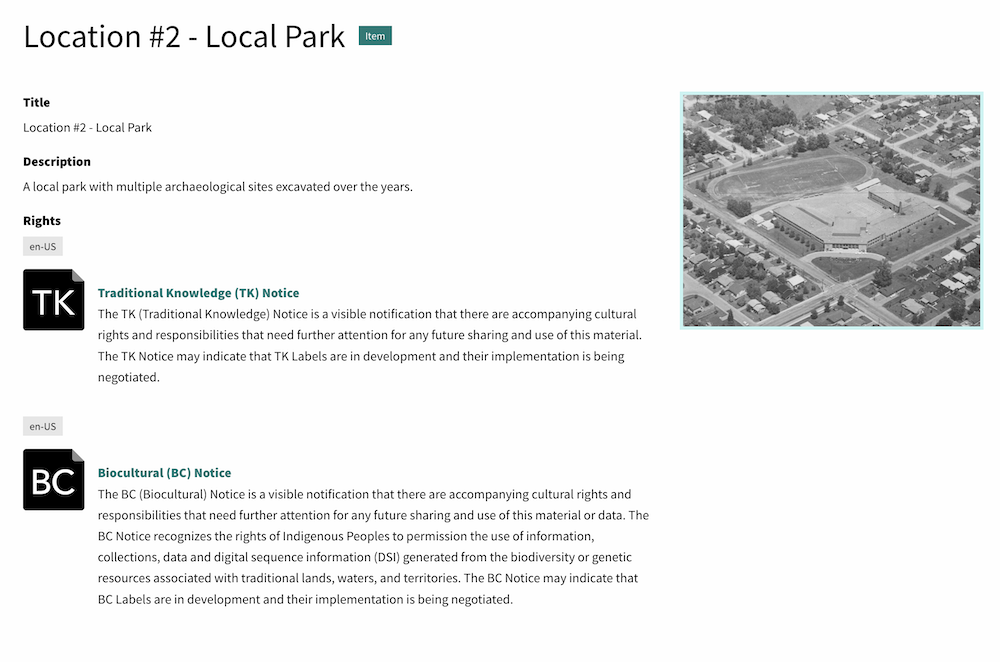

## What is Local Contexts?

Local Contexts is a global initiative. It supports Indigenous communities with tools that reassert cultural authority in heritage collections and data. Local Contexts has three components of note to Omeka users: Notices, Labels, and Projects.

### Notices

This text is from the [Local Contexts website](https://localcontexts.org/notices/about-the-notices/){target=_blank}:

> *The Notices are tools for institutions and researchers to identify Indigenous collections and data and recognize Indigenous rights and interests. The Notices were developed to create pathways for partnership, collaboration, and support of Indigenous cultural authority.*

> *Notices can be applied to websites, publications, datasets, museum exhibitions, items in a collection, genetic samples, and more. Institutions and researchers can generate Notices using the Local Contexts Hub.*

> *There are three categories of Notices: Engagement, Disclosure, and Collections Care Notices. See below for more information on the different types of Notices.*

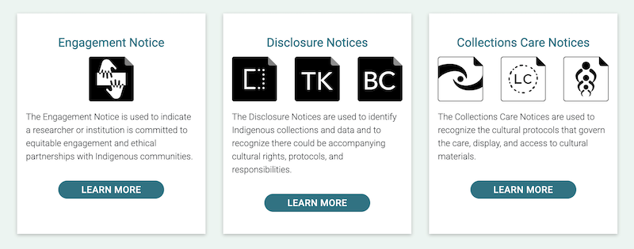

### Labels

This text is from the [Local Contexts website](https://localcontexts.org/labels/about-the-labels/){target=_blank}:

> *The Traditional Knowledge (TK) and Biocultural (BC) Labels are tools for Indigenous communities and local organizations. Developed through sustained partnership and testing within Indigenous communities across multiple countries, the Labels allow communities to express local and specific conditions for sharing and engaging in future research and relationships in ways that are consistent with already existing community rules, governance, and protocols for using, sharing, and circulating knowledge and data.*

> *Labels can be applied to websites, publications, datasets, museum exhibitions, items in a collection, genetic samples, and more. Communities can customize and apply their TK and BC Labels using the Local Contexts Hub.*

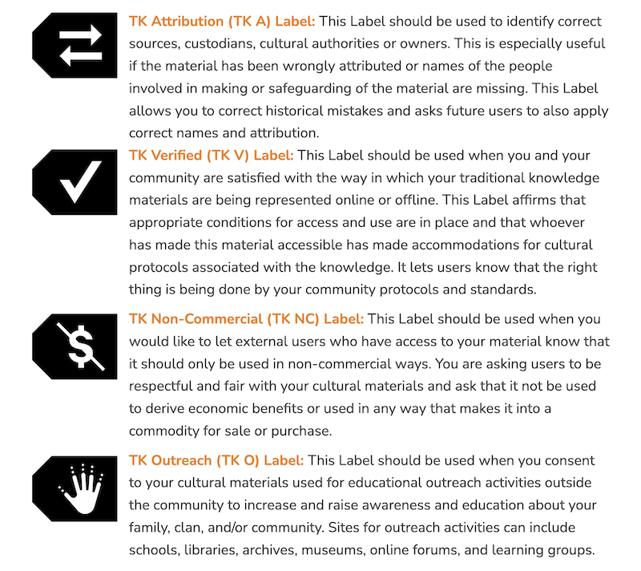

### Projects

This text is from the [Local Contexts website](https://localcontexts.org/support/getting-started-on-the-hub/){target=_blank}:

> *What is a Local Contexts Project?*

> *Local Contexts Projects describe the context where Labels or Notices are being applied. For example, a Project could include: a website, university syllabus, dissertation, research publication, dataset, museum exhibition, archival record, item in a collection, library database, photography collection, voucher specimen, and/or metadata about a record.*

> *When you create a Local Contexts Project, you will be asked for Project details and contacts, and have the option to add metadata.*

> *Creating Projects allows institutions and researchers to generate Notices and engage, acknowledge, and make visible Indigenous interests in collections, information, and data. Communities may then choose how and when to add their Labels.*

> *Community accounts can apply customized Labels to Projects they create in the Hub, as well as to Projects they have been sent by institution and researcher accounts. You can see Projects that have been added to the Hub publicly on the Projects Board.*

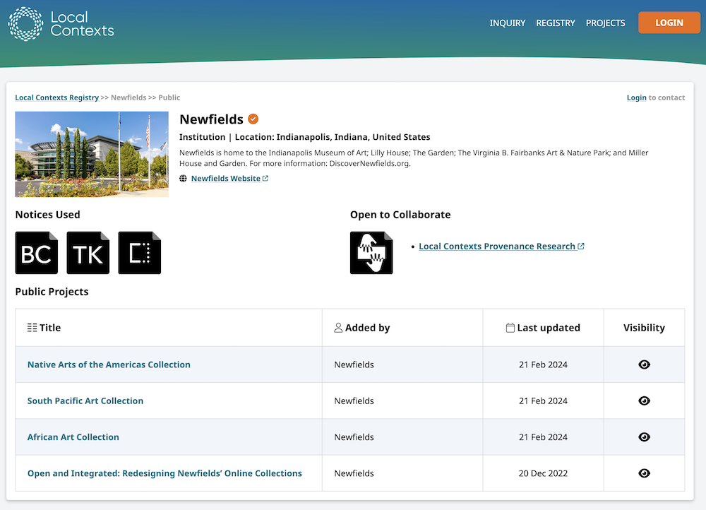

## Preparing to use the Local Context module

The Local Contexts module encourages engagement with members of Indigenous communities through institutionally-created Notices and community-created Labels. An "Open to Collaborate" Notice, for example, indicates that collaboration is welcome. As a result, you must be prepared to manage that collaboration. If you are using Notices, be sure that your Omeka site has a means for Indigenous community members to participate. This might look like:
- account creation for Indigenous community members
- the ability to add Local Contexts Projects and Labels to the site
- a contact form
- comments on items
- a plan for staff responsiveness to contributions. 
Think through your workflow for improving your collections in collaboration before proceeding further.

### Local Contexts Hub account

To use this module, you must have a Local Contexts Hub account. Creating a profile there allows you to have one or more Projects. This can then be connected to your Omeka installation with an API key.

[Go to the Local Contexts website to learn more and set up your Projects](https://localcontexts.org/support/getting-started-on-the-hub/#about-projects){target=_blank}. 

You can design a Project for one single object, a collection, an exhibit, or for your entire institution. You may have simple needs. For instance, you might need to add an "Open to Collaborate" Notice in your Omeka site footer. Or, you might have more complex needs, such as separate and unique sets of Labels for each of hundreds of items. Familiarize yourself with all of the Local Contexts Notice and Label options. Plan which set of Projects you will need to express your organization's situation. 

### Permissions

Local Contexts projects can be applied to sites where the user has Site Manager permissions or an installation-wide Global Administrator account. Notices and Labels can be added to site pages for which the user has permission (Site Creator level and above). A user can add Local Contexts projects to resources if they have editing permissions. They must either the ownthe resource or have an account at the Editor level or higher. 

## How to use the Local Contexts module

### Import Projects

Make sure the module is installed and active on your Omeka site. Then, go to the "Local Contexts" module entry in the sidebar of the administrative dashboard. There you will be able to enter in your API key from the Local Contexts Hub. 

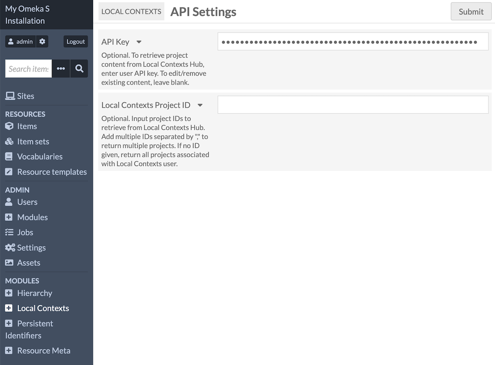

You can optionally select only a few of your Projects for import, by entering in their IDs. If you leave the "Projects" field blank, Omeka will load all the Projects associated with your Local Contexts API key. 

When you save the page, the Projects will load on an "Assign" tab. You will see each Project name and all of its associated Notices and Labels. On this screen you can check the box of each Project you wish to make available from the API key you just input. If you do not check any of these Projects before saving the page, they will not persist in the Omeka site. Assigning the Projects at this stage will not make them appear on your site. You will still need to apply them manually to items and site pages, and place them into the site footer. 

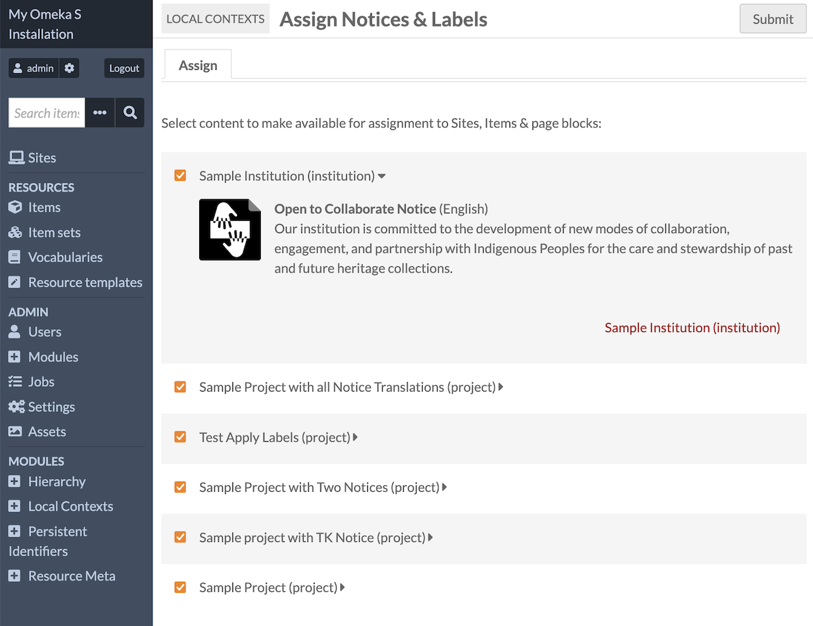

Omeka S will not save the API key, and does not create a persistent connection. If you update content on the LC Hubs website, you will need to re-enter the API key to also update Omeka's information. Then you will need to re-apply the modified Projects to your footer, items, and site pages where applicable. 

Other users on the Omeka installation can add more Projects by entering in another LC API key. They can also do this by entering the same key and assinging other projects. The interface will list projects from all sources together and any user can access them. 

If you return to this page after initially inputting an API key, you will see the same form to enter a new API key. Ignore this and save the page if you wish to see the list of Projects already imported to your site. This will appear on a "Remove" tab. 

This table will allow you to remove Projects from your site. If you wish to add these Projects back later, you will have to re-import them by entering the API key again. This will not change any items or exhibits. Remove anything already assigned manually. 

### Apply Projects to sites

Site Managers or Global Administrators can choose one or more Local Contexts Projects to appear in the footer of each site on your Omeka S installation. Go to the Sites tab in the sidebar, select a site, and go to "Site admin". In the "Settings" tab of the site admin page, look for the Local Contexts section. From here you can choose one or more of the Projects assigned to the installation after inputting an API key. 

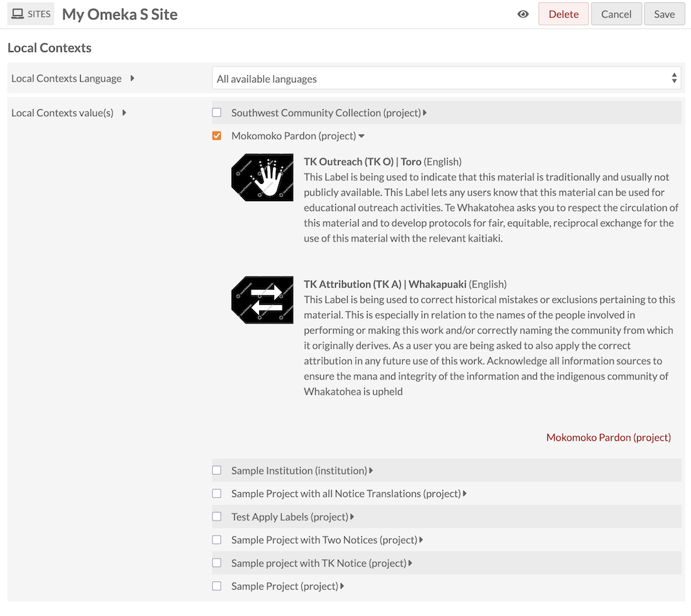

You can choose to display one or all languages of the chosen Notices and Labels in the selected Projects. 

The Local Contexts site footer content will appear inside a `div` at the beginning of the content in the `footer` on all public pages. 

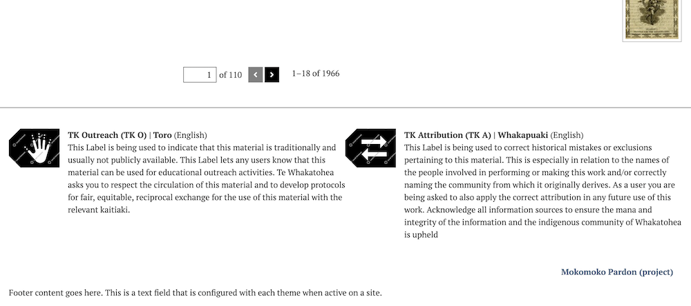

### Apply Projects to items

Assign one or more Local Contexts Projects to fill out a metadata value in one or all languages. You can choose any metadata field provided by any vocabulary in your installation. 

Go to the item editing interface, and look for the "Advanced" tab at the top of the screen. On this page you will see a Local Contexts section. This allows you to assign a Project from one dropdown to a metadata property chosen from another dropdown. 

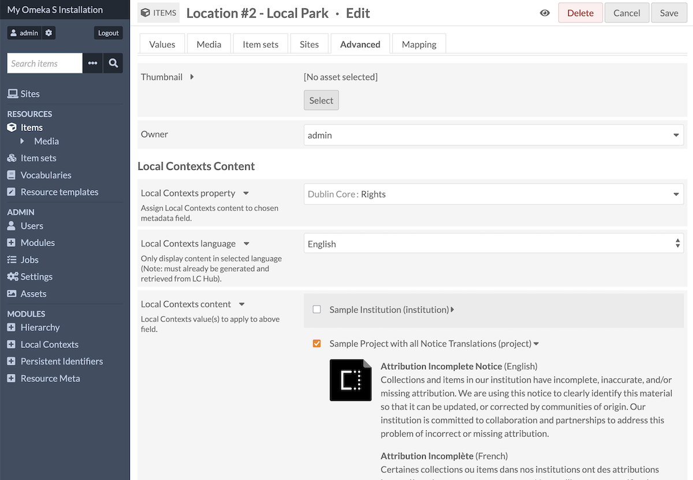

When you save your changes, you will see the visual Notices and Labels entered as separate values on the property you chose. You will also see aa two- or four-letter language tag pulled from the Local Contexts Project's metadata. 

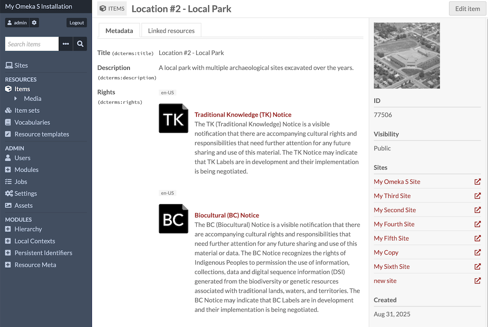

The metadata values are entered as JSON:

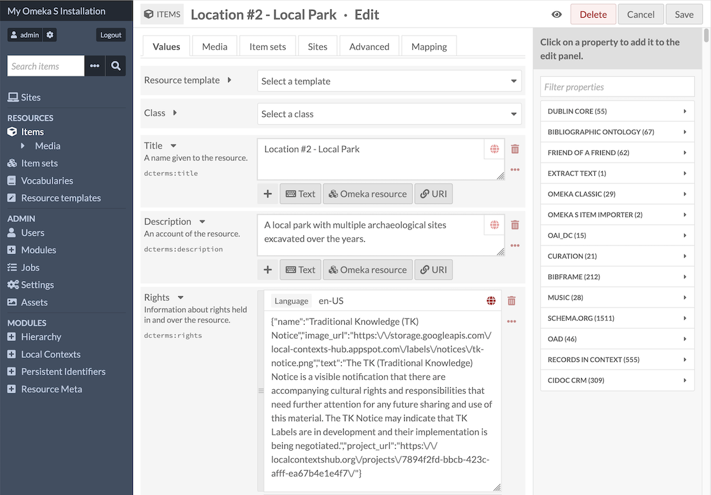

The [Metadata Browse module](metadatabrowse.md) may conflict with Local Contexts in metadata entries, adding links to the text of the Notices and Labels. We recommend unchecking the "Direct links" box in the module configuration. This allows you to continue using Metadata Browse so users to browse all items with the same Projects. 

### Apply Projects to site pages

Local Contexts can also display in a site page through the use of a dedicated page block. Edit a page, then select the "Local Contexts" block in the right-hand drawer. Within the page block, choose a Project from the dropdown and one language if desired. 

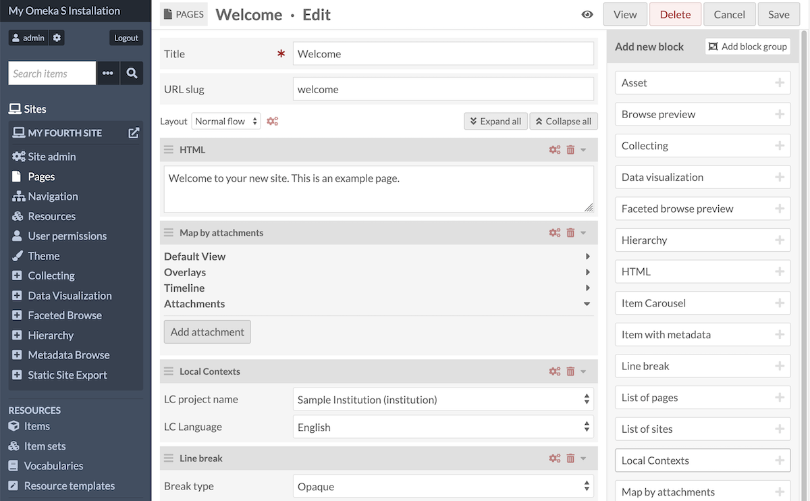

This will display Local Contexts Projects in a format similar to the site footer. 

### Remove Projects 

Once you've added a Project to an item, site page, or site footer, you must remove it manually. Edit the item, site, or page, and delete the content by hand. 

You can remove a Project from the list of Projects displayed in the future. Do this by returning to the Local Contexts module entry in the sidebar. Save the empty form that displays first. This will show you the list of assigned Projects. You can remove individual Projects by checking the boxes and saving this page. 

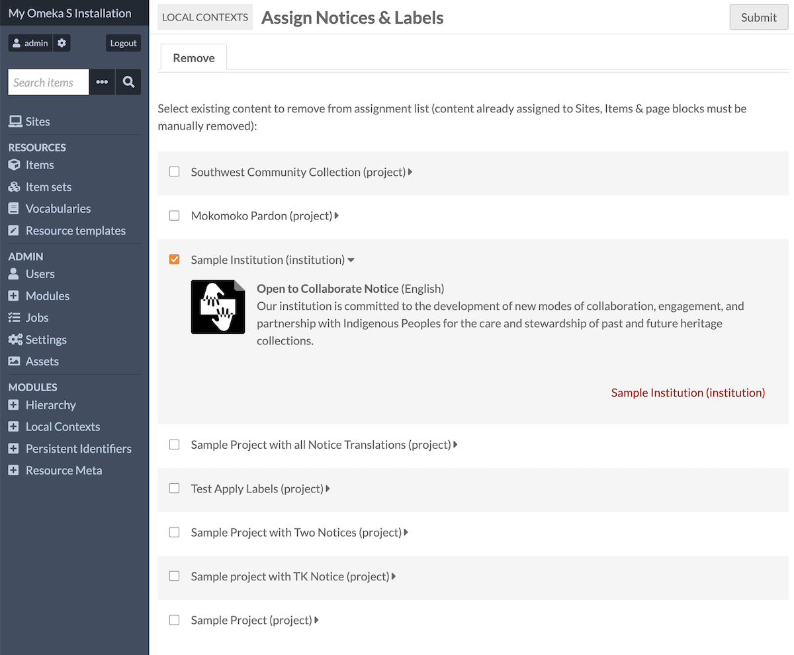

Deleting a Project from the list of Projects in the Local Contexts modules page **will not** remove that Project from resources to which it has been added. It will only remove the option to add it to resources in the future. 